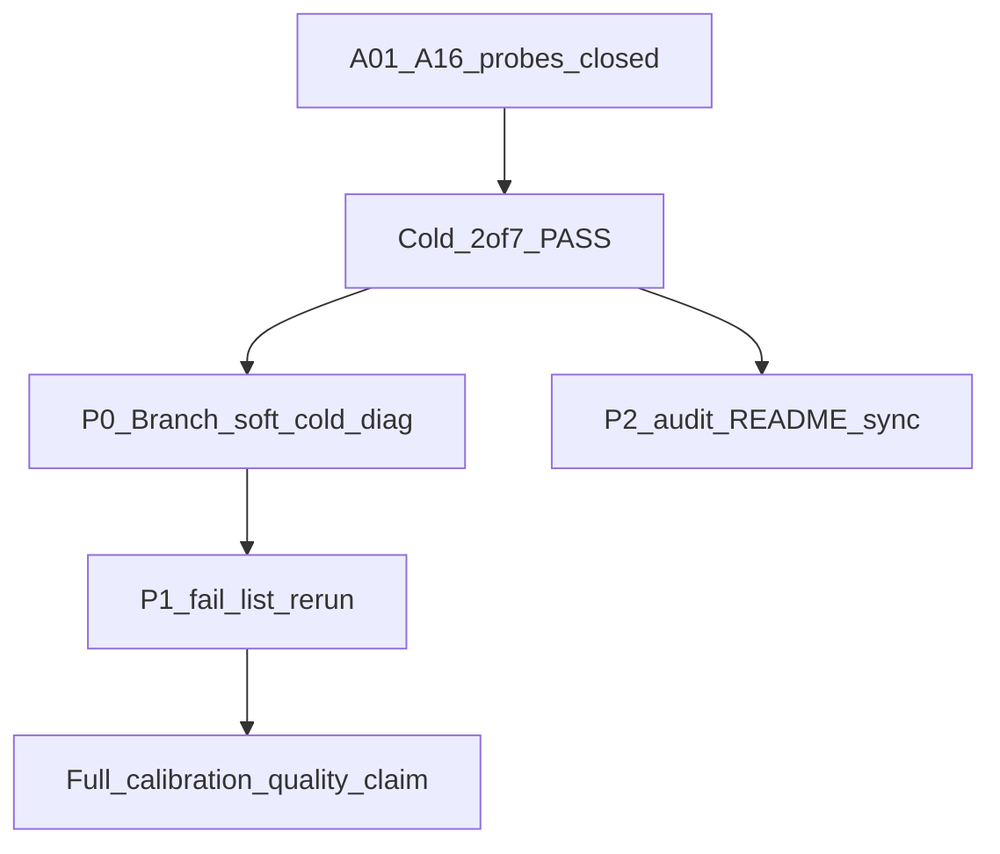

# Анализ follow-up vs аудит + план следующей работы

Дата: 2026-09-24. Источники: [README аудита](../README.md), [status.json](status.json), [RECONCILE.md](RECONCILE.md), [_repro/POSTTUNE_VERIFY_RESULT.md](../../../Bin/Configs/SpikeSamples/StructTrain/_repro/POSTTUNE_VERIFY_RESULT.md).

## 1. Сопоставление с аудитом (исходный README)

Исходный вывод аудита (2026-09-22/23): *успешный gate не доказывает избирательность*; A01–A06/A08–A11/A13–A16 открыты; A07 принят; A12 отложен; cold не гоняли; Console не пересобирали; probes ожидали FAIL.

| Тема аудита | Было (README) | Сейчас (after-fixes) | Вердикт |
|-------------|----------------|----------------------|---------|
| A01–A06 (analyzer / metrics) | открыты; CE FAIL | код + probes CE Analyzer PASS; A01 bind Branch DatasetMatrix | **закрыто доказательством probes** |
| A08–A10 (PostTune Branch/TL) | частично / открыты | Branch probes 8/8 PASS | **закрыто probes** |
| A11 / A13 | открыты | CE Axon delay PASS; A13 closed в RECONCILE | **закрыто** |
| A14 / A15 (GUI / CLI) | открыты | GUI 13/13 PASS | **закрыто** |
| A16 (verifier provenance) | открыт | SHA + tipr expect; units 15/15 | **закрыто** |
| A07 | accepted | без изменений | **как в аудите** |
| A12 | deferred | PositiveTau diagnostic FAIL | **как в аудите** |
| Cold V1–V6 | не выполнялся | 2/7 PASS (asym50, br100_search) | **частично** |
| Заявление о качестве HEAD | нельзя | полный V1–V6 calibration-quality **нельзя** | **согласовано с fail-list** |

**Важно:** README аудита (§0) всё ещё описывает состояние *до* remediation (A01–A16 «открыты»). Фактический статус — в [status.json](status.json) / [RECONCILE.md](RECONCILE.md). Имеет смысл добавить в README короткую секцию «после remediation», не переписывая исторический срез.

## 2. Что выполнено follow-up (F1–F5)

1. Console в `Bin/Platform/Linux/NeuroModelerConsole` (SHA `1b719f6f…`).
2. audit-probes Linux: GUI 13, CE 9/9 без A12, Branch 8/8; stubs под A01/PostTuneResult.
3. A16: binary/source/config SHA, expect_tipr → row_fail.
4. Soft_cold: FixedLTZ→1 (иначе tiprmin mid stall Phase6).
5. Cold soft_cold+verify на клонах; RESULT § Calibration-quality; gitlinks/docs.

## 3. Что не закрыто / расхождения

### 3.1 Cold fail-list (главный остаток)

| case | Симптом | Интерпретация |
|------|---------|---------------|
| br25_on, br100_keep | TipR ok (canon/keep), mid silent, Test inference NonSeparable, fires пусто/0 | Soft_cold Branch retrain → нет LTZ-gap; **не** «gate на старом analyzer» |
| br25_off | gate metrics ok path, fires=`11110000` | Селективность после soft_cold сломана (FP) |
| asym25 | flat TipR, gate FAIL / mid missing | Короткий AsymRm cold; отдельно от asym50 PASS |
| phase6_480 | долгий Train, gate FAIL, mid missing | После FixedLTZ-fix morph идёт; калибровка/gate не прошли |

Контраст: **gold Branch Test** на том же Console → fires=`10000000`, mid≈0.0718. Значит измерение/A01 на inherited-weights работают; ломается именно **переобучение soft_cold** (или PostTune landscape на свежем morph).

### 3.2 Вне scope аудита (по-прежнему)

Held-out / robustness; A12 Euler; prefix-mode; PHASE12 VALIDATED ≠ soft_cold clone.

### 3.3 Документация аудита

Корневой [README.md](../README.md) не обновлён под post-remediation (остаётся историческим срезом). after-fixes согласованы с фактами.

## 4. Выводы

1. **Цели аудита по дефектам измерения/PostTune/GUI/CLI в коде и probes закрыты** (кроме принятого A07 и отложенного A12).
2. **Исходный тезис «gate ≠ качество» остаётся верным для soft_cold Branch** на текущем HEAD: TipR/Need=0 возможны при NonSeparable и fires≠expect.
3. **Частичный cold PASS** (asym50, Search V5b) показывает, что путь PostTune+cpp mid+fires достижим не на всех семьях/span.
4. Следующая работа — **не повторная реализация A01–A16**, а диагностика soft_cold / морфогенеза / landscape после cold, плюс синхронизация README аудита с after-fixes.

## 5. План дальнейшей работы (рекомендуемый)

### P0 — Диагностика soft_cold Branch (br25_on как канон)

1. Зафиксировать минимальный repro: rsync gold→posttune, soft_cold, Train mode=1, снять Train flag metrics (tgt/foils), Test infer-mid flag.
2. Сравнить с gold: DendriteLength, TipR timeline (traces), PostTuneResult, gap, SB/AutoScale.
3. Гипотезы по приоритету:
   - soft_cold недостаточно сбрасывает состояние (помимо FixedLTZ);
   - AutoScaleIterationGap=1 меняет режим относительно исторического cold PASS;
   - PostTune free-run / LandscapeOk слишком строг или метрики не те;
   - morph L после soft_cold (напр. 12 8 5 1 vs gold 13 11 7 1) + Canon TipR = over-sensitive foils.
4. Критерий: br25_on cold → mid_source=cpp, fires=`10000000`, tipr=canon, exit 0.

### P1 — Дожать fail-list тем же протоколом

1. br25_off, br100_keep — после фикса P0.
2. asym25 — сравнить с asym50 (span/mode/train_t).
3. phase6_480 — отдельный лог gate после успешного morph (уже TipR canon в traces).

### P2 — Документы

1. Краткая секция в README аудита: «после remediation 2026-09-23» → ссылка на after-fixes; не стирать исторический срез.
2. Не заявлять полный calibration-quality V1–V6 до P0–P1 зелёных.

### P3 — Опционально (не блокер)

Held-out; A12; prefix-mode.

## 6. Нужен ли план?

Да — один узкий план **P0→P1→P2** выше. Повторный полный remediation A01–A16 **не** нужен, пока probes остаются PASS.
