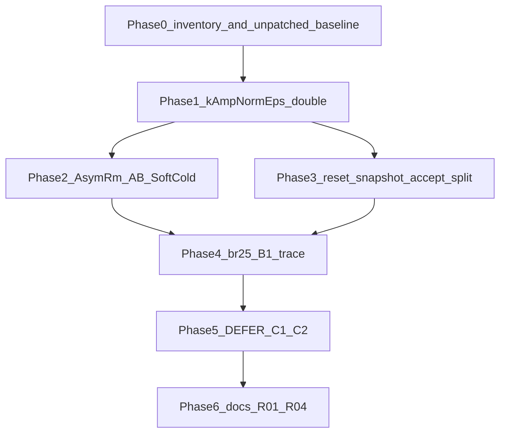
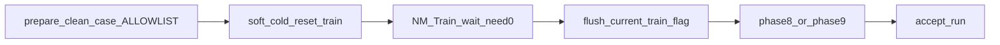

# План проверок и исправлений (детализация код / конфиги / доки)

Основание: [`Docs/Audit/TimeLearner-2026-09-26-review/README.md`](Docs/Audit/TimeLearner-2026-09-26-review/README.md) (TL-01…TL-06), [`PLAN.ru.md`](Docs/Audit/TimeLearner-2026-09-26-review/PLAN.ru.md), контракт [`POST_TRAIN_VERIFY.ru.md`](Bin/Configs/SpikeSamples/StructTrain/POST_TRAIN_VERIFY.ru.md).

Срез среды (на момент планирования): ветка `time_trainer_audit3` @ `17fe513`; PulseLib `8d429e7`; Bin `a99c7c6`; Console `Bin/Platform/Linux/NeuroModelerConsole` SHA `4917a2bc…` (пересоберётся после Phase 1).

**SSH-блокер снят:** работа только на локальном `/home/user/Nmsdk`. Inventory wave-C из `_repro/runs/` (bundles уже есть). Не копировать с `10.245.1.11`.

**Запреты:** не ослаблять `LandscapeOk` ([`NNeuronPostTrainTune.h`](Libraries/Nmsdk-PulseLib/Core/NNeuronPostTrainTune.h)); не менять Acc/fires ожидания ради PASS; без `--allow-salvage` / `--use-archive-inplace`; GoldTest/SkipTrain ≠ Cold; `Need=0` ≠ PASS; не коммитить `_work/`, StatisticLog, overwrite [`_repro/POSTTUNE_VERIFY_RESULT.md`](Bin/Configs/SpikeSamples/StructTrain/_repro/POSTTUNE_VERIFY_RESULT.md).



Карта SoftCold (как сейчас работает):



---

## Индекс артефактов и путей

| Роль | Путь |
|------|------|
| Orchestrator SoftCold | [`scripts/posttune_verify.py`](Bin/Configs/SpikeSamples/StructTrain/scripts/posttune_verify.py) |
| Soft/strip cold + preflight XML | [`scripts/repro_cold_lib.py`](Bin/Configs/SpikeSamples/StructTrain/scripts/repro_cold_lib.py) |
| Metrics Acc/Цель/fires | [`scripts/selectivity_metrics.py`](Bin/Configs/SpikeSamples/StructTrain/scripts/selectivity_metrics.py) |
| Branch gate | [`SelectivityBranch/scripts/phase8_tiprmin_gate.py`](Bin/Configs/SpikeSamples/StructTrain/SelectivityBranch/scripts/phase8_tiprmin_gate.py) |
| AsymRm/Phase6/FastSpan gate | [`SelectivityAsymRm/scripts/phase9_preinh_bc_gate.py`](Bin/Configs/SpikeSamples/StructTrain/SelectivityAsymRm/scripts/phase9_preinh_bc_gate.py) |
| Harness unit tests | [`scripts/tests/test_posttune_verify_unit.py`](Bin/Configs/SpikeSamples/StructTrain/scripts/tests/test_posttune_verify_unit.py) |
| Classic learner | [`NNeuronTimeLearner.h/.cpp`](Libraries/Nmsdk-PulseLib/Core/NNeuronTimeLearner.h) |
| Branch learner | [`NNeuronTimeLearnerBranch.h/.cpp`](Libraries/Nmsdk-PulseLib/Core/NNeuronTimeLearnerBranch.h) |
| TipR / LandscapeOk | [`NNeuronPostTrainTune.h`](Libraries/Nmsdk-PulseLib/Core/NNeuronPostTrainTune.h) |
| Полный реестр | [`EXPERIMENTS.md`](Bin/Configs/SpikeSamples/StructTrain/EXPERIMENTS.md) |
| PASS + блоки провалов | [`SUCCESSFUL_EXPERIMENTS.md`](Bin/Configs/SpikeSamples/StructTrain/SUCCESSFUL_EXPERIMENTS.md) |
| Bundles | `Bin/Configs/SpikeSamples/StructTrain/_repro/runs/<case>_<utc>/` |
| Wave-C rc list | [`_repro/SOFTCOLD_C_rcs.txt`](Bin/Configs/SpikeSamples/StructTrain/_repro/SOFTCOLD_C_rcs.txt) |
| Сборка | скилл [`nmsdk-build`](.cursor/skills/nmsdk-build/SKILL.md) |
| Коммиты submodule | скилл [`nmsdk-gitlinks`](.cursor/skills/nmsdk-gitlinks/SKILL.md) |
| Эксперименты skill | [`structtrain-experiments`](.cursor/skills/structtrain-experiments/SKILL.md) |

`CASES` уже содержат C1/C2 id ([`posttune_verify.py` L75–230](Bin/Configs/SpikeSamples/StructTrain/scripts/posttune_verify.py)): не расширять список без нужды; Phase 5 гоняет существующие keys.

`ALLOWLIST_INPUTS` L47–52: `Model_00.xml`, `Parameters_00.xml`, `Project.ini`, `Interface.xml` + optional `Matrix*.xml` / `Pack*.xml` / `*.pack`.

`PROVENANCE_SOURCE_REL` L26–44: PulseLib Core TL/Branch/PostTune/Analyzer/Dataset, Console `main.cpp`, harness scripts, phase8/9.

Константы soft-cold ([`repro_cold_lib.py`](Bin/Configs/SpikeSamples/StructTrain/scripts/repro_cold_lib.py)): `TIPR_COLD=86000000×4`, `L_COLD=1 1 1 1`, `NM=/home/user/Nmsdk/Bin/Platform/Linux/NeuroModelerConsole`.

---

## Phase 0 — локальная база (вместо SSH / TL-05)

### 0.1 Inventory существующих wave-C bundles

Для каждого case из SoftCold wave C auto (14 FAIL):

`br50_gen`, `br25_preinh`, `br50_preinh`, `br100_preinh`, `br25_nextseg`, `br50_nextseg`, `br100_nextseg`, `br480_tiprmin`, `br480_nextseg`, `br480_preinh`, `asym25_preinh`, `asym50_preinh`, `asym100_gen`, `asym100_preinh`

Проверить в `_repro/runs/<case>_*Z/` (не `_work`):

- `provenance.json` (поля: `train_status`, `child_rc`, `tipr_class`, `gate_rc`, `gate_ok`, `quality_class`, `params_source`, `binary_sha256`, `config_sha256_before`, `artifacts[]` — см. `build_provenance` ~L589 + update ~L1252)
- Train: `Parameters_00.xml` / `Model_00.xml` / `posttune_complete.flag` / `tipr_final.txt`
- Test: `SelectivityLog/results.csv`
- логи: `run_train.log` / `run_gate.log` если есть

Класс каждой записи (TL-04):

| Класс | Критерий |
|-------|----------|
| `train_incomplete` | `train_status` ∈ exited/incomplete/`FAIL` в status **или** Need≠0 без `done` |
| `gate_fail` | Train дошёл (`done*` / Need=0) + `gate_rc≠0` |
| `quality_NonSeparable` | mid silent / Result NonSeparable при Train complete |
| `unknown` | нет provenance / битый CSV |

Артефакт: `Docs/Audit/TimeLearner-2026-09-26-review/evidence/P0_waveC_inventory.md` (+ optional CSV).

### 0.2 Manifest среды

Записать в `evidence/P0_environment.json`:

- `git -C . rev-parse HEAD`, PulseLib, Bin short SHA
- `sha256sum Bin/Platform/Linux/NeuroModelerConsole`
- `cmake` preset / dirty files summary (ожидаемо dirty `POSTTUNE_VERIFY_RESULT.md` — **не** в baseline inputs)

### 0.3 Unpatched SoftCold baseline (eps ещё `int`)

Команды из корня Nmsdk / StructTrain (один case за раз, clean workdir по умолчанию):

```bash
python3 Bin/Configs/SpikeSamples/StructTrain/scripts/posttune_verify.py --case asym50_preinh
python3 Bin/Configs/SpikeSamples/StructTrain/scripts/posttune_verify.py --case asym100_preinh
python3 Bin/Configs/SpikeSamples/StructTrain/scripts/posttune_verify.py --case br25_on
```

Опционально сразу: `asym25_preinh`, `asym100_gen` (если wall-clock позволяет).

Конфиг case (уже в `CASES`):

| case | archive root / gold | train_t | kind | expect_tipr |
|------|---------------------|---------|------|-------------|
| `asym50_preinh` | `SelectivityAsymRm/EXP_span50ms_packA_preinh` | 640 | asym → phase9 | canon |
| `asym100_preinh` | `…/EXP_span100ms_packA_preinh` | 640 | asym | canon |
| `br25_on` | `…/EXP_br_span25_packA_gen_C1e9_posttune` / gold packA gen | 320 | branch → phase8 | canon |

Цепочка внутри `run_case` (~L1049+): `prepare_clean_case` → TipRMode tags → `soft_cold_reset_train` → `wait_need0` → `flush_current_train_flag` → `run_gate` → `accept_run`.

**Не** трогать код PulseLib до конца Phase 0. Новые run-id не перезаписывают старые wave-C каталоги.

### Приёмка Phase 0

- Inventory 14/14 с классом отказа.
- Три+ новых baseline bundles с полным `provenance.json`.
- Зафиксирован unpatched Console SHA для сравнения с Phase 2.

---

## Phase 1 — TL-01: classic `kAmpNormEps` (код + тесты + сборка)

### 1.1 Код PulseLib

Файл: [`Libraries/Nmsdk-PulseLib/Core/NNeuronTimeLearner.h`](Libraries/Nmsdk-PulseLib/Core/NNeuronTimeLearner.h) **L449–451**:

```cpp
/// Absolute |Initial-amp| tolerance … stall ~6e-6 …
static constexpr int kAmpNormEps = 1e-5;  // BUG: → 0
```

Заменить на:

```cpp
static constexpr double kAmpNormEps = 1e-5;
static_assert(kAmpNormEps > 0.0);
static_assert(kAmpNormEps == 1e-5);
```

Комментарий о cold stalls **сохранить** (он уже объясняет контракт).

Потребители (тип уже `const double eps = kAmpNormEps` — после фикса narrowing исчезнет):

| Функция | Файл:строки |
|---------|-------------|
| `ChangeSynapseResistanceStatus` | [`NNeuronTimeLearner.cpp` L667+](Libraries/Nmsdk-PulseLib/Core/NNeuronTimeLearner.cpp), eps **L704**, AmpDtAudit |
| sync/dt check | **L3371** `fabs(dt) <= kAmpNormEps` |
| `AllSynapsesNormalized` | **L3484–3486+** — критерий amp Done → `SetIsNeedToTrain(false)` ~L3618 |

**Не менять:** [`NNeuronTimeLearnerBranch.h` L464](Libraries/Nmsdk-PulseLib/Core/NNeuronTimeLearnerBranch.h) (`double` уже); Done best-effort пути (`at_r_min`, `dead_tip`, `oscillation`, `no_improve`) — только регрессионно проверить, что не ломаются.

### 1.2 Регрессии

1. C++: `static_assert` выше (обязательно).
2. Python harness: расширить [`test_posttune_verify_unit.py`](Bin/Configs/SpikeSamples/StructTrain/scripts/tests/test_posttune_verify_unit.py) — тест, что при чтении header/константы (или отдельный tiny helper) eps не ноль; существующие 24 теста остаются зелёными:
   ```bash
   python3 -m pytest Bin/Configs/SpikeSamples/StructTrain/scripts/tests/test_posttune_verify_unit.py -q
   ```
3. Документировать boundary-кейсы tolerance в audit note: residual `6e-6` (должен проходить при eps=`1e-5`), `1e-5`, `1.1e-5` (строго выше — не Done без best-effort). Полный C++ unit на amp, если в PulseLib нет каркаса — зафиксировать как ручную проверку на SoftCold логах AmpDtAudit, не блокировать Phase 2.

### 1.3 Сборка

По [`nmsdk-build`](.cursor/skills/nmsdk-build/SKILL.md):

```bash
cmake --preset linux-gcc-debug-local   # если нужно
cmake --build build/linux-gcc-debug-local \
  --target Nmsdk-PulseLib.core NeuroModelerConsole -j"$(nproc)"
sha256sum Bin/Platform/Linux/NeuroModelerConsole
```

Windows Release / C4244 — желательно; Linux Console обязателен.

### 1.4 Документация Phase 1

- Строка в [`Docs/Audit/TimeLearner-2026-09-26-review/`](Docs/Audit/TimeLearner-2026-09-26-review/): `STATUS.ru.md` или дополнение README — «TL-01 fixed @ PulseLib &lt;sha&gt;».
- Коммит PulseLib: `fix(TimeLearner): keep classic amp-norm epsilon as double` (стиль репо) → потом root gitlink PulseLib.

### Приёмка Phase 1

- `kAmpNormEps` — `double`, static_assert зелёный.
- pytest harness PASS.
- Новый Console SHA ≠ unpatched; записан в evidence.

---

## Phase 2 — A/B SoftCold classic AsymRm (конфиги / прогоны / реестр)

Один фактор: бинарник после Phase 1. Конфиги case — без правок порогов.

### 2.1 Матрица прогонов

| case | Роль | Сравнить с Phase 0 |
|------|------|--------------------|
| `asym50_preinh` | основной incomplete/gate | Need, residual amp, train_status |
| `asym100_preinh` | Need≠0 / stall | Need→0?, TipR class |
| `asym25_preinh` | контроль gate | termination ≠ ложный PASS |
| `asym100_gen` | TipR flat / early exit | eps vs иной fail |
| `br25_on` SkipTrain только если нужно sanity | `--skip-train` | **не** Cold proof |

Команды те же `posttune_verify.py --case …`. Параллель ≤1–2 Train.

### 2.2 Что снимать из каждого bundle

Из `provenance.json` + XML/CSV:

- `train_status`, `child_rc`, `Need` (после flush), `tipr_class`, `expect_tipr`, `params_source` (`nm_save`/`flag_flush`)
- `fires`, Acc/target из metrics / CSV
- `FixedLTZThreshold` / mid_source; `PostTuneResult` если в flag/params
- `gate_rc`, `gate_ok`, `quality_class`

Вердикт-матрица (не схлопывать):

| Train | Quality | Gate | Как писать в реестр |
|-------|---------|------|---------------------|
| incomplete | — | любой | SoftCold **FAIL** reason=`train_incomplete` |
| complete | NonSeparable | fail/ok | SoftCold **FAIL** quality (Need=0 допустим) |
| complete | OK landscape | fail fires | SoftCold **FAIL** gate |
| complete | OK | pass | SoftCold **PASS** |

### 2.3 Документы / реестр

- Evidence: `Docs/Audit/TimeLearner-2026-09-26-review/evidence/P2_asymrm_ab.md` — таблица pre/post.
- Обновить соседние SoftCold-строки в [`EXPERIMENTS.md`](Bin/Configs/SpikeSamples/StructTrain/EXPERIMENTS.md) §3 / SoftCold wave C для прогнанных case (Acc/Цель/Примечание/bundle).
- Блоки «Провалы» в [`SUCCESSFUL_EXPERIMENTS.md`](Bin/Configs/SpikeSamples/StructTrain/SUCCESSFUL_EXPERIMENTS.md) §3 — уточнить причины после A/B.
- Narrative: краткий абзац в [`EXPERIMENTS_AFTER_FIXES.ru.md`](Docs/Audit/TimeLearner-2026-09-24-review/EXPERIMENTS_AFTER_FIXES.ru.md) или STATUS 09-26 — **не** дублировать полные таблицы.

### Приёмка Phase 2

- Epsilon-гипотеза подтверждена или опровергнута числами Need/train_status.
- Ни один acceptance threshold не изменён в phase8/9 / `accept_run`.

---

## Phase 3 — TL-02 / TL-04: harness reset snapshot + split вердиктов

### 3.1 C++ runtime snapshot после reset

**Branch** ([`NNeuronTimeLearnerBranch.cpp`](Libraries/Nmsdk-PulseLib/Core/NNeuronTimeLearnerBranch.cpp)):

- `ResetToUntrained` **L1865–1867**: `DendriteLength.assign(…,1)` затем **last = 0** (reference).
- `AReset` **L3012–3016** вызывает `ResetToUntrained()` при флаге.
- `ADefault` **L2876–2878** — тот же last=0.

**Classic** [`NNeuronTimeLearner.cpp` `ResetToUntrained` ~L1317+](Libraries/Nmsdk-PulseLib/Core/NNeuronTimeLearner.cpp): все L=1 без обнуления ref.

Добавить диагностический dump (лог / файл в Train workdir, напр. `cold_reset_runtime.json` или строка в train log) **сразу после** успешного `ResetToUntrained()` / входа в train с флагом, **до** первой итерации:

поля: learner class, `DendriteLength[]`, `TipSynapseResistance[]`, `IsNeedToTrain`, `FixedLTZThreshold`, `NumInputDendrite`, index reference (=N-1), `ResetToUntrainedState` cleared.

**Не менять** семантику last=0 без явного согласования контракта (PLAN §6.3).

### 3.2 Python preflight split — [`repro_cold_lib.py`](Bin/Configs/SpikeSamples/StructTrain/scripts/repro_cold_lib.py)

Сейчас:

- `soft_cold_reset_train` L289–302 пишет XML `L_COLD` / `TIPR_COLD` / Need=1 / AutoCal=0 / ResetToUntrained=1.
- `assert_train_cold_flags` L215–231 требует XML `L==1 1 1 1` — **это только pre-NM state**, не post-C++.

Сделать:

1. Переименовать/разделить: `assert_train_cold_xml_before_nm(...)` (текущая проверка).
2. Новая `assert_or_record_runtime_after_reset(...)` — читает артефакт из §3.1 (если есть) или документирует «ожидаемо Branch L last=0».
3. В `posttune_verify.run_case` после первых секунд Train / после флага reset — сохранить runtime snapshot в bundle.

### 3.3 `accept_run` / provenance — [`posttune_verify.py`](Bin/Configs/SpikeSamples/StructTrain/scripts/posttune_verify.py)

Сейчас `accept_run` L604+ смешивает incomplete и quality в один FAIL list.

Сделать machine-readable в `provenance.json` / result row:

- `failure_class`: `train_incomplete` | `process_error` | `quality_fail` | `gate_fail` | `tipr_mismatch` | `ok`
- Не считать `gate_rc=0` при `Need=1` / `train_incomplete` завершённым обучением (уже частично L623–631 — усилить явным классом).

Provenance:

- Уже есть `config_sha256_before` / `source_sha256`.
- Добавить **`config_sha256_after`** и **`source_sha256_after`** (те же `PROVENANCE_SOURCE_REL` L26–44); при diff → `inputs_mutated_during_run=true` в verdict.

Unit tests: кейсы incomplete vs gate_fail в `test_posttune_verify_unit.py`.

### 3.4 Документация контракта

Одна строка в [`POST_TRAIN_VERIFY.ru.md`](Bin/Configs/SpikeSamples/StructTrain/POST_TRAIN_VERIFY.ru.md) § «Требования» / «Разные типы приёмки»: XML preflight ≠ runtime post-reset; Branch ref L=0; классы failure.

### Приёмка Phase 3

- Bundle содержит XML-before + runtime-after.
- `failure_class` различает incomplete и quality/gate.
- pytest обновлён и зелёный.

---

## Phase 4 — TL-03: Branch br25 диагностика (код наблюдения, не morph-fix)

### 4.1 Что уже есть (не гонять заново без нужды)

H1–H4 / soft-cold FAIL: [`EXPERIMENTS_AFTER_FIXES.ru.md`](Docs/Audit/TimeLearner-2026-09-24-review/EXPERIMENTS_AFTER_FIXES.ru.md), bundles `br25_on_*`, keep/search. SkipTrainGold PASS на frozen — только B0.

### 4.2 Протоколы

| Id | Команда / case | Назначение |
|----|----------------|------------|
| B0 | `posttune_verify.py --case br25_on --skip-train` | Test/gate на готовых весах |
| B1 | `posttune_verify.py --case br25_on` (soft-cold Canon) | основной Cold |
| B2–B4 | повтор H1/H3/H4 | только если в локальных bundles нет per-iteration метрик |

`br25_on` TipRMode Canon: tags в `run_case` ~L1071 (`"br25_on": "1"`).

Gate: `phase8_tiprmin_gate.py` — `prepare_test` L263+, `main` prepare L439–447, NM+metrics L516+.

### 4.3 Точки инструментирования morphogenesis (только логирование)

[`NNeuronTimeLearnerBranch.cpp`](Libraries/Nmsdk-PulseLib/Core/NNeuronTimeLearnerBranch.cpp):

| Символ | Lines | Что логировать |
|--------|-------|----------------|
| `ChangeDendriteStatus` | 3513+ (early-out last dend 3515–3519) | num, DendStatus, Dissynchronization/dt, SyncTolerance |
| `FinishTrainingIteration` | 5162+; call ChangeDendriteStatus **5251**; ApplyPending **5417–5418** | phase, ActivePulseIndex, PeakSeen, DelayLen |
| `ApplyPendingDendriteLengthChanges` | 3112+ | applied ΔL, CanChangeDendLength |
| `ChangeDendriteLength` | 3091+ | pending lengths |

Дерево интерпретации (из PLAN §7) — зафиксировать в `evidence/P4_br25_trace.md`:

1. Нет peak → Dataset/Generator/LTZ wiring.
2. Peak без anchor → runtime reset / ref L=0.
3. dt требует рост, L не меняется → блок в ChangeDendriteStatus / ApplyPending / индексы.
4. Рост есть, landscape не делится → `LandscapeOk` / foil gaps (не трогать порог).
5. Need=0 + NonSeparable → quality FAIL, штатно.

**Запрет:** правки `ChangeDendriteStatus` / критериев роста **до** конкретной строки trace + отдельного one-factor A/B.

### 4.4 Документы

- `evidence/P4_br25_trace.md` + ссылка bundle B1.
- EXPERIMENTS §1.1 SoftCold строки — обновить Evidence, не менять FAIL→PASS без gate+quality.

### Приёмка Phase 4

- Полный B1 с runtime snapshot + iteration trace + gate CSV.
- Четыре verdicts разделены: Gold / Train complete / separability / gate.

---

## Phase 5 — DEFER C1/C2 SoftCold (конфиги CASES + реестры)

После фаз 1–4, **одна** зафиксированная сборка (Console SHA в шапке).

### 5.1 Очередь (keys уже в `CASES` L197–229)

**C1 DEFER (8):**

| case | root EXP |
|------|----------|
| `phase6_thr_only` | `SelectivityPhaseA/Phase6/EXP_480_gen_thr_only` |
| `phase6_preinh250` | `…/EXP_480_preinh250_tiprmin` |
| `phase6_ltzcal_twin` | `…/EXP_480_ltzcal_twin_gen` |
| `fs25_gen` / `fs25_preinh` | `SelectivityFastSpan/EXP_span25ms_fast[_preinh]_C1e9` |
| `fs50_preinh` | `…/EXP_span50ms_fast_preinh_C1e9` |
| `fs100_gen` / `fs100_preinh` | `…/EXP_span100ms_fast[_preinh]_C1e9` |

**C2 (20):** `ltz25/50/100_{gen,preinh}`, `pa00_baseline`, `pa01_ltz_sweep`, `pa02_ltzone_avg`, `pa06_ltzone_int`, `tn_classic`, `psi01_050`, `psi14_260`, `psi15_270`, `psi21_100`, `psi31_200`, `psi32_300`, `psi33_300`, `psi34_400`, `psi35_400`.

Повтор C1 «exited» / classic eps-затронутых из § SoftCold wave C auto — если inventory P0 показал неполный bundle.

Запуск: `posttune_verify.py --case <id>`; batch-обёртка [`softcold_c_batch.sh`](Bin/Configs/SpikeSamples/StructTrain/scripts/softcold_c_batch.sh) — только если не тащит salvage; иначе последовательный цикл.

### 5.2 Обновление реестров

- [`EXPERIMENTS.md`](Bin/Configs/SpikeSamples/StructTrain/EXPERIMENTS.md): снять DEFER; строки SoftCold+PostTune с Acc/Цель/HEAD/bundle; шапка Console SHA.
- [`SUCCESSFUL_EXPERIMENTS.md`](Bin/Configs/SpikeSamples/StructTrain/SUCCESSFUL_EXPERIMENTS.md): PASS в §1–7; FAIL — блок «Провалы»; SoftCold wave C / DEFER секции синхронизировать.
- `_repro/SOFTCOLD_C_rcs.txt` или новый `SOFTCOLD_C2_rcs.txt` — rc list (можно коммитить маленький txt).

Параллель ≤1–2 Train; Phase6/br480 train_t=900 — тяжёлые.

### Приёмка Phase 5

- Каждый DEFER case → PASS | FAIL | blocked(с причиной ≠ SSH).
- incomplete не записан как quality FAIL без `failure_class`.

---

## Phase 6 — TL-06 docs + R01/R04

### 6.1 Реестры (обязательно)

Заголовки [`EXPERIMENTS.md` L3](Bin/Configs/SpikeSamples/StructTrain/EXPERIMENTS.md) и [`SUCCESSFUL_EXPERIMENTS.md` L3](Bin/Configs/SpikeSamples/StructTrain/SUCCESSFUL_EXPERIMENTS.md):

```
Console SHA-256 <…> · PulseLib <short> · Bin gitlink <short> · doc edit <date>
```

Явно: SHA бинарника ≠ обязательно SHA commit редакции Bin.

Вводная SUCCESSFUL L5–6: уточнить — таблицы PASS; причины FAIL в «Провалы»; полные FAIL-строки протоколов — в EXPERIMENTS.

### 6.2 Audit pack 2026-09-26

- `STATUS.ru.md` (новый): фазы 0–5 done/blocked; снять «SSH недоступен» как активный блокер; ссылки на evidence/*.
- Правка [`README.md`](Docs/Audit/TimeLearner-2026-09-26-review/README.md) TL-05: bundles локально инвентаризированы.
- [`PLAN.ru.md`](Docs/Audit/TimeLearner-2026-09-26-review/PLAN.ru.md): статус «в исполнении / закрыт» по фазам (без переписывания целей).

### 6.3 R01 / R04 (после стабильного SoftCold runtime)

Из PLAN §9; не смешивать с eps:

- **R01:** production Dataset/Generator wiring, sample boundaries — не probe stubs; статус в [`status.json`](Docs/Audit/TimeLearner-2026-09-24-review/status.json).
- **R04:** два полных Train→PostTune→Test на одном объекте classic + Branch; сброс PostTuneResult/metrics.

Если wall-clock исчерпан — явный `blocked: time` в STATUS, не молчаливый DEFER.

### 6.4 Коммиты (порядок)

1. PulseLib: eps (+ optional snapshot log).
2. Bin: harness (`repro_cold_lib`, `posttune_verify`, tests), EXPERIMENTS/SUCCESSFUL, POST_TRAIN_VERIFY note, мелкие `_repro/*_rcs.txt` / GOLD evidence txt.
3. Root: gitlinks PulseLib+Bin, Docs/Audit 09-26 STATUS, skill note если контракт SUCCESSFUL менялся.

По [`nmsdk-gitlinks`](.cursor/skills/nmsdk-gitlinks/SKILL.md). Push — только по просьбе.

---

## Критерии готовности всего плана

1. Classic `kAmpNormEps` = `double` + static_assert; Console пересобран.
2. AsymRm SoftCold pre/post с provenance; влияние eps на Need/termination зафиксировано в evidence.
3. Branch br25: B1 + trace; morphogenesis не угадывается.
4. Preflight XML ≠ runtime post-reset; `failure_class` разделяет incomplete / quality / gate.
5. DEFER C1/C2 закрыты или явно blocked без SSH-формулировок.
6. Заголовки реестров и audit STATUS согласованы; пороги LandscapeOk/gate не ослаблены.
