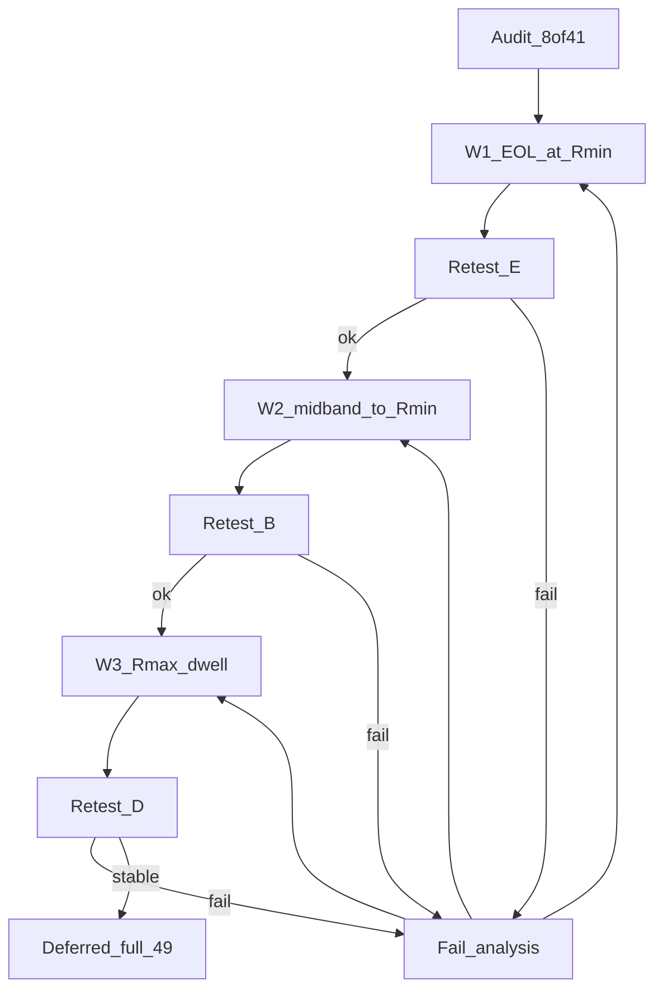
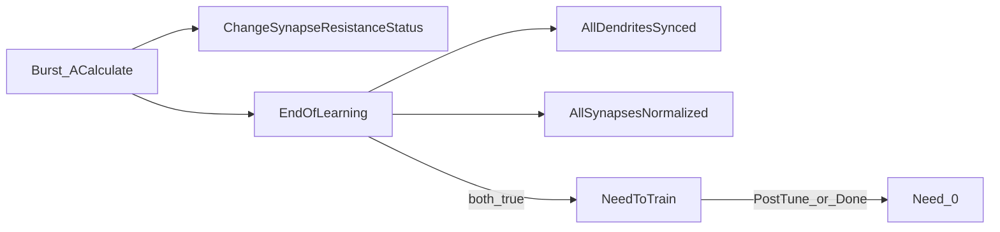

# План: AmpNorm / EOL — исправление сходимости Train

Статус: **pending** (исполнение не начато).  
База: [SOFTCOLD_CONVERGENCE_AUDIT.ru.md](SOFTCOLD_CONVERGENCE_AUDIT.ru.md) (49/49 = **8 PASS / 41 FAIL**).  
Код: `Libraries/Nmsdk-PulseLib/Core/NNeuronTimeLearner.cpp` (+ Branch twin).  
Связано: [AMPNORM_EOL_STUCK.ru.md](AMPNORM_EOL_STUCK.ru.md), [AMPNORM_EOL_INVESTIGATE.plan.md](AMPNORM_EOL_INVESTIGATE.plan.md).

**Инварианты:** не трогать LandscapeOk / Acc / fires; SoftCold контракт `tipr_class=canon` + Need→0; не маскировать Need в harness.

**Цель:** cold Train доходит до `EndOfLearning` на якорях E/B; ceiling/runaway (D) — отдельная волна; keep-PASS (`asym50`, `ltz50_gen`) без регрессии.

### Todos

- [ ] W1: EOL Done при TipR@Rmin (`AllSynapsesNormalized`) + rebuild + keep-PASS smoke
- [ ] W1 retest: `asym100_gen`, `ltz100_gen`, `fs50_preinh`, `ltz50_gen`; реестр/аудит
- [ ] W2: pathological/midband→Rmin в base + порт Branch; rebuild
- [ ] W2 retest: `fs25_gen`, `fs25_preinh`, `br25_preinh`, `asym50`; реестр/аудит
- [ ] W3: Rmax-dwell escape + amp-collapse guard; rebuild
- [ ] W3 retest выборка: `phase6_480`, `tn_classic`, 1× PhaseA/PSI; fail-analysis
- [ ] Отложено: полный SoftCold 49 после стабилизации W1–W3

---

## Диагноз → волны

| Волна | Корзина | Симптом | Где правим |
|-------|---------|---------|------------|
| **W1** | **E** (6) | TipR@Rmin, Need=1 | `AllSynapsesNormalized` |
| **W2** | **B** (7) | mid-band TipR, Need=1 | `ChangeSynapseResistanceStatus` + порт Branch |
| **W3** | **D** (21) | TipR → 1e11 / runaway | Rmax-dwell escape; EstDelay/L вторично |
| — | A/C/N | flat / Off / NonSeparable | вне C++-фикса |

Полный SoftCold 49 — только после W1–W3 (Deferred).



---

## Текущая реализация

### Поток Train → Need



### TipR tree (base) — сейчас

`ChangeSynapseResistanceStatus` ~669–925. Константы в `NNeuronTimeLearner.h`: `kAmpNormEps=1e-5`, `kAmpOscillationBand=0.005`, `kNoImproveResistanceLimit=3`, `kRminLengthTolFactor=2.0`. Порог `|dt|>5` — литерал.

```
dt = Initial - MaxAmp
ready = length_settled AND NOT DendStatus

IF NOT ready:          Status = pending if |dt|>eps; no TipR update
ELIF same_pattern AND |dt|<=eps:  Status=0
ELIF |dt| > 5.0:                  # SKIP TipR
  AmpDtSkipCount++
  IF skip>=3: clamp-step +/-5%; Status=1
ELIF |dt| > eps:
  IF R>Rmin AND |dt|<=osc_band:   # midband_walk → Rmin 5%
    force Rmin step
  ELSE:
    r_new = ComputeDampedTipResistance(...)  # может гнать к Rmax
    NoImprove++; IF NoImprove>=3 AND midband: force Rmin
                 ELIF NoImprove>=3: Status=0   # без Done
ELSE: Status=0
```

**Branch** (~916–1058): нет `|dt|>5` skip, нет midband→Rmin, нет `AmpDtSkipCount` — при NoImprove только Status=0. Критично для `br25_preinh` / br480 mid.

### EOL Done — сейчас

```
EndOfLearning:
  IF PostTune: false
  IF NOT synced OR NOT normalized: false
  IF PostTrainTuning: EnterPostTune; false
  ELSE: CalibrateFixedLTZ; Need=0

AllSynapsesNormalized (parametric, non-ref):
  length_ok = tol OR best_effort
              OR (at_r_min AND LastAbsDt <= tol * kRminLengthTolFactor)
  IF ResistanceStatus AND NOT (length_ok AND NoImprove>=3): BLOCK
  OK if amp_ok
     OR (at_r_min AND dt_positive AND length_ok)  # требует Initial > MaxAmp
     OR dead_tip+PeakSeen
     OR oscillation_ok / no_improve_done
```

Дыры: **E** — `@Rmin` часто без `dt_positive` или Status pending; **B** — skip `|dt|>5` + Status=0; **D** — clamp к ResistanceMax=1e11 без dwell-escape.

---

## Планируемые изменения

### W1 — EOL при TipR@Rmin (E)

Файл: `AllSynapsesNormalized` (симметрия в `AllDendritesSynced` только если блокирует sync).

```
# NEW rmin_settled
IF at_r_min AND length_ok:
  IF |dt| <= kAmpOscillationBand: OK     # amp у цели, в т.ч. чуть выше
  ELIF NoImprove >= limit: OK            # застряли на полу
  ELIF AmpDtSkipCount >= limit: OK

# ResistanceStatus: при at_r_min AND length_ok — не блокировать Done
```

Успех: `asym100_gen` / `ltz100_gen` → Need=0 + tipr=canon; keep `asym50`, `ltz50_gen` PASS.  
Риск раннего Done: только `|dt|<=osc_band` или NoImprove@Rmin, не «любой dt @Rmin».

### W2 — mid-band → Rmin (B)

Base + **обязательный порт Branch**.

```
kPathologicalAmpDt = 5.0  # named constexpr

ELIF |dt| > kPathologicalAmpDt:
  IF R > Rmin:
    # NEW: всегда шаг к Rmin (step >= 0.15), не skip-forever
    force Rmin step; Status=1
  ELSE:
    прежний escape после skip>=3
# NoImprove>=3 AND R>Rmin: ВСЕГДА force Rmin (даже |dt|>osc_band)
# midband_walk: шаг 0.05 → 0.15 если R > 1.2*Rmin
```

Успех: `fs25_gen` Need=0 + tipr≈canon; `br25_preinh` dend2 уходит с 6.76e7.

### W3 — Rmax dwell (D)

```
IF TipR >= ResistanceMax * (1 - eps):
  RmaxDwell++
  IF RmaxDwell >= limit: force step to Rmin; clear dwell
ELSE: RmaxDwell=0

# ComputeDampedTipResistance / coarse:
#   если r_old высок AND amp collapse: не увеличивать R
```

EstDelay / L=97 — отдельный follow-up после TipR-фикса, не в одном патче с W3.  
Успех выборки: `phase6_480` / `tn_classic` — TipR не залипает на 1e11 весь `-t`.

### Скрипты (минимально)

- Retest: `--keep-slog --snap-every 20` (на fail-якорях при нужде `--no-prune`).
- Нормализация запятой в TipR только в разборе лога (не меняет rc).
- Реестр: `apply_softcold_rcs_to_registry.py` после retest.
- Не менять tipr_class / early-stop / gate пороги.

---

## Порядок исполнения

0. **Подготовка:** `nmsdk-build`; evidence `AMPNORM_EOL_FIX_W{n}.ru.md`.
1. **W1** код → smoke `asym50` → retest E → реестр/аудит/коммиты (PulseLib→Bin→root).
2. **W2** код+Branch → retest B → документы.
3. **W3** код → retest D выборка → документы; EstDelay follow-up если L=97 при живом TipR.
4. **Fail-analysis:** stop queue; keep-slog timeline TipR/Need/AmpDt/LastAbsDt; патч той же волны; не идти дальше при регрессии keep-PASS.

---

## Выборочный retest (манифест)

Файл: `Bin/Configs/SpikeSamples/StructTrain/_repro/AMPNORM_EOL_RETEST_manifest.txt`.

- Keep: `asym50`, `ltz50_gen` → PASS
- E: `asym100_gen`, `ltz100_gen`, `fs50_preinh` → Need=0, tipr=canon
- B: `fs25_gen`, `br25_preinh` → Need=0, tipr→Rmin
- D: `phase6_480`, `tn_classic` → нет залипания @1e11
- N (не чинить): `br25_on` может остаться NonSeparable

---

## Deferred: полный SoftCold 49

Только после закрытия W1–W3 и стабильного выборочного манифеста. Скрипт `softcold_full_matrix.sh`; обновить RCS, реестр, финальный аудит. Не смешивать с промежуточными волнами.

---

## Вне скоупа

- LandscapeOk / Acc (`br25_on` NonSeparable)
- SoftColdOff / Keep/Search / nextseg flat (A/C)
- Полный EstDelay rewrite PhaseA (follow-up после W3)
