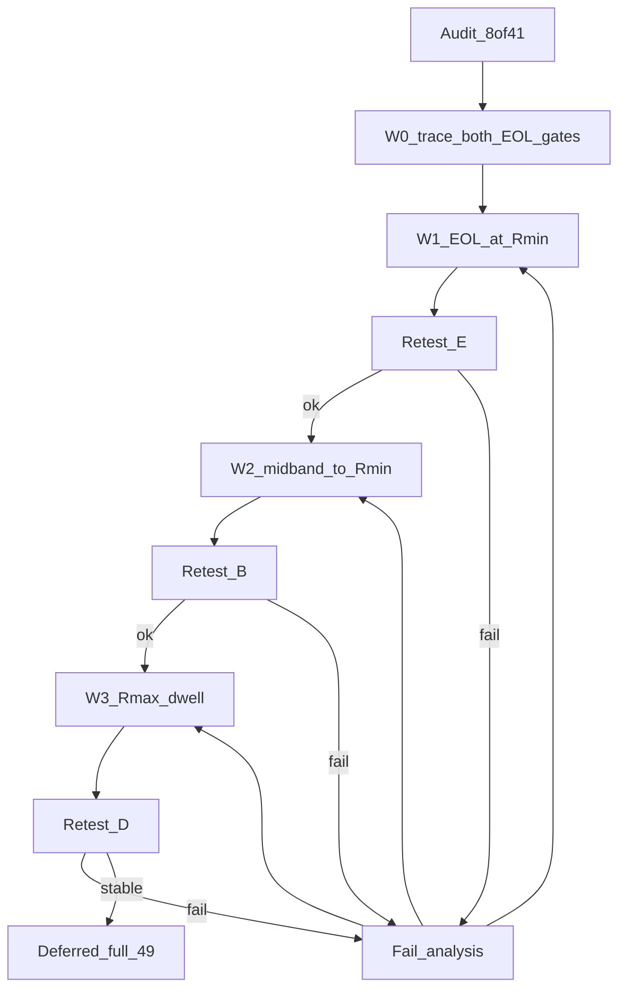
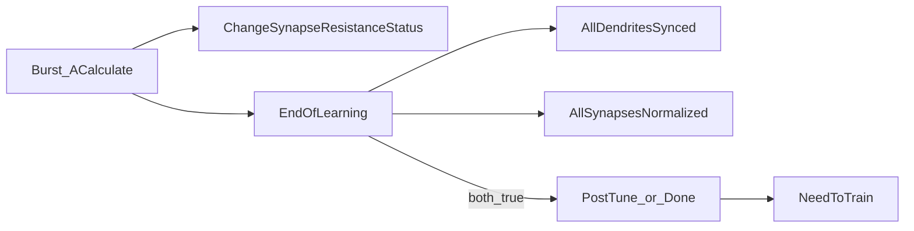

# План: AmpNorm / EOL — исправление сходимости Train

Статус: **pending** (исполнение не начато; детализация по коду 2026-10-03 после `db7c9133`).  
База: [SOFTCOLD_CONVERGENCE_AUDIT.ru.md](SOFTCOLD_CONVERGENCE_AUDIT.ru.md) (49/49 = **8 PASS / 41 FAIL**; D=22, E=6, B=7, A=3, C=1, G=2; N пересекает E).  
Код: [`NNeuronTimeLearner.cpp`](../../../Libraries/Nmsdk-PulseLib/Core/NNeuronTimeLearner.cpp) / [`.h`](../../../Libraries/Nmsdk-PulseLib/Core/NNeuronTimeLearner.h) (+ [`NNeuronTimeLearnerBranch.cpp`](../../../Libraries/Nmsdk-PulseLib/Core/NNeuronTimeLearnerBranch.cpp)).  
Связано: [AMPNORM_EOL_STUCK.ru.md](AMPNORM_EOL_STUCK.ru.md), [AMPNORM_fs25_KEEPSLOG.ru.md](AMPNORM_fs25_KEEPSLOG.ru.md), [AMPNORM_EOL_INVESTIGATE.plan.md](AMPNORM_EOL_INVESTIGATE.plan.md).

**Инварианты:** не трогать LandscapeOk / Acc / fires; SoftCold контракт `tipr_class=canon` + Need→0; не маскировать Need в harness.

**Цель:** cold Train доходит до `EndOfLearning` на якорях E/B; ceiling/runaway (D) — отдельная волна; keep-PASS (`asym50`, `ltz50_gen`) без регрессии.

### Сверка выводов ре-аудита (`db7c9133`)

| Утверждение ре-аудита | Вердикт сверки |
|----------------------|----------------|
| Арифметика 41 FAIL = D22+E6+B7+A3+C1+G2; N overlap на `br25_on` | **Подтверждено** по `SOFTCOLD_HEAD_rcs.txt` + спискам §4 |
| `ltz25_preinh` → D (runaway), не «прочее» | **Подтверждено** из локального untracked `metrics/SOFTCOLD_full_matrix.log`: TipR dend уходит в ~1e8…2e8+, Need=1 |
| `br100_keep/search` = G, не CanonRmin-дефект | **Подтверждено** (режим TipRMode) |
| Симптом ≠ доказанная C++-причина; нужны оба EOL-гейта | **Согласны** |
| Старый W1 «rmin_settled / Done при любом dt@Rmin» опасен (теряет знак dt) | **Согласны** — снят как спецификация |
| fs25 keep-slog: `\|dt\|>5` hits=0; stall = NoImprove/ResSt=0 | **Подтверждено** ([AMPNORM_fs25_KEEPSLOG.ru.md](AMPNORM_fs25_KEEPSLOG.ru.md)); W2 не центрировать на skip-ветке |
| Branch ≠ base (`ActivePulseIndex`, нет midband/`\|dt\|>5`) | **Подтверждено** в `NNeuronTimeLearnerBranch.cpp` |
| Полный matrix log «отсутствует в checkout» | **Уточнение:** файлы `metrics/SOFTCOLD_full_matrix.log` и `softcold_last_sample.json` есть **локально**, но **не в git** (`git ls-files` пусто). Clone без working tree их не видит. W0 = извлечь committed SNAP-summary + политика архива, не обязательно перегонять 49 |

**Вывод ревью (принят):** приоритет E/B/D сохраняется как *симптоматический*; W1–W3 — гипотезы до W0. До W0 не менять критерии Done и не применять слепые Rmin/Rmax escapes.

### Этапы

- [ ] **W0 — доказательства:** (1) matrix-log TipR/Need/L/gate; (2) harness читает уже существующие `*Trace` из Parameters на autosave; (3) при необходимости одна diagnostic-строка `EolGateAudit` (без смены Done); summary → `AMPNORM_EOL_W0_SNAP.md`. Без W0 не менять критерии Done.
- [ ] **W1 — E:** по W0 определить, что именно блокирует каждый Rmin-якорь; внести минимальную branch-specific правку только в доказанно ложный гейт.
- [ ] **W1 retest:** `asym100_gen`, `asym100_preinh`, `ltz100_gen`, `ltz25_gen`, `fs50_preinh`; Keep PASS: `asym50`, `ltz50_gen`; отдельно измерить Branch `br25_on` (ожидаемый NonSeparable не считать обучающим PASS).
- [ ] **W2 — B:** исправлять фактически подтверждённый stall отдельно в base и Branch; не переносить одну реализацию копированием.
- [ ] **W2 retest:** `fs25_gen`, `fs25_preinh`, `br25_preinh`, `br480_nextseg`, `br480_tiprmin`; Keep PASS: `asym50`, `br50_gen`.
- [ ] **W3 — D:** сначала проверить amp/dt/length динамику и направления R-шага; escape реализовывать только при подтверждённом Rmax dwell, с ограниченным возвратом и отдельной base/Branch логикой.
- [ ] **W3 retest:** representative PhaseA/PSI, Phase6, preinh и Branch cases; критерий фикса всего D — все 22 D-кейса в финальной матрице, а не только smoke на трёх якорях.
- [ ] **W4 — полный SoftCold 49** после закрытия W1–W3 и повторный аудит/реестр.

---

## Диагноз → волны

| Волна | Корзина | Симптом | Где правим |
|-------|---------|---------|------------|
| **W1** | **E** (6) | TipR@Rmin, Need=1 | сначала оба EOL-гейта; branch-specific правка |
| **W2** | **B** (7) | mid-band TipR, Need=1 | near-band/NoImprove path; base и Branch **отдельно** |
| **W3** | **D** (22) | TipR → 1e11 / runaway | сначала диагностика; Rmax-dwell escape только при подтверждении |
| **—** | A/C/G/N | flat / Off / Keep-Search / NonSeparable | отдельные протоколы и свойства данных |

Полный SoftCold 49 — только после W1–W3 (W4). W1–W3 — гипотезы, не заранее подтверждённые причины.



---

## Детализация по коду (base / Branch)

Константы (`NNeuronTimeLearner.h` ~450–470): `kAmpNormEps=1e-5`, `kAmpOscillationBand=0.005`, `kNoImproveResistanceLimit=3`, `kRminLengthTolFactor=2.0`, `kResistanceSettleRatio=1e-3`. Порог pathological `|dt|>5` — литерал в base (~778).

### Уже доступные traces (W0 без смены Done)

`UpdateNormTraces` (~220–293) пишет в `ptPubState` и уходит в Parameters/autosave:

| Property | Содержание |
|----------|------------|
| `AmpDtTrace` | `Initial - MaxAmp` per dend |
| `TipSynapseResistanceTrace` / `TipSynapseResistance` | TipR |
| `ResistanceStatusTrace` | ResistanceStatus |
| `NoImproveResistanceTrace` | NoImprove count |
| `LastAbsDtTrace` | DendLastAbsDt |
| `DendriteLengthTrace` | L |
| `TrainingPhase` | фаза Train/PostTune/Done |
| `IsNeedToTrain` | Need |

**Нет в Parameters (нужен diagnostic dump или EnableDebug log):** булевы `AllDendritesSynced()` / `AllSynapsesNormalized()` целиком; `PeakSeen`; `DendBestEffortSynced`; `SomaPeakValid`; Branch `PulseSynced` / `ActivePulseIndex`.  
W0 harness: расширить `posttune_verify` snap — парсить перечисленные `*Trace` из Parameters. Опционально C++: одна строка `EolGateAudit synced=… norm=…` при `EnableDebug` на вызове `EndOfLearning` (~3679 / Branch ~4001) — **только лог**.

### Поток Train → Need



Важно: при `EnablePostTrainTuning` успешный EOL вызывает `EnterPostTunePhase` и возвращает **false** (Need ещё не 0). SoftCold Need→0 = завершение PostTune / Done. Кейсы E с Need=1 до конца `-t` **не вошли** в PostTune.

### TipR tree — base (`ChangeSynapseResistanceStatus` ~669–925)

```
dt = Initial - MaxAmp
ready = length_settled AND NOT DendStatus   # length_settled: LastAbsDt<=tol OR best_effort

IF NOT ready:          Status = (|dt|>eps)?1:0;   # TipR НЕ обновляется
ELIF same_pattern AND |dt|<=eps:  Status=0
ELIF |dt| > 5.0:                  # AmpDtSkipCount; после 3 — clamp ±5% по знаку dt
ELIF |dt| > eps:
  IF R>Rmin AND |dt|<=osc_band:   # midband_walk (~824): шаг к Rmin 5%, NoImprove=0
    force Rmin
  ELSE:
    damped-P / coarse ±15%
    ApplyComputedResistance  # Status=0 если |ΔR|/R < settle_ratio !
    IF |dt|>eps: Status=1
    NoImprove++ unless meaningful_drop
    IF NoImprove>=3:
      IF R>Rmin AND |dt|<=osc_band: force Rmin   # (~891–907)
      ELSE: Status=0                             # ★ HOLE: freeze при osc_band < |dt| <= 5
ELSE: Status=0
```

**Критическая дыра base (кандидат W2):** при `NoImprove>=3` и `R>Rmin` и `|dt| > kAmpOscillationBand` код ставит `ResistanceStatus=0` **без** шага к Rmin (~909–910). Keep-slog fs25: медиана `|AmpDt|~6e-5` (внутри band), но хвосты/знаки могут уводить в damped-P; после midband-патча матрица всё ещё FAIL — проверить, срабатывает ли walk на HEAD и хватает ли шага 5% за `-t`.

`ApplyComputedResistance` (~612–614): при крошечном ΔR снова Status=0 — ещё один путь «заморозки» при формально активном контроллере.

### TipR tree — Branch (~916–1058)

Нет `|dt|>5` skip, нет `AmpDtSkipCount`, нет `midband_walk`, нет force-Rmin на NoImprove. При `NoImprove>=3` всегда `ResistanceStatus=0` (~1044–1045).  
`AllSynapsesNormalized` смотрит **только** `i == ActivePulseIndex` (~3896–3897).  
`AllDendritesSynced` = все `PulseSynced[]` (~3865–3877), не `DendLastAbsDt`.  
`EndOfLearning` → `kPhaseCalibrateLtz` + `ScaleTipResistancesForParallelActivation` (~4030), не сразу Done.

### EOL predicates — base

**`AllDendritesSynced` (~3523–3563)** для non-ref: требует `HasPrevPeakSnapshot`, valid ref peaks; per dend: `best_effort` OR `length_ok` OR `rmin_length_ok` (LastAbsDt ≤ 2×tol @Rmin) OR (dead_tip∧length_ok); иначе `SomaPeakValid` must hold.

**`AllSynapsesNormalized` parametric (~3567–3640)** per non-ref:

```
length_ok = LastAbsDt<=tol OR best_effort OR (at_Rmin AND LastAbsDt<=2*tol)
IF ResistanceStatus AND NOT (length_ok AND NoImprove>=3): return false   # pending R

OK iff any:
  amp_ok:           length_ok AND |dt|<=eps
  dead_tip:         MaxAmp < kMinMeasurable AND length_ok AND PeakSeen
  rmin_undershoot:  at_Rmin AND dt_positive AND length_ok   # Initial > MaxAmp+eps
  oscillation_ok:   length_ok AND NoImprove>=3 AND |dt|<osc_band
  no_improve_done:  length_ok AND NoImprove>=3 AND at_Rmin AND dt_positive
```

**Кандидаты блокировки E (TipR@Rmin, Need=1) — выбрать по W0 traces:**

| ID | Предикат ложен | Как видно в traces |
|----|----------------|--------------------|
| E1 | `AllDendritesSynced==false` | `LastAbsDtTrace` > 2×tol; или peak invalid (нет в Parameters → EolGateAudit) |
| E2 | `ResistanceStatus==1` и NoImprove&lt;3 | `ResistanceStatusTrace`, `NoImproveResistanceTrace` |
| E3 | overshoot: `dt<=0` и `|dt|>=osc_band` @Rmin | `AmpDtTrace` ≤ −eps, TipR@Rmin — **нет** Done-пути |
| E4 | `|dt|` в (eps, osc_band) без NoImprove≥3 | amp не amp_ok, oscillation_ok ещё нет |
| E5 | PostTune/Need lifecycle | `TrainingPhase`≠Done при synced∧norm (редко для E) |

W1 правит **только** подтверждённый ID; запрещён слепой «Done if TipR@Rmin».

### Кандидаты B (mid TipR)

| ID | Механизм | base / Branch |
|----|----------|---------------|
| B1 | NoImprove≥3 → Status=0 при `|dt|>osc_band` | base ★ |
| B2 | midband_walk/force только при `|dt|<=osc_band`; иначе damped-P осцилляция mid-R | base |
| B3 | шаг 5% слишком медленный за `-t` при walk | base (budget) |
| B4 | NoImprove≥3 → Status=0, **нет** force Rmin | Branch ★ (`br25_preinh`) |
| B5 | `!ready_for_r_tune` (length) — TipR не крутится | оба |

Гипотезы D: damped-P + clamp `ResistanceMax=1e11`; польза Rmax-dwell **не доказана** без ряда TipR/dt.

---

## Планируемые изменения

### W0 — доказательства (деталь)

1. Из untracked `SOFTCOLD_full_matrix.log` — таблица case→Need/TipR/L/gate (все 49).
2. Harness: на каждом autosave/SNAP писать из Parameters: `AmpDtTrace`, `ResistanceStatusTrace`, `NoImproveResistanceTrace`, `LastAbsDtTrace`, TipR, L, `TrainingPhase`, Need. Нормализация `,`→`.` в TipR.
3. Diagnostic SoftCold на якорях E/B (+1 D): `asym100_gen`, `fs50_preinh`, `fs25_gen`, `br25_preinh`, `phase6_480` — с `--keep-slog --snap-every 20`; EnableDebug для `AmpDtAudit` / опциональный `EolGateAudit`.
4. Артефакт git: `AMPNORM_EOL_W0_SNAP.md` — per-anchor гипотеза E1–E5 / B1–B5.  
5. **Стоп-критерий W0:** для каждого E/B якоря назван один доминирующий предикат; иначе не переходить к коду Done/controller.

### W1 — EOL при TipR@Rmin (E)

**Сначала W0, затем узкая правка.**

```text
IF AllDendritesSynced == false:
  fix only measured sync blocker (length / peak / best-effort)
ELIF AllSynapsesNormalized == false:
  match failing predicate to E2–E4; narrowest rule that preserves dt-sign contract
ELSE:
  inspect PostTune / Need lifecycle — do not widen normalization
```

Примеры допустимых правок **после** доказательства (не заранее):
- E2: не держать Status=1 вечно @Rmin при length_ok (согласовать с ApplyComputedResistance).
- E3/E4: только если amp-контракт допускает — например oscillation_ok уже покрывает `|dt|<osc_band`; расширять band **не** без метрик.
- Запрещено: `if (at_r_min) return true` без length/dt.

**Успех:** E-якоря с достижимой селективностью → Need=0 + tipr=canon; keep `asym50`/`ltz50_gen`. `br25_on`: Train Done отдельно от NonSeparable gate.

### W2 — mid-band → Rmin (B)

Отдельно base и Branch. Приоритет по коду (до подтверждения W0 trace на HEAD):

**Base — кандидат B1 (главный):** заменить ветку ~909–910:

```text
# сейчас:
IF NoImprove>=3:
  IF R>Rmin AND |dt|<=osc_band: force Rmin
  ELSE: ResistanceStatus=0          # freeze

# цель после W0 (если подтверждено):
IF NoImprove>=3 AND R>Rmin AND ready AND peak valid:
  bounded step in error-correction direction  # dt>0 → R↓, dt<0 → R↑
  NoImprove=0; Status=1
ELSE IF NoImprove>=3 AND R<=Rmin:
  Status=0   # floor reached; EOL решает W1
```

Сохранить/усилить midband_walk (~824) только как ускоритель при `|dt|<=osc_band`; не единственный фикс.  
**Branch — кандидат B4:** добавить bounded directional recovery при NoImprove≥3 и R>Rmin (инвариант base, не copy-paste midband/`|dt|>5`).

Запрещено: безусловный force Rmin при `dt<0`. `|dt|>5` escape — вторичная защита, не фокус fs25.

**Успех:** `fs25_gen` / `br25_preinh` → tipr=canon, Need=0; keep-PASS зелёные.

### W3 — Rmax dwell (D)

```
IF valid fresh burst AND length/controller state is ready:
  record TipR, dt sign/magnitude, amp ratio, length and applied R delta
  IF repeated near-Rmax dwell AND dt direction supports lowering R:
    use bounded recovery step; preserve per-dendrite controller state
ELSE:
  do not advance dwell counter
```

`RmaxDwell`, порог, счётчик, сброс и связь с амп-collapse пока не определены данными. Не делать автоматический прыжок Rmax→Rmin до подтверждения временным рядом; это может разрушить валидный режим и не устранить первопричину. Base и Branch имеют разные контуры, поэтому W3 должен явно перечислить код-пути/кейсы обоих.

EstDelay / L=97 — отдельный follow-up, не смешивать его с W3. Проверить отдельно PhaseA/PSI с длинным L, Phase6 после EstDelay fix, preinh и `tn_classic`. **Успех выборки** — воспроизводимый ограниченный R-control без длительного ceiling и без ухудшения sync/Acc; **успех W3** подтверждается только полной повторной матрицей D=22.

### Скрипты (минимально)

- Retest: `--keep-slog --snap-every 20` (на fail-якорях при нужде `--no-prune`).
- **W0 harness:** парсить из Parameters уже существующие `AmpDtTrace`, `ResistanceStatusTrace`, `NoImproveResistanceTrace`, `LastAbsDtTrace` (см. `UpdateNormTraces`); не ждать нового бинарника для базового SNAP.
- Нормализация запятой в TipR только в разборе лога (не меняет rc).
- **Evidence policy:** полный matrix log / slog — вне git; в git — `AMPNORM_EOL_W0_SNAP.md`.
- Зафиксировать SHA Console, commit PulseLib, config hash, cmdline, RCS, bundle path у каждого нового прогона.
- Реестр: `apply_softcold_rcs_to_registry.py` после retest.
- Не менять tipr_class / early-stop / gate пороги.

---

## Порядок исполнения

0. **W0:** (a) matrix-log TipR/Need/L/gate на 49; (b) harness читает `AmpDtTrace` / `ResistanceStatusTrace` / `NoImproveResistanceTrace` / `LastAbsDtTrace` с autosave; (c) diagnostic runs якорей + опциональный `EolGateAudit`; (d) `AMPNORM_EOL_W0_SNAP.md` с ID E1–E5 / B1–B5; (e) без названного предиката — не править Done/controller.
1. **W1:** воспроизвести E; если изменяется алгоритм — build, smoke на `asym50`/`ltz50_gen`, затем все релевантные E-якоря и отдельный Branch контроль.
2. **W2:** отдельные base и Branch изменения; build и ретест B плюс keep-PASS.
3. **W3:** только после подтверждения Rmax-dwell; диагностический ретест разных семейств, затем весь D=22.
4. **W4:** полный SoftCold 49 на одном зафиксированном Console/PulseLib срезе; сравнить PASS/FAIL, Need, gate rc, TipR, length и fires; обновить RCS, реестр и аудит.
5. **Fail-analysis:** при любом неожиданном gate/Need исходе остановить волну, сохранить keep-slog timeline TipR/Need/AmpDt/LastAbsDt и оба EOL-гейта; корректировать ту же гипотезу. Не продолжать при регрессии keep-PASS.

---

## Выборочный retest (манифест)

Создать файл `Bin/Configs/SpikeSamples/StructTrain/_repro/AMPNORM_EOL_RETEST_manifest.txt` перед выполнением; в текущем checkout его ещё нет.

- Keep: `asym50`, `ltz50_gen` → PASS
- E: `asym100_gen`, `asym100_preinh`, `ltz100_gen`, `ltz25_gen`, `fs50_preinh` → оба EOL-гейта/need проверены; при достижимой селективности Need=0, tipr=canon
- B base: `fs25_gen`, `fs25_preinh`; B Branch: `br25_preinh`, `br480_nextseg`, `br480_tiprmin` → Need=0, tipr=canon для CanonRmin
- Keep PASS: `asym50`, `ltz50_gen`, `br50_gen`
- D smoke: `phase6_480`, `tn_classic`, один PhaseA/PSI и один preinh; затем полная D=22 матрица
- N: `br25_on` может завершиться с NonSeparable; зафиксировать обучение отдельно от gate/selectivity
- G: `br100_keep`, `br100_search` оставить отдельными от CanonRmin критериев

---

## Deferred: полный SoftCold 49

Только после закрытия W1–W3 и стабильного выборочного манифеста. Скрипт `softcold_full_matrix.sh`; сохранить артефакты, проверить 49/49 case id и обновить RCS, реестр, финальный аудит. Не смешивать разные бинарные срезы внутри одной итоговой матрицы.

---

## Вне скоупа

- LandscapeOk / Acc (`br25_on` NonSeparable)
- SoftColdOff / Keep/Search / nextseg flat (A/C/G)
- Полный EstDelay rewrite PhaseA (follow-up после W3)
