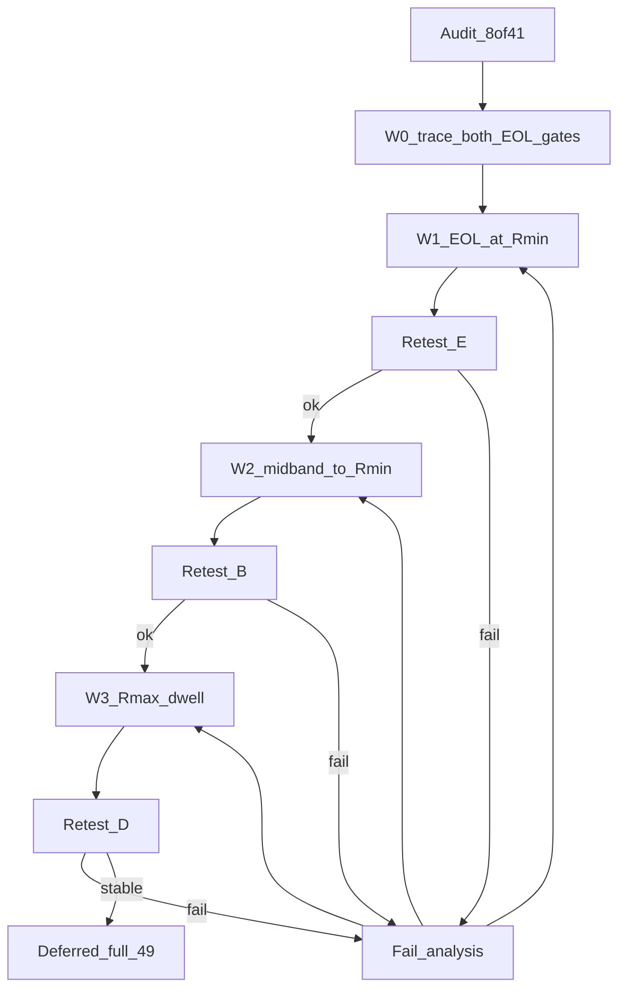
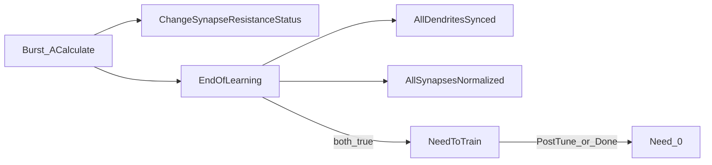

# План: AmpNorm / EOL — исправление сходимости Train

Статус: **pending** (исполнение не начато; пересмотрен по ре-аудиту `db7c9133`, сверка агентом 2026-10-03).  
База: [SOFTCOLD_CONVERGENCE_AUDIT.ru.md](SOFTCOLD_CONVERGENCE_AUDIT.ru.md) (49/49 = **8 PASS / 41 FAIL**; D=22, E=6, B=7, A=3, C=1, G=2; N пересекает E).  
Код: `Libraries/Nmsdk-PulseLib/Core/NNeuronTimeLearner.cpp` (+ Branch twin).  
Связано: [AMPNORM_EOL_STUCK.ru.md](AMPNORM_EOL_STUCK.ru.md), [AMPNORM_fs25_KEEPSLOG.ru.md](AMPNORM_fs25_KEEPSLOG.ru.md), [AMPNORM_EOL_INVESTIGATE.plan.md](AMPNORM_EOL_INVESTIGATE.plan.md).

**Инварианты:** не трогать LandscapeOk / Acc / fires; SoftCold контракт `tipr_class=canon` + Need→0; не маскировать Need в harness.

**Цель:** cold Train доходит до `EndOfLearning` на якорях E/B; ceiling/runaway (D) — отдельная волна; keep-PASS (`asym50`, `ltz50_gen`) без регрессии.

### Сверка выводов ре-аудита (`db7c9133`)

| Утверждение ре-аудита | Вердикт сверки |
|----------------------|----------------|
| Арифметика 41 FAIL = D22+E6+B7+A3+C1+G2; N overlap на `br25_on` | **Подтверждено** по `SOFTCOLD_HEAD_rcs.txt` + спискам §4 |
| `ltz25_preinh` → D (runaway), не «прочее» | **Подтверждено** из локального untracked `metrics/SOFTCOLD_full_matrix.log`: TipR dend уходит в ~1e8…2e8+, Need=1 |
| `br100_keep/search` = G, не CanonRmin-дефект | **Подтверждено** (режим TipRMode) |
| Симптом ≠ доказанная C++-причина; нужны оба EOL-гейта | **Согласны** |
| Старый W1 «rmin_settled / Done при любом dt@Rmin» опасен (теряет знак dt) | **Согласны** — снят как спецификация |
| fs25 keep-slog: `\|dt\|>5` hits=0; stall = NoImprove/ResSt=0 | **Подтверждено** ([AMPNORM_fs25_KEEPSLOG.ru.md](AMPNORM_fs25_KEEPSLOG.ru.md)); W2 не центрировать на skip-ветке |
| Branch ≠ base (`ActivePulseIndex`, нет midband/`\|dt\|>5`) | **Подтверждено** в `NNeuronTimeLearnerBranch.cpp` |
| Полный matrix log «отсутствует в checkout» | **Уточнение:** файлы `metrics/SOFTCOLD_full_matrix.log` и `softcold_last_sample.json` есть **локально**, но **не в git** (`git ls-files` пусто). Clone без working tree их не видит. W0 = извлечь committed SNAP-summary + политика архива, не обязательно перегонять 49 |

**Вывод ревью (принят):** приоритет E/B/D сохраняется как *симптоматический*; W1–W3 — гипотезы до W0. До W0 не менять критерии Done и не применять слепые Rmin/Rmax escapes.

### Этапы

- [ ] **W0 — доказательства:** из локального matrix log (если есть) и/или новых diagnostic runs извлечь per-case SNAP: оба EOL-гейта + dendrite state; закоммитить компактный summary в evidence; полный slog не в git. Без W0 не менять критерии Done.
- [ ] **W1 — E:** по W0 определить, что именно блокирует каждый Rmin-якорь; внести минимальную branch-specific правку только в доказанно ложный гейт.
- [ ] **W1 retest:** `asym100_gen`, `asym100_preinh`, `ltz100_gen`, `ltz25_gen`, `fs50_preinh`; Keep PASS: `asym50`, `ltz50_gen`; отдельно измерить Branch `br25_on` (ожидаемый NonSeparable не считать обучающим PASS).
- [ ] **W2 — B:** исправлять фактически подтверждённый stall отдельно в base и Branch; не переносить одну реализацию копированием.
- [ ] **W2 retest:** `fs25_gen`, `fs25_preinh`, `br25_preinh`, `br480_nextseg`, `br480_tiprmin`; Keep PASS: `asym50`, `br50_gen`.
- [ ] **W3 — D:** сначала проверить amp/dt/length динамику и направления R-шага; escape реализовывать только при подтверждённом Rmax dwell, с ограниченным возвратом и отдельной base/Branch логикой.
- [ ] **W3 retest:** representative PhaseA/PSI, Phase6, preinh и Branch cases; критерий фикса всего D — все 22 D-кейса в финальной матрице, а не только smoke на трёх якорях.
- [ ] **W4 — полный SoftCold 49** после закрытия W1–W3 и повторный аудит/реестр.

---

## Диагноз → волны

| Волна | Корзина | Симптом | Где правим |
|-------|---------|---------|------------|
| **W1** | **E** (6) | TipR@Rmin, Need=1 | сначала оба EOL-гейта; branch-specific правка |
| **W2** | **B** (7) | mid-band TipR, Need=1 | near-band/NoImprove path; base и Branch **отдельно** |
| **W3** | **D** (22) | TipR → 1e11 / runaway | сначала диагностика; Rmax-dwell escape только при подтверждении |
| **—** | A/C/G/N | flat / Off / Keep-Search / NonSeparable | отдельные протоколы и свойства данных |

Полный SoftCold 49 — только после W1–W3 (W4). W1–W3 — гипотезы, не заранее подтверждённые причины.



---

## Текущая реализация

### Поток Train → Need



### TipR tree (base) — сейчас

`ChangeSynapseResistanceStatus` ~669–925. Константы в `NNeuronTimeLearner.h`: `kAmpNormEps=1e-5`, `kAmpOscillationBand=0.005`, `kNoImproveResistanceLimit=3`, `kRminLengthTolFactor=2.0`. Порог `|dt|>5` — литерал.

```
dt = Initial - MaxAmp
ready = length_settled AND NOT DendStatus

IF NOT ready:          Status = pending if |dt|>eps; no TipR update
ELIF same_pattern AND |dt|<=eps:  Status=0
ELIF |dt| > 5.0:                  # SKIP TipR
  AmpDtSkipCount++
  IF skip>=3: clamp-step +/-5%; Status=1
ELIF |dt| > eps:
  IF R>Rmin AND |dt|<=osc_band:   # midband_walk → Rmin 5%
    force Rmin step
  ELSE:
    r_new = ComputeDampedTipResistance(...)  # может гнать к Rmax
    NoImprove++; IF NoImprove>=3 AND midband: force Rmin
                 ELIF NoImprove>=3: Status=0   # без Done
ELSE: Status=0
```

**Branch** (~916–1058): нет `|dt|>5` skip, нет midband→Rmin, нет `AmpDtSkipCount` — при NoImprove только Status=0. Критично для `br25_preinh` / br480 mid.

### EOL Done — сейчас

```
EndOfLearning:
  IF PostTune: false
  IF NOT synced OR NOT normalized: false
  IF PostTrainTuning: EnterPostTune; false
  ELSE: CalibrateFixedLTZ; Need=0

AllSynapsesNormalized (parametric, non-ref):
  length_ok = tol OR best_effort
              OR (at_r_min AND LastAbsDt <= tol * kRminLengthTolFactor)
  IF ResistanceStatus AND NOT (length_ok AND NoImprove>=3): BLOCK
  OK if amp_ok
     OR (at_r_min AND dt_positive AND length_ok)  # требует Initial > MaxAmp
     OR dead_tip+PeakSeen
     OR oscillation_ok / no_improve_done
```

Гипотезы: **E** — один из sync/AmpNorm гейтов не проходит (конкретный предикат не известен); **B** — mid-band/NoImprove stall или недостаточный budget (base skip `|dt|>5` существует, но не наблюдался в старом fs25 keep-slog); **D** — TipR упирается в ResistanceMax, но причина и польза dwell-escape не доказаны.

---

## Планируемые изменения

### W1 — EOL при TipR@Rmin (E)

**Сначала диагноз, затем код.** На каждом E-якоре сохранить `AllDendritesSynced()`, `AllSynapsesNormalized()`, `DendLastAbsDt`, `DendBestEffortSynced`, `DendStatus`, `PulseSynced` (Branch), `ResistanceStatus`, `NoImproveResistanceCount`, `PeakSeen`, `dt = InitialSomaPotential - MaxIterSomaAmp`, текущую фазу и `ActivePulseIndex` (для Branch). Длины `L` и факт `TipR≈Rmin` не заменяют эти поля.

В текущем base-коде уже есть проверки `at_r_min && dt_positive && length_ok`, `no_improve_done` и slack длины до `2×SyncTolerance`; `AllDendritesSynced` имеет соответствующую проверку длины. Поэтому W1 **не** должен просто добавлять второй `at_r_min` bypass. Branch имеет другой active-pulse gate, и его анализ/правка отдельны.

```text
IF AllDendritesSynced == false:
  diagnose length / best-effort / PeakValid; fix only measured sync blocker
ELIF AllSynapsesNormalized == false:
  identify exact failing predicate (dt sign/magnitude, pending status, peak attempt)
  propose the narrowest rule consistent with the amp error contract
ELSE:
  inspect PostTune transition and Need lifecycle; do not change normalization gate
```

Не считать `NoImprove >= limit` само по себе достаточным для Done. При `dt <= 0` TipR@Rmin нельзя трактовать как «недостаёт только спуска R»: сначала выяснить, вызван ли overshoot/invalid peak; не снимать `Need` только потому, что сопротивление упёрлось в нижний предел. Не ослаблять `LandscapeOk`, gate, fires или контракт `tipr_class`.

**Успех:** на E-якорях, для которых селективность достижима, `Need→0`, ожидаемый CanonRmin и сохранённые гейты; `asym50`, `ltz50_gen` остаются PASS. `br25_on` проверяется отдельно: EndOfLearning и классификатор/gate — разные критерии, и ожидаемый NonSeparable не засчитывается как селективный PASS.

### W2 — mid-band → Rmin (B)

Отдельные правки **base** и **Branch** (не копировать base verbatim). Инвариант: при валидном измерении и R>Rmin контроллер не замирает через `ResistanceStatus=0` без шага коррекции ошибки.

```text
IF peak/length data are valid AND R > Rmin:
  IF |dt| <= eps:
    settle this amp measurement
  ELIF near-band AND NoImprove >= limit:
    take a bounded step in the measured error-correction direction
    # primary fs25 path (keep-slog): |dt|>5 never fired
  ELIF |dt| > kPathologicalAmpDt:
    after the bounded skip budget, take a bounded directional recovery step
    # defense only; not the proven fs25 stall
  ELSE:
    continue the damped controller and track whether error actually falls
ELSE:
  do not apply a blind floor step; record invalid/opposite-sign/unready state
```

Preserve error direction: lower R for positive `dt`, raise for negative `dt`; unconditionally forcing Rmin when `dt<0` is forbidden. Do not reintroduce NoImprove→freeze without Done.

**Диагностическое ограничение:** [AMPNORM_fs25_KEEPSLOG.ru.md](AMPNORM_fs25_KEEPSLOG.ru.md) — `|dt|>5` hits=0, NoImprove mid=21, ResSt=0. W2 сначала проверяет near-band на финальном HEAD (`--keep-slog`), затем Branch mid-freeze (`br25_preinh`). Не переносить причину fs25 на все B без per-case trace.

**Успех:** B retests → tipr=canon и Need=0 без деградации fires/Acc; `fs25_gen` не stall ~2.6e7; `br25_preinh` dend2 уходит с ~6.76e7. Keep-PASS зелёные.

### W3 — Rmax dwell (D)

```
IF valid fresh burst AND length/controller state is ready:
  record TipR, dt sign/magnitude, amp ratio, length and applied R delta
  IF repeated near-Rmax dwell AND dt direction supports lowering R:
    use bounded recovery step; preserve per-dendrite controller state
ELSE:
  do not advance dwell counter
```

`RmaxDwell`, порог, счётчик, сброс и связь с амп-collapse пока не определены данными. Не делать автоматический прыжок Rmax→Rmin до подтверждения временным рядом; это может разрушить валидный режим и не устранить первопричину. Base и Branch имеют разные контуры, поэтому W3 должен явно перечислить код-пути/кейсы обоих.

EstDelay / L=97 — отдельный follow-up, не смешивать его с W3. Проверить отдельно PhaseA/PSI с длинным L, Phase6 после EstDelay fix, preinh и `tn_classic`. **Успех выборки** — воспроизводимый ограниченный R-control без длительного ceiling и без ухудшения sync/Acc; **успех W3** подтверждается только полной повторной матрицей D=22.

### Скрипты (минимально)

- Retest: `--keep-slog --snap-every 20` (на fail-якорях при нужде `--no-prune`).
- Нормализация запятой в TipR только в разборе лога (не меняет rc).
- **Evidence policy:** полный `SOFTCOLD_full_matrix.log` / slog — локально или в архиве вне git; в git — компактный `AMPNORM_EOL_W0_SNAP.md` (таблица case → Need/TipR/L/gate + поля гейтов, когда доступны). Не считать «отсутствие в git» = «прогонов не было», если файлы есть untracked на машине прогона.
- Зафиксировать SHA Console, commit PulseLib, config hash, cmdline, RCS, bundle path у каждого нового прогона.
- Реестр: `apply_softcold_rcs_to_registry.py` после retest.
- Не менять tipr_class / early-stop / gate пороги.

---

## Порядок исполнения

0. **W0:** (a) извлечь из локального matrix log финальные TipR/Need/L/gate для всех 41 FAIL + PASS controls; (b) для якорей E/B/D — diagnostic SoftCold с расширенным SNAP обоих EOL-гейтов и dendrite state (код логирования SNAP при необходимости — **только диагностика**, не смена Done); (c) закоммитить summary; (d) зафиксировать гипотезу per-anchor до правки алгоритма.
1. **W1:** воспроизвести E; если изменяется алгоритм — build, smoke на `asym50`/`ltz50_gen`, затем все релевантные E-якоря и отдельный Branch контроль.
2. **W2:** отдельные base и Branch изменения; build и ретест B плюс keep-PASS.
3. **W3:** только после подтверждения Rmax-dwell; диагностический ретест разных семейств, затем весь D=22.
4. **W4:** полный SoftCold 49 на одном зафиксированном Console/PulseLib срезе; сравнить PASS/FAIL, Need, gate rc, TipR, length и fires; обновить RCS, реестр и аудит.
5. **Fail-analysis:** при любом неожиданном gate/Need исходе остановить волну, сохранить keep-slog timeline TipR/Need/AmpDt/LastAbsDt и оба EOL-гейта; корректировать ту же гипотезу. Не продолжать при регрессии keep-PASS.

---

## Выборочный retest (манифест)

Создать файл `Bin/Configs/SpikeSamples/StructTrain/_repro/AMPNORM_EOL_RETEST_manifest.txt` перед выполнением; в текущем checkout его ещё нет.

- Keep: `asym50`, `ltz50_gen` → PASS
- E: `asym100_gen`, `asym100_preinh`, `ltz100_gen`, `ltz25_gen`, `fs50_preinh` → оба EOL-гейта/need проверены; при достижимой селективности Need=0, tipr=canon
- B base: `fs25_gen`, `fs25_preinh`; B Branch: `br25_preinh`, `br480_nextseg`, `br480_tiprmin` → Need=0, tipr=canon для CanonRmin
- Keep PASS: `asym50`, `ltz50_gen`, `br50_gen`
- D smoke: `phase6_480`, `tn_classic`, один PhaseA/PSI и один preinh; затем полная D=22 матрица
- N: `br25_on` может завершиться с NonSeparable; зафиксировать обучение отдельно от gate/selectivity
- G: `br100_keep`, `br100_search` оставить отдельными от CanonRmin критериев

---

## Deferred: полный SoftCold 49

Только после закрытия W1–W3 и стабильного выборочного манифеста. Скрипт `softcold_full_matrix.sh`; сохранить артефакты, проверить 49/49 case id и обновить RCS, реестр, финальный аудит. Не смешивать разные бинарные срезы внутри одной итоговой матрицы.

---

## Вне скоупа

- LandscapeOk / Acc (`br25_on` NonSeparable)
- SoftColdOff / Keep/Search / nextseg flat (A/C/G)
- Полный EstDelay rewrite PhaseA (follow-up после W3)
