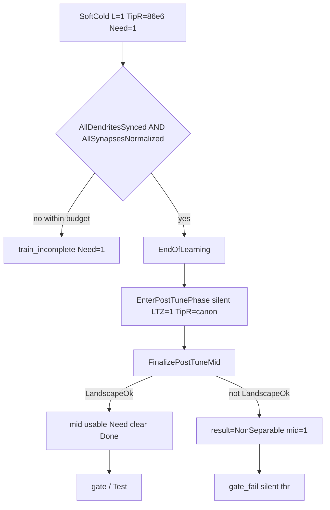

# Root-cause: SoftCold FAIL на eps-fixed Console (`ec86430e…`)

Дата: 2026-09-27. Источники: provenance + `_work` Parameters/flags/gate logs + `NNeuronTimeLearner.cpp` / `NNeuronPostTrainTune.h` / `posttune_verify.py`.

## Две главные корзины

| Корзина | failure_class | Критерий в артефактах | Кейсы |
|---------|---------------|----------------------|-------|
| **A. PostTune NonSeparable** | `gate_fail` | Need→0, tipr=canon, FLAG `result=2` `landscape_ok=0` `mid=1`, gate: `inference mid still silent: 1` | `asym25_preinh`, `br25_on` |
| **B. Train incomplete** | `train_incomplete` | Need=1 до конца budget / exit; tipr≠canon или mid missing | `asym50/100_*`, `phase6_*`, `fs25_gen` |

`fires_missing` часто **вторичен**: в `posttune_verify.run_gate` при `gate.ok=False` fires обнуляются (`fires = gate.fires if gate.ok else ""`), даже если CSV есть.

---

## A — Need=0 + tipr=canon, но gate_fail

### Что видно

**asym25_preinh** (`…T110401Z_work`):

- Need=0, TipR=`2e07 2e07 2e07 8.6e07` (canon), L=`1 1 1 1`
- `posttune_complete.flag`: `mid=1 gap=-0.00045 landscape_ok=0 inference=0 result=2 FixedLTZ=1`
- metrics (8 peaks): `0.0337,0.0339,0.0338,0.0342,0.0264,…` — есть foil **выше** target → gap&lt;0
- gate: `skip-tipr-mid: thr=1 (silent)` → `inference mid still silent: 1`

**br25_on** (`…T001141Z_work`): то же — Need=0, tipr=canon, FLAG `result=2 landscape_ok=0 mid=1`, gate silent mid.

### Код

1. `EndOfLearning()` при `EnablePostTrainTuning` → `EnterPostTunePhase()` (Need **ещё не** Done):

```3608:3611:Libraries/Nmsdk-PulseLib/Core/NNeuronTimeLearner.cpp
 if(EnablePostTrainTuning.GetData())
 {
  EnterPostTunePhase();
  return false;
```

2. PostTune ставит LTZ = silent (1.0), TipR→canon:

```3975:3978:Libraries/Nmsdk-PulseLib/Core/NNeuronTimeLearner.cpp
 const double silent = PostTrainSilentThreshold.GetData();
 SetLTZThreshold(silent);
 ...
 UseFixedLTZThreshold.SetDataDirect(true);
```

3. `FinalizePostTuneMid`: если `!LandscapeOk(tgt, foils)` → mid остаётся silent, `PostTuneResult = kResultNonSeparable` (2):

```4054:4070:Libraries/Nmsdk-PulseLib/Core/NNeuronTimeLearner.cpp
   landscape_ok = metrics_ok && PostTrainTune::LandscapeOk(tgt, foils);
   ...
   if(!metrics_ok || !landscape_ok)
    mid = PostTrainSilentThreshold.GetData();
   ...
   else if(!landscape_ok)
    PostTuneResult = PostTrainTune::kResultNonSeparable;
```

4. `LandscapeOk` — каждый foil строго &lt; tgt (`NNeuronPostTrainTune.h`). Ослаблять **нельзя** по плану.

5. Harness видит flag → `flag_flush` Need=0, SIGTERM (−15); gate с `--skip-tipr-mid` пытается inference mid при thr=1 → FAIL.

**Вывод A:** eps-fix **справился с Train termination** (Need=0). Провал — **качество mid**: recognition landscape неразделим → silent mid → Test/gate не селективны. Это не баг poll-budget и не Pixbuf.

---

## B — Need=1 до конца (train_incomplete)

### B1. TipR «замёрз» на cold flat (AsymRm span50/100)

| case | TipR end | L end | Need |
|------|----------|-------|------|
| asym50_preinh | `86e6×4` flat | `1 1 1 1` | 1 |
| asym100_preinh / gen | same | `1 1 1 1` | 1 |

~401 poll × 30 s ≈ 3.3 ч, child_rc=−15 (harness kill на cap). TipR/L **не сдвинулись** с soft-cold старта → обучение не дошло до sync/amp-norm / EndOfLearning.

Контраст span25: те же neuron-классы Preinh/AsymRm **доходят** до TipR=canon за минуты.

Гипотезы (ещё не доказаны кодом одного бага):

- слишком малый wall-budget относительно динамики span50/100 (−t 640 + polls=401);
- amp-norm / sync stall **до** роста TipR (не тот же int-eps — eps уже double);
- soft-cold + FixedLTZ=1 + AutoCalibrate=0 держит «тихий» режим дольше на длинном span.

### B2. Phase6: рост есть, Need не сброшен

`phase6_thr_only`: TipR=`1e11 1e11 1e11 86e6`, L=`97 81 49 1`, Need=1, tipr_class=**other**, child_rc=**0** (NM сам вышел по −t 900).

Морфогенез/TipR **шли**, но `AllDendritesSynced() && AllSynapsesNormalized()` так и не стали true → `EndOfLearning` не вызвал успешный PostTune Done. Gate снова `thr=1 silent`.

`phase6_preinh250` / `ltzcal_twin` — тот же класс.

### B3. fs25_gen: парадокс

- Train: Need=1, TipR частично вырос (`20e6 20e6 ~3.4e7 86e6`), L=`6 5 4 1`
- Gate: **acc=8 selective**, mid≈0.0277, `ok_audit=1` — но `gate rc -15` (SIGTERM NM в gate) → harness `gate_ok=False`
- accept: **train_incomplete** (Need=1) первичен; качество Test не спасает PASS

То есть на FastSpan Test уже «хороший», но cold-контракт требует Need=0.

---

## Карта причин (код ↔ симптом)



---

## Что это значит для плана

| Наблюдение | Следствие |
|------------|-----------|
| TL-01 eps | Подтверждён на span25: Train finishes. **Не** чинит NonSeparable mid. |
| LandscapeOk | На asym25/br25 — реальный quality FAIL; не трогать порог. |
| span50/100 SoftCold | Нужен отдельный разбор **почему TipR не стартует** (не путать с gate_fail). |
| Phase6 | Need-stuck после роста L/TipR → sync/amp-norm / time budget. |
| fs25 | Возможный false-negative по gate SIGTERM; всё равно Need=1 блокирует PASS. |
| Harness | `fires_missing` при gate_fail — шум; смотреть FLAG `result`/`landscape_ok` и gate log. |

## Следующие проверки (investigation, без morph-fix)

1. На asym50: StatisticLog / debug — была ли хоть одна смена TipR или amp-norm progress.
2. Сравнить unpatched vs patched asym50 TipR timeline (если bundle есть).
3. Для NonSeparable: разобрать order metrics[0]=tgt vs foils в FLAG (уже gap&lt;0).
4. Harness: не обнулять fires при gate_rc≠0 если CSV свежий (улучшение диагностики, не PASS).


---

## Отложенный retest с увеличенным `-t`

Таксономия и очередь: [RETEST_EXTENDED_TIME.plan.md](RETEST_EXTENDED_TIME.plan.md), снимок [FAIL_TAXONOMY.json](FAIL_TAXONOMY.json), манифест P0 `_repro/EXTENDED_TIME_MANIFEST.txt`.

- **B_partial_growth_need1** (fs25_gen, phase6_*) — приоритет ×2…×4 train_t + больше max_polls.
- **A_nonseparable_mid** — не лечить временем.
- **B_tipr_frozen_cold** — сначала probe, не слепой ×4.

## Timing span mismatch

Детальный разбор soft-cold / EstDelayPerSeg / SBM: [TIMING_SPAN_MISMATCH.ru.md](TIMING_SPAN_MISMATCH.ru.md).
