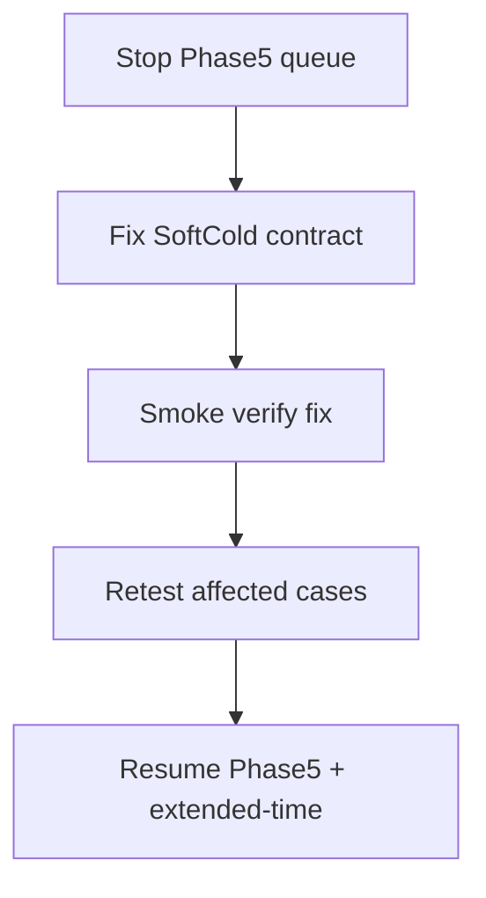

# План: исправление SoftCold → проверка → retest затронутых кейсов

Статус: **done** (desync снят; Cold PASS нет). Анализ: [SOFTCOLD_PLAN_RESULT.md](SOFTCOLD_PLAN_RESULT.md).  
`DONE_TAILS` 2026-09-30T10:05:51Z; AmpNorm: [AMPNORM_EOL_STUCK.ru.md](AMPNORM_EOL_STUCK.ru.md).  
Fix: `2026-09-27_sbm2_strip_tip1`.

---

## Phase S0 — стоп (done)

- Остановлены `run_phase5_defer.sh`, `posttune_verify`, `NeuroModelerConsole`.
- Лог: `evidence/metrics/phase5_defer.log` → `ABORTED … SoftCold fix first`.
- Частичный rc-list: `_repro/SOFTCOLD_DEFER_rcs.txt` (не полный DEFER).

---

## Phase S1 — исправление режима SoftCold (код harness)

Файлы: [`repro_cold_lib.py`](../../../Bin/Configs/SpikeSamples/StructTrain/scripts/repro_cold_lib.py) (`soft_cold_reset_train`, `_cold_params_common`, `_cold_model_common`), при необходимости `posttune_verify.py` / unit tests.

### Обязательные правки

| # | Проблема | Исправление |
|---|----------|-------------|
| S1.1 | Несколько тегов `StructureBuildMode`; soft-cold пишет `1`, **последний** остаётся `0` | Выставить **все** вхождения SBM → **`2`** (или удалить дубликаты, оставить один `2`) в Parameters **и** Model |
| S1.2 | Soft-cold: L-тег=`1 1 1 1`, fat cable в Model; `DelayLenOf(L≤1)=0` | Вариант A (предпочтителен для cold): после cold — **strip** сегментов >1 **или** явный `BuildStructure`/пересборка согласованная с L=1. Вариант B: документированный «fat+links→tip1» только если SBM=2 и доказано, что DelayLenOf/peaks согласованы — сейчас **не** использовать для packA SBM=0 |
| S1.3 | `NumDendriteMembraneParts` scalar (напр. 25) остаётся при L-теге 1 | Синхронизировать/очистить scalar или выровнять с `NumDendriteMembranePartsVec=1 1 1 1` |
| S1.4 | Контракт в `cold_reset_contract.json` | Зафиксировать: effective SBM, max_seg Model after reset, DelayLenOf expectation |

Комментарий soft-cold «keep fat Model cable» пересмотреть: для **классического** SoftCold cold-start целевое состояние — **L=1 физически и в тегах**, SBM=2, TipR flat, Need=1, FixedLTZ silent.

### Не в этом фиксе (отдельно)

- Phase6 `EstDelayPerSeg` vs span 480 (параметры EXP) — после S1 можно probe; не смешивать с SBM-фиксом.
- NonSeparable mid (asym25/br25) — quality, не soft-cold.
- Extended `-t` — только после S1+verify для `timing_ok_budget`.

---

## Phase S2 — проверка фикса (smoke)

Без полного DEFER. Цель: доказать, что рост **стартует** и топология согласована.

| # | Проверка | Pass criteria |
|---|----------|----------------|
| S2.1 | Unit/harness: soft-cold на копии EXP с SBM=0 → после reset **все** SBM=2, L-тег=1, Model max_seg≤1 (если strip) или явный documented rebuild | assert в тесте |
| S2.2 | Short SoftCold **`asym50_preinh`** (или укороченный wall) | за N минут TipR **≠** flat cold **или** L[0]>1 (рост стартовал); не требовать PASS gate |
| S2.3 | Контроль регрессии **`asym25_preinh`** smoke (или skip-train не заменяет) | Need/TipR путь не хуже прежнего (Need=0 достижим или TipR→canon как раньше) |
| S2.4 | `cold_reset_contract.json` + provenance note `softcold_fix=…` | есть в bundle |

Если S2.2 снова flat за разумный budget → стоп, углубить; не запускать полный retest.

---

## Phase S3 — повторный запуск затронутых экспериментов

Затронуты фиксом soft-cold (любой SoftCold на архивах с SBM=0 / fat+L=1 desync, и все soft-cold прогоны для честного сравнения на одной сборке harness).

### S3.a Обязательный retest (timing_softcold_desync)

| case | Почему |
|------|--------|
| `asym50_preinh` | эталон «не стартовал» |
| `asym100_preinh` | то же |
| `asym100_gen` | то же |

Критерий: не обязательно Cold PASS; минимум — **снятие** `timing_softcold_desync` (рост стартует). Дальше классификация A / B_partial / PASS.

### S3.b Retest SoftCold, уже гнанные на сломанном/старом soft-cold (сопоставимость)

| case | Примечание |
|------|------------|
| `asym25_preinh` | был Need=0 + NonSeparable — проверить, что фикс не ломает Train Done |
| `br25_on` | то же |
| `fs25_gen` | был почти gold — после фикса + при необходимости extended `-t` |
| `phase6_thr_only`, `phase6_preinh250`, `phase6_ltzcal_twin` | после S1; ожидать возможный `timing_est_delay_vs_span` — не путать с SBM |

### S3.c Phase 5 DEFER — возобновить с нуля на фиксированном soft-cold

Полный список C1+C2 из плана audit Phase 5; предыдущие rc в `SOFTCOLD_DEFER_rcs.txt` считать **устаревшими** (прервано / до фикса). Новый файл: `_repro/SOFTCOLD_DEFER_rcs_after_softcold_fix.txt`.

### S3.d Extended-time

Только кейсы с `timing_ok_budget` после S3; манифест [`EXTENDED_TIME_MANIFEST.txt`](../../../Bin/Configs/SpikeSamples/StructTrain/_repro/EXTENDED_TIME_MANIFEST.txt).

---

## Порядок исполнения (чеклист)

1. [x] Остановить текущие SoftCold  
2. [x] S1: патч `repro_cold_lib` (+ тесты) — `2026-09-27_sbm2_strip_tip1`  
3. [x] S2: smoke asym50 (+ asym25 control) — growth ~30 s; [S2_SMOKE_RESULT.md](S2_SMOKE_RESULT.md)  
4. [x] S3.a: asym50/100_* — desync lifted all 3; Need≠0. [S3a_DESYNC_SUMMARY.md](S3a_DESYNC_SUMMARY.md)  
5. [x] S3.b: asym25, br25, fs25, phase6_* — все rc=1; [S3_QUEUE_RESULT.md](S3_QUEUE_RESULT.md)  
6. [x] S3.c: C1+C2 остаток — 24/24 rc=1 (`DONE_TAILS`)  
7. [x] S3.d: extended P0 — 4/4 Need=1 (fs25+asym*); phase6 не в манифесте  
8. [x] Обновить EXPERIMENTS/SUCCESSFUL/`FAIL_TAXONOMY` / STATUS + [SOFTCOLD_PLAN_RESULT.md](SOFTCOLD_PLAN_RESULT.md)  
9. [x] Checkpoint commit после `DONE_TAILS` (Bin+Docs gitlinks)  
10. [x] Полнота хвостов OK → [AMPNORM_EOL_INVESTIGATE.plan.md](AMPNORM_EOL_INVESTIGATE.plan.md) DONE; follow-up remediations отдельно

---

## Связь с audit Phase 5–6

| Было | Стало |
|------|--------|
| Phase 5 in progress | **paused/aborted** до S1–S2 |
| Phase 6 docs | после S3 или параллельно docs-only |
| Extended-time plan | подчинён этому плану (после soft-cold fix) |
