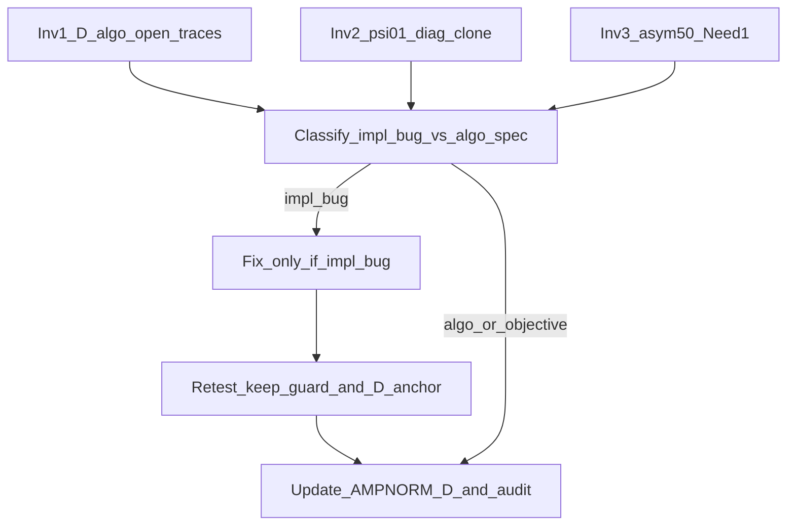

# Residual 1-3: исследование и условный фикс (детализация)

## Контекст

Anti-bounce (Console `dde07ac6…`) снял waste-bounce. SoftCold D-core **0/5**, keep SoftCold **7/8**. Full 49 / registry **закрыты**.

Правка кода **только** при доказанной ошибке реализации; algo/objective/конфиг — docs без ослабления SoftCold.



---

## Инварианты (из прежних планов — не терять)

**SoftCold / registry**
- SoftCold PASS только при Need→0; no always-success; Acc/fires при Need=1 — note ([AMPNORM_THRESHOLDS_AND_OSCILLATION.ru.md](Docs/Audit/TimeLearner-2026-09-26-review/evidence/AMPNORM_THRESHOLDS_AND_OSCILLATION.ru.md) §C).
- Не ослаблять LandscapeOk / ok_audit / fires / Acc.
- `SKIP_REGISTRY_APPLY=1` пока D PASS ниже 4/5; full 49 не запускать ([SOFTCOLD_ANTIBOUNCE_FULL_matrix_plan.txt](Bin/Configs/SpikeSamples/StructTrain/_repro/SOFTCOLD_ANTIBOUNCE_FULL_matrix_plan.txt)).

**Алгоритм AmpNorm / Rmax**
- `dt<0` + TipR@Rmax → никогда TipR-down; length grow только при L ниже MaxL; L=MaxL → HOLD (не возвращать W3f).
- TipR-down только при `dt≥0` (W3e) и L не ниже MaxL/2.
- Не трогать без justification: midband, W1@Rmin, `accept_run`, step 0.15, SyncTol×4, dwell/cooldown 3, ApplyPending keep TipR@Rmax / no feedforward / no shrink@Rmax.
- Twin base+Branch. Не relax SyncTol/EstDelay/MaxL в production archives.

**Harness**
- Чистый workdir; без `--allow-salvage` / `--use-archive-inplace`.
- Diag только `_repro/diag/`. Keep×8 стоп-кран после C++. `STALL_AUTOSAVE_N=8` для D. CSV flake → solo retry.

**Метки:** `D_waste_fixed` / `D_objective` / `D_algo_open` — как в [AMPNORM_D_VS_KEEP_PARAMS.ru.md](Docs/Audit/TimeLearner-2026-09-26-review/evidence/AMPNORM_D_VS_KEEP_PARAMS.ru.md).

---

## Карта артефактов (общая)

| Слой | Пути |
|------|------|
| C++ base | [NNeuronTimeLearner.cpp](Libraries/Nmsdk-PulseLib/Core/NNeuronTimeLearner.cpp) |
| C++ Branch | [NNeuronTimeLearnerBranch.cpp](Libraries/Nmsdk-PulseLib/Core/NNeuronTimeLearnerBranch.cpp) |
| Headers (константы) | `NNeuronTimeLearner.h` / Branch twin — `kRmaxOvershootLengthCooldown`, `kRmaxUndershootMinLengthFactor*`, `kNoImproveResistanceLimit`, `kMidbandRminStep` |
| SoftCold harness | [posttune_verify.py](Bin/Configs/SpikeSamples/StructTrain/scripts/posttune_verify.py), [repro_cold_lib.py](Bin/Configs/SpikeSamples/StructTrain/scripts/repro_cold_lib.py) |
| Parallel runner | [softcold_full_matrix_parallel.sh](Bin/Configs/SpikeSamples/StructTrain/scripts/softcold_full_matrix_parallel.sh) |
| Unit harness | [test_posttune_verify_unit.py](Bin/Configs/SpikeSamples/StructTrain/scripts/tests/test_posttune_verify_unit.py) |
| Build | скилл `nmsdk-build` → `NeuroModelerConsole` + PulseLib |
| Evidence memo | [AMPNORM_D_RMAX_LENGTH_ESCAPE.ru.md](Docs/Audit/TimeLearner-2026-09-26-review/evidence/AMPNORM_D_RMAX_LENGTH_ESCAPE.ru.md), [SOFTCOLD_CONVERGENCE_AUDIT.ru.md](Docs/Audit/TimeLearner-2026-09-26-review/evidence/SOFTCOLD_CONVERGENCE_AUDIT.ru.md) §4.1, [AMPNORM_THRESHOLDS_AND_OSCILLATION.ru.md](Docs/Audit/TimeLearner-2026-09-26-review/evidence/AMPNORM_THRESHOLDS_AND_OSCILLATION.ru.md) |
| Metrics | `Docs/.../evidence/metrics/SOFTCOLD_antibounce_P12.log`, `_P4.log`, `softcold_monitor.jsonl` |
| RCS / manifests | `_repro/SOFTCOLD_ANTIBOUNCE_P12_*`, `_P4_*`, `_asym50_retry.txt` |

---

## Inv1 — `D_algo_open` (length-escape при L ниже MaxL)

### Вопрос

Почему при TipR@Rmax, отрицательном amp_dt, L≈70–90 W3d не доводит до `dt≥0` / W3e / Need→0?

### Конфиги / cases

| case | CASES entry | archive Train | SyncTol / EstDelay |
|------|-------------|---------------|-------------------|
| `pa00_baseline` | [posttune_verify.py](Bin/Configs/SpikeSamples/StructTrain/scripts/posttune_verify.py) ~220 | [SelectivityPhaseA/EXP00_baseline/Train/Parameters_00.xml](Bin/Configs/SpikeSamples/StructTrain/SelectivityPhaseA/EXP00_baseline/Train/Parameters_00.xml) | **0.02 / 0.01** |
| `phase6_480` | CASES ~137–146 | `SelectivityPhaseA/Phase6/EXP_480_gen_posttune` (+ gold tiprmin EstDelay sync) | **0.02 / 0.01** |

Уже снятые workdirs antibounce: `_repro/runs/pa00_baseline_20261007T090955Z_*_work`, `phase6_480_20261007T090955Z_*_work`.

### Код — точки аудита (base; twin в Branch ~1006+)

1. **Arm W3d** — `ChangeSynapseResistanceStatus` ~831–868: `at_ceiling_dwell && dt<0 && L<MaxL` → cooldown++, при `>=kRmaxOvershootLengthCooldown` ставит `DendStatus=1`, `RmaxOvershootLengthGrow=true`.
2. **Hold MaxL** ~870–884: `L>=MaxL` + overshoot → HOLD (не трогать).
3. **W3e** ~885–908: `dt>=0`, `!pending_grow`, `DendStatus==0`, `L>=MaxL/2` → TipR×(1−0.15).
4. **`restore_dend_status`** ~680–692 / вызов ~1126: сохраняет DendStatus=1 пока флаг grow.
5. **`ApplyPendingDendriteLengthChanges`** ~2901–3030:
   - settle clear обходится если `rmax_overshoot_grow` (~2915–2918);
   - force DendStatus=1 если flag и status 0 (~2921–2922);
   - `L>=MaxDendriteLength` → clear flag (~2930–2935);
   - forced `delta=1` (~2978–2980);
   - keep TipR@Rmax / no shrink@Rmax / no feedforward (ниже по функции).
6. **Finish path** вызывает ApplyPending (~2894) с save/restore DendStatus.

**Кандидаты impl-бага:** cooldown не достигает порога; flag clear без ΔL; restore откатывает; `pending_grow_w3` вечно блокирует W3e; LastAbsDt/amp_dt не обновляются после grow; Dissync anti-overshoot режет delta до 0 вопреки forced +1 (проверить порядок: forced delta=1 после anti-overshoot — сейчас OK).

### Скрипты / прогон

Readonly сначала:
```bash
# finals из live + Parameters
# TipR/L/amp_dt: Train/posttune_tipr_live.txt
# IsNeedToTrain: get_tag Parameters_00.xml
```

Инструментированный прогон (после аудита, если нужны live AmpDtAudit):
```bash
cd Bin/Configs/SpikeSamples/StructTrain
# EnableDebug=1 в work Train Parameters/Model после soft-cold (точечно в workdir),
# или --keep-slog + парсинг StatisticLog
PYTHONUNBUFFERED=1 python3 -u scripts/posttune_verify.py \
  --case pa00_baseline --autosave-model-s 10 --snap-every 20 \
  --stall-autosave-n 8 --keep-slog --no-result-md
```
Критерий: частота логов `AmpDtAudit RmaxOvershoot→length+` vs реальный ΔL в AUTOSAVE; есть ли `RmaxUndershoot→down` после роста L.

### Документация Inv1

Дописать в [AMPNORM_D_RMAX_LENGTH_ESCAPE.ru.md](Docs/Audit/TimeLearner-2026-09-26-review/evidence/AMPNORM_D_RMAX_LENGTH_ESCAPE.ru.md) §Anti-bounce: таблица «arm vs apply vs amp_dt» + вердикт impl/algo для pa00/phase6_480.

### Вердикт / фикс

- **Impl:** точечный C++ в перечисленных блоках, twin Branch, `nmsdk-build`, SHA.
- **Algo:** оставить `D_algo_open`; без TipR-down при overshoot; без relax порогов.
- Retest после фикса: `pa00`+`phase6_480`; keep-guard `asym50,ltz50_gen,fs25_gen,br50_gen`; bounce L≥60 ≈0.

---

## Inv2 — `psi01_050` objective axis

### Вопрос

Hold@MaxL+перелёт — специфика SyncTol/EstDelay/паттерна или баг hold/length на MaxL?

### Конфиги

| | archive | SyncTol | EstDelay |
|--|---------|---------|----------|
| psi01 (D) | [SelectivityPresynapticInhib/EXP01_preinh_050/Train/Parameters_00.xml](Bin/Configs/SpikeSamples/StructTrain/SelectivityPresynapticInhib/EXP01_preinh_050/Train/Parameters_00.xml) | **0.02** | **0.01** |
| keep эталон | [SelectivityAsymRm/EXP_span50ms_packA_gen_posttune/Train/Parameters_00.xml](Bin/Configs/SpikeSamples/StructTrain/SelectivityAsymRm/EXP_span50ms_packA_gen_posttune/Train/Parameters_00.xml) | **0.00208333** | **0.002** |

CASES: `psi01_050` ~226 в `posttune_verify.py`. Финал antibounce: TipR@Rmax, L=100, amp_dt≈−0.041, Need=1.

### Код

Тот же hold-блок ~870–884. На MaxL grow **намеренно** не идёт (~2930–2935). Проверить: нет ли ложного clear `RmaxOvershootLengthGrow` / зависания amp measurement при L=MaxL (баг измерения → impl; иначе objective).

### Скрипты / diag-конфиг

1. `prepare_clean_case("psi01_050", …)` → workdir.
2. Клон только параметров (не archive inplace):
   - создать `_repro/diag/psi01_sync_as_keep/` — копия work Train/Test Parameters+Model **или** post-prepare patch через `repro_cold_lib.set_tag_all`:
     - `SyncTolerance` → `0.00208333`
     - `EstDelayPerSeg` → `0.002`
   - MaxL / ResistanceMax / Gain / паттерн / StructureBuildMode — **не** менять.
3. Запуск:
```bash
# после soft-cold reset — патч Sync/EstDelay в work Train+Model, затем Train
PYTHONUNBUFFERED=1 python3 -u scripts/posttune_verify.py \
  --case psi01_050 ...   # лучше отдельный thin wrapper/скрипт diag, чтобы не путать с CASES archive
```
Предпочтительный способ: маленький `scripts/diag_psi01_sync_as_keep.py` (или one-shot shell), который:
- вызывает `prepare_clean_case` + `soft_cold_reset_train`;
- патчит Sync/EstDelay в Train (+ Model если тег есть);
- запускает тот же poll/gate путь что `run_case`, **без** записи в EXPERIMENTS.

Сравнить с antibounce psi01: TipR/L/amp_dt/Need; bounce; wall-time @Rmax.

### Документация Inv2

- Результат diag → [AMPNORM_D_VS_KEEP_PARAMS.ru.md](Docs/Audit/TimeLearner-2026-09-26-review/evidence/AMPNORM_D_VS_KEEP_PARAMS.ru.md) (строка psi01 diag).
- Подтверждение/уточнение `D_objective` в AMPNORM_D §Anti-bounce + SoftCold audit §4.1.
- Production XML **не** менять в этой волне даже если diag зелёный (param-policy — отдельный план).

### Вердикт

- Diag ≈ baseline → `D_objective`.
- Diag Need→0 → чувствительность Sync/EstDelay, не баг HOLD; docs only.
- Баг измерения/hold на MaxL → C++ twin + retest psi01 + keep-guard.

P4 не перезапускать без C++ изменения.

---

## Inv3 — `asym50` solo Need=1

### Вопрос

SoftCold FAIL при TipR@CanonRmin и полном CSV — регресс keep, ложный flag/Need, или недобучение?

### Артефакты

- Work: `_repro/runs/asym50_20261007T120638Z_3519413_9a999227_work`
- Note: [_repro/SOFTCOLD_ANTIBOUNCE_asym50_retry.txt](Bin/Configs/SpikeSamples/StructTrain/_repro/SOFTCOLD_ANTIBOUNCE_asym50_retry.txt)
- Archive keep: `SelectivityAsymRm/EXP_span50ms_packA_gen_posttune` (CASES `asym50` ~127–136, `train_t=640`)
- Сравнение PASS: `ltz50_gen` antibounce workdir

### Код — flag / Need

Запись flag и сброс Need: [NNeuronTimeLearner.cpp](Libraries/Nmsdk-PulseLib/Core/NNeuronTimeLearner.cpp) ~4531–4572 (`PostTrainTuneComplete`, `SetIsNeedToTrain(false)` если `!inference`, затем `posttune_complete.flag`).

Harness:
- `read_train_snapshot` / polls: Need = тег **`IsNeedToTrain`** ([posttune_verify.py](Bin/Configs/SpikeSamples/StructTrain/scripts/posttune_verify.py) ~861).
- `softcold_early_done` (~934–950): требует `need=="0"`; flag_hit alone недостаточен если Need≠0.
- Наблюдение retry: poll `Need=1 flag=1` → XML Need отстаёт от in-memory clear **или** flag из inference/частичного PostTune (`inference=0 result=2 landscape_ok=0` в Train flag) при Need всё ещё 1.

Проверить Branch twin того же Finalize/flag path.

### Скрипты — протокол

1. Diff Train flag vs `Parameters_00.xml` `IsNeedToTrain` vs `Model_00.xml` на work asym50 retry.
2. Unit: при необходимости расширить [test_posttune_verify_unit.py](Bin/Configs/SpikeSamples/StructTrain/scripts/tests/test_posttune_verify_unit.py) на сценарий flag_hit + Need=1 (early_done=False; SoftCold rc).
3. Solo повтор:
```bash
cd Bin/Configs/SpikeSamples/StructTrain
PYTHONUNBUFFERED=1 python3 -u scripts/posttune_verify.py \
  --case asym50 --autosave-model-s 10 --snap-every 20 \
  --stall-autosave-n 8 --no-result-md \
  2>&1 | tee /tmp/softcold_antibounce_asym50_retry2.out
```
Дождаться строки SoftCold PASS/FAIL (не обрывать после gate).

### Документация Inv3

- Обновить `_repro/SOFTCOLD_ANTIBOUNCE_asym50_retry.txt` (или `_retry2`).
- В AMPNORM_D / audit: keep 7/8 vs 8/8; если harness bug — пометить flake/контракт, не anti-bounce регресс.

### Вердикт / фикс

| Находка | Действие |
|---------|----------|
| XML Need stale при flag + in-memory Need=0 | фикс harness: читать Need после flush / не early-stop на противоречии; или force re-read Model |
| Console пишет flag при Need≠0 | фикс C++ Finalize/PostTune; twin |
| Честный Need=1 до budget | keep-регресс; W3e/guard только с evidence + keep matrix (не снижать MaxL/2 вслепую) |

---

## Условное исправление (общий пайплайн)

Только после вердикта **impl bug** по Inv1/2/3.

### Код

- Минимальный diff в названных блоках; twin Branch обязателен для PulseLib.
- Не возвращать W3f TipR-down; не менять константы порогов «для PASS».

### Сборка

```bash
# скилл nmsdk-build
cmake --build build/linux-gcc-debug-local \
  --target Nmsdk-PulseLib.core NeuroModelerConsole -j"$(nproc)"
sha256sum Bin/Platform/Linux/NeuroModelerConsole | cut -c1-16
git -C Libraries/Nmsdk-PulseLib rev-parse --short HEAD
```

### Retest (скрипты)

```bash
# keep-guard PARALLEL=4 SKIP_REGISTRY_APPLY=1
MANIFEST=.../keep_guard_manifest.txt  # asym50 ltz50_gen fs25_gen br50_gen
RCS=_repro/SOFTCOLD_RESIDUALFIX_keep_rcs.txt
LOG=.../metrics/SOFTCOLD_residualfix_keep.log
PARALLEL=4 STALL_AUTOSAVE_N=8 SKIP_REGISTRY_APPLY=1 \
  bash scripts/softcold_full_matrix_parallel.sh

# затронутый D/diag — отдельные posttune_verify --case …
```

Критерий: keep без регресса SoftCold; bounce L≥60 primary ≈0; затронутый D — переклассификация метки.

### Документация (обязательно)

| Файл | Что дописать |
|------|----------------|
| [AMPNORM_D_RMAX_LENGTH_ESCAPE.ru.md](Docs/Audit/TimeLearner-2026-09-26-review/evidence/AMPNORM_D_RMAX_LENGTH_ESCAPE.ru.md) | § residual-investigate: SHA, вердикты Inv1–3, фикс/не фикс, retest |
| [SOFTCOLD_CONVERGENCE_AUDIT.ru.md](Docs/Audit/TimeLearner-2026-09-26-review/evidence/SOFTCOLD_CONVERGENCE_AUDIT.ru.md) §4.1 | обновить подклассы D |
| [AMPNORM_D_VS_KEEP_PARAMS.ru.md](Docs/Audit/TimeLearner-2026-09-26-review/evidence/AMPNORM_D_VS_KEEP_PARAMS.ru.md) | строка diag psi01 |
| [AMPNORM_THRESHOLDS_AND_OSCILLATION.ru.md](Docs/Audit/TimeLearner-2026-09-26-review/evidence/AMPNORM_THRESHOLDS_AND_OSCILLATION.ru.md) | только если менялась интерпретация порогов (не сами числа) |
| `_repro/SOFTCOLD_ANTIBOUNCE_FULL_matrix_plan.txt` | статус residual-investigate; full49 всё ещё CLOSED |
| EXPERIMENTS.md | **не** трогать без зелёного D≥4/5 + явного запроса |

Если все три вердикта = algo/objective/конфиг: **код не менять**; только docs + open questions для следующей AmpNorm-итерации.
