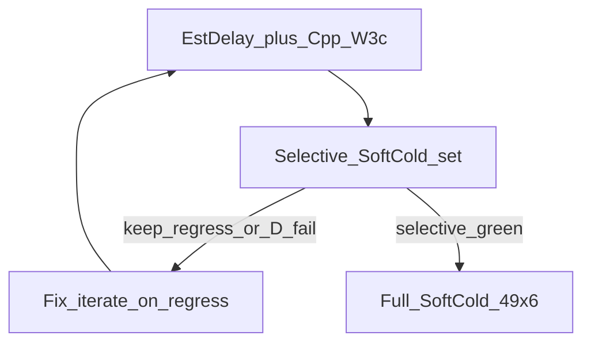
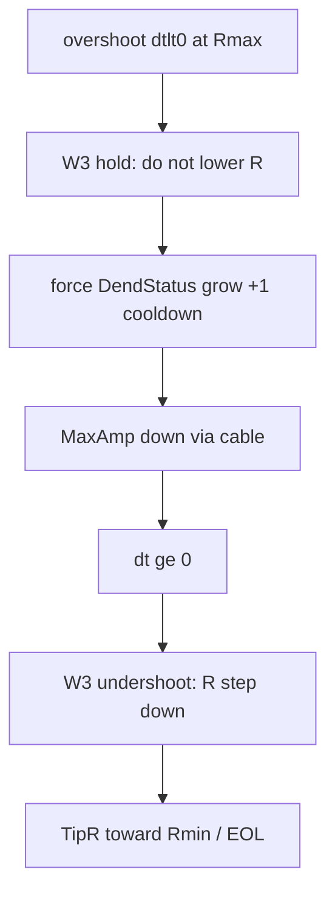

# План: D Rmax-hold → length escape (+ EstDelay пробелы)

База: rematrix **13 PASS / 36 FAIL** (Console `8589daff…`, PulseLib `b32d715`); W3 hold убрал `1e11↔8.5e10`, но оставил ceiling freeze. Физика: `amp_dt&lt;0` @ `ResistanceMax` = overshoot (`MaxAmp > Initial`); R поднять нельзя; down-step **увеличивает** amp → re-climb → осцилляция. Рабочая степень свободы — **рост L (cable attenuation)** при hold R@Rmax; после `dt≥0` — штатный W3 undershoot down-step к CanonRmin.

Наследует ограничения/экспериментальный контракт из [softcold_parallel_rematrix](/home/user/.cursor/plans/softcold_parallel_rematrix_eb3445a3.plan.md) и скилла [structtrain-experiments](.cursor/skills/structtrain-experiments/SKILL.md).

**Порядок волн:** (1) правки EstDelay+C++ → (2) **выборочный SoftCold набор** до зелёного → (3) **только потом** full SoftCold 49×6. Полную матрицу не стартовать, пока selective не закрыт.





**Отклонено (исследование D):** *latched R-descent* (down-step + запрет raise при `dt&lt;0`) — уводит TipR к Rmin при ещё большем overshoot и конфликтует с W1 raise@Rmin; не чинит amp. Оставить hold по R; лечить attenuation через L.

**Вне скоупа (объективные / протокольные):** `br25_on` (N), `fs50_preinh` (C), flat A (`asym25`, nextseg), SoftColdOff/G режимы, и rematrix «E-like» с **Need→0 + tipr canon + gate/Landscape** (`asym100_gen`, `ltz100_gen`, `ltz25_gen`, `fs100_gen`, `br25_preinh`) — не ослаблять LandscapeOk/Acc/fires.

---

## 0. Переклассификация rematrix (документы)

Обновить [SOFTCOLD_CONVERGENCE_AUDIT.ru.md](Docs/Audit/TimeLearner-2026-09-26-review/evidence/SOFTCOLD_CONVERGENCE_AUDIT.ru.md) по triage rematrix HEAD:

- **D** ≈ ceiling freeze после hold (`pa*`/`psi*`/`phase6_*`/`tn_*`/`ltz*_preinh`) — нет attenuation DOF, не «баг hold».
- Бывшие E с TipR@Rmin + `done_flag_flush` + `gate_fail` / LandscapeOk=0 → **gate/Landscape** (объективно), не AmpNorm EOL: `asym100_gen`, `ltz100_gen`, `ltz25_gen`, `fs100_gen`, `br25_preinh` (+ `fs50_preinh` C, `br25_on` N).
- Узкий алгоритмный Branch Need=1: только `br480_nextseg` / `br480_tiprmin` (отложить; не в этой волне).

Evidence note: `AMPNORM_D_RMAX_LENGTH_ESCAPE.ru.md` (физика hold vs latched descent vs L-grow).

---

## 1. Config — EstDelay gaps (псевдокод)

Уже есть тег: `EXP_480_gen_thr_only` / `ltzcal_twin` / `preinh250`.
**Дыры (нет `EstDelayPerSeg` → default `0.005` → SoftCold L→`97 81 49`):**

| case | archive Train | EstDelay | формула |
|------|---------------|----------|---------|
| `phase6_480` | `SelectivityPhaseA/Phase6/EXP_480_gen_tiprmin` | **0.01** | `0.48/(49−1)` |
| `tn_classic` | `TimeNeuronTimeLearner` | **0.01** | rematrix: L уходит в `97…` при gold `49…` ⇒ Dissync≈0.48; harness `span_ms=25` — только gate, **не** для формулы |

PhaseA/PSI / прочие Phase6 **не** трогать.

```text
# patch_phase6_tn_estdelay.py (или расширить patch_phasea_psi_estdelay.py)
TARGETS = [
  (archive=EXP_480_gen_tiprmin/Train, est=0.01),
  (archive=TimeNeuronTimeLearner/Train, est=0.01),
]
for archive, est in TARGETS:
  for rel in ["Parameters_00.xml", "Model_00.xml"]:
    path = archive / rel
    if not path.exists(): continue
    text = path.read_text()
    if tag_exists(text, "EstDelayPerSeg"):
      text = set_tag_all(text, "EstDelayPerSeg", format_double(est))
    else:
      text = insert_tag_after(text, after="ResistanceMax",  # или DendriteLength
                              tag="EstDelayPerSeg", value=est)
    path.write_text(text)
# НЕ писать в _repro/runs/*_work
```

Хелперы: `set_tag` / `set_tag_all` в [`repro_cold_lib.py`](Bin/Configs/SpikeSamples/StructTrain/scripts/repro_cold_lib.py).

---

## 2. C++ — W3c Rmax-overshoot → length grow (псевдокод)

Файлы:
- [`NNeuronTimeLearner.h`](Libraries/Nmsdk-PulseLib/Core/NNeuronTimeLearner.h) / Branch `.h` — новые векторы
- [`NNeuronTimeLearner.cpp`](Libraries/Nmsdk-PulseLib/Core/NNeuronTimeLearner.cpp) `ChangeSynapseResistanceStatus` ~863–897; `ApplyPendingDendriteLengthChanges` ~2788–3002; `FeedforwardResistanceOnLengthGrow` ~631; resize/reset рядом с `RmaxDwellCount`
- [`NNeuronTimeLearnerBranch.cpp`](Libraries/Nmsdk-PulseLib/Core/NNeuronTimeLearnerBranch.cpp) twin ~1035–1054 + тот же ApplyPending/Feedforward

Порядок тика (факт): resistance status в burst → в конце итерации `ApplyPendingDendriteLengthChanges()` (~5082) → `ApplySynapseResistanceChange`. `DendStatus=1` должен **дожить** до ApplyPending.

### 2.1 Состояние (`.h`, twin Branch)

```text
# рядом с RmaxDwellCount:
std::vector<bool> RmaxOvershootLengthGrow;   # arm: этот ΔL — forced from Rmax overshoot
std::vector<int>  RmaxOvershootLengthCooldown; # amp-ticks since last forced +ΔL (or since arm)

# в ResizeSyncVectors / BeginTraining / clear counters (все места, где fill RmaxDwellCount):
RmaxOvershootLengthGrow.assign(n, false);
RmaxOvershootLengthCooldown.assign(n, 0);

static constexpr int kRmaxOvershootLengthCooldown = kNoImproveResistanceLimit; # =3
```

### 2.2 `ChangeSynapseResistanceStatus` — ветка W3 (base + Branch одинаково)

Сейчас (~863–897 base / ~1035–1054 Branch):

```text
ELSE IF rmax_dwell >= kNoImproveResistanceLimit AND r_old > rmin*(1+1e-6):
  IF dt >= 0:   # undershoot — БЕЗ ИЗМЕНЕНИЙ
    step down; Apply; RmaxDwell=0; NoImprove=0; Status=1
  ELSE:         # overshoot hold — РАСШИРИТЬ
    RmaxDwellCount[num] = kNoImproveResistanceLimit
    ResistanceStatus[num] = 1
    # NEW: attenuation DOF (не трогать R)
    L = DendriteLength[num]
    IF L < MaxDendriteLength
       AND RmaxOvershootLengthCooldown[num] >= kRmaxOvershootLengthCooldown:
      DendBestEffortSynced[num] = false
      DendStatus[num] = 1                    # request +ΔL
      RmaxOvershootLengthGrow[num] = true
      RmaxOvershootLengthCooldown[num] = 0     # ждём фактический grow
      LOG "AmpDtAudit RmaxOvershoot→length+ dt<0 num=… L=… dt=…"
    ELSE:
      RmaxOvershootLengthCooldown[num]++       # или ++ всегда в hold, reset only after grow
      LOG "AmpDtAudit RmaxOvershoot hold dt<0 …"
# НЕ вызывать ApplyComputedResistance в ветке dt<0
# НЕ fall-through в midband/damped
```

Инкремент cooldown: считать **только** входы в overshoot-hold (каждый amp-update на потолке с `dt<0`), не каждый симуляционный тик. После успешного +ΔL в ApplyPending — cooldown уже 0; следующий grow не раньше чем через `kRmaxOvershootLengthCooldown` hold-входов.

### 2.3 `ApplyPendingDendriteLengthChanges` — bypass settle

```text
for i in 0 .. N-2:
  peak_valid = SomaPeakValid[i]
  length_settled = (DendLastAbsDt[i] <= SyncTolerance)   # узкий tol, без Rmax slack

  # NEW: forced Rmax-overshoot grow must not be cleared by settle
  IF peak_valid AND length_settled AND NOT RmaxOvershootLengthGrow[i]:
    DendStatus[i] = 0
    continue

  IF DendStatus[i] != 1 AND DendStatus[i] != -1: continue
  IF DendStatus[i]==1 AND L>=MaxDendriteLength:
    DendStatus[i]=0; RmaxOvershootLengthGrow[i]=false; continue

  # existing: compute delta from Dissync/EstDelay, clamp kMaxLengthStep, anti-overshoot
  # IMPORTANT for forced grow when Dissync≈0:
  IF RmaxOvershootLengthGrow[i] AND direction>0:
    delta = 1   # ровно +1 сегмент; игнорировать anti-overshoot shrink to 0
                # (если max_delta из dsyn стал <1 — всё равно 1, room permitting)

  apply +delta to DendriteLength[i]; collect `changed`
  # existing Build/Relink …

for d in changed:
  deltaL = L_new - L_old
  IF RmaxOvershootLengthGrow[d]:
    # SKIP FeedforwardResistanceOnLengthGrow  OR call then re-clamp:
    #   Feedforward...  # optional skip preferred
    SetTipSynapseResistanceOnComponent(d, ResistanceMax)  # keep ceiling
    TipSynapseResistance[d] = ResistanceMax
    ResistanceStatus[d] = 1   # ещё pending amp, не Done
    RmaxOvershootLengthGrow[d] = false
    RmaxOvershootLengthCooldown[d] = 0
    LOG "AmpDtAudit RmaxOvershoot length applied +ΔL keep Rmax …"
  ELSE:
    FeedforwardResistanceOnLengthGrow(d, deltaL)  # штатно
```

Предпочтительная реализация re-clamp: **skip** `FeedforwardResistanceOnLengthGrow` когда флаг armed (меньше шансов на промежуточный drop R).

### 2.4 Branch twin

Та же семантика в `NNeuronTimeLearnerBranch::ChangeSynapseResistanceStatus` overshoot-hold.
`ApplyPendingDendriteLengthChanges` / Feedforward — если Branch **наследует** base метод, правка один раз в base; если копия — дублировать bypass+reclamp. Проверить: Branch override ApplyPending? (если нет — только base).

Не переносить `midband_walk` в Branch ActivePulse path.

### 2.5 Запреты (код)

- `ApplyComputedResistance` down при `dt<0` @ Rmax (any-dt / latched descent)
- blind `r_new = Rmin`
- `AllSynapsesNormalized` / Done success при TipR@Rmax и `|dt|>eps`
- LandscapeOk / fires / Acc
- писать EstDelay только в SoftCold-source архивы §1

### 2.6 Build

`nmsdk-build` → SHA16 Console + PulseLib. Зафиксировать SHA до/после. Selective и full — **один** финальный SHA.

---

## 2b. Selective runner (псевдокод)

```text
# _repro/SOFTCOLD_D_ESCAPE_SELECTIVE_manifest.txt — фиксированный список §4.1
# scripts/run_softcold_selective.sh  OR  inline:
RCS=_repro/SOFTCOLD_D_ESCAPE_selective_rcs.txt
LOG=metrics/SOFTCOLD_d_escape_selective.log
: > "$RCS"
for case in $(grep -vE '^(#|$)' SELECTIVE_manifest); do
  set +e
  python3 -u scripts/posttune_verify.py --case "$case" \
    --autosave-model-s 10 --snap-every 20
  # serial first; optional PARALLEL<=3 only if workdirs unique + --no-result-md
  rc=$?
  set -e
  echo "$case $rc $(date -u -Iseconds)" >> "$RCS"
  # gate checks:
  #  keep_* → require rc==0 else STOP
  #  pa00/phase6_* → parse last AUTOSAVE L / TipR; fail if L~97 on pa00 or 85000000000 ping-pong
done
# НЕ вызывать apply_softcold_rcs_to_registry на selective
# НЕ затирать SOFTCOLD_HEAD_rcs.txt (49) до full
```

---

## 3. Инварианты экспериментов (из rematrix + structtrain)

Переносить без ослабления:

- SoftCold контракт: Need→0, `tipr_class=canon` (где CanonRmin), gate rc, L, fires — **без** ослабления LandscapeOk / ok_audit / Acc.
- **§4 rematrix:** не чинить `fs50_preinh` / `br25_on` (Done+canon+gate / NonSeparable) ослаблением гейта.
- **§5 rematrix:** flat `asym25` / nextseg — протокол; не маскировать Need; C++ cold TipR start не трогать без новой diag.
- W3 hold по R при `dt&lt;0@Rmax` **сохранить** (не возвращать any-dt down / blind Rmax→Rmin).
- PhaseA/PSI EstDelay (уже `0.01`/…) **не откатывать**; smoke L на `pa00` остаётся ≠`97 81 49`.
- `br25_off` SoftColdOff `expect_fires=10110000` — не ломать harness.
- Не `--use-archive-inplace` / `--allow-salvage` в матрице; не писать EstDelay в `_repro/runs/*_work`.
- Реестр: ось **алгоритм+Имя**, лестница Working SoftCold > SoftColdOff > …; GoldTest ≠ SoftCold.
- Не коммитить `*_work/`, StatisticLog, огромные archives; push только по просьбе; gitlinks через `nmsdk-gitlinks`.

---

## 4. Выборочный SoftCold набор (ворота перед full 49)

**Цель:** проверить все исправления этой волны и регрессы **до** полного прогона. Full 49 **запрещён**, пока selective не зелёный и правки не закрыты.

Порядок: EstDelay gaps → `nmsdk-build` → **serial** (или малый PARALLEL≤3 только внутри selective) `posttune_verify --autosave-model-s 10 --snap-every 20`. Manifest: `_repro/SOFTCOLD_D_ESCAPE_SELECTIVE_manifest.txt` (новый файл, не подменять queue 49).

При регрессии keep / осцилляции / L→97 → **стоп selective**, `--keep-slog` якоря, правка той же гипотезы, **повтор только selective** (не full).

### 4.1 Состав selective (~18 case) — покрывает фикс + регресс + objective control

| блок | cases | критерий «зелёно» |
|------|--------|-------------------|
| **Keep-PASS (регресс)** | `asym50`, `ltz50_gen`, `br50_gen`, `fs25_gen`, `asym50_preinh`, `asym25_preinh`, `br25_off` | rc=0 все |
| **Rematrix PASS контроль** | `br50_preinh`, `fs25_preinh` | rc=0 (Branch/FastSpan keep) |
| **EstDelay L** | `pa00_baseline`, `phase6_480`, `tn_classic`, `phase6_thr_only` | L≠`97 81 49`; `pa00`/`thr_only` ≈gold |
| **D-фиксы (цель)** | `pa00_baseline`, `phase6_thr_only`, `phase6_480`, `psi01_050` (или `ltz50_preinh`) | TipR сходит с потолка **или** явный рост L при overshoot; count `TipR=85000000000`=0; Need→0 желательно на ≥1 якоре |
| **Objective control (не чинить)** | `br25_on`, `fs50_preinh`, `asym25` | FAIL ок; tipr/Need как baseline; гейт не трогать |

Итого уникальных id (ориентир):
`asym50`, `ltz50_gen`, `br50_gen`, `fs25_gen`, `asym50_preinh`, `asym25_preinh`, `br25_off`, `br50_preinh`, `fs25_preinh`, `pa00_baseline`, `phase6_thr_only`, `phase6_480`, `tn_classic`, `psi01_050`, `br25_on`, `fs50_preinh`, `asym25` (± `ltz50_preinh` если нужен второй D-preinh).

Не в selective (остаются на full 49): остальные rematrix PASS (`asym100_preinh`, `br100_preinh`, `br25_nextseg`, `fs100_preinh`, …) и весь хвост D/E/B/G — после ворот.

### 4.2 Метрики selective

SNAP/autosave: `TipR`, `amp_dt`, `L`, `Need`, `res_st`, `last_abs_dt`.
RCS selective: `_repro/SOFTCOLD_D_ESCAPE_selective_rcs.txt` (не затирать HEAD 49 до full).
Evidence: дописать в `AMPNORM_EOL_RETEST_RESULT.md` таблицу selective + `AMPNORM_D_RMAX_LENGTH_ESCAPE.ru.md`.
Registry (`EXPERIMENTS.md`) на selective — **не** массовый apply; только после full 49 (как rematrix).

### 4.3 Ворота → full

Full 49 стартует **только если**:

1. Все Keep-PASS + Rematrix-контроль из §4.1 = rc=0.
2. EstDelay L-критерии §4.1 выполнены.
3. На D-якорях нет ping-pong `1e11↔8.5e10`; есть движение с eternal freeze (рост L и/или сход TipR).
4. Objective controls не «починены» ослаблением гейта.
5. Один финальный Console/PulseLib SHA зафиксирован для full.

---

## 5. Full SoftCold 49 × PARALLEL=6 (после ворот)

Из‑за **C++ W3c** — перегнать **все 49** на том же SHA, что закрыл selective (включая все 13 rematrix PASS).

### 5.1 Preflight

- Selective §4 зелёный; SHA совпадает с билдом selective.
- Manifest [`SOFTCOLD_QUEUE_manifest.txt`](Bin/Configs/SpikeSamples/StructTrain/_repro/SOFTCOLD_QUEUE_manifest.txt): 49 id без дублей.
- Disk ≥ `80 + 10*PARALLEL` GiB.
- Backup: `_repro/SOFTCOLD_HEAD_rcs_before_d_escape_<UTC>.txt` (текущий rematrix HEAD).

### 5.2 Запуск

```bash
cd Bin/Configs/SpikeSamples/StructTrain
PARALLEL=6 AUTOSAVE_MODEL_S=10 SNAP_EVERY=20 \
  LOG=…/metrics/SOFTCOLD_full_matrix_d_escape.log \
  RCS=_repro/SOFTCOLD_HEAD_rcs.txt \
  MANIFEST=_repro/SOFTCOLD_QUEUE_manifest.txt \
  bash scripts/softcold_full_matrix_parallel.sh
```

Оркестратор: unique workdirs, `--no-result-md`, `rcs.d` → merge, **один** apply **без** nested `flock(1)`. Hourly → stop on DONE.

### 5.3 Артефакты

| Артефакт | Когда |
|----------|--------|
| selective RCS / RESULT notes | после §4 |
| `_repro/SOFTCOLD_HEAD_rcs.txt` | merge после full join |
| `EXPERIMENTS.md` / `SUCCESSFUL_EXPERIMENTS.md` | **один** apply после full 49 |
| `SOFTCOLD_CONVERGENCE_AUDIT.ru.md` + AmpNorm RESULT/evidence | после selective (черновик) и после full (финал) |
| gitlinks | commit по запросу после стабильного full |

### 5.4 Fail-analysis на full

- Регресс keep-PASS → **стоп full**, keep-slog, правка, **сначала снова selective**, не продолжать 49 вслепую.
- Осцилляция / L→97 на `pa*` → стоп; та же петля.
- Objective FAIL без изменения tipr/Need — OK.

---

## 6. Критерии готовности

**После selective (обязательно до full):** keep зелёные; EstDelay L OK; D без ping-pong и с прогрессом с freeze; objective не трогали гейтом.

**После full:** 49/49 один SHA; RCS+registry; аудит корзин; Working/LastCheck по SoftCold лестнице; §4/A/Landscape/N/G не ослаблены.

---

## Вне скоупа этой волны

- Ослабление LandscapeOk / Acc / fires для NonSeparable и silent-mid gen (`br25_on`, `fs50_preinh`, `asym100_gen`, …).
- Flat TipR protocol (`asym25`, nextseg) и G keep/search.
- Branch `br480_*` Need=1 (отдельный слот после D).
- Полный EstDelay rewrite вне SoftCold-source дыр (`phase6_480`, `tn_classic`).
- Latched R-descent / any-dt Rmax down / Done@Rmax с non-canon TipR.
- Старт full 49 до зелёного selective.
- Push в remote без явной просьбы.
