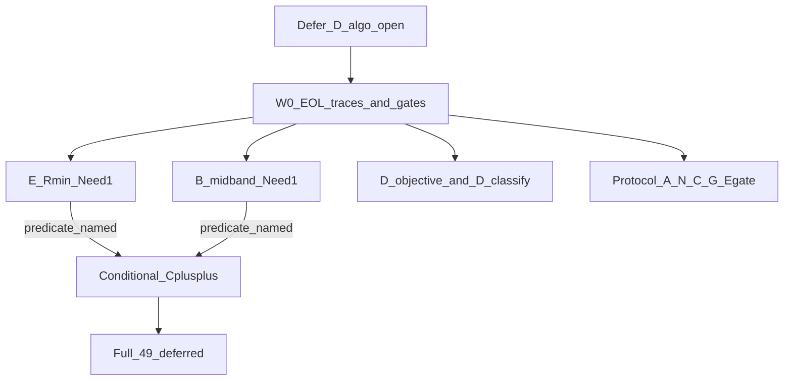

# План: открытые вопросы SoftCold без D_algo_open

Статус: **к исполнению** (исследование + диагностика; C++ только после названного предиката).

База:
- [SOFTCOLD_CONVERGENCE_AUDIT.ru.md](Docs/Audit/TimeLearner-2026-09-26-review/evidence/SOFTCOLD_CONVERGENCE_AUDIT.ru.md) — rematrix **13 PASS / 36 FAIL**
- [AMPNORM_EOL_FIX.plan.md](Docs/Audit/TimeLearner-2026-09-26-review/evidence/AMPNORM_EOL_FIX.plan.md) — W0–W2 pending
- [AMPNORM_D_RMAX_LENGTH_ESCAPE.ru.md](Docs/Audit/TimeLearner-2026-09-26-review/evidence/AMPNORM_D_RMAX_LENGTH_ESCAPE.ru.md)
- [AMPNORM_D_VS_KEEP_PARAMS.ru.md](Docs/Audit/TimeLearner-2026-09-26-review/evidence/AMPNORM_D_VS_KEEP_PARAMS.ru.md)

Алгоритм = только [NNeuronTimeLearner.cpp](Libraries/Nmsdk-PulseLib/Core/NNeuronTimeLearner.cpp) / [NNeuronTimeLearnerBranch.cpp](Libraries/Nmsdk-PulseLib/Core/NNeuronTimeLearnerBranch.cpp). SoftCold/Python/RCS — инструментарий.

## Отложено явно

**D_algo_open** (якоря: `pa00_baseline`, `phase6_thr_only`, `phase6_480`, `tn_classic`) — не чинить AmpNorm ceiling-escape, не возвращать TipR-down при overshoot, не открывать full-49 ради D. При старте пометить **DEFERRED** в аудите.

Остальная корзина D (~22) не считается автоматически `D_algo_open`: переклассифицировать без нового algo.

## Инварианты (из предыдущих планов)

- SoftCold PASS только при Need→0 + tipr_class=canon; запрещён PASS при Need=1 / always-success
- Не ослаблять LandscapeOk / Acc / fires
- Keep не регрессировать: `asym50`, `ltz50_gen`, `br50_gen`, `fs25_gen`
- Anti-bounce: TipR@Rmax и amp_dt&lt;0 → hold, не TipR-down
- До W0 не менять EndOfLearning / Done / слепые Rmin|Rmax escapes
- Base и Branch править раздельно
- Не множить extended -t (уже Need=1 → AmpNorm, не budget)
- Partial: SKIP_REGISTRY_APPLY=1; full 49 только после стабильного selective
- Evidence: slog/matrix вне git; в git — SNAP/audit + manifests/rcs
- EstDelay rewrite PhaseA — отдельный follow-up
- Diagnostic gate note при incomplete OK; не путать с SoftCold PASS

---

## Phase 0 — скоуп и срез

1. В SoftCold audit §4.1: `D_algo_open = DEFERRED` + список 4 якорей; anti-bounce hold сохранён
2. Baseline: Console SHA + PulseLib anti-bounce (`3cefd64`) / root (`3c9f528`)
3. Манифест `_repro/OPEN_GAPS_W0_manifest.txt` — без full 49

---

## Phase W0 — диагностический пробел (обязательно первым)

Цель: для каждого E/B якоря назвать один доминирующий предикат (E1–E5 / B1–B5). Иначе код Done/controller не трогать.

### W0.1 Matrix table

Из локального `SOFTCOLD_full_matrix*.log` / antibounce RCS: case → Need / TipR / L / tipr_class / gate / failure_class → секция Matrix в `AMPNORM_EOL_W0_SNAP.md`.

### W0.2 Harness traces

Парсить из Parameters на autosave (уже пишет `UpdateNormTraces`):
AmpDtTrace, TipR traces, ResistanceStatusTrace, NoImproveResistanceTrace, LastAbsDtTrace, DendriteLengthTrace, TrainingPhase, IsNeedToTrain.
Нормализация запятой только в разборе.

### W0.3 Missing EOL booleans

Нет в Parameters: AllDendritesSynced / AllSynapsesNormalized целиком, PeakSeen, DendBestEffortSynced, SomaPeakValid; Branch PulseSynced / ActivePulseIndex.

Допустимо: одна строка `EolGateAudit` на EndOfLearning — **только лог**, без смены Done. Twin base+Branch если включаем.

### W0.4 Diagnostic SoftCold runs

PARALLEL≤2–4, SKIP_REGISTRY_APPLY=1, `--keep-slog --snap-every 20`:

- E: `asym100_gen`, `ltz100_gen`, `ltz25_gen`, `fs50_preinh` (+ `asym100_preinh` если E_algo)
- B base: `fs25_gen`, `fs25_preinh`
- B Branch: `br25_preinh`, `br480_nextseg` или `br480_tiprmin`
- Keep: `asym50`, `ltz50_gen` (ожидание PASS)
- D_objective smoke: `psi01_050` (без C++ фикса)
- N control: `br25_on` — Train Done vs LandscapeOk раздельно

Стоп: keep не зелёные → fail-analysis.

### W0.5 Стоп-критерий

В `AMPNORM_EOL_W0_SNAP.md` для каждого E/B якоря — один ID (E1 sync / E2 Status / E3 overshoot@Rmin / E4 band / E5 PostTune; B1–B5). Без имени — стоп.

---

## Phase E — TipR@Rmin, Need=1

Не путать с E_gate (Need→0 + Landscape fail).

Якоря: `asym100_gen`, `asym100_preinh`, `ltz100_gen`, `ltz25_gen`; Branch partial `br480_*` отдельно. Контраст keep: `asym50`, `ltz50_gen`.

1. По W0 — failing predicate
2. Условный C++ только на доказанный ID; запрещено `if (at_r_min) return true` без length/dt
3. Retest E + keep; `br25_on`: Need→0 отдельно от NonSeparable

Вне скоупа: LandscapeOk, fires.

---

## Phase B — mid-band TipR, Need=1

- Base: `fs25_*` — перепроверить NoImprove/Status на HEAD traces (`|dt|>5` hits=0 на старом срезе)
- Branch: `br25_preinh`, `br480_*` — кандидат B4 (NoImprove→Status=0 без force Rmin)

W0 → named B-ID → правка base или Branch отдельно → retest + keep (`asym50`, `br50_gen`).
Запрещено: безусловный force Rmin при dt&lt;0; не лечить B большим -t.

---

## Phase D_obj — D_objective и классификация D (без D_algo_open)

### D_obj.1 psi01_050

Уже: Sync как keep → TipR@Rmin + L=MaxL + Need≠0. Дальше W0-style SNAP (EOL @Rmin+MaxL). Production XML не менять; итог — param-policy note, не AmpNorm hold-patch.

### D_obj.2 Переклассификация §4.1 D

Для каждого case кроме 4× DEFERRED:

- `D_algo_open` — @Rmax, L&lt;MaxL, grow был, overshoot → оставить DEFERRED
- `D_objective` — @Rmin или Sync-чувствительный Need≠0 без MaxL-hold bug
- `D_unclassified` — мало SNAP

Без нового ceiling-algo. EstDelay/L=97 — follow-up заметка.

---

## Phase Proto — протокольные FAIL (только объяснение)

| Корзина | Cases | Действие |
|---------|-------|----------|
| E_gate | Need→0 + Landscape/silent mid | Train Done vs gate; не ослаблять LandscapeOk |
| N | br25_on | NonSeparable = objective |
| C | fs50_preinh | metrics после Need=0 |
| A | asym25, br*_nextseg | протокол / R-tune не старт |
| G | br100_keep/search | другой TipRMode |
| SoftColdOff | br25_off | отдельный протокол |

Артефакт: секция в SoftCold audit или `SOFTCOLD_PROTOCOL_FAILS.ru.md`. Без C++ AmpNorm.

---

## Условный C++ (после W0)

Только если E или B назвала предикат: минимальная правка → build → smoke keep → selective retest → при регрессии keep стоп. Full 49 вне этого плана.

---

## Чеклист порядка

1. Phase 0 DEFERRED + SHA + manifest
2. W0.1 → W0.2 → W0.3 → W0.4 → W0.5
3. Phase E
4. Phase B
5. Phase D_obj
6. Phase Proto
7. Обновить audit + W0 SNAP; commit только по запросу
8. Full 49 — отдельный W4 позже

---

## Вне скоупа

- Следующий AmpNorm шаг для D_algo_open / возврат W3f TipR-down
- Ослабление LandscapeOk / Acc / fires / SoftCold Need→0
- Full SoftCold 49 / registry на нестабильном срезе
- EstDelay rewrite как основной фикс
- Extended -t вместо AmpNorm
- Keep/Search / nextseg как баг CanonRmin
- HardwareLib / несвязанный шум
