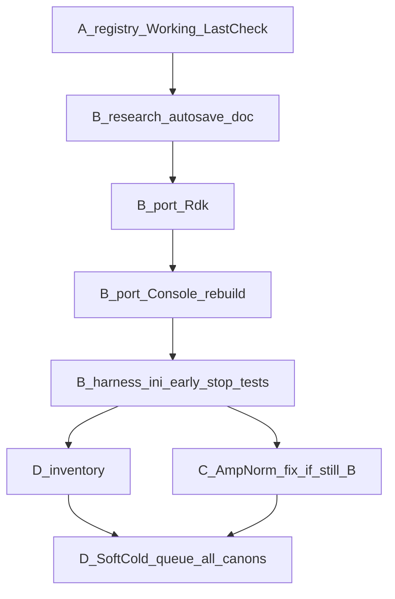

# Детальный план: реестры, autosave, cold SoftCold → рабочий C++ Train

## Конечная цель

Для **каждого канонического Имени** в [EXPERIMENTS.md](Bin/Configs/SpikeSamples/StructTrain/EXPERIMENTS.md): надёжный SoftCold-статус (`PASS` | `FAIL`+корзина | `blocked`) и, где объективно возможно, `Working=SoftCold`. GoldTest остаётся нижней ступенью. LandscapeOk / Acc / fires **не** ослаблять.

Сейчас: ~**81** уникальных Имён в таблицах; SoftCold `--case` в `posttune_verify.py` — **42** `_case(...)` + отдельные legacy (`br25_on`, `asym50`, …). Нужен явный инвентарь дыр.

---

## Часть A — реестры Working / LastCheck

### Файлы (обязательно)

| Файл | Действие |
|------|----------|
| [Bin/.../EXPERIMENTS.md](Bin/Configs/SpikeSamples/StructTrain/EXPERIMENTS.md) | Шапка + все markdown-таблицы |
| [Bin/.../SUCCESSFUL_EXPERIMENTS.md](Bin/Configs/SpikeSamples/StructTrain/SUCCESSFUL_EXPERIMENTS.md) | То же; FAIL только в блоках «Провалы» |
| [.cursor/skills/structtrain-experiments/SKILL.md](.cursor/skills/structtrain-experiments/SKILL.md) | Колонки, правило Working/LastCheck |
| [.cursor/skills/structtrain-experiments/reference.md](.cursor/skills/structtrain-experiments/reference.md) | Таблица протоколов + лестница |
| [Bin/.../POST_TRAIN_VERIFY.ru.md](Bin/Configs/SpikeSamples/StructTrain/POST_TRAIN_VERIFY.ru.md) | § типы приёмки: Gold ≠ SoftCold; ссылка на Working |
| [Docs/.../STATUS.ru.md](Docs/Audit/TimeLearner-2026-09-26-review/STATUS.ru.md) | Ссылка на PROTOCOL + FAIL_BOUNDS |
| **NEW** [Docs/.../evidence/PROTOCOL_WORKING_VS_LASTCHECK.ru.md](Docs/Audit/TimeLearner-2026-09-26-review/evidence/PROTOCOL_WORKING_VS_LASTCHECK.ru.md) | Контракт колонок |
| **NEW** [Docs/.../evidence/SOFTCOLD_FAIL_BOUNDS.ru.md](Docs/Audit/TimeLearner-2026-09-26-review/evidence/SOFTCOLD_FAIL_BOUNDS.ru.md) | Корзины A/B/EstDelay + «чинить?» |
| [Docs/.../evidence/SOFTCOLD_FINAL_MATRIX.ru.md](Docs/Audit/TimeLearner-2026-09-26-review/evidence/SOFTCOLD_FINAL_MATRIX.ru.md) | Дописать: Working≠SoftCold; ссылка на autosave |

### Схема колонок

Было: `Имя | … | Протокол | Acc | Цель | Режим | HEAD | PHASE12 | Примечание | Конфиги`

Станет: `Имя | … | **Working** | **LastCheck** | Acc | Цель | Режим | HEAD | PHASE12 | Примечание | Конфиги`

- **Working** ∈ `SoftCold` | `SkipTrainGold` | `GoldTest` | `MatrixClone` | `none` — сильнейший PASS по Имени.
- **LastCheck** — строка вида `SoftCold FAIL (B_need1)` / `GoldTest PASS (Console=…)` — протокол последней проверки.
- Лестница силы: `SoftCold` > `SkipTrainGold` > `GoldTest` ≈ `MatrixClone`.

### Миграция

1. Скрипт (одноразовый, можно в `Bin/.../scripts/` или `_repro/`): парсит строки таблиц, для каждого Имени считает Working из PASS-строк; LastCheck = протокол этой строки (для SoftCold-строк после W2–W4 — `SoftCold FAIL`).
2. Прогон скрипта на обоих md; ручная вычитка шапок §1–§N.
3. Коммит Bin submodule + root gitlink ([nmsdk-gitlinks](.cursor/skills/nmsdk-gitlinks/SKILL.md)).

### Корзины FAIL (в SOFTCOLD_FAIL_BOUNDS)

| ID | Признак | Файлы-доказательства | Действие |
|----|---------|----------------------|----------|
| A | Need=0, TipR canon, LandscapeOk=0 | [A_NONSEPARABLE_MID.ru.md](Docs/Audit/TimeLearner-2026-09-26-review/evidence/A_NONSEPARABLE_MID.ru.md), FAIL_TAXONOMY | research; не ослаблять LandscapeOk |
| B / AmpNorm | TipR@Rmin или mid, Need=1 | [AMPNORM_EOL_STUCK.ru.md](Docs/Audit/TimeLearner-2026-09-26-review/evidence/AMPNORM_EOL_STUCK.ru.md), [AMPNORM_asym50_KEEPSLOG.ru.md](Docs/Audit/TimeLearner-2026-09-26-review/evidence/AMPNORM_asym50_KEEPSLOG.ru.md) | чинить PulseLib EOL |
| EstDelay | L≈97 | [PHASE6_ESTDELAY_FIX.ru.md](Docs/Audit/TimeLearner-2026-09-26-review/evidence/PHASE6_ESTDELAY_FIX.ru.md) | XML done; остаток → B |
| desync | TipR flat L=1 | SOFTCOLD_PLAN_RESULT | закрыто |

---

## Часть B — model-time autosave из `spike_classifier_preset`

### Источник (уже на remote)

| Компонент | Ref | Что брать |
|-----------|-----|-----------|
| Root commit | `3bae747` *Add console model-time autosave* | diff `App/NeuroModelerConsole/main.cpp` |
| Rdk submodule | `d27ba4c` (pointer на preset) | `ProjectAutoSaveModelTimeInterval` |
| PulseLib preset | `cbd605e` / branch | **не** merge целиком (classifier/AutoPreset); только docs-ссылка |
| Описание | PulseLib `Docs/Analysis/NNeuronStructuralTrainingAudit.md` § autosave | цитата в наш evidence |

### B1. Research checklist → [MODEL_TIME_AUTOSAVE.ru.md](Docs/Audit/TimeLearner-2026-09-26-review/evidence/MODEL_TIME_AUTOSAVE.ru.md)

Зафиксировать:

- Поведение: QTimer 500 ms → при `modelTime >= nextSave` → `SaveProject()` (Model+Parameters; States **не** обязательны).
- Ограничения: `SaveProject()` может вернуть true при частичном fail; нет гарантии resume; GUI не обязан.
- Diff vs HEAD: Rdk только `UProject.h` + `UProject.cpp` (~17 строк); Console `main.cpp` (~59 строк).
- Решение: **cherry-pick/port**, не merge `spike_classifier_preset`.

### B2. Rdk — код

Файлы на текущем `time_trainer_audit3` (сейчас свойства **нет**):

- [Rdk/Core/Application/UProject.h](Rdk/Core/Application/UProject.h) — поле `int ProjectAutoSaveModelTimeInterval;` рядом с `ProjectAutoSaveFlag`.
- [Rdk/Core/Application/UProject.cpp](Rdk/Core/Application/UProject.cpp) — init `=0`, copy/==, `ReadInteger`/`WriteInteger` в XML General (теги как на preset: `ProjectAutoSaveModelTimeInterval`).

Опционально позже (не блокер SoftCold): GUI checkbox в `UStatusPanel` / wizard — **вне** минимального порта.

Коммит: submodule Rdk → bump gitlink в root.

### B3. Console — код

- [App/NeuroModelerConsole/main.cpp](App/NeuroModelerConsole/main.cpp) — перенести логику из `3bae747`:
  - читать `GetProjectConfig().ProjectAutoSaveModelTimeInterval`;
  - расширить условие старта monitor: `exitAfterCalc \|\| cliSaveProject \|\| interval>0`;
  - внутри timer: autosave по model-time **до** early-return на `!IsCalcFinished`;
  - сохранить latch A15 (один Save+quit по завершении calc).

Сборка ([nmsdk-build](.cursor/skills/nmsdk-build/SKILL.md)):

```bash
cmake --build build/linux-gcc-debug-local \
  --target NeuroModelerConsole -j"$(nproc)"
# Rdk подтянется как зависимость приложения
sha256sum Bin/Platform/Linux/NeuroModelerConsole
```

Проверка: smoke с `ProjectAutoSaveModelTimeInterval>0` → в логе `Project auto-save call completed…`; mtime `Parameters_00.xml`/`Model_00.xml` обновляются.

### B4. Конфиги SoftCold / harness

**XML ключ** в `Train/Project.ini` внутри `<General>` (сейчас только `ProjectAutoSaveFlag` / `ProjectAutoSaveStateFlag`):

```xml
<ProjectAutoSaveModelTimeInterval>10</ProjectAutoSaveModelTimeInterval>
```

(значение калибровать: 5–30 с model-time; дефолт SoftCold зафиксировать в contract.)

Файлы harness:

| Файл | Изменение |
|------|-----------|
| [repro_cold_lib.py](Bin/Configs/SpikeSamples/StructTrain/scripts/repro_cold_lib.py) | `set_project_autosave_model_interval(train_or_ini, seconds)`; вызов из `soft_cold_reset_train` / `prepare_clean_case` после копирования `Project.ini` |
| [posttune_verify.py](Bin/Configs/SpikeSamples/StructTrain/scripts/posttune_verify.py) | CLI `--autosave-model-s N` (default SoftCold N>0); `wait_need0`: после каждого poll читать Need/TipR/L из **сохранённых** XML (autosave), не только stale pre-train; optional early stop when Need=0 + tipr settled + flag; логировать `AUTOSAVE_SEEN mtime=…` |
| [cold_reset_contract.json](Bin/Configs/SpikeSamples/StructTrain/scripts/repro_cold_lib.py) (`write_cold_reset_contract`) | поле `project_autosave_model_time_interval` |
| [test_softcold_fix_unit.py](Bin/Configs/SpikeSamples/StructTrain/scripts/tests/test_softcold_fix_unit.py) | assert тег interval после soft_cold |
| [test_posttune_verify_unit.py](Bin/Configs/SpikeSamples/StructTrain/scripts/tests/test_posttune_verify_unit.py) | mock early-detect Need=0 from XML mtime path |
| [POST_TRAIN_VERIFY.ru.md](Bin/Configs/SpikeSamples/StructTrain/POST_TRAIN_VERIFY.ru.md) | документ CLI + interval |
| **NEW** evidence `MODEL_TIME_AUTOSAVE.ru.md` | контракт + калибровка |

**Важно:** сегодня `wait_need0` читает `Parameters_00.xml` `IsNeedToTrain`, но без Save XML часто **не** обновляется до flag_flush — из‑за этого poll показывает Need=1 часами при уже «почти готовом» live TipR. Autosave как раз закрывает этот gap.

Не менять массово архивные EXP `Project.ini` в git (сотни файлов): выставлять interval **в workdir** при soft-cold / prepare.

### B5. Что явно НЕ мержить из preset (пока)

- PulseLib: `AutoPreset.*`, `NClassifier*`, `NSpikeClassifier` large diffs, `NNeuronLearner` AutoPreset API.
- Bin classifier experiment archives / replay assets.
- Root `cmake/DeployVcpkg*.cmake` fixes — только если сломана сборка Linux SoftCold.

Критерий «можно домержить позже»: отдельный PR после зелёного SoftCold smoke на TL.

---

## Часть C — AmpNorm / алгоритм (после видимости Save)

Файлы кода (уже трогались; следующий инкремент по keep-slog+autosave):

- [Libraries/Nmsdk-PulseLib/Core/NNeuronTimeLearner.cpp](Libraries/Nmsdk-PulseLib/Core/NNeuronTimeLearner.cpp) — `AllDendritesSynced` / `AllSynapsesNormalized` / EOL (`kRminLengthTolFactor`, midband→Rmin).
- [Libraries/Nmsdk-PulseLib/Core/NNeuronTimeLearner.h](Libraries/Nmsdk-PulseLib/Core/NNeuronTimeLearner.h) — константы.
- Якорь диагностики: `posttune_verify --case asym50_preinh --keep-slog --snap-every …` + autosave.
- Docs: AMPNORM_* обновлять вердиктами; не трогать LandscapeOk.

Branch TimeLearner (`NNeuronTimeLearnerBranch.cpp`) — зеркалить EOL-правки, если SoftCold Branch падает той же корзиной B.

Сборка: PulseLib + Console ([nmsdk-build](.cursor/skills/nmsdk-build/SKILL.md)); gitlinks PulseLib+root.

---

## Часть D — полная SoftCold-матрица EXPERIMENTS

### D1. Инвентарь

**NEW** `Bin/Configs/SpikeSamples/StructTrain/_repro/SOFTCOLD_CANON_INVENTORY.md` (или `.csv`):

| Имя (реестр) | SoftCold `--case` | Есть? | Last SoftCold | Working сейчас |
|--------------|-------------------|-------|---------------|----------------|
| … | … | yes/no | … | GoldTest |

Источники: EXPERIMENTS.md + `CASES`/`_case` в [posttune_verify.py](Bin/Configs/SpikeSamples/StructTrain/scripts/posttune_verify.py) + [apply_softcold_rcs.py](Bin/Configs/SpikeSamples/StructTrain/scripts/apply_softcold_rcs.py) + [reference.md](.cursor/skills/structtrain-experiments/reference.md).

Дыры: каноны без `--case` → добавить case **или** пометить `SoftCold=not_applicable` (только MatrixClone pack B/C наследует SoftCold packA).

### D2. Очередь прогонов

- Скрипт очереди (как W2/W3): `metrics/SOFTCOLD_full_matrix.log`.
- Флаги: soft-cold + `--autosave-model-s` + `--snap-every 20`; 10‑мин `AGENT_LOOP_TICK`.
- После каждого case: обновить LastCheck (+ Working если PASS); append RC list `_repro/SOFTCOLD_HEAD_rcs.txt`.
- Приоритет якорей для кода: `asym50_preinh` (B), `asym25_preinh`/`br25_on` (A), `phase6_thr_only` (EstDelay+B), `fs50_preinh`.

### D3. Критерий done

- Инвентарь 100% закрыт строкой статуса.
- SUCCESSFUL: SoftCold PASS появляются только при реальном cold PASS.
- STATUS / SOFTCOLD_FINAL_MATRIX: актуальная сводка; цель продукта — рост числа `Working=SoftCold`, не обнуление Gold.

---

## Порядок работ (исполнение)



---

## Автокоммиты по ходу выполнения (обязательно)

**Политика:** после **каждого** завершённого логического инкремента сразу делать git commit(ы), не копить большую грязную рабочую копию до конца плана. Push — **только** по явной просьбе пользователя.

Следовать [nmsdk-gitlinks](.cursor/skills/nmsdk-gitlinks/SKILL.md) и user git rules: HEREDOC message; не `--no-verify`; не amend чужих/запушенных; не коммитить `_work/`, StatisticLog, secrets.

### Порядок submodule → root

1. Коммит в затронутом submodule (`Bin`, `Rdk`, `Libraries/Nmsdk-PulseLib`, …).
2. В root: `git add <submodule> [Docs/…]` → commit с bump gitlink + связанные Docs.
3. `git status` / `git submodule status` — проверить чистоту инкремента.

### Обязательные точки коммита (чеклист)

| После шага | Где commit | Пример message |
|------------|------------|----------------|
| A: шапки + миграция Working/LastCheck | Bin → root | `docs(structtrain): Working/LastCheck columns` / `docs(audit): registry protocol ladder; bump Bin` |
| A: SKILL + PROTOCOL + FAIL_BOUNDS + STATUS | root (+ Bin если POST_TRAIN_VERIFY) | `docs(audit): SoftCold fail bounds + Working vs LastCheck` |
| B1: MODEL_TIME_AUTOSAVE research doc | root | `docs(audit): model-time autosave research from spike_classifier_preset` |
| B2: Rdk property | Rdk → root | `feat(rdk): ProjectAutoSaveModelTimeInterval` / bump Rdk |
| B3: Console main.cpp + rebuild note (sha в doc) | root App | `feat(console): model-time Project auto-save (from 3bae747)` |
| B4: harness + unit tests | Bin → root | `feat(structtrain): SoftCold Project.ini autosave + early Need poll` |
| C: PulseLib AmpNorm fix (когда будет) | PulseLib → root | `fix(TimeLearner): …` / bump PulseLib |
| D1: inventory manifest | Bin и/или Docs | `docs(structtrain): SoftCold canon inventory` |
| D2: после **каждого** SoftCold case или пачки ≤5 | Bin (EXPERIMENTS/SUCCESSFUL) → root | `docs(structtrain): SoftCold LastCheck <case> …` |
| D3: final matrix / STATUS closeout | Docs → root | `docs(audit): SoftCold HEAD matrix closeout` |

Если инкремент только Docs без submodule — один root commit. Если упал hook — **новый** commit после фикса, не amend чужого.

Todo `auto-commits`: считать выполненным, когда политика соблюдена на всех точках выше (не отдельный финальный шаг).

---

## Вне scope первого инкремента

- Полный merge `spike_classifier_preset` / AutoPreset / новые classifier EXP.
- R01/R04 production scheduler (blocked:time).
- Ослабление LandscapeOk / Acc.
- Массовая правка архивных EXP `Project.ini` в git (только workdir).
