# SoftCold Full 49 + explanation pass (детальный инвентарь)

## Политика

Предыдущие планы держали full 49 закрытым при D-core &lt;4/5 ([`SOFTCOLD_ANTIBOUNCE_FULL_matrix_plan.txt`](Bin/Configs/SpikeSamples/StructTrain/_repro/SOFTCOLD_ANTIBOUNCE_FULL_matrix_plan.txt), [`AMPNORM_D_RMAX_LENGTH_ESCAPE.ru.md`](Docs/Audit/TimeLearner-2026-09-26-review/evidence/AMPNORM_D_RMAX_LENGTH_ESCAPE.ru.md)). Здесь — **override**: rematrix как **новый HEAD baseline** + таблицы + объяснения.

**Запрещено в волне:** C++ AmpNorm Done / E1–E3 policy / `D_algo_open` algo-fix; ослабление LandscapeOk / Acc / fires / Need→0 / tipr_class; `--keep-slog` на все 49; правка production XML канонов; nested `flock` на `registry_apply.lock`.

**Коммит:** после успешного post-DONE (RCS 49/49 + реестр + audit docs) — **автоматически закоммитить** результат (§8). Push только по отдельной просьбе.

```mermaid
flowchart LR
  preflight[Preflight_rebuild_disk]
  matrix["PARALLEL8_matrix_49"]
  monitor["Monitor_every_15m"]
  merge[Merge_RCS]
  apply[Apply_EXPERIMENTS_SUCCESSFUL]
  snap[FULL49_SNAP_table]
  audit[Docs_rebucket]
  commit[Auto_commit_Bin_root]
  preflight --> matrix
  matrix --> monitor
  monitor -->|"DONE"| merge
  merge --> apply --> snap --> audit --> commit
```



---

## 1. Код (C++ / build)

### 1.1 Что уже должно быть в бинаре (не писать новый AmpNorm)

| SHA PulseLib | Содержание | Файлы |
|--------------|------------|--------|
| `3cefd64` | anti-bounce hold TipR@MaxL+overshoot | `NNeuronTimeLearner.cpp` / `Branch` |
| `dc2866a` | EolGateAudit PeakSeen/BestEffort/SomaPeakValid | те же `EndOfLearning` debug logs |

Проверка: `git -C Libraries/Nmsdk-PulseLib rev-parse --short HEAD` → `dc2866a` (или потомок с обоими ancestors).

### 1.2 Rebuild (обязательный preflight)

По [`.cursor/skills/nmsdk-build/SKILL.md`](.cursor/skills/nmsdk-build/SKILL.md):

```bash
cmake --preset linux-gcc-debug-local   # если configure нет
cmake --build build/linux-gcc-debug-local \
  --target Nmsdk-PulseLib.core NeuroModelerConsole -j"$(nproc)"
sha256sum Bin/Platform/Linux/NeuroModelerConsole | cut -c1-16
```

Один Console SHA на всю матрицу; записать в LOG (скрипт уже печатает `SHA=…`).

### 1.3 Новый C++ в этой волне

**Нет.** Explanation = SNAP/provenance post-process + Docs. Не трогать Done predicates.

### 1.4 Опциональный маленький harness-скрипт (только если нет ручного агрегата)

Если после DONE нет удобного сброса 49× таблицы — **один** новый post-process (не во время матрицы):

- путь: `Bin/.../scripts/softcold_full49_snap_table.py` (или под `evidence/metrics/`)
- вход: `SOFTCOLD_HEAD_rcs.txt` + latest `_repro/runs/<case>_*` `provenance.json` / `Train/tipr_final.txt` / `posttune_tipr_live.txt`
- выход: markdown-таблица → [`SOFTCOLD_FULL49_SNAP.md`](Docs/Audit/TimeLearner-2026-09-26-review/evidence/SOFTCOLD_FULL49_SNAP.md)

Не менять `softcold_full_matrix_parallel.sh` ради classify dump (уже даёт SNAP в LOG).

---

## 2. Скрипты и harness

### 2.1 Запуск (использовать as-is)

| Скрипт | Роль |
|--------|------|
| [`softcold_full_matrix_parallel.sh`](Bin/Configs/SpikeSamples/StructTrain/scripts/softcold_full_matrix_parallel.sh) | оркестратор PARALLEL → RCS shards → merge → apply |
| [`posttune_verify.py`](Bin/Configs/SpikeSamples/StructTrain/scripts/posttune_verify.py) | worker: SoftCold+PostTune, SNAP, provenance, stall |
| [`apply_softcold_rcs_to_registry.py`](Bin/Configs/SpikeSamples/StructTrain/scripts/apply_softcold_rcs_to_registry.py) | RCS → EXPERIMENTS + SUCCESSFUL (PASS only) |
| [`softcold_w4_status_snapshot.sh`](Bin/Configs/SpikeSamples/StructTrain/scripts/softcold_w4_status_snapshot.sh) | база для статуса; для full49 — каждые **15 мин**, считать `rcs.d` (см. §2.2a) |

**Не использовать** для этой волны: `softcold_full_matrix.sh` (serial W4), `open_gaps_w0_diag.sh` (subset + keep-slog), `apply_softcold_rcs.py` (legacy append block), `diag_psi01_sync_as_keep.py` (не матрица).

### 2.2 Команда запуска

```bash
cd /home/user/Nmsdk/Bin/Configs/SpikeSamples/StructTrain
# archive RCS first
cp -a _repro/SOFTCOLD_HEAD_rcs.txt \
  "_repro/SOFTCOLD_HEAD_rcs_before_full49_$(date -u +%Y%m%dT%H%M%SZ).txt"

LOG=/home/user/Nmsdk/Docs/Audit/TimeLearner-2026-09-26-review/evidence/metrics/SOFTCOLD_full_matrix_$(date -u +%Y%m%d).log
PARALLEL=8 AUTOSAVE_MODEL_S=10 SNAP_EVERY=20 STALL_AUTOSAVE_N=8 \
  SKIP_REGISTRY_APPLY=0 \
  MANIFEST=_repro/SOFTCOLD_QUEUE_manifest.txt \
  RCS=_repro/SOFTCOLD_HEAD_rcs.txt \
  RCS_DIR=_repro/rcs.d \
  LOG="$LOG" \
  nohup bash scripts/softcold_full_matrix_parallel.sh >"${LOG}.nohup" 2>&1 &
```

Env-контракт скрипта: `PARALLEL` (default 6→цель 8), disk clamp `80+10×P` GiB, `SNAP_EVERY`, `STALL_AUTOSAVE_N`, `SKIP_REGISTRY_APPLY`, `NM` path Console.

Сразу после nohup — задача **monitor-15m** (§2.2a). Не оборачивать apply во внешний `flock` на `registry_apply.lock`.

Ожидаемое wall ~сутки− (прошлый 49×6 ~13–20h Train+apply).

### 2.2a Мониторинг хода — каждые 15 минут (обязательная задача)

Пока жив оркестратор или `done < 49` — **тик раз в 15 минут**. Не убивать silent mid-gate / Train.

**Источник статуса (read-only):**
- shards `_repro/rcs.d/*.rc` → done/pass/fail (до merge финальный `SOFTCOLD_HEAD_rcs.txt` может быть старым)
- процессы: `pgrep -af 'softcold_full_matrix_parallel|posttune_verify.py --case|NeuroModelerConsole'`
- хвост LOG: `CASE … START/END`, `SNAP`, `ERROR` / `RCS incomplete`
- диск: `df -BG` vs порог `80+10×PARALLEL`
- адаптировать snapshot: считать `rcs.d`, детект `softcold_full_matrix_parallel.sh`, писать в `metrics/softcold_full49_15m_status.txt`

**Строка тика:**
`UTC done=N/49 pass=P fail=F active=<cases> parallel_alive=Y/N disk=GiB`

**Стоп мониторинга:** LOG содержит `SoftCold full matrix PARALLEL done`, либо `ERROR: RCS incomplete` / оркестратор умер при `done<49` → эскалация.

**Запуск loop:** Cursor `/loop 15m` или `while sleep 900` + snapshot; не блокировать матрицу.

### 2.3 Что пишет worker на каждый case

Из `posttune_verify` / Open Gaps SNAP:

| Артефакт | Поля для explanation |
|----------|----------------------|
| `_repro/rcs.d/<case>.rc` | `case rc utc` |
| LOG `SNAP` / `posttune_tipr_live.txt` | tipr, L, amp_dt, res_st, no_imp, last_abs_dt, need, phase |
| `provenance.json` | `tipr_class`, `failure_class`, `fail_notes`, `gate_ok`/`gate_rc`, `train_status`, `binary_sha256`, gitlinks |
| `Train/tipr_final.txt` | сырой TipR → корзина D/E/B/A |
| `Train/cold_reset_contract.json` | softcold_fix/mode, topology (не FAIL-корзина) |
| `inputs_manifest.json` | архив/case binding |

### 2.4 Apply registry — точные мутации

[`apply_softcold_rcs_to_registry.py`](Bin/Configs/SpikeSamples/StructTrain/scripts/apply_softcold_rcs_to_registry.py):

| Файл | Что меняет |
|------|------------|
| `EXPERIMENTS.md` | matching SoftCold rows: LastCheck; Working↑ до SoftCold при PASS; HEAD PASS/FAIL |
| `SUCCESSFUL_EXPERIMENTS.md` | только `rc==0` строки |
| `_repro/registry_apply.lock` | fcntl (не контент) |

**Не трогает:** шапки SHA (обновить **вручную**), XML канонов, `FAIL_TAXONOMY.json`, STATUS, Open Gaps docs.

PASS LastCheck формат: `SoftCold PASS (case=<id>)`.
FAIL: `SoftCold FAIL (case=<id>, rc=<n>)` — Working Gold **не** demote.

### 2.5 Post-process taxonomy

| Скрипт | Действие |
|--------|----------|
| `evidence/metrics/refresh_fail_taxonomy_after_fix.py` | **устаревший** snapshot softcold_fix — не гонять вслепую |
| новый `softcold_full49_snap_table.py` (см. §1.4) **или** ручной grep LOG/provenance | → `SOFTCOLD_FULL49_SNAP.md` |
| ручное обновление `FAIL_TAXONOMY.json` | counts/subtypes под новый RCS (не переписывать историю S3 subtypes) |

---

## 3. Конфиги (XML / manifests / очередь)

### 3.1 Production XML канонов

**Не менять** для baseline rematrix. SoftCold копирует allowlist в workdir (`prepare_clean_case`). EstDelay PhaseA/PSI уже в архивах с прошлой волны — не re-patch «ради» full 49.

### 3.2 Обязательные manifests / inventory (read / verify)

| Путь | Действие |
|------|----------|
| [`_repro/SOFTCOLD_QUEUE_manifest.txt`](Bin/Configs/SpikeSamples/StructTrain/_repro/SOFTCOLD_QUEUE_manifest.txt) | **очередь 49** — `wc -l` = 49, без `#`/пустых |
| [`_repro/SOFTCOLD_CANON_INVENTORY.md`](Bin/Configs/SpikeSamples/StructTrain/_repro/SOFTCOLD_CANON_INVENTORY.md) / `.csv` | сверить case id ↔ EXP имена; при рассинхроне — поправить inventory **после** матрицы |
| `_repro/SOFTCOLD_*_manifest.txt` (W3e/P12/antibounce/…) | **не** запускать; только архив истории |
| [`SOFTCOLD_ANTIBOUNCE_FULL_matrix_plan.txt`](Bin/Configs/SpikeSamples/StructTrain/_repro/SOFTCOLD_ANTIBOUNCE_FULL_matrix_plan.txt) | дописать статус: «full 49 RUN by user override YYYY-MM-DD» (снять CLOSED) |

### 3.3 Артефакты `_repro` после прогона

| Путь | Действие |
|------|----------|
| `SOFTCOLD_HEAD_rcs.txt` | перезаписать merge 49 |
| `SOFTCOLD_HEAD_rcs_before_full49_<UTC>.txt` | backup до старта |
| `rcs.d/*.rc` | runtime shards (можно не коммитить) |
| `_repro/runs/*` | workdirs — **не коммитить** slog/Model; provenance можно читать |
| `.last_softcold_rc.txt` | serial leftover — игнор |

### 3.4 Контракт cold (не править код контракта)

[`POST_TRAIN_VERIFY.ru.md`](Bin/Configs/SpikeSamples/StructTrain/POST_TRAIN_VERIFY.ru.md) — критерий SoftCold PASS: Need→0 + tipr_class=canon + gate. Ссылку в шапке SUCCESSFUL оставить; текст контракта менять только если обнаружен harness-баг (не ожидается).

---

## 4. Документация (полный список обновлений)

### 4.1 Bin registry — обязательно

| Файл | Кто пишет | Что обновить |
|------|-----------|--------------|
| [`EXPERIMENTS.md`](Bin/Configs/SpikeSamples/StructTrain/EXPERIMENTS.md) | apply + **ручная шапка** | LastCheck/HEAD/Working по 49 SoftCold-строкам; шапка `Console SHA-256` · PulseLib `dc2866a` · Bin · дата full49 |
| [`SUCCESSFUL_EXPERIMENTS.md`](Bin/Configs/SpikeSamples/StructTrain/SUCCESSFUL_EXPERIMENTS.md) | apply PASS + **ручная шапка** + **блоки «Провалы / вне PASS»** | PASS-строки SoftCold; в каждом разделе сверить провалы с новым RCS (не оставлять устаревшие «ожидаем PASS») |

Колонки (не ломать):
`Имя | Алгоритм | Параметры | Working | LastCheck | Acc | Цель | Режим | HEAD | PHASE12 | Примечание | Конфиги`
Лестница: SoftCold > SoftColdOff > SkipTrainGold > GoldTest. Gold PASS ≠ SoftCold ([`PROTOCOL_WORKING_VS_LASTCHECK.ru.md`](Docs/Audit/TimeLearner-2026-09-26-review/evidence/PROTOCOL_WORKING_VS_LASTCHECK.ru.md)).

### 4.2 Evidence audit — обязательно

| Файл | Обновление |
|------|------------|
| [`SOFTCOLD_CONVERGENCE_AUDIT.ru.md`](Docs/Audit/TimeLearner-2026-09-26-review/evidence/SOFTCOLD_CONVERGENCE_AUDIT.ru.md) | шапка SHA/PARALLEL/даты; §1 PASS/FAIL = RCS; §2 таксономия; §4 карта всех FAIL; §7 вердикт; §8 чеклист заново |
| **новый** [`SOFTCOLD_FULL49_SNAP.md`](Docs/Audit/TimeLearner-2026-09-26-review/evidence/SOFTCOLD_FULL49_SNAP.md) | 49× таблица TipR/Need/LastAbsDt/amp_dt/failure_class/корзина (explanation pass) |
| [`OPEN_GAPS_D_CLASSIFY.ru.md`](Docs/Audit/TimeLearner-2026-09-26-review/evidence/OPEN_GAPS_D_CLASSIFY.ru.md) | пересчитать D_algo_open / D_objective / D_unclassified по FULL49 SNAP |
| [`OPEN_GAPS_E_B.ru.md`](Docs/Audit/TimeLearner-2026-09-26-review/evidence/OPEN_GAPS_E_B.ru.md) | E1/E3/B4/N на новом срезе; DEFERRED не снимать без policy |
| [`SOFTCOLD_PROTOCOL_FAILS.ru.md`](Docs/Audit/TimeLearner-2026-09-26-review/evidence/SOFTCOLD_PROTOCOL_FAILS.ru.md) | подтвердить N/A/G/C/E_gate на HEAD |
| [`AMPNORM_EOL_RETEST_RESULT.md`](Docs/Audit/TimeLearner-2026-09-26-review/evidence/AMPNORM_EOL_RETEST_RESULT.md) | блок «Full49 HEAD YYYY-MM-DD»: SHA, PASS/FAIL, LOG/RCS paths |
| [`AMPNORM_EOL_W0_SNAP.md`](Docs/Audit/TimeLearner-2026-09-26-review/evidence/AMPNORM_EOL_W0_SNAP.md) | ссылка на FULL49_SNAP (не дублировать всю таблицу) |
| [`AMPNORM_D_RMAX_LENGTH_ESCAPE.ru.md`](Docs/Audit/TimeLearner-2026-09-26-review/evidence/AMPNORM_D_RMAX_LENGTH_ESCAPE.ru.md) | снять «full 49 закрыты» → «baseline full49 run; D_algo_open всё ещё DEFERRED» |

### 4.3 Evidence audit — sync / указатели

| Файл | Обновление |
|------|------------|
| [`STATUS.ru.md`](Docs/Audit/TimeLearner-2026-09-26-review/STATUS.ru.md) | новая секция «SoftCold full49 HEAD»: дата, SHA, N PASS/FAIL, ссылки CONVERGENCE + FULL49_SNAP + LOG |
| [`SOFTCOLD_FINAL_MATRIX.ru.md`](Docs/Audit/TimeLearner-2026-09-26-review/evidence/SOFTCOLD_FINAL_MATRIX.ru.md) | appendix: не путать с W6 0-PASS; указать актуальный rematrix HEAD |
| [`SOFTCOLD_FAIL_BOUNDS.ru.md`](Docs/Audit/TimeLearner-2026-09-26-review/evidence/SOFTCOLD_FAIL_BOUNDS.ru.md) | краткий sync чисел/корзин если разъехались |
| [`FAIL_TAXONOMY.json`](Docs/Audit/TimeLearner-2026-09-26-review/evidence/FAIL_TAXONOMY.json) | counts под новый срез (сохранить исторические ключи softcold_fix) |
| [`SOFTCOLD_PLAN_RESULT.md`](Docs/Audit/TimeLearner-2026-09-26-review/evidence/SOFTCOLD_PLAN_RESULT.md) | одна строка-указатель на full49 (не переписывать историю fix→retest) |

### 4.4 Не трогать / не путать

- Планы done: `SOFTCOLD_FIX_THEN_RETEST.plan.md`, `RETEST_EXTENDED_TIME.plan.md`, `AMPNORM_EOL_FIX.plan.md`, `AMPNORM_EOL_INVESTIGATE.plan.md` — только ссылка из STATUS/RESULT при необходимости.
- Исторические W1–W2 notes (`SOFTCOLD_W2_ASYM.ru.md`, `AMPNORM_*_KEEPSLOG`) — не переписывать.
- `metrics/*.log` / nohup / jsonl — локальные; LOG full49 можно не коммитить (gitignore `*.log`); в Docs ссылаться на путь.
- `.partial` (P2/P4) — вне волны.

### 4.5 Explanation pass — правила корзин (из Open Gaps + audit)

| Корзина | Критерий (финальный SNAP) | Действие Docs |
|---------|---------------------------|---------------|
| PASS | rc=0, Need=0, tipr=canon, gate ok | SUCCESSFUL + §1 PASS list |
| D_algo_open | @Rmax, L&lt;MaxL или grow+overshoot block (как Inv1) | DEFERRED fix |
| D_objective | @Rmin/MaxL+Need, basin/param (psi01 pattern) | param-policy follow-up |
| D_unclassified | ceiling/runaway без SNAP-предиката | оставить unclassified |
| E1 / E3 | @Rmin Need=1 length/dt-sign | DEFERRED policy EOL |
| E_gate | Train почти Done, gate/Landscape | Proto |
| B4 / B mid | mid TipR Need=1 | Branch note; не force Rmin |
| N | NonSeparable / LandscapeOk=0 | Proto; не ослаблять |
| A | flat LastR / nextseg | Proto |
| G | Keep/Search TipRMode | вне CanonRmin |
| C | metrics после Need≈0 | Proto |

Keep-якоря для Inv3 flake-check: `asym50`, `ltz50_gen`, `br50_gen`, `fs25_gen`, `br25_off`, preinh keep-set из antibounce P12.

---

## 5. Preflight checklist (перед nohup)

1. PulseLib HEAD содержит `3cefd64` + `dc2866a`; Console rebuilt; SHA16 записан.
2. `SOFTCOLD_QUEUE_manifest.txt` = 49 строк.
3. Free disk ≥160 GiB для PARALLEL=8 (иначе clamp; цель не ниже 6).
4. Нет чужих `posttune_verify` / SoftCold Console; Open Gaps очередь idle.
5. Backup `SOFTCOLD_HEAD_rcs.txt` → `*_before_full49_<UTC>.txt`.
6. Новый `LOG=.../SOFTCOLD_full_matrix_YYYYMMDD.log` (не append к `SOFTCOLD_full_matrix_parallel.log`).
7. `SKIP_REGISTRY_APPLY=0` осознанно (нужны таблицы).
8. Сразу после nohup — стартовать **monitor-15m** (§2.2a): loop каждые 15 мин до DONE/ERROR.

---

## 6. Post-DONE checklist

1. LOG: `RCS merged lines=49 expected=49 missing=0`; `PARALLEL done`.
2. Apply отработал без deadlock; EXPERIMENTS LastCheck покрывает все 49 SoftCold case id.
3. Ручные шапки SHA в EXPERIMENTS + SUCCESSFUL.
4. SUCCESSFUL: PASS ⊆ RCS rc=0; блоки «Провалы» актуальны.
5. `SOFTCOLD_FULL49_SNAP.md` + CONVERGENCE_AUDIT §1–§8.
6. Open Gaps D/E_B + PROTOCOL_FAILS + AMPNORM_D escape note + STATUS + FINAL_MATRIX pointer + FAIL_BOUNDS + FAIL_TAXONOMY.
7. ANTIBOUNCE_FULL plan txt: RUN recorded.
8. Арифметика: PASS+FAIL=49; корзины покрывают все FAIL; D_unclassified только без SNAP.
9. **Автокоммит** (§8) — не ждать отдельной просьбы «закоммить».

---

## 7. Критерии готовности волны

- RCS 49/49, missing=0, один Console/PulseLib срез.
- Полная таблица EXPERIMENTS и SUCCESSFUL согласованы с RCS; шапки SHA актуальны.
- Explanation: FULL49_SNAP + audit rebucket; D_unclassified минимизирован данными SNAP.
- AmpNorm DEFERRED не переоткрыт «из‑за» матрицы; LandscapeOk не ослаблен.
- Автокоммиты Bin + root созданы; `git status` чист по целевым путям (кроме игнорируемых runs/metrics noise).

---

## 8. Автокоммит результата (после docs-audit)

Триггер: post-DONE п.1–8 выполнены (RCS полный, реестр+шапки, FULL49_SNAP, CONVERGENCE_AUDIT и sync-доки обновлены). При `ERROR: RCS incomplete` / matrix abort — **не** коммитить частичный реестр.

По скиллу [nmsdk-gitlinks](.cursor/skills/nmsdk-gitlinks/SKILL.md) и user git rules:

1. **Bin** (submodule):
   - stage: `EXPERIMENTS.md`, `SUCCESSFUL_EXPERIMENTS.md`, `_repro/SOFTCOLD_HEAD_rcs.txt`, `_repro/SOFTCOLD_HEAD_rcs_before_full49_*.txt` (backup), `_repro/SOFTCOLD_ANTIBOUNCE_FULL_matrix_plan.txt` (если правили), `_repro/SOFTCOLD_CANON_INVENTORY.*` (если правили), опционально `scripts/softcold_full49_snap_table.py`
   - **не** stage: `_repro/runs/`, `rcs.d/`, slog, archives, `__pycache__`, History.xml
   - message: `docs(structtrain): SoftCold full49 HEAD RCS and registry`

2. **PulseLib**: коммит только если в этой волне были новые C++ commits сверх уже закоммиченного `dc2866a` (обычно skip).

3. **Root**:
   - stage: Docs evidence (CONVERGENCE_AUDIT, FULL49_SNAP, Open Gaps, PROTOCOL_FAILS, STATUS, FINAL_MATRIX, FAIL_BOUNDS, FAIL_TAXONOMY, AMPNORM_* notes), gitlinks `Bin` (+ PulseLib если bump)
   - **не** stage: `evidence/metrics/*.log`, nohup, jsonl, `.partial`, `Skills/Cursor`, HardwareLib
   - message: `docs(audit): SoftCold full49 rematrix results; bump Bin gitlink`

4. Проверка: `git status -sb` / `git submodule status Bin`; **не** `git push` без явной просьбы.

5. Если pre-commit hook правит файлы — новый commit (не amend чужого/уже запушенного).
