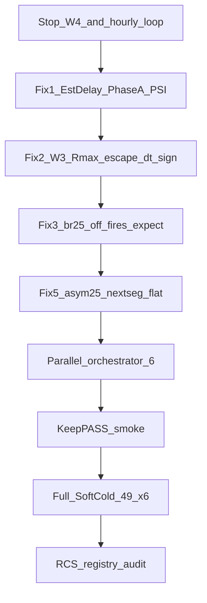

# План: стоп W4 → фиксы §1–3,§5 → parallel SoftCold 49×6

База: анализ FAIL W4 (22/49, 5 PASS / 17 FAIL), пункты правок из разбора, оркестрация из [ampnorm_eol_fixes_3c7a888d.plan.md](/home/user/.cursor/plans/ampnorm_eol_fixes_3c7a888d.plan.md) и скилла [structtrain-experiments](.cursor/skills/structtrain-experiments/SKILL.md).
**§4 не трогать:** не ослаблять LandscapeOk/Acc/fires для `fs50_preinh` / `br25_on` (Done+canon + gate — объективный/протокольный FAIL).

**Решение по частичному W4:** считать матрицу незавершённой; архивировать RCS; после правок — **новый полный SoftCold 49** на одном Console/PulseLib срезе. PASS текущего W4 **не засчитывать** в финал (другой бинарь/конфиги).



---

## 0. Остановка текущего прогона (без правок кода)

1. Остановить **только** W4 + hourly monitor:
   - PID матрицы / `softcold_full_matrix.sh` / `posttune_verify` / `NeuroModelerConsole` из job W4 (терминал `167473`);
   - hourly loop `AGENT_LOOP_TICK_softcold_w4_hourly` (терминал `167474`, PID ~3289158).
2. Не убивать чужие процессы; не `kill -9` без проверки дерева.
3. Архив артефактов (не в git slog):
   - скопировать [`SOFTCOLD_HEAD_rcs.txt`](Bin/Configs/SpikeSamples/StructTrain/_repro/SOFTCOLD_HEAD_rcs.txt) → `_repro/SOFTCOLD_HEAD_rcs_w4_partial_YYYYMMDD.txt`;
   - оставить `metrics/SOFTCOLD_full_matrix_w4.log` локально;
   - кратко дописать в [`AMPNORM_EOL_RETEST_RESULT.md`](Docs/Audit/TimeLearner-2026-09-26-review/evidence/AMPNORM_EOL_RETEST_RESULT.md): W4 aborted at N/49, reason=stop for EstDelay/W3/parallel rematrix.
4. Зафиксировать SHA Console / PulseLib **до** правок (для сравнения).

---

## 1. §1 — EstDelay SoftCold PhaseA/PSI (конфиг)

**Проблема:** Train XML `EstDelayPerSeg=0.005` → SoftCold L≈`97 81 49`. Phase6 уже ок; PhaseA/PSI — нет.
Паттерн: [`PHASE6_ESTDELAY_FIX.ru.md`](Docs/Audit/TimeLearner-2026-09-26-review/evidence/PHASE6_ESTDELAY_FIX.ru.md).
Хелпер XML: `set_tag` / `set_tag_all` в [`repro_cold_lib.py`](Bin/Configs/SpikeSamples/StructTrain/scripts/repro_cold_lib.py).

### 1.1 Псевдокод патча архивов

```text
# one-shot script (или ручной цикл): patch_phasea_psi_estdelay.py
CASES_PA_PSI = filter(CASES, name matches pa*|psi*)
# exclude phase6_* (already patched)

for case_name, case in CASES_PA_PSI:
  archive = case["root"]          # SoftCold-source EXP, NOT _work
  gold    = case.get("gold") or archive
  span_s  = case["span_ms"] / 1000.0

  # Gold L0 from gold Train Parameters (pre-softcold tip-1)
  gold_params = gold / "Train" / "Parameters_00.xml"
  Lvec = parse_simplevector(gold_params, "DendriteLength")  # e.g. [49,41,25,1]
  L0 = Lvec[0]
  assert L0 > 1
  est = span_s / (L0 - 1)         # Phase6 formula

  for rel in ["Train/Parameters_00.xml", "Train/Model_00.xml"]:
    path = archive / rel
    if not path.exists(): continue
    text = path.read_text()
    if tag_exists(text, "EstDelayPerSeg"):
      text = set_tag_all(text, "EstDelayPerSeg", format_double(est))
    else:
      text = insert_tag_after(text, after="ResistanceMax",  # or DendriteLength
                              tag="EstDelayPerSeg", value=est)
    path.write_text(text)
  log_row(case_name, L0, span_s, est, archive)
```

**Инварианты:** не трогать Phase6 (`0.01` / `0.0096`); не писать в `_repro/runs/*_work`; SoftCold cold-reset по-прежнему ставит L=`1 1 1 1` в workdir (EstDelay seed остаётся в Parameters).

**Smoke:** `posttune_verify --case pa00_baseline …` → live L ≈ gold (±tol), **не** `97 81 49`. TipR/Need могут остаться FAIL до §2.

**Evidence:** `PHASEA_PSI_ESTDELAY_FIX.ru.md` (case → EstDelay → формула → smoke L).

---

## 2. §2 — W3 Rmax-escape по знаку dt (C++)

**Файлы:**
[`NNeuronTimeLearner.cpp`](Libraries/Nmsdk-PulseLib/Core/NNeuronTimeLearner.cpp) ~860–881
[`NNeuronTimeLearnerBranch.cpp`](Libraries/Nmsdk-PulseLib/Core/NNeuronTimeLearnerBranch.cpp) ~1035–1046

### 2.1 Сейчас (оба twin)

```text
ELSE IF rmax_dwell >= kNoImproveResistanceLimit AND r_old > rmin:
  r_new = Clamp(r_old * (1 - step))   # ALWAYS down — even if dt < 0
  Apply; RmaxDwell=0; NoImprove=0; Status=1
```

### 2.2 Целевой псевдокод (base + Branch, одинаковая семантика)

```text
# inside ChangeSynapseResistanceStatus, after overshoot@Rmin branch:

ELSE IF rmax_dwell >= kNoImproveResistanceLimit AND r_old > rmin*(1+1e-6):
  IF dt >= 0.0:                                    # undershoot: R too high
    step = max(kMidbandRminStep, kResistanceSettleRatio)
    r_new = ClampResistance(r_old * (1.0 - step))
    ApplyComputedResistance(num, r_old, r_new, eff_gain)
    RmaxDwellCount[num] = 0
    NoImproveResistanceCount[num] = 0
    ResistanceStatus[num] = 1
    LOG "AmpDtAudit RmaxDwell→down dt>=0 …"
  ELSE:                                            # overshoot @ Rmax: cannot raise
    # DO NOT lower R (forbids 1e11↔0.85*Rmax oscillation)
    # Keep dwell counter from runaway-stepping: freeze dwell or cap
    RmaxDwellCount[num] = kNoImproveResistanceLimit  # stay armed, no step
    ResistanceStatus[num] = 1                        # pending / not Done
    # fall through is NOT taken; skip midband/damped this tick
    # (equivalent: treat as handled; no ApplyComputedResistance)
    LOG "AmpDtAudit RmaxDwell overshoot hold dt<0 …"
ELSE:
  … existing midband / ComputeDampedTipResistance …
```

**Запреты:** blind Rmax→Rmin; менять Done@Rmin / LandscapeOk / tipr_class / gate.

**Build:** `nmsdk-build` → новый SHA16 Console + PulseLib.

**Smoke (serial):** keep `asym50`, `ltz50_gen`, `br50_gen`, `fs25_gen` → PASS; D `phase6_thr_only`/`pa00` — нет длительной 1e11↔8.5e10 при `amp_dt<0`.

---

## 3. §3 — harness SoftColdOff `br25_off`

**Проблема:** Need=0, gate=0, FAIL `fires=10110000 expect=10000000`.

### 3.1 Псевдокод (предпочтительный: явный expect)

```text
# posttune_verify.py CASES["br25_off"]:
"br25_off": {
  …,
  "expect_tipr": "legacy",
  "expect_fires": "10110000",   # observed SoftColdOff mask; NOT CanonRmin 10000000
  "skip_tipr_mid": False,
}

# evaluate_softcold_reasons / existing fires check (~659–663):
# already:
#   if expect_fires and fires != expect_fires: reasons += fires=…
# no change to gate scripts; default expect_fires remains "10000000" for other cases
```

Альтернатива (хуже): `if case.expect_tipr == "legacy": skip fires equality` — не использовать, чтобы не скрыть реальные fires-регрессии.

Smoke: `posttune_verify --case br25_off` → SoftCold PASS при gate=0 и Need=0 (или явный documented FAIL только по tipr, не fires).

**§4 вне скоупа:** `fs50_preinh` / `br25_on` Done+canon+gate_fail не чинить ослаблением LandscapeOk.

---

## 4. §5 — flat TipR (`asym25`, nextseg)

**Диагностика first** (`--keep-slog --snap-every 20`):

```text
for case in [asym25, br50_nextseg]:
  run posttune_verify(case, keep_slog=True, snap_every=20)
  extract timeline: TipR, amp_dt, res_st, PeakSeen/ready, NoImprove
  IF TipR stays LastR(=8.6e7) AND ready==false forever:
    → cold path / PeakValid blocker (protocol or sync)
  ELIF TipR stays LastR AND ready==true AND res_st==0 AND no R step:
    → IMPLEMENTATION BUG: freeze without correction (candidate C++ fix)
  ELIF nextseg and L stays 1 1 1 1:
    → protocol A; document; DO NOT mask Need
```

### 4.1 Кандидатный C++ псевдокод (только если diag = freeze при ready)

```text
# base ChangeSynapseResistanceStatus — ONLY if measured:
#   length_settled AND NOT DendStatus AND PeakSeen AND |dt| > eps AND R == LastR/flat
# AND NoImprove path currently sets Status=0 WITHOUT Apply:

IF ready AND R > Rmin AND |dt| > eps AND NoImprove >= limit:
  # directional bounded step (same sign rule as midband):
  IF dt >= 0: r_new = Clamp(r_old * (1 - step))   # or floor Rmin after N
  ELSE:       r_new = Clamp(r_old * (1 + step))
  Apply; Status = 1
  # NEVER Status=0 freeze without Done when measurement valid
# Branch: separate port; do NOT copy midband_walk that breaks ActivePulse
```

Если diag = протокол nextseg — только аудит, без кода. Smoke: `asym25`; keep `asym25_preinh` зелёный.

---

## 5. Параллельный запуск 6× NeuroModelerConsole

### 5.1 Аудит (факт)

| Изолировано | Гонки |
|-------------|--------|
| per-case `_repro/runs/{case}_{utc}_work/` + StatisticLog | `POSTTUNE_VERIFY_RESULT.md` — полная перезапись |
| архивы read-only без `--use-archive-inplace` | `EXPERIMENTS.md` / SUCCESSFUL — RMW без lock |
| общий read-only Console binary | `SOFTCOLD_HEAD_rcs.txt` `: >` + `>>`; `.last_softcold_rc.txt` |
| | коллизия `{case}_{utc}` при 1с |

### 5.2 Псевдокод правок `posttune_verify.py`

```text
# make_run_dir / prepare_clean_case:
utc = now_utc_strftime("%Y%m%dT%H%M%SZ")
uniq = f"{os.getpid()}_{uuid4().hex[:8]}"
work = RUNS_ROOT / f"{case_name}_{utc}_{uniq}_work"   # was: {case}_{utc}_work
run  = RUNS_ROOT / f"{case_name}_{utc}_{uniq}"        # make_run_dir analog

# argparse:
ap.add_argument("--no-result-md", action="store_true",
                help="Skip writing POSTTUNE_VERIFY_RESULT.md (parallel workers)")

# main() end:
rows = [run_case(...) for n in names]
if not args.no_result_md:
  append_result(rows)
sys.exit(verdict_rows(rows))
# provenance.json always written inside run_case — source of truth for merge
```

### 5.3 Псевдокод оркестратора `softcold_full_matrix_parallel.sh` (или .py)

```text
PARALLEL = env(PARALLEL, 6)
MANIFEST = SOFTCOLD_QUEUE_manifest.txt   # 49 cases
RCS_DIR  = _repro/rcs.d/ ; mkdir; rm old *.rc optional
LOG      = metrics/SOFTCOLD_full_matrix_parallel.log
RCS      = _repro/SOFTCOLD_HEAD_rcs.txt
LOCK     = _repro/registry_apply.lock

assert free_disk_GiB() >= 80 + 10*PARALLEL   # else PARALLEL=min(PARALLEL,2)
assert Console binary exists; log SHA

queue = read_manifest(MANIFEST)  # non-empty, non-#

function run_one(case):
  echo "==== CASE $case START …" >> LOG
  set +e
  python3 -u scripts/posttune_verify.py \
    --case "$case" \
    --autosave-model-s "$AUTOSAVE_S" \
    --snap-every "$SNAP_EVERY" \
    --no-result-md
  rc=$?
  set -e
  # atomic per-case RCS (no shared append):
  tmp = RCS_DIR / f"{case}.rc.tmp"
  write tmp: f"{case} {rc} {utc_now}\n"
  rename tmp → RCS_DIR / f"{case}.rc"
  echo "==== CASE $case END rc=$rc …" >> LOG
  # NO apply_softcold_rcs_to_registry here

# pool: at most PARALLEL concurrent run_one (bash xargs -P / python ThreadPool
# of subprocesses — prefer ProcessPool/subprocess, not threads sharing GIL for NM)
for case in queue: submit run_one(case) with concurrency PARALLEL
wait_all

# merge RCS in manifest order:
: > RCS
for case in queue:
  assert exists RCS_DIR/case.rc
  cat RCS_DIR/case.rc >> RCS
assert line_count(RCS) == len(queue) AND unique case ids

# serial registry once:
flock LOCK python3 -u scripts/apply_softcold_rcs_to_registry.py --rcs RCS

# optional: build POSTTUNE_VERIFY_RESULT.md from latest provenance.json per case
echo "SoftCold full matrix done …" >> LOG
```

### 5.4 `apply_softcold_rcs_to_registry.py` (минимально)

```text
# optional hardening (if called outside flock by mistake):
with open(LOCK_PATH, "w") as lf:
  fcntl.flock(lf, LOCK_EX)
  … existing read EXP/SUC → patch → write …
  fcntl.flock(lf, LOCK_UN)
```

Оркестратор всё равно вызывает apply **один раз** после join.

### 5.5 Запреты / smoke parallel

- `--use-archive-inplace` запрещён в parallel.
- Unit: два case одновременно → разные `*_work` paths; RCS merge 2 строки; registry не вызывается из workers.
- Hourly monitor → новый LOG/RCS; stop loop on DONE_ALL.

---

## 6. Полный SoftCold 49 × 6 (после фиксов)

### 6.1 Preflight

- Один Console SHA / PulseLib commit на всю матрицу (не смешивать срезы).
- Manifest 49 id без дублей.
- Keep-PASS smoke (§2) зелёный.
- EstDelay smoke L на `pa00` ≠97.

### 6.2 Запуск

```bash
cd Bin/Configs/SpikeSamples/StructTrain
PARALLEL=6 AUTOSAVE_MODEL_S=10 SNAP_EVERY=20 \
  LOG=…/metrics/SOFTCOLD_full_matrix_parallel.log \
  RCS=_repro/SOFTCOLD_HEAD_rcs.txt \
  bash scripts/softcold_full_matrix_parallel.sh
```

### 6.3 Документы по ходу / в конце (как в AmpNorm + structtrain-experiments)

| Артефакт | Когда |
|----------|--------|
| `_repro/SOFTCOLD_HEAD_rcs.txt` | merge после join (и опционально инкрементальный merge без apply) |
| `EXPERIMENTS.md` / `SUCCESSFUL_EXPERIMENTS.md` | **один** apply после полной очереди (Working/LastCheck/HEAD по SoftCold лестнице) |
| `POSTTUNE_VERIFY_RESULT.md` | собрать из provenance после join (опционально) |
| `AMPNORM_EOL_RETEST_RESULT.md` + evidence EstDelay/W3 | после smoke и после full |
| `SOFTCOLD_CONVERGENCE_AUDIT.ru.md` | пересчёт PASS/FAIL, корзины D/E/B/A/C/G/N на новом срезе |
| PulseLib/Bin gitlinks | через `nmsdk-gitlinks` при коммите кода/конфигов (по запросу commit) |

Метрики SoftCold: Need→0, tipr_class=canon (где CanonRmin), gate rc, L, fires — без ослабления LandscapeOk.

### 6.4 Какие уже «зелёные» нужно перегнать

Из‑за **C++ W3** — **все 49**, включая W4 PASS (`asym50_preinh`, `asym25_preinh`, `asym50`, `fs25_gen`, `br50_gen`) и selective keep.
Из‑за **EstDelay** — особенно все `pa*`/`psi*`.
Из‑за **harness br25_off** — `br25_off`.
Из‑за **§5** — `asym25`, `br50_nextseg`, `br100_nextseg` (+ контроль `asym25_preinh`).

Fail-analysis: при регрессии keep-PASS — **стоп матрицы**, keep-slog якоря, правка той же гипотезы (как в AmpNorm плане §Fail-analysis).

---

## 7. Критерии готовности

- W4 и hourly loop остановлены; partial RCS сохранён.
- §1–3,§5 сделаны; §4 не менялся.
- Parallel orchestrator: 6 NM без порчи registry/RCS/OUT; workdir уникальны.
- Full matrix 49/49 на одном SHA; registry apply один раз; аудит обновлён.
- Keep-PASS не регрессировали; PhaseA L не уходит в 97; W3 не качает R вниз при dt&lt;0@Rmax.

---

## Вне скоупа

- Ослабление gate / LandscapeOk для NonSeparable (`br25_on`, `fs50_preinh`).
- Полный EstDelay rewrite вне SoftCold-source PhaseA/PSI.
- Push в remote без явной просьбы.
