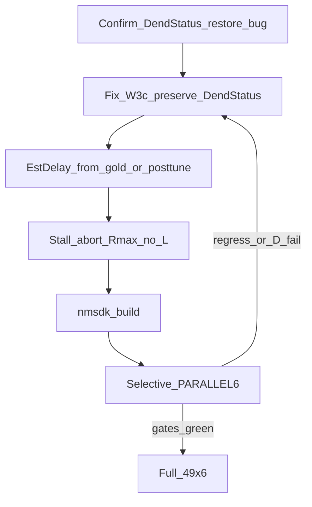

# План: W3c apply-fix + EstDelay harness + stall-abort

База (selective `da3a6424…`): keep **9/9 PASS**; D-якоря FAIL (`pa00`/`tn`/`psi`/`phase6_*` TipR@`1e11`); objective FAIL ок. Коммиты WIP: PulseLib `162e7c9`, Bin `d9a378d`, root `6dbd0cd`.

Наследует контракт из [d_rmax_length_escape](/home/user/.cursor/plans/d_rmax_length_escape_1d50f760.plan.md) и [softcold_parallel_rematrix](/home/user/.cursor/plans/softcold_parallel_rematrix_eb3445a3.plan.md): SoftCold Need→0 + tipr canon + gate **без** ослабления LandscapeOk/Acc/fires; W3 hold R при `dt<0@Rmax` сохранить; latched R-descent / Done@Rmax / blind Rmax→Rmin — запрещены; full 49 только после зелёного selective; не `--use-archive-inplace` / `--allow-salvage` в матрице; registry apply только после full.

**Вердикт principality:** найденные баги **не** принципиальные пределы алгоритма — (1) W3c не доезжает до Apply; (2) EstDelay не попадает в SoftCold-source work. Физика L-attenuation остаётся валидной гипотезой после починки apply.



---

## 0. Findings (исследование закрыто достаточно для фикса)

### F1 — W3c arm не доходит до ApplyPending (главный C++)

В [`NNeuronTimeLearner.cpp`](Libraries/Nmsdk-PulseLib/Core/NNeuronTimeLearner.cpp):

- W3c ставит `DendStatus[num]=1` + `RmaxOvershootLengthGrow=true` (~907–912).
- Конец `ChangeSynapseResistanceStatus` **всегда** делает `DendStatus[num] = dendstatus` (**1052**), где `dendstatus` снят на входе (**677**) — после `DendStatus.assign(0)` в Finish (**4989**) это **0**.
- `ApplyPendingDendriteLengthChanges`: флаг обходит settle-clear, но **`if(!DendStatus[i]) continue`** (**2846**) — grow не применяется.
- Twin: тот же restore в Branch (~1159) + Apply `!DendStatus` (~3243).

На active дополнительно: `ChangeDendriteStatus` может оставить `DendStatus=-1` → `ready_for_r_tune=false` (**784–788**) → W3c не крутится на этой dendrite в тике (вторично).

**Не** MaxL=100 (L=49≪100). Anti-shrink уже закрыл откат +ΔL; текущий L=gold = **нет apply**, не (C).

### F2 — EstDelay «0.005» не Python-overwrite

[`CASES["phase6_480"]`](Bin/Configs/SpikeSamples/StructTrain/scripts/posttune_verify.py) `root` = **`EXP_480_gen_posttune`** (тега нет), `gold` = tiprmin (0.01). Cold reset тег не трогает; NM `-S` пишет C++ default **`kDelayPerSegDefault=0.005`**. Патч tiprmin не влияет на SoftCold-source. `tn_classic` / `pa00` с 0.01 в архиве — EstDelay OK (L=`49…`).

### F3 — Harness ждёт часами при Need=1 freeze

[`wait_need0`](Bin/Configs/SpikeSamples/StructTrain/scripts/posttune_verify.py): early-stop только при Need=0; slog abort по GiB; **нет** abort TipR@Rmax + L stagnant. `max_polls=401` × 30s ≈ wall ceiling.

---

## 1. C++ — сохранить forced grow DendStatus

Файлы: [`NNeuronTimeLearner.cpp`](Libraries/Nmsdk-PulseLib/Core/NNeuronTimeLearner.cpp), [`NNeuronTimeLearnerBranch.cpp`](Libraries/Nmsdk-PulseLib/Core/NNeuronTimeLearnerBranch.cpp) (тот же паттерн).

```text
# ChangeSynapseResistanceStatus — перед каждым early return и финальным restore:
# вместо слепого DendStatus[num] = dendstatus:

IF RmaxOvershootLengthGrow[num]:
  DendStatus[num] = 1          # forced grow must survive to ApplyPending
ELSE:
  DendStatus[num] = dendstatus

# ApplyPending (defense in depth):
IF DendStatus[i]==0 AND RmaxOvershootLengthGrow[i]:
  DendStatus[i] = 1            # then fall through to +delta=1 path
# keep: settle bypass, delta=1, skip Feedforward, no shrink@Rmax
```

Все ветки с `DendStatus[num]=dendstatus` в этой функции (вкл. ref-dend / early exits) — проверить, чтобы forced grow не сбрасывался.

Запреты кода (из прошлых планов): не any-dt / latched Rmax down; не blind Rmin; не Done@Rmax с non-canon TipR; не midband_walk в Branch ActivePulse path.

Build: `nmsdk-build` → один SHA Console+PulseLib для selective и full.

---

## 2. Harness — EstDelay для SoftCold-source

Предпочтительно **не** менять `root` case на tiprmin (могут отличаться PostTune-теги).

В [`repro_cold_lib.py`](Bin/Configs/SpikeSamples/StructTrain/scripts/repro_cold_lib.py) + вызов из [`posttune_verify.py`](Bin/Configs/SpikeSamples/StructTrain/scripts/posttune_verify.py) `run_case` **после** `soft_cold_reset_train`:

```text
sync_estdelay_from_gold(work_train, gold_train):
  if gold has EstDelayPerSeg AND work missing tag (or work empty/0):
    set_tag_all Parameters+Model from gold value
  # do NOT overwrite existing non-default EstDelay already in work
```

Дополнительно: расширить [`patch_phase6_tn_estdelay.py`](Bin/Configs/SpikeSamples/StructTrain/scripts/patch_phase6_tn_estdelay.py) на **`EXP_480_gen_posttune`** Train (0.01), чтобы архив сам был полным.

Smoke: work после cold для `phase6_480` содержит `EstDelayPerSeg=0.01` **до** NM; после короткого autosave не откатывается к 0.005.

---

## 3. Harness — stall-abort TipR@Rmax без прогресса L

В `wait_need0` / `poll_params_snapshot` ([`posttune_verify.py`](Bin/Configs/SpikeSamples/StructTrain/scripts/posttune_verify.py)):

```text
# defaults (CLI override):
STALL_AUTOSAVE_N = 8          # consecutive autosave_seen
# on each autosave_seen:
#   tip_at_rmax = any TipR >= 0.99 * ResistanceMax (from Parameters)
#   L_unchanged vs previous autosave L vector
# if tip_at_rmax AND L_unchanged for N autosaves AND Need!=0:
#   terminate NM; train_status = abort_tipr_rmax_stall; rc non-zero
# do NOT treat objective controls specially — same abort (faster FAIL ok)
```

Кирпичи: уже есть `autosave_seen`, TipR/L в poll, pattern slog abort terminate, Rmax check как в `reset_pathological_tip.py`. Unit-тест на счётчик (mock snapshots).

Параллельный оркестратор: `--no-result-md`, unique workdirs, `SKIP_REGISTRY_APPLY=1` на selective (уже в [`softcold_full_matrix_parallel.sh`](Bin/Configs/SpikeSamples/StructTrain/scripts/softcold_full_matrix_parallel.sh)).

---

## 4. Selective retest (ворота перед full)

Manifest: [`_repro/SOFTCOLD_D_ESCAPE_SELECTIVE_manifest.txt`](Bin/Configs/SpikeSamples/StructTrain/_repro/SOFTCOLD_D_ESCAPE_SELECTIVE_manifest.txt) (~17). `PARALLEL=6`, `SKIP_REGISTRY_APPLY=1`, не затирать `SOFTCOLD_HEAD_rcs.txt`.

| Блок | Критерий зелёно |
|------|-----------------|
| Keep + rematrix control | rc=0 все (`asym50`…`fs25_preinh`, `br25_off`) |
| EstDelay L | `pa00`/`thr_only`/`tn`/`phase6_480`: L≠`97 81 49`; `phase6_480` work EstDelay=0.01 |
| D-фиксы | нет вечного TipR@`1e11` без роста L; count `85000000000` ping-pong=0; желательно TipR сход / Need→0 ≥1 якорь |
| Objective | `br25_on`/`fs50_preinh`/`asym25` FAIL ок; гейт не трогать |

Регресс keep / L→97 / ping-pong → стоп, правка, **только selective** заново.

Evidence: дописать [`AMPNORM_D_RMAX_LENGTH_ESCAPE.ru.md`](Docs/Audit/TimeLearner-2026-09-26-review/evidence/AMPNORM_D_RMAX_LENGTH_ESCAPE.ru.md) (DendStatus restore + EstDelay posttune + stall-abort).

---

## 5. Full SoftCold 49×6 (только после ворот)

Тот же SHA; backup `SOFTCOLD_HEAD_rcs_before_*`; `PARALLEL=6`; merge RCS → один apply registry; аудит корзин; gitlinks по запросу. Keep-регресс на full → стоп → selective → fix.

---

## 6. Критерии готовности

**После selective:** keep зелёные; EstDelay L OK на phase6_480; D без eternal freeze (есть +L и/или сход TipR); stall-abort срабатывает на D-fail за минуты, не часы; objective не «починены» гейтом.

**После full:** 49/49 один SHA; RCS+registry; §4/A/Landscape/N/G не ослаблены.

---

## Вне скоупа

- Ослабление LandscapeOk / Acc / fires (`br25_on`, `fs50_preinh`, silent-mid gen).
- Flat TipR protocol (`asym25`, nextseg), G keep/search.
- Branch `br480_*` Need=1 (отдельный слот).
- Latched R-descent / any-dt Rmax down / Done@Rmax non-canon.
- Full 49 до зелёного selective; push без просьбы.
