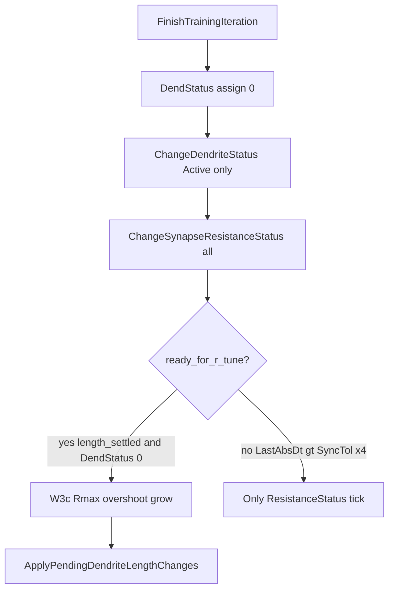

# W3d: Rmax-overshoot escape без length_settled

## Диагноз (D3 evidence + код)

Финальное состояние D-якорей (`pa00`, `phase6_*`, `tn`, `psi01`):

- TipR ≈ `3.15e9 · 1e11 · 4.95e7 · 8.6e7`, L=`97 51 25 1` (MaxL=100)
- Live: `amp_dt ≈ -7e-6 | **-0.011** | +4.7e-6 | 0`, `last_abs_dt ≈ 0.465 | **0.0855** | 0.0145 | …`
- Harness: `ABORT TipR@Rmax stall` → gate silent mid → SoftCold FAIL

Корень в [`ChangeSynapseResistanceStatus`](Libraries/Nmsdk-PulseLib/Core/NNeuronTimeLearner.cpp):

```793:798:Libraries/Nmsdk-PulseLib/Core/NNeuronTimeLearner.cpp
 const bool ready_for_r_tune = length_settled && !DendStatus[num];
 if(!ready_for_r_tune)
 {
  ResistanceStatus[num] = (fabs(dt) > eps) ? 1 : 0;
 }
```

Ветка W3c (Rmax dwell → `RmaxOvershootLengthGrow` / `DendStatus=1`) живёт **только** внутри `else if(fabs(dt) > eps)` при `ready_for_r_tune`.

`length_settled` при TipR@Rmax: `LastAbsDt ≤ SyncTol × kRminLengthTolFactor` (default `0.02 × 4 = 0.08`). У **d1** `LastAbsDt≈0.0855` → чуть выше порога → **escape не армится**, TipR остаётся на ceiling, L1 заморожен. Length-escape на d0 успевал, пока settle ещё проходил; multi-dend застревает.



Объективный FAIL [`br25_on`](Docs/Audit/TimeLearner-2026-09-26-review/evidence/A_NONSEPARABLE_MID.ru.md): TipR canon, `landscape_ok=0` / silent mid — **вне скоупа**, LandscapeOk не ослаблять.

## Целевая правка C++ (W3d)

**Решение:** вынести армирование Rmax-overshoot length-escape **из-под** `ready_for_r_tune`, сохранив ограничения: TipR@Rmax, `dt < -eps`, `L < MaxL`, cooldown/`rmax_dwell`, anti-shrink @Rmax, `restore_dend_status`, defense в `ApplyPending`.

Файлы (twin):

- [`NNeuronTimeLearner.cpp`](Libraries/Nmsdk-PulseLib/Core/NNeuronTimeLearner.cpp) — `ChangeSynapseResistanceStatus`
- [`NNeuronTimeLearnerBranch.cpp`](Libraries/Nmsdk-PulseLib/Core/NNeuronTimeLearnerBranch.cpp) — тот же контракт

Конкретная структура (без расширения `kRminLengthTolFactor` как основного рычага):

1. После вычисления `dt`, `r_old`, `at_r_max`: если `at_r_max && dt < -eps` — инкремент dwell/cooldown и при пороге выставить `DendStatus=1` + `RmaxOvershootLengthGrow=true` (как сейчас в W3c else-ветке), **даже если** `!ready_for_r_tune`.
2. Обычный R-tune (`damped-P`, midband, W1@Rmin, W3 undershoot down-step) по-прежнему только при `ready_for_r_tune`.
3. Не трогать LandscapeOk / gate / expect для NonSeparable.

Сборка: skill `nmsdk-build` → новый Console SHA.

Диагностика до/после на одном якоре: `EnableDebug=1` на `pa00` (короткий прогон) — в логе должны появиться `RmaxOvershoot→length+` для **num=1** при LastAbsDt>0.08.

Документ: дополнить [`AMPNORM_D_RMAX_LENGTH_ESCAPE.ru.md`](Docs/Audit/TimeLearner-2026-09-26-review/evidence/AMPNORM_D_RMAX_LENGTH_ESCAPE.ru.md) секцией W3d + ссылкой на D3 evidence.

## Частичные эксперименты (запускать)

Пороги: keep остаются PASS; D-якоря — TipR уходит с ceiling / Need→0 / gate по контракту case; objective control — **ожидаемый FAIL**, не регрессия-критерий.

| Волна | Manifest | PARALLEL | Зачем |
|-------|----------|----------|-------|
| **P0 smoke** | `pa00_baseline` (+ debug) | 1 | подтвердить arming grow на d1 |
| **P1 D-core** | `pa00`, `phase6_thr_only`, `phase6_480`, `tn_classic`, `psi01_050` | 4–6 | закрытие D после W3d |
| **P2 keep** | `asym50`, `ltz50_gen`, `br50_gen`, `fs25_gen`, `br25_off`, `asym50_preinh`, `asym25_preinh` | 6 | регресс зелёных |
| **P3 branch twin** | `br50_preinh` (keep-ish) | 1–2 | Branch twin ApplyPending |
| **P4 objective control** | `br25_on`, `fs50_preinh`, `asym25` | 3 | убедиться, что FAIL тот же класс (N/flat), не новый D |

Harness: `SKIP_REGISTRY_APPLY=1`, `STALL_AUTOSAVE_N=8`, существующий `softcold_full_matrix_parallel.sh` + RCS в `_repro/rcs_w3d_*`. Full 49 и registry apply — **не** в этих волнах.

Критерий перехода дальше: P1 ≥4/5 D PASS (или явное улучшение TipR/Need без stall@1e11) **и** P2 keep 7/7 PASS. Иначе — итерация C++ (не крутить stall/train_t как «фикс»).

## Полная матрица тестирования (составить, **не запускать** — отложено)

После зелёных P1+P2 зафиксировать файл `_repro/SOFTCOLD_W3d_FULL_matrix_plan.txt` (или обновить audit), без запуска:

**Включить в прогон (когда откроют ворота):** полная SoftCold queue ~49 из [`SOFTCOLD_QUEUE_manifest.txt`](Bin/Configs/SpikeSamples/StructTrain/_repro/SOFTCOLD_QUEUE_manifest.txt) + D-якоря из audit §4.1.

**Ожидаемый PASS (ворота registry):** keep + ранее зелёные rematrix + D, которые стали PASS на P1.

**Ожидаемый FAIL / не ослаблять ворота (оставить в матрице как control, не как цель чинить):**

- NonSeparable / Landscape: `br25_on` (+ при необходимости `fs50_preinh` как C/E overlap)
- Flat TipR протокол: `asym25`, `br50_nextseg`, `br100_nextseg`
- Keep/Search режимы: `br100_keep`, `br100_search` (корзина G)

**Кандидаты на исключение из «must-green» отчёта (в матрице пометить `expect_fail` / `protocol`, не дропать молча):** nextseg / Keep-Search / NonSeparable выше.

**Добавить явно (если не в queue):** повтор D-core из P1 как якоря в шапке отчёта; при необходимости `phase6_preinh250` / `phase6_ltzcal_twin` как соседние D из audit §4.1.

**После успешного full (отложено):** RCS backup HEAD → registry apply один раз → audit rebucket → gitlinks по запросу.

## Вне скоупа

- Ослабление LandscapeOk / Acc / fires
- «Фикс» `br25_on` / silent-mid NonSeparable
- Full 49×6 и registry до зелёного P1+P2
- Поднятие MaxL / stall_n / train_t как замена C++ fix
