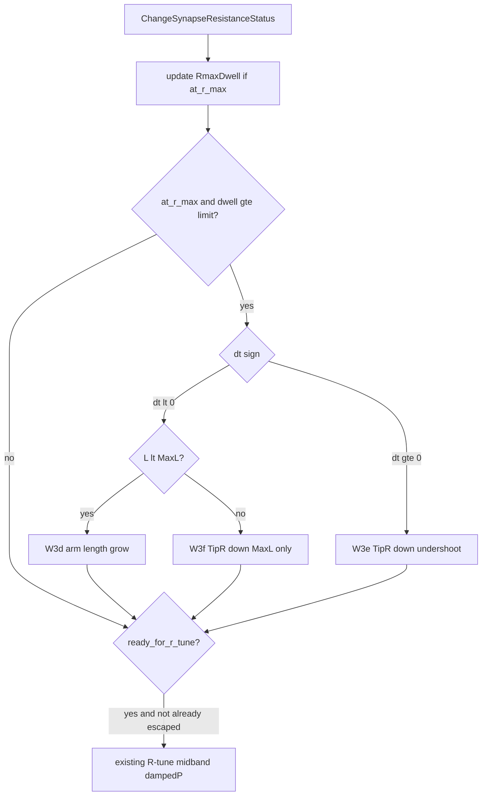

# W3e/W3f: TipR сходит с Rmax после length-escape (детальный план)

## Коммиты (уже сделаны)

- PulseLib `c3b0226` — W3d
- Bin `217c065` — harness/RCS/manifests
- Root `f79083d` — audit doc + gitlinks

## История шагов (не повторять отвергнутое)

| Шаг | Что сделали | Результат / урок |
|-----|-------------|------------------|
| **W3** | Rmax dwell: down-step **только** при `dt≥0`; при `dt<0` — hold | Снята осцилляция `1e11↔0.85·Rmax`; D остался ceiling freeze |
| **latched R-descent** | Предлагали всегда понижать R при overshoot@Rmax | **Отклонено** — worse overshoot + конфликт W1@Rmin ([AMPNORM_D…](Docs/Audit/TimeLearner-2026-09-26-review/evidence/AMPNORM_D_RMAX_LENGTH_ESCAPE.ru.md)) |
| **W3c** | Length grow + `DendStatus` preserve + anti-shrink + skip feedforward @Rmax | Apply баг restore; после фикса grow apply’ится |
| **W3d** | Arm length-escape **до** `ready_for_r_tune` при `dt<0` | L растёт (`97 82`, psi `100 100`); TipR всё ещё `1e11` |
| **P12** | Keep 8/8 PASS; D 0/5 | У 4/5 D уже **undershoot** (`amp_dt>0`) при огромном `LastAbsDt` → W3 down-step не вызывается |

Константы (не менять без отдельного обоснования): `kNoImproveResistanceLimit=3`, `kRmaxOvershootLengthCooldown=3`, `kMidbandRminStep=0.15`, `SyncTol×4=0.08` для settle.

## Диагноз P12

| case | TipR | L | amp_dt | LastAbsDt | блокер |
|------|------|---|--------|-----------|--------|
| `pa00` / `phase6_*` / `tn` | `1e11×2` | `97 82 25 1` | **`+` undershoot** | `~0.47 / 0.40` | down-step только при `ready_for_r_tune` |
| `psi01_050` | `1e11×2` | **`100 100` MaxL** | **`-` overshoot** | `~0.23 / 0.31` | W3d не растит; W3 hold запрещает down |



## Ограничения (наследуем)

- LandscapeOk / Acc / fires **не** ослаблять
- Objective FAIL не чинить: `br25_on`, `fs50_preinh`, `asym25`
- Full 49 + registry — только после зелёных D-core + keep
- Не маскировать `MaxL` / `stall_n` / `train_t` вместо C++
- Twin: base ([`NNeuronTimeLearner.cpp`](Libraries/Nmsdk-PulseLib/Core/NNeuronTimeLearner.cpp)) + Branch
- Keep зелёные — жёсткий регресс-критерий (см. ниже)

## Псевдокод целевого блока

Вставить **сразу после** текущего обновления `rmax_dwell_w3` и **вместо/расширяя** блок `if (w3d_rmax_overshoot) { ... }` (~строки 813–858). Идентичная логика в Branch.

```text
# Inputs for dendrite num (already computed):
#   dt, eps, r_old, rmin_w3, rmax_w3, at_r_max_w3, rmax_dwell_w3
#   ready_for_r_tune, DendStatus[num], DendriteLength[num], MaxDendriteLength
#   RmaxOvershootLengthCooldown[num], RmaxOvershootLengthGrow[num]
# Flags set this call (init false):
#   escaped_rmax_this_call = false

step = max(kMidbandRminStep, kResistanceSettleRatio)   # 0.15
L = DendriteLength[num]
maxL = MaxDendriteLength
pending_grow = RmaxOvershootLengthGrow[num] || (DendStatus[num] == 1)
at_ceiling_dwell = at_r_max_w3
                 && (r_old > rmin_w3*(1+1e-6))
                 && (rmax_dwell_w3 >= kNoImproveResistanceLimit)

# ----- W3d: overshoot + room to grow L (UNCHANGED semantics) -----
if at_ceiling_dwell && (dt < -eps) && (L < maxL):
    RmaxDwellCount[num] = kNoImproveResistanceLimit   # latch
    ResistanceStatus[num] = 1
    if DendStatus[num] < 0: DendStatus[num] = 0
    cooldown++
    if cooldown >= kRmaxOvershootLengthCooldown:
        DendBestEffortSynced[num] = false
        DendStatus[num] = 1
        RmaxOvershootLengthGrow[num] = true
        cooldown = 0
        # ApplyPending still: keep TipR@Rmax, no feedforward
    escaped_rmax_this_call = true   # "handled" — not a TipR step, but skip generic !ready overwrite carefully
    # NOTE: do NOT TipR-down here (W3 hold / anti-oscillation)

# ----- W3f: overshoot + L exhausted (NEW, narrow) -----
else if at_ceiling_dwell && (dt < -eps) && (L >= maxL):
    # Only when length DOF is gone. NOT latched perpetual descent.
    RmaxDwellCount[num] = kNoImproveResistanceLimit
    ResistanceStatus[num] = 1
    cooldown++   # reuse RmaxOvershootLengthCooldown as TipR-step pacing
    if cooldown >= kRmaxOvershootLengthCooldown:
        r_new = ClampResistance(r_old * (1.0 - step))
        ApplyComputedResistance(num, r_old, r_new, default_gain)
        RmaxDwellCount[num] = 0          # must re-dwell before next step
        cooldown = 0
        NoImproveResistanceCount[num] = 0
        escaped_rmax_this_call = true
        # If TipR leaves Rmax: normal R-tune later when settled.
        # If re-climbs to Rmax with dt<0: wait full dwell+cooldown again
        #   (prevents 1e11↔0.85*Rmax every burst).
    else:
        escaped_rmax_this_call = true    # hold this burst (status=1)

# ----- W3e: undershoot @Rmax without ready_for_r_tune (NEW, primary) -----
else if at_ceiling_dwell && (dt >= 0.0) && !pending_grow && (DendStatus[num] == 0):
    # Same TipR action as legacy W3 undershoot branch, but BEFORE ready gate.
    # Guarantees: never fires on overshoot; never during pending length grow.
    r_new = ClampResistance(r_old * (1.0 - step))
    ApplyComputedResistance(num, r_old, r_new, default_gain)
    RmaxDwellCount[num] = 0
    NoImproveResistanceCount[num] = 0
    ResistanceStatus[num] = 1
    escaped_rmax_this_call = true

# ----- existing ready_for_r_tune cascade -----
if !ready_for_r_tune:
    if !escaped_rmax_this_call:
        ResistanceStatus[num] = (fabs(dt) > eps) ? 1 : 0
    # else: keep ResistanceStatus from W3d/e/f
else if same_pattern && |dt|<=eps:
    ...
else if pathological:
    ...
else if |dt| > eps:
    # W1 @Rmin — unchanged
    # W3 undershoot @Rmax when ready: SKIP if escaped_rmax_this_call
    #   (avoid double down-step same Finish)
    # W3d overshoot empty branch — already handled above
    # midband / damped-P — unchanged
...
restore_dend_status()   # still preserves DendStatus=1 if RmaxOvershootLengthGrow
```

### Инварианты (обязательные assert-комментарии в коде)

1. **W3 hold:** `dt < 0` && `L < MaxL` → **никогда** TipR-down (только length).
2. **W3f pacing:** TipR-down на overshoot@MaxL не чаще чем раз в `kRmaxOvershootLengthCooldown` Finish + полный re-dwell.
3. **W3e pending_grow:** не down-step, пока `DendStatus==1` или `RmaxOvershootLengthGrow` (сначала ApplyPending).
4. **ApplyPending Rmax grow:** по-прежнему keep TipR@Rmax / no feedforward (не возвращать feedforward).
5. **Branch twin:** тот же порядок веток; без midband-walk отличий в этом блоке.

## Антирегресс по экспериментам

### Must-PASS (волна P2) — стоп-кран при любом FAIL

`asym50`, `ltz50_gen`, `br50_gen`, `fs25_gen`, `br25_off`, `asym50_preinh`, `asym25_preinh`, `br50_preinh`

Риск W3e: короткий визит TipR@Rmax при ещё не settled length → ранний down-step. Митигация: `dwell≥3` + `!pending_grow` + `DendStatus==0`. Если keep краснеет — сузить W3e (например требовать `LastAbsDt ≤ SyncTol×kRminLengthTolFactor` **или** `dt ≤ kAmpOscillationBand`), не расширять W3f.

### Must-improve (волна P1 D-core)

`pa00_baseline`, `phase6_thr_only`, `phase6_480`, `tn_classic`, `psi01_050`

Критерий PASS ≥4/5: TipR ушёл с `1e11` на всех активных дендритах, Need→0, gate по контракту case.
`psi01` опирается на W3f; остальные — на W3e.

### Expect-FAIL control (P4) — класс FAIL не менять на D

`br25_on` (NonSeparable), `asym25` (flat), `fs50_preinh` (C/E) — по-прежнему FAIL; **не** TipR@Rmax stall как новый симптом.

### Запрещённые «фиксы» при регрессе

- Ослабить LandscapeOk / Acc / fires
- Поднять MaxL / stall_n / train_t вместо правки логики
- Вернуть unconditional TipR-down при overshoot && L&lt;MaxL
- Включить feedforward drop на W3d grow

## Частичные эксперименты

PARALLEL=6, `SKIP_REGISTRY_APPLY=1`, `STALL_AUTOSAVE_N=8`.

1. **P1** D-core (5) → ≥4/5 PASS
2. **P2** keep (8) → 8/8 PASS
3. **P4** objective (3) → expect FAIL, класс N/flat/C

Порог к full: P1+P2 зелёные. Иначе — только C++ итерация.

## Full matrix (отложено)

Обновить plan-файл `_repro/SOFTCOLD_W3e_FULL_matrix_plan.txt` (must_pass / expect_fail / protocol); **не запускать** до зелёных P1+P2. После успеха: RCS backup → registry apply один раз → audit → gitlinks по запросу.

## Документация

[`AMPNORM_D_RMAX_LENGTH_ESCAPE.ru.md`](Docs/Audit/TimeLearner-2026-09-26-review/evidence/AMPNORM_D_RMAX_LENGTH_ESCAPE.ru.md): секция W3e/W3f, таблица P12 amp_dt, ссылка на W3 hold, инварианты анти-осцилляции.
