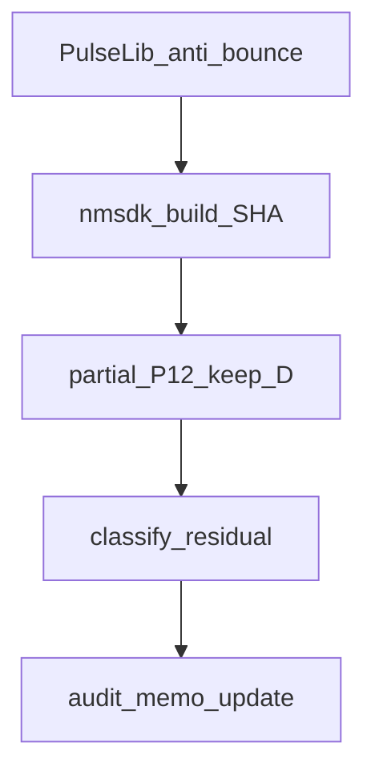

# Anti-bounce + objective FAIL (детализация код / конфиги / docs)

## Решения

- SoftCold: **Need→0 обязателен**; no always-success / no ослабление LandscapeOk/fires.
- Алгоритм: при TipR@Rmax и **перелёте** amp — **никогда** TipR-down (hold); length grow только пока `L < MaxL`.
- Residual Need=1 после anti-bounce → исследование **objective** (паттерн × Sync/EstDelay × режим), не ослабление порогов sync.

Keep×8 — стоп-кран. Full 49 — только после классификации residual.



---

## 1. Код (PulseLib)

### 1.1 Файлы

| Файл | Действие |
|------|----------|
| [`Libraries/Nmsdk-PulseLib/Core/NNeuronTimeLearner.cpp`](Libraries/Nmsdk-PulseLib/Core/NNeuronTimeLearner.cpp) | блок ~870–897 (`W3f`) |
| [`Libraries/Nmsdk-PulseLib/Core/NNeuronTimeLearnerBranch.cpp`](Libraries/Nmsdk-PulseLib/Core/NNeuronTimeLearnerBranch.cpp) | twin ~1061+ |
| Headers | комментарии к инварианту; **константы step/SyncTol/×4/L≥MaxL/2 не менять** |

Не трогать: `ApplyPendingDendriteLengthChanges` (Rmax grow keep TipR / no feedforward), midband, W1@Rmin, ready-path undershoot, `accept_run` Need.

### 1.2 Точечная правка (семантика)

**Сейчас** (`NNeuronTimeLearner.cpp` ~870–897):

```cpp
// W3f: overshoot + L exhausted — paced TipR down
else if(at_ceiling_dwell && (dt < -eps) && (L_w3 >= maxL_w3)) {
  ...
  r_new = ClampResistance(r_old * (1.0 - rmax_escape_step)); // ← bounce source
  ApplyComputedResistance(...);
}
```

**Станет:** та же ветка условий, но **без** `ApplyComputedResistance` / без сброса dwell в down-step:

```cpp
// Overshoot @Rmax with L exhausted: HOLD TipR (no paced down — sterile bounce).
else if(at_ceiling_dwell && (dt < -eps) && (L_w3 >= maxL_w3)) {
  RmaxDwellCount[num] = kNoImproveResistanceLimit; // latch
  ResistanceStatus[num] = 1;
  // optional: cooldown unused or kept for debug only
  escaped_rmax_this_call = true;
  // EnableDebug: AmpDtAudit RmaxMaxL hold dt<0 (no TipR step)
}
```

**Сохранить без изменений:**

- ветка `L < MaxL` + overshoot → length grow (`RmaxOvershootLengthGrow`) (~831–868);
- ветка undershoot `dt >= 0` + `L >= MaxL/2` + `!pending_grow` → TipR-down (~898–921) — единственный легальный спуск с потолка до ready;
- `if (!ready_for_r_tune) { if (!escaped...) ...}` и skip double-step в ready-path при `escaped_rmax_this_call`.

Инвариант в комментарии (base+Branch):
`dt < 0 && at_r_max → never TipR-down` (length DOF only if `L < MaxL`).

### 1.3 Сборка

Из корня Nmsdk (скилл nmsdk-build):

```bash
cmake --build build/linux-gcc-debug-local \
  --target Nmsdk-PulseLib.core NeuroModelerConsole -j"$(nproc)"
sha256sum Bin/Platform/Linux/NeuroModelerConsole | cut -c1-16
```

Зафиксировать SHA16 + `git -C Libraries/Nmsdk-PulseLib rev-parse --short HEAD` в log/memo (коммит — только по запросу).

---

## 2. Конфиги и harness (Bin / StructTrain)

### 2.1 Case → archive (не менять production XML в этой волне)

Определения: [`scripts/posttune_verify.py`](Bin/Configs/SpikeSamples/StructTrain/scripts/posttune_verify.py) `CASES` (~127–226).

| case | archive root | train_t | span |
|------|----------------|---------|------|
| `pa00_baseline` | `SelectivityPhaseA/EXP00_baseline` | 640 | 25 |
| `phase6_thr_only` | `SelectivityPhaseA/Phase6/EXP_480_gen_thr_only` | 900 | 480 |
| `phase6_480` | (см. CASES `phase6_480` ~137) Phase6 posttune | 900 | 480 |
| `tn_classic` | `TimeNeuronTimeLearner` | 640 | 25 |
| `psi01_050` | `SelectivityPresynapticInhib/EXP01_preinh_050` | 640 | 25 |
| `asym50` | `SelectivityAsymRm/EXP_span50ms_packA_gen_posttune` | 640 | 50 |
| `ltz50_gen` | `SelectivityLtzCalibrate/AsymRmLtzCal/EXP_span50ms_packA_gen` | 640 | 50 |
| `br50_gen` | `SelectivityBranch/EXP_br_span50_packA_gen_C1e9` | 320 | 50 |
| `fs25_gen` | `SelectivityFastSpan/EXP_span25ms_fast_C1e9` | 160 | 25 |
| + keep | `br25_off`, `asym50_preinh`, `asym25_preinh`, `br50_preinh` | … | … |

SoftCold идёт через `prepare_clean_case` + soft-cold reset ([`repro_cold_lib.py`](Bin/Configs/SpikeSamples/StructTrain/scripts/repro_cold_lib.py)) — production archives **не** мутировать (`--use-archive-inplace` запрещён).

### 2.2 Снимок Train Parameters (readonly baseline для objective)

Уже снято с archive Train (до soft-cold; soft-cold может переписать TipR/L, не обязательно Sync/EstDelay):

| case | MaxL | Rmax | SyncTol | EstDelay | Gain |
|------|------|------|---------|----------|------|
| D: pa00 / phase6_* / tn / psi01 | 100 | 1e11 | **0.02** | **0.01** | 0.4 |
| keep: asym50 / ltz50 | 100 | 1e11 | **~0.00208** | **0.002** | 0.4 |
| keep: fs25 | 100 | 1e11 | **~0.00104** | 0.005 | 0.4 |
| keep: br50 | 100 | 1e11 | **~0.00208** | (var) | 0.4 |

Вывод для трека objective: MaxL/Rmax **одинаковы**; отличаются **паттерн (span/preinh/Phase)** и **SyncTol/EstDelay**. Гипотеза objective — не «мало MaxL», а несовместимость динамики паттерна с AmpNorm+CanonRmin при потолочном перелёте.

Diagnostic work-clone (только если residual после anti-bounce = hold@MaxL+перелёт): один клон под `_repro/diag/` с `MaxL`↑ **или** EstDelay/Sync как у asym50 — **не** правка archive, **не** SoftCold PASS при Need=1.

### 2.3 Manifests / RCS / запуск

Создать (по аналогии с W3e):

- [`Bin/.../_repro/SOFTCOLD_ANTIBOUNCE_P12_manifest.txt`](Bin/Configs/SpikeSamples/StructTrain/_repro/SOFTCOLD_ANTIBOUNCE_P12_manifest.txt) — те же 13 case, что [`SOFTCOLD_W3e_P12_manifest.txt`](Bin/Configs/SpikeSamples/StructTrain/_repro/SOFTCOLD_W3e_P12_manifest.txt)
- `_repro/SOFTCOLD_ANTIBOUNCE_P4_manifest.txt` — `br25_on`, `fs50_preinh`, `asym25` (expect FAIL)
- опционально `_repro/SOFTCOLD_ANTIBOUNCE_FULL_matrix_plan.txt` — deferred, не запускать

```bash
cd Bin/Configs/SpikeSamples/StructTrain
PARALLEL=6 STALL_AUTOSAVE_N=8 SKIP_REGISTRY_APPLY=1 \
MANIFEST=_repro/SOFTCOLD_ANTIBOUNCE_P12_manifest.txt \
RCS=_repro/SOFTCOLD_ANTIBOUNCE_P12_rcs.txt \
LOG=.../evidence/metrics/SOFTCOLD_antibounce_P12.log \
bash scripts/softcold_full_matrix_parallel.sh
```

Критерии:

- keep: rc=0 на всех 8 (при CSV flake — retry PARALLEL=2 как W3e).
- D: в AUTOSAVE **нет** (или ≪1%) mixed TipR `1e11`+`8.5e10`; доля wall-time ceiling-хвоста падает vs P12b.
- P4: по-прежнему FAIL своего класса (не новый TipR@Rmax stall как единственный симптом).

`EXPERIMENTS.md` / registry — **не** apply (`SKIP_REGISTRY_APPLY=1`).

---

## 3. Документация

| Документ | Содержание |
|----------|------------|
| **новый** [`Docs/.../evidence/AMPNORM_THRESHOLDS_AND_OSCILLATION.ru.md`](Docs/Audit/TimeLearner-2026-09-26-review/evidence/AMPNORM_THRESHOLDS_AND_OSCILLATION.ru.md) | §A пороги (SyncTol/×4/step/dwell/L≥MaxL/2) + почему не relax; §B oscillation=waste (PASS keep vs D); §C явно no SoftCold without Need=0 |
| **обновить** [`AMPNORM_D_RMAX_LENGTH_ESCAPE.ru.md`](Docs/Audit/TimeLearner-2026-09-26-review/evidence/AMPNORM_D_RMAX_LENGTH_ESCAPE.ru.md) | секция anti-bounce: W3f removed; hold@MaxL+overshoot; таблица P12 antibounce; residual class |
| **обновить** [`SOFTCOLD_CONVERGENCE_AUDIT.ru.md`](Docs/Audit/TimeLearner-2026-09-26-review/evidence/SOFTCOLD_CONVERGENCE_AUDIT.ru.md) §4.1 D | разбить D на waste (исправлен bounce) / objective (hold+перелёт@MaxL) / algo_open |
| metrics logs | `SOFTCOLD_antibounce_P12.log`, `_P4.log` под `evidence/metrics/` |
| plan file FULL | `_repro/SOFTCOLD_ANTIBOUNCE_FULL_matrix_plan.txt` — текст only, launch deferred |

Не писать в SUCCESSFUL_EXPERIMENTS / EXPERIMENTS без зелёного D или явной пометки objective + запроса на registry.

---

## 4. Классификация residual (после partial)

Для каждого D-case по финальному SNAP:

| Метка | Условие |
|-------|---------|
| `D_waste_fixed` | bounce исчез; TipR ушёл с потолка и/или Need→0 |
| `D_objective` | TipR hold@Rmax, amp перелёт, `L≥MaxL`, Need=1, keep зелёный |
| `D_algo_open` | bounce исчез, но TipR всё ещё ceiling при `L<MaxL` или недолёт не открывается — нужен следующий C++ (не SyncTol relax) |

Objective подтверждать строкой в memo: таблица Sync/EstDelay/span vs keep + «DOF длины исчерпан».

---

## 5. Порядок исполнения

1. Memo §A–B–C (можно до/параллельно с кодом).
2. C++ anti-bounce + Branch twin + build.
3. Manifests + P12 partial + при необходимости P2 retry keep.
4. P4 control.
5. Таблица residual + обновление AMPNORM_D + audit §4.1.
6. Full 49 — только по критерию из overview.

## Вне скоупа

Always-success SoftCold; gate_probe как PASS; правка production MaxL/Sync в archives; ослабление expect_fires / LandscapeOk; фикс `br25_on` NonSeparable.
