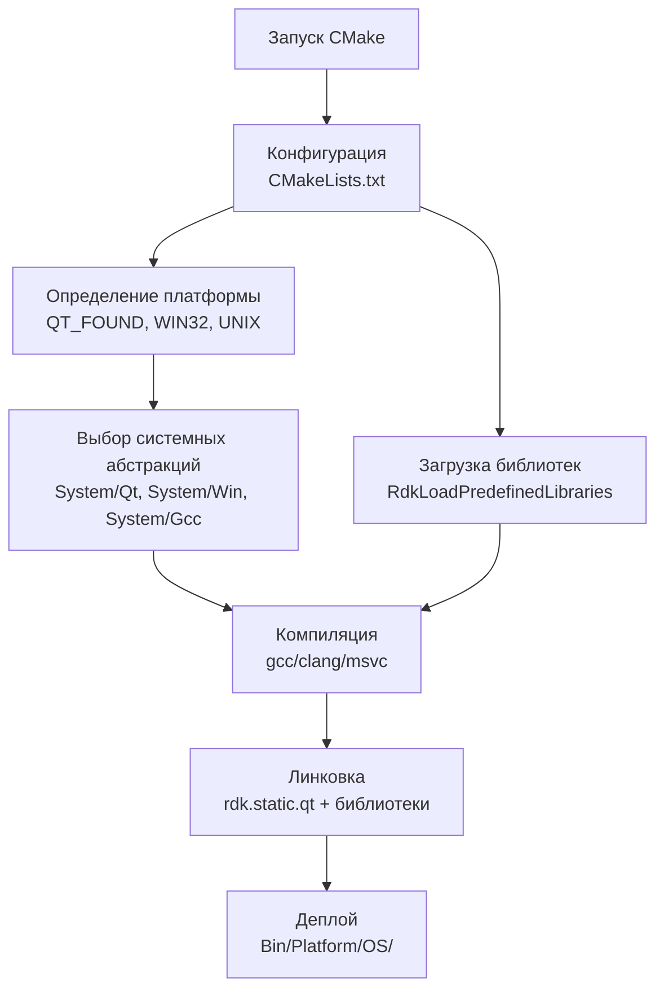
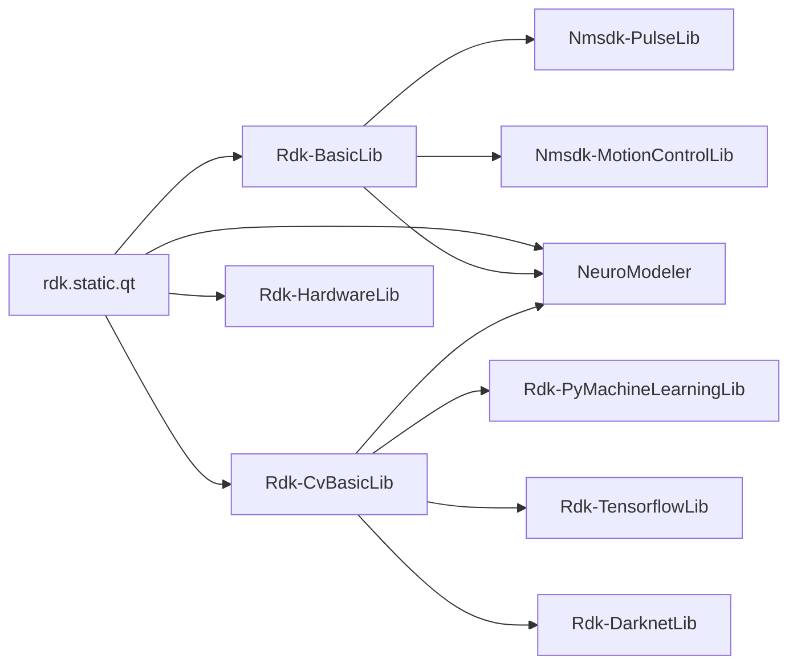

# Система сборки (Build System)

## RU

### Обзор

Проект Nmsdk использует **CMake** как основную систему сборки. Проект поддерживает сборку на платформах Linux и Windows.

### Основные настройки

- **Минимальная версия CMake:** 3.16
- **Стандарт C++:** C++20
- **Поддержка Qt5:** AUTOMOC, AUTOUIC, AUTORCC
- **Платформы:** Linux и Windows

### Структура сборки

Все скомпилированные файлы размещаются в:
- **Исполняемые файлы:** `Bin/Platform/<OS>/`
- **Библиотеки:** `Bin/Platform/<OS>/Lib.CMake/`

### Основные цели сборки

- `rdk.static.qt` - статическая библиотека ядра Rdk
- `Rdk-BasicLib.qt` - базовая библиотека
- `Rdk-CvBasicLib.qt` - библиотека компьютерного зрения
- `Rdk-HardwareLib.qt` - библиотека работы с железом
- `Nmsdk-MotionControlLib.qt` - библиотека управления движением
- `Nmsdk-PulseLib.qt` - библиотека импульсных нейросетей
- Приложения: NeuroModeler, NeuroModelerConsole

### Процесс сборки

```bash
# 1. Конфигурация
mkdir build
cd build
cmake ..

# 2. Сборка
cmake --build .
# или
make
# или (на Windows)
cmake --build . --config Release
```

**Процесс сборки:**



**Зависимости между модулями:**



### Зависимости

**Обязательные:**
- Qt5 (Core)
- C++20 компилятор (GCC, Clang, MSVC)

**Опциональные:**
- OpenCV - для Rdk-CvBasicLib
- Python - для Rdk-PyMachineLearningLib
- TensorFlow - для Rdk-TensorflowLib
- Darknet - для Rdk-DarknetLib
- ODE Solver - для Nmsdk-PulseLib

### Опции CMake

- `RDK_USE_PYTHON` - включить поддержку Python
- `RDK_USE_TENSORFLOW` - включить поддержку TensorFlow
- `RDK_USE_DARKNET` - включить поддержку Darknet
- `RDK_USE_ODESOLVER` - включить поддержку ODE Solver

### См. также

- [Cross-Platform Support](Cross-Platform.md)
- [Build Windows](Build-Windows.md)
- [Build Linux](Build-Linux.md)
- [Reports/10-Build-System.md](../../Reports/10-Build-System.md) - детальное описание

---

## EN

### Overview

The Nmsdk project uses **CMake** as the main build system. The project supports building on Linux and Windows platforms.

### Main Settings

- **Minimum CMake version:** 3.16
- **C++ standard:** C++20
- **Qt5 support:** AUTOMOC, AUTOUIC, AUTORCC
- **Platforms:** Linux and Windows

### Build Structure

All compiled files are placed in:
- **Executables:** `Bin/Platform/<OS>/`
- **Libraries:** `Bin/Platform/<OS>/Lib.CMake/`

### Main Build Targets

- `rdk.static.qt` - static Rdk core library
- `Rdk-BasicLib.qt` - basic library
- `Rdk-CvBasicLib.qt` - computer vision library
- `Rdk-HardwareLib.qt` - hardware library
- `Nmsdk-MotionControlLib.qt` - motion control library
- `Nmsdk-PulseLib.qt` - spiking neural networks library
- Applications: NeuroModeler, NeuroModelerConsole

### Build Process

The build process follows these steps:
1. **Configuration**: CMake analyzes `CMakeLists.txt` files and detects platform, dependencies, and build options
2. **Platform Detection**: Determines which system abstraction implementation to use (Qt/Win/Gcc)
3. **Compilation**: Compiles all source files with C++20 standard
4. **Linking**: Links libraries and executables together
5. **Deployment**: Copies binaries and resources to `Bin/Platform/<OS>/`

The flowchart in the Russian section illustrates the complete build pipeline, including the selection of system abstractions and the dependency chain between modules.

### Dependencies

**Required:**
- Qt5 (Core)
- C++20 compiler (GCC, Clang, MSVC)

**Optional:**
- OpenCV - for Rdk-CvBasicLib
- Python - for Rdk-PyMachineLearningLib
- TensorFlow - for Rdk-TensorflowLib
- Darknet - for Rdk-DarknetLib
- ODE Solver - for Nmsdk-PulseLib

### CMake Options

- `RDK_USE_PYTHON` - enable Python support
- `RDK_USE_TENSORFLOW` - enable TensorFlow support
- `RDK_USE_DARKNET` - enable Darknet support
- `RDK_USE_ODESOLVER` - enable ODE Solver support

### See Also

- [Cross-Platform Support](Cross-Platform.md)
- [Build Windows](Build-Windows.md)
- [Build Linux](Build-Linux.md)
- [Reports/10-Build-System.md](../../Reports/10-Build-System.md) - detailed description
