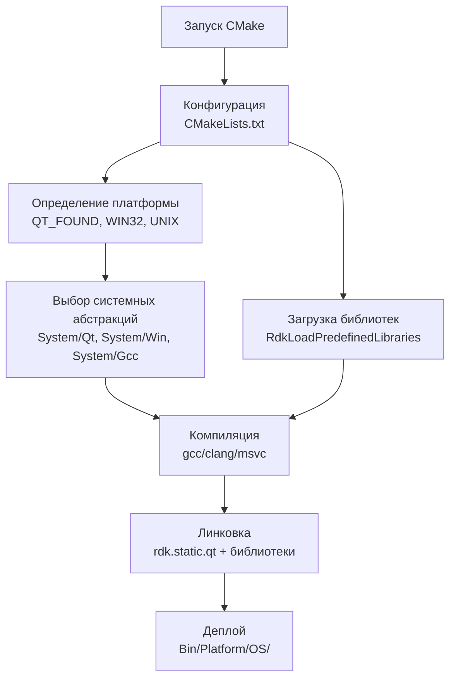
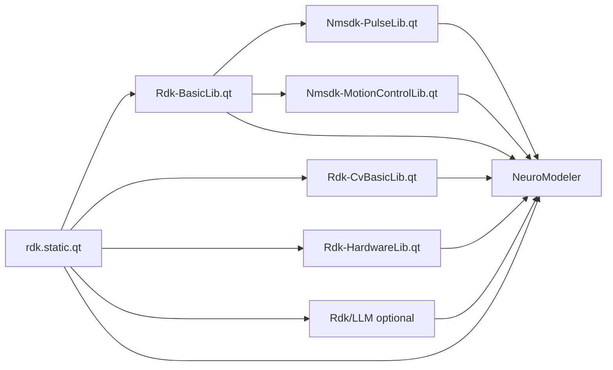

# Система сборки (Build System)

## RU

### Обзор

Проект Nmsdk использует **CMake** как основную систему сборки. Проект поддерживает сборку на платформах Linux и Windows.

### Основные настройки

- **Минимальная версия CMake:** 3.16
- **Стандарт C++:** C++20
- **Поддержка Qt5:** AUTOMOC, AUTOUIC, AUTORCC
- **Платформы:** Linux и Windows

### Структура сборки

Все скомпилированные файлы размещаются в:
- **Исполняемые файлы:** `Bin/Platform/<OS>/`
- **Библиотеки:** `Bin/Platform/<OS>/Lib.CMake/`

### Основные цели сборки

- `rdk.static.qt` — статическая библиотека ядра Rdk (+ Qt GUI в `Rdk/GUI/Qt`)
- `Rdk-BasicLib.qt`, `Rdk-CvBasicLib.qt`, `Rdk-HardwareLib.qt` — библиотеки компонентов
- `Rdk-HardwareLib.gui`, `Rdk-BasicLib.gui`, … — Qt-формы компонентов (registration units)
- `Nmsdk-MotionControlLib.qt`, `Nmsdk-PulseLib.qt` — SNN и motion control
- Приложения: `NeuroModeler`, `NeuroModelerConsole`
- LLM (при `RDK_USE_LLM=ON`): модуль `Rdk/LLM`, GUI dock; утилита `llm-index-pack` — индекс документации для ассистента

### Процесс сборки

```bash
# 1. Конфигурация
mkdir build
cd build
cmake ..

# 2. Сборка
cmake --build .
# или
make
# или (на Windows)
cmake --build . --config Release
```

**Процесс сборки:**



**Зависимости между модулями:**



### Зависимости

**Обязательные:**
- Qt5 (Core)
- C++20 компилятор (GCC, Clang, MSVC)

**Опциональные:**
- OpenCV - для Rdk-CvBasicLib
- ODE Solver - для Nmsdk-PulseLib

### Опции CMake и preset-ы

Ключевые флаги сборки задаются **в одном месте** — hidden preset `nmsdk-global-defaults` в [`CMakePresets.json`](../../CMakePresets.json). Все платформенные preset-ы (`win-msvc-base`, `win-vs2019-base`, `win-vs2022-base`, `linux-gcc-debug`) наследуют его через `"inherits": ["nmsdk-global-defaults"]`.

Тот же набор опций объявлен в [`cmake/RdkDefines.cmake`](../../cmake/RdkDefines.cmake) как `option()` и превращается в compile definitions. Это работает и при ручном `cmake ..` без preset-ов.

| Опция | Preset по умолчанию | Назначение |
|-------|---------------------|------------|
| `RDK_USE_LLM` | ON | Сборка `Rdk/LLM` и GUI dock ассистента |
| `RDK_USE_OPENCV` | ON | OpenCV для Rdk-CvBasicLib |
| `RDK_USE_ODESOLVER` | OFF | ODE solver в Nmsdk-PulseLib |
| `RDK_USE_PYTHON` | OFF | Deprecated: `Rdk-PyMachineLearningLib` (submodule absent) |
| `RDK_USE_DARKNET` | OFF | Deprecated: `Rdk-DarknetLib` (submodule absent) |
| `RDK_USE_TENSORFLOW` | OFF | Deprecated: `Rdk-TensorflowLib` (submodule absent) |
| `RDK_LLM_BUILD_EMBEDDED` | OFF | Встроенный llama.cpp (RDK LLM) |
| `RDK_UNICODE_RUN` | OFF | UTF-8 API (`RDK_UNICODE_RUN` define) |
| `NO_MOTION_CONTROL` | ON | Не регистрировать MotionControlLibrary в runtime |
| `NMSDK_PULSELIB_BUILD_CORE_ONLY` | OFF | PulseLib без Qt GUI helpers |
| `NMSDK_MOTIONCONTROLLIB_BUILD_CORE_ONLY` | OFF | MotionControlLib без Qt GUI helpers |
| `BUILD_TESTS` | ON | Юнит и интеграционные тесты |
| `NMSDK_FORCE_QT_FROM_VCPKG` | ON (Windows) | Принудительный Qt из vcpkg |

Legacy `.pro` files may still list ML libraries; see [Optional ML Libraries](../Libraries/Optional-ML-Libraries.md).

Параллельная сборка: `CMAKE_BUILD_PARALLEL_LEVEL` задаётся в `nmsdk-global-defaults` через `$env{NUMBER_OF_PROCESSORS}` и наследуется всеми preset-ами. На Linux переменная может быть не задана — CMake использует значение по умолчанию.

**После изменения флагов** нужен re-configure (в Qt Creator: «Run CMake» или очистка каталога `build/`). Иначе CMake cache сохранит старые значения.

Локальные override-ы без правки общего preset-а: необязательный `CMakeUserPresets.json` с `"inherits": ["win-vs2019-debug-localqt"]` и точечными `cacheVariables`.

### См. также

- [Cross-Platform Support](Cross-Platform.md)
- [Build Windows](Build-Windows.md)
- [Build Linux](Build-Linux.md)
- [Reports/10-Build-System.md](../../Reports/10-Build-System.md) - детальное описание

---

## EN

### Overview

The Nmsdk project uses **CMake** as the main build system. The project supports building on Linux and Windows platforms.

### Main Settings

- **Minimum CMake version:** 3.16
- **C++ standard:** C++20
- **Qt5 support:** AUTOMOC, AUTOUIC, AUTORCC
- **Platforms:** Linux and Windows

### Build Structure

All compiled files are placed in:
- **Executables:** `Bin/Platform/<OS>/`
- **Libraries:** `Bin/Platform/<OS>/Lib.CMake/`

### Main Build Targets

- `rdk.static.qt` — static Rdk core (+ `Rdk/GUI/Qt`)
- `Rdk-BasicLib.qt`, `Rdk-CvBasicLib.qt`, `Rdk-HardwareLib.qt` — component libraries
- `*.gui` targets — Qt component form registration units
- `Nmsdk-MotionControlLib.qt`, `Nmsdk-PulseLib.qt`
- Applications: `NeuroModeler`, `NeuroModelerConsole`
- With `RDK_USE_LLM=ON`: `Rdk/LLM` module and `llm-index-pack` documentation index tool

### Build Process

The build process follows these steps:
1. **Configuration**: CMake analyzes `CMakeLists.txt` files and detects platform, dependencies, and build options
2. **Platform Detection**: Determines which system abstraction implementation to use (Qt/Win/Gcc)
3. **Compilation**: Compiles all source files with C++20 standard
4. **Linking**: Links libraries and executables together
5. **Deployment**: Copies binaries and resources to `Bin/Platform/<OS>/`

The flowchart in the Russian section illustrates the complete build pipeline, including the selection of system abstractions and the dependency chain between modules.

### Dependencies

**Required:**
- Qt5 (Core)
- C++20 compiler (GCC, Clang, MSVC)

**Optional:**
- OpenCV - for Rdk-CvBasicLib
- ODE Solver - for Nmsdk-PulseLib

### CMake Options and Presets

Key build flags are defined **in one place** — hidden preset `nmsdk-global-defaults` in [`CMakePresets.json`](../../CMakePresets.json). All platform presets inherit it via `"inherits": ["nmsdk-global-defaults"]`.

The same options are declared in [`cmake/RdkDefines.cmake`](../../cmake/RdkDefines.cmake) as `option()` and become compile definitions. This also applies to manual `cmake ..` without presets.

| Option | Preset default | Purpose |
|--------|----------------|---------|
| `RDK_USE_LLM` | ON | Build `Rdk/LLM` and assistant GUI dock |
| `RDK_USE_OPENCV` | ON | OpenCV for Rdk-CvBasicLib |
| `RDK_USE_ODESOLVER` | OFF | ODE solver in Nmsdk-PulseLib |
| `RDK_USE_PYTHON` | OFF | Deprecated: `Rdk-PyMachineLearningLib` (submodule absent) |
| `RDK_USE_DARKNET` | OFF | Deprecated: `Rdk-DarknetLib` (submodule absent) |
| `RDK_USE_TENSORFLOW` | OFF | Deprecated: `Rdk-TensorflowLib` (submodule absent) |
| `RDK_LLM_BUILD_EMBEDDED` | OFF | Embedded llama.cpp (RDK LLM) |
| `RDK_UNICODE_RUN` | OFF | UTF-8 API (`RDK_UNICODE_RUN` define) |
| `NO_MOTION_CONTROL` | ON | Skip MotionControlLibrary runtime registration |
| `NMSDK_PULSELIB_BUILD_CORE_ONLY` | OFF | PulseLib without Qt GUI helpers |
| `NMSDK_MOTIONCONTROLLIB_BUILD_CORE_ONLY` | OFF | MotionControlLib without Qt GUI helpers |
| `BUILD_TESTS` | ON | Unit and integration tests |
| `NMSDK_FORCE_QT_FROM_VCPKG` | ON (Windows) | Force Qt from vcpkg |

Legacy `.pro` files may still list ML libraries; see [Optional ML Libraries](../Libraries/Optional-ML-Libraries.md).

Parallel builds: `CMAKE_BUILD_PARALLEL_LEVEL` is set in `nmsdk-global-defaults` via `$env{NUMBER_OF_PROCESSORS}` and inherited by all presets. On Linux the variable may be unset — CMake falls back to its default.

**After changing flags**, re-run configure (Qt Creator: «Run CMake» or clear the `build/` directory). Otherwise the CMake cache keeps old values.

Local overrides without editing the shared preset: optional `CMakeUserPresets.json` with `"inherits": ["win-vs2019-debug-localqt"]` and targeted `cacheVariables`.

### See Also

- [Cross-Platform Support](Cross-Platform.md)
- [Build Windows](Build-Windows.md)
- [Build Linux](Build-Linux.md)
- [Reports/10-Build-System.md](../../Reports/10-Build-System.md) - detailed description


