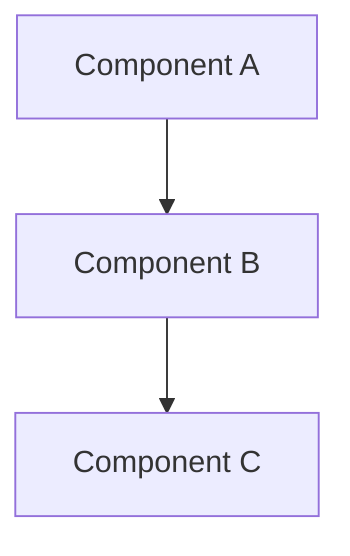

# Правила поддержки документации (Documentation Maintenance Guidelines)

## RU

### Общие принципы

Документация проекта Nmsdk должна поддерживаться в актуальном состоянии и соответствовать текущему состоянию кода.

### Структура документации

Документация организована в следующей структуре:

- **Docs/** (корень) - основная документация проекта
- **Rdk/Docs/** - детальная документация ядра Rdk
- **Bin/Docs/** - документация по ресурсам и конфигурациям
- **Libraries/<LibName>/Docs/** - документация библиотек

### Двуязычность

Каждый файл документации должен содержать секции на двух языках:

```markdown
## RU

[Русский текст]

---

## EN

[English text]
```

### Добавление новой документации

1. **Выберите правильное место:**
   - Общая информация → `Docs/`
   - Детали Rdk → `Rdk/Docs/`
   - Детали библиотеки → `Libraries/<LibName>/Docs/`

2. **Создайте файл с понятным именем:**
   - Используйте PascalCase или kebab-case
   - Избегайте нумерации вида `00-*`, `01-*`

3. **Добавьте ссылки:**
   - В соответствующий `README.md`
   - В корневой `Docs/README.md` (если необходимо)

4. **Добавьте диаграммы:**
   - Используйте mermaid для диаграмм классов, последовательностей, архитектуры
   - Диаграммы должны быть понятными и информативными

### Обновление существующей документации

1. **Проверьте актуальность:**
   - Соответствует ли документация текущему коду?
   - Нужны ли обновления диаграмм?

2. **Обновите оба языка:**
   - RU и EN секции должны быть синхронизированы

3. **Обновите ссылки:**
   - Проверьте, что все ссылки актуальны

### Диаграммы (Mermaid)

#### Типы диаграмм

- **flowchart/graph** - для архитектуры и потоков данных
- **classDiagram** - для диаграмм классов
- **sequenceDiagram** - для последовательностей вызовов
- **stateDiagram** - для состояний и жизненных циклов

#### Правила создания диаграмм

1. Используйте понятные имена узлов (без пробелов, используйте camelCase)
2. Добавляйте описания к диаграммам
3. Проверяйте корректность синтаксиса mermaid
4. Избегайте слишком сложных диаграмм - разбивайте на несколько

### Примеры

#### Добавление нового раздела

```markdown
# Новый раздел

## RU

Описание на русском...

---

## EN

Description in English...
```

#### Добавление диаграммы

````markdown
### Архитектура


````

### Проверка документации

Перед коммитом проверьте:

1. Прогон `Scripts/doc-audit/run-all.sh` (или CI `Scripts/ci-doc-audit.sh`)
2. Все ссылки работают — см. [Audit/Link-Health-Report.md](Audit/Link-Health-Report.md)
3. Диаграммы mermaid корректны
4. Обе языковые секции заполнены
5. Документация соответствует коду — см. [Audit/Component-Gap-Report.md](Audit/Component-Gap-Report.md)

### Commit workflow (documentation)

После логической порции правок документации:

```bash
Scripts/doc-audit/commit-phase.sh \
  --phase "phase-name" \
  --scope "nmsdk|rdk|bin|hardware|..." \
  --summary "imperative English summary" \
  --body-file Docs/Audit/commit-templates/phase-name.txt
```

- Сообщения коммитов — **только на английском**, формат `docs(<scope>): <summary>`
- Сначала субмодуль, затем корневой репозиторий (gitlink bump)
- Без `--no-verify`; без push из скрипта

### См. также

- [README.md](README.md) - навигация по документации
- [Mermaid Documentation](https://mermaid.js.org/) - справочник по синтаксису mermaid

---

## EN

### General Principles

The Nmsdk project documentation should be kept up to date and match the current state of the code.

### Documentation Structure

Documentation is organized in the following structure:

- **Docs/** (root) - main project documentation
- **Rdk/Docs/** - detailed Rdk core documentation
- **Bin/Docs/** - resources and configuration documentation
- **Libraries/<LibName>/Docs/** - library documentation

### Bilingual Support

Each documentation file should contain sections in two languages:

```markdown
## RU

[Russian text]

---

## EN

[English text]
```

### Adding New Documentation

1. **Choose the right location:**
   - General information → `Docs/`
   - Rdk details → `Rdk/Docs/`
   - Library details → `Libraries/<LibName>/Docs/`

2. **Create a file with a clear name:**
   - Use PascalCase or kebab-case
   - Avoid numbering like `00-*`, `01-*`

3. **Add links:**
   - In the corresponding `README.md`
   - In root `Docs/README.md` (if necessary)

4. **Add diagrams:**
   - Use mermaid for class, sequence, architecture diagrams
   - Diagrams should be clear and informative

### Updating Existing Documentation

1. **Check relevance:**
   - Does the documentation match the current code?
   - Do diagrams need updates?

2. **Update both languages:**
   - RU and EN sections should be synchronized

3. **Update links:**
   - Check that all links are current

### Diagrams (Mermaid)

#### Diagram Types

- **flowchart/graph** - for architecture and data flows
- **classDiagram** - for class diagrams
- **sequenceDiagram** - for call sequences
- **stateDiagram** - for states and lifecycles

#### Diagram Creation Rules

1. Use clear node names (no spaces, use camelCase)
2. Add descriptions to diagrams
3. Check mermaid syntax correctness
4. Avoid overly complex diagrams - split into several

### Examples

#### Adding a New Section

```markdown
# New Section

## RU

Russian description...

---

## EN

English description...
```

#### Adding a Diagram

````markdown
### Architecture


````

### Documentation Review

Before committing, check:

1. Run `Scripts/doc-audit/run-all.sh` (or CI `Scripts/ci-doc-audit.sh`)
2. All links work — see [Audit/Link-Health-Report.md](Audit/Link-Health-Report.md)
3. Mermaid diagrams are correct
4. Both language sections are filled
5. Documentation matches the code — see [Audit/Component-Gap-Report.md](Audit/Component-Gap-Report.md)

### Commit workflow (documentation)

Use `Scripts/doc-audit/commit-phase.sh` after each documentation batch. English conventional commits only: `docs(<scope>): <summary>`. Submodule first, then root gitlink bump.

### See Also

- [README.md](README.md) - documentation navigation
- [Mermaid Documentation](https://mermaid.js.org/) - mermaid syntax reference
