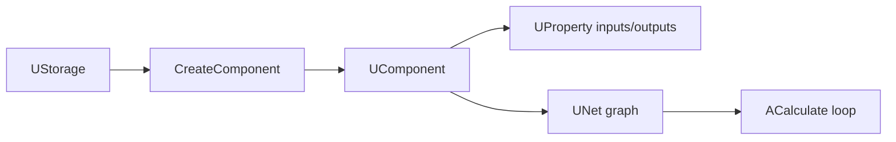

# Component System (Navigator)

## RU

### Назначение

Краткий навигатор по компонентной системе Nmsdk. **Полное описание** — в canonical-документе субмодуля Rdk.

> **Canonical:** [Rdk/Docs/Guides/Component-System.md](../../Rdk/Docs/Guides/Component-System.md)

### Ключевые концепции

| Концепция | Класс | Описание |
|-----------|-------|----------|
| Компонент | `UComponent` | Базовая функциональная единица |
| Сеть | `UNet` | Граф компонентов и связей |
| Хранилище | `UStorage` | Регистрация классов, создание экземпляров |
| Свойство | `UProperty` | Параметры, состояния, входы/выходы |
| Жизненный цикл | `ADefault` → `ABuild` → `AReset` → `ACalculate` | Этапы выполнения |

### Связанные разделы

- [Configuration Files Overview](Configuration-Files-Overview.md) — XML-конфигурации проектов
- [Direct Property Access](Direct-Property-Access.md) — оптимизация доступа к свойствам
- [Rdk Engine Architecture](../../Rdk/Docs/Architecture/Engine-Architecture.md) — архитектура движка
- [Creating Components](../../Rdk/Docs/Guides/Creating-Components.md) — создание нового компонента
- [Global Component Index](../Overview/Global-Component-Index.md) — каталоги библиотек
- [Component Inventory](../Overview/Component-Inventory.md) — регистрация `UploadClass`

### Диаграмма (обзор)

---

## EN

### Purpose

Short navigator for the Nmsdk component system. **Full documentation** lives in the Rdk submodule canonical guide.

> **Canonical:** [Rdk/Docs/Guides/Component-System.md](../../Rdk/Docs/Guides/Component-System.md)

### Key concepts

| Concept | Class | Description |
|---------|-------|-------------|
| Component | `UComponent` | Base functional unit |
| Network | `UNet` | Graph of components and links |
| Storage | `UStorage` | Class registration and instance creation |
| Property | `UProperty` | Parameters, state, inputs/outputs |
| Lifecycle | `ADefault` → `ABuild` → `AReset` → `ACalculate` | Execution stages |

### Related sections

- [Configuration Files Overview](Configuration-Files-Overview.md)
- [Direct Property Access](Direct-Property-Access.md)
- [Rdk Engine Architecture](../../Rdk/Docs/Architecture/Engine-Architecture.md)
- [Creating Components](../../Rdk/Docs/Guides/Creating-Components.md)
- [Global Component Index](../Overview/Global-Component-Index.md)
- [Component Inventory](../Overview/Component-Inventory.md)
