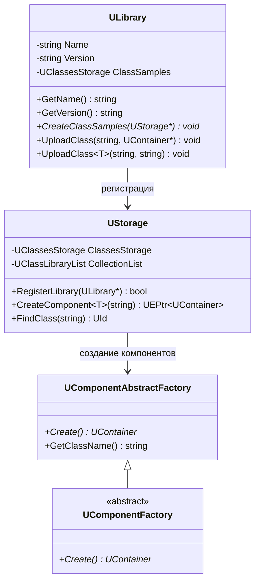
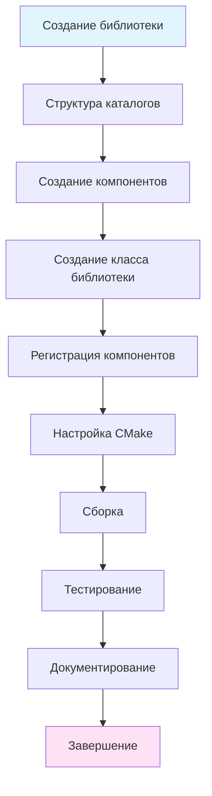
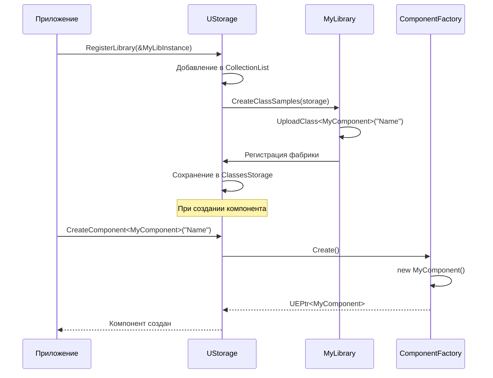
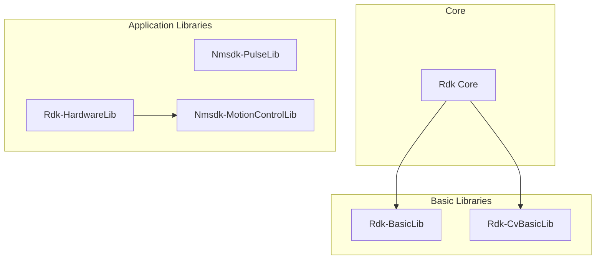
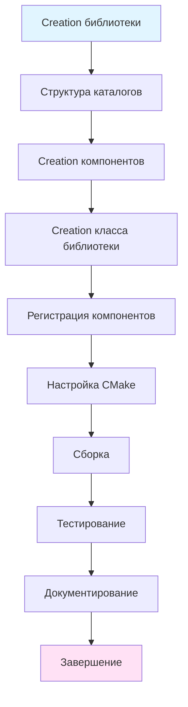
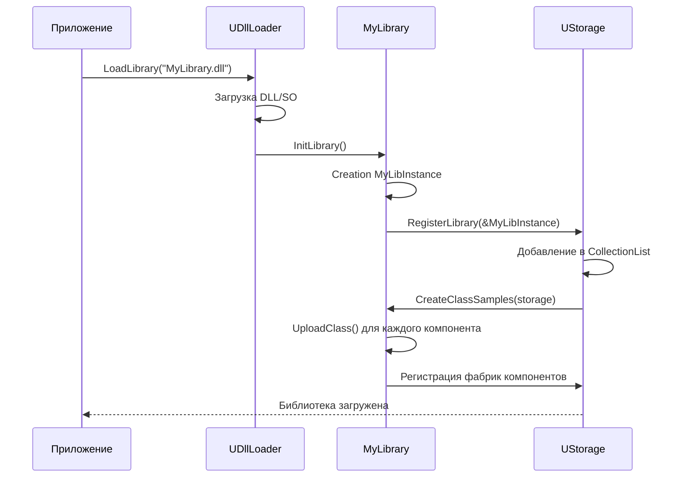

# Руководство по разработке библиотек (Library Development Guide)

## RU

### Обзор

Библиотеки в Nmsdk являются коллекциями компонентов, которые расширяют функциональность базового ядра Rdk. Каждая библиотека регистрирует свои компоненты в системе, делая их доступными для использования в проектах.

### Архитектура библиотеки

**Основные компоненты библиотеки:**



### Процесс создания библиотеки

**Основные этапы:**



### Шаг 1: Структура каталогов библиотеки

**Рекомендуемая структура:**

```
MyLibrary/
├── Core/
│   ├── MyComponent1.h
│   ├── MyComponent1.cpp
│   ├── MyComponent2.h
│   ├── MyComponent2.cpp
│   ├── MyLibrary.h
│   └── MyLibrary.cpp
├── Docs/
│   ├── Architecture.md
│   ├── API-Overview.md
│   └── Usage-Examples.md
├── Tests/
│   └── Unit/
│       └── MyComponent1/
│           └── Test_MyComponent1_Basic.cpp
└── CMakeLists.txt
```

### Шаг 2: Создание класса библиотеки

**Базовый шаблон библиотеки:**

```cpp
#ifndef MYLIBRARY_H
#define MYLIBRARY_H

#include "Rdk/Core/Engine/ULibrary.h"
#include "Rdk/Core/Engine/UStorage.h"

namespace RDK {

class MyLibrary : public ULibrary
{
public:
    // --------------------------
    // Конструкторы и деструкторы
    // --------------------------
    MyLibrary(void);
    // --------------------------

    // --------------------------
    // Методы заполнения библиотеки
    // --------------------------
    // Заполняет массив ClassSamples готовыми экземплярами образцов и их именами
    virtual void CreateClassSamples(UStorage *storage) override;
    // --------------------------
};

// Глобальный экземпляр библиотеки
extern RDK_LIB_TYPE MyLibrary MyLibInstance;

} // namespace RDK

#endif // MYLIBRARY_H
```

**Реализация библиотеки:**

```cpp
#include "MyLibrary.h"
#include "MyComponent1.h"
#include "MyComponent2.h"

namespace RDK {

// Глобальный экземпляр библиотеки
MyLibrary MyLibInstance;

MyLibrary::MyLibrary(void)
    : ULibrary("MyLibrary", "1.0.0")
{
    // Инициализация библиотеки
}

void MyLibrary::CreateClassSamples(UStorage *storage)
{
    // Метод 1: Регистрация через создание экземпляра
    UContainer *component = new MyComponent1();
    component->SetName("MyComponent1");
    component->Default();  // Инициализация по умолчанию
    UploadClass("MyComponent1", component);
    
    // Метод 2: Регистрация через шаблонный метод (рекомендуется)
    UploadClass<MyComponent2>("MyComponent2", "DisplayName");
    
    // Метод 3: Регистрация с альтернативным именем
    UploadClass<MyComponent1>("MyComponent1", "AlternativeName");
}
```

### Шаг 3: Регистрация компонентов

**Методы регистрации:**

#### Метод 1: UploadClass с экземпляром

```cpp
void MyLibrary::CreateClassSamples(UStorage *storage)
{
    // Создание экземпляра компонента
    UContainer *component = new MyComponent1();
    component->SetName("MyComponent1");
    component->Default();  // Обязательно вызвать Default()
    
    // Регистрация в библиотеке
    UploadClass("MyComponent1", component);
}
```

#### Метод 2: UploadClass с шаблоном (рекомендуется)

```cpp
void MyLibrary::CreateClassSamples(UStorage *storage)
{
    // Регистрация через шаблонный метод
    // Первый параметр - имя класса для создания
    // Второй параметр - отображаемое имя (опционально)
    UploadClass<MyComponent1>("MyComponent1", "My Component 1");
    UploadClass<MyComponent2>("MyComponent2", "My Component 2");
}
```

**Процесс регистрации:**



### Шаг 4: Создание описаний классов (ClDesc)

Для каждого компонента можно создать XML описание класса, которое используется GUI для отображения информации о компоненте.

**Структура ClDesc файла:**

```xml
<?xml version="1.0" encoding="UTF-8"?>
<ClassDescription>
    <ClassName>MyComponent1</ClassName>
    <DisplayName>My Component 1</DisplayName>
    <Description>
        <RU>Описание компонента на русском языке</RU>
        <EN>Component description in English</EN>
    </Description>
    <Category>MyCategory</Category>
    <Icon>path/to/icon.png</Icon>
    <Properties>
        <Property>
            <Name>Parameter1</Name>
            <DisplayName>Parameter 1</DisplayName>
            <Type>double</Type>
            <Description>
                <RU>Описание параметра</RU>
                <EN>Parameter description</EN>
            </Description>
            <DefaultValue>0.0</DefaultValue>
            <MinValue>0.0</MinValue>
            <MaxValue>100.0</MaxValue>
        </Property>
    </Properties>
</ClassDescription>
```

**Расположение ClDesc файлов:**

```
MyLibrary/
├── Core/
│   └── ...
└── ClDesc/
    ├── MyComponent1.cls
    └── MyComponent2.cls
```

**Загрузка описаний:**

Описания классов загружаются автоматически при регистрации библиотеки, если они находятся в каталоге `ClDesc/` относительно библиотеки.

### Шаг 5: Генерация алиасов свойств

Алиасы свойств позволяют создавать порты верхнего уровня для входов/выходов вложенных компонентов.

**Пример создания алиасов:**

```cpp
class CompositeComponent : public UNet
{
public:
    UEPtr<MyComponent1> SubComponent;
    
    // Алиасы для свойств подкомпонента
    UPropertyAlias InputAlias;
    UPropertyAlias OutputAlias;

protected:
    virtual bool ABuild(void) override
    {
        if (!UNet::ABuild())
            return false;
        
        // Создание подкомпонента
        SubComponent = CreateComponent<MyComponent1>("Sub");
        SubComponent->Build();
        
        // Создание алиасов
        InputAlias = UPropertyAlias(
            "Input",                    // имя алиаса
            "Sub",                      // путь к компоненту
            "InputSignal",              // имя свойства
            ptPubInput                  // тип свойства
        );
        
        OutputAlias = UPropertyAlias(
            "Output",
            "Sub",
            "OutputSignal",
            ptPubOutput
        );
        
        // Регистрация алиасов в сети
        AddPropertyAlias(InputAlias);
        AddPropertyAlias(OutputAlias);
        
        return true;
    }
};
```

### Шаг 6: Настройка CMake

**Пример CMakeLists.txt для библиотеки:**

```cmake
# MyLibrary/CMakeLists.txt

# Название библиотеки
set(LIBRARY_NAME "MyLibrary")

# Исходные файлы
set(SOURCES
    Core/MyLibrary.cpp
    Core/MyComponent1.cpp
    Core/MyComponent2.cpp
)

set(HEADERS
    Core/MyLibrary.h
    Core/MyComponent1.h
    Core/MyComponent2.h
)

# Создание библиотеки
add_library(${LIBRARY_NAME} SHARED ${SOURCES} ${HEADERS})

# Зависимости
target_link_libraries(${LIBRARY_NAME}
    PRIVATE
    Rdk::Core
    # Другие зависимости
)

# Включение директорий
target_include_directories(${LIBRARY_NAME}
    PUBLIC
    ${CMAKE_CURRENT_SOURCE_DIR}
    ${RDK_CORE_INCLUDE_DIR}
)

# Установка библиотеки
install(TARGETS ${LIBRARY_NAME}
    LIBRARY DESTINATION lib
    ARCHIVE DESTINATION lib
    RUNTIME DESTINATION bin
)

# Установка заголовочных файлов
install(FILES ${HEADERS}
    DESTINATION include/${LIBRARY_NAME}
)

# Установка ClDesc файлов
install(DIRECTORY ClDesc/
    DESTINATION share/${LIBRARY_NAME}/ClDesc
    FILES_MATCHING PATTERN "*.cls"
)
```

**Интеграция в корневой CMakeLists.txt:**

```cmake
# Корневой CMakeLists.txt

# Добавление библиотеки
add_subdirectory(Libraries/MyLibrary)

# Регистрация библиотеки в системе
# (выполняется автоматически при загрузке DLL/SO)
```

### Шаг 7: Версионирование библиотек

Библиотеки должны иметь версии для управления совместимостью.

**Формат версии:**

- `MAJOR.MINOR.PATCH` (например, "1.2.3")
- MAJOR - несовместимые изменения API
- MINOR - обратно совместимые новые функции
- PATCH - исправления ошибок

**Пример версионирования:**

```cpp
MyLibrary::MyLibrary(void)
    : ULibrary("MyLibrary", "1.0.0")  // Версия библиотеки
{
}

// В заголовочном файле
#define MY_LIBRARY_VERSION_MAJOR 1
#define MY_LIBRARY_VERSION_MINOR 0
#define MY_LIBRARY_VERSION_PATCH 0
#define MY_LIBRARY_VERSION "1.0.0"
```

### Шаг 8: Зависимости между библиотеками

Библиотеки могут зависеть от других библиотек.

**Объявление зависимостей:**

```cpp
class MyLibrary : public ULibrary
{
public:
    MyLibrary(void)
        : ULibrary("MyLibrary", "1.0.0")
    {
        // Зависимости указываются в CMakeLists.txt
        // через target_link_libraries
    }
    
    virtual void CreateClassSamples(UStorage *storage) override
    {
        // Проверка наличия зависимостей
        if (!storage->FindClass("RequiredComponent")) {
            Logger->LogMessage(RDK_EX_WARNING, 
                "Required library not found");
            return;
        }
        
        // Регистрация компонентов
        UploadClass<MyComponent>("MyComponent");
    }
};
```

**Схема зависимостей:**



### Полный пример библиотеки

**MyLibrary.h:**

```cpp
#ifndef MYLIBRARY_H
#define MYLIBRARY_H

#include "Rdk/Core/Engine/ULibrary.h"

namespace RDK {

// Предварительные объявления компонентов
class MyComponent1;
class MyComponent2;

class MyLibrary : public ULibrary
{
public:
    MyLibrary(void);
    virtual void CreateClassSamples(UStorage *storage) override;
};

extern RDK_LIB_TYPE MyLibrary MyLibInstance;

} // namespace RDK

#endif // MYLIBRARY_H
```

**MyLibrary.cpp:**

```cpp
#include "MyLibrary.h"
#include "MyComponent1.h"
#include "MyComponent2.h"

namespace RDK {

MyLibrary MyLibInstance;

MyLibrary::MyLibrary(void)
    : ULibrary("MyLibrary", "1.0.0")
{
}

void MyLibrary::CreateClassSamples(UStorage *storage)
{
    // Регистрация компонентов
    UploadClass<MyComponent1>("MyComponent1", "My Component 1");
    UploadClass<MyComponent2>("MyComponent2", "My Component 2");
    
    // Альтернативные имена
    UploadClass<MyComponent1>("MC1", "My Component 1 (Short)");
}

} // namespace RDK
```

**MyComponent1.h:**

```cpp
#ifndef MYCOMPONENT1_H
#define MYCOMPONENT1_H

#include "Rdk/Core/Engine/UContainer.h"
#include "Rdk/Core/Engine/UProperty.h"

namespace RDK {

class MyComponent1 : public UContainer
{
public:
    UProperty<double, MyComponent1, ptPubParameter> Gain;
    UProperty<double, MyComponent1, ptPubInput> Input;
    UProperty<double, MyComponent1, ptPubOutput> Output;

    MyComponent1(void)
        : UContainer(),
          Gain("Gain", this, 1.0),
          Input("Input", this, 0.0),
          Output("Output", this, 0.0)
    {
    }

protected:
    virtual bool ADefault(void) override
    {
        if (!UContainer::ADefault())
            return false;
        Gain = 1.0;
        return true;
    }
    
    virtual bool ABuild(void) override
    {
        if (!UContainer::ABuild())
            return false;
        return true;
    }
    
    virtual bool AReset(void) override
    {
        if (!UContainer::AReset())
            return false;
        Output = 0.0;
        return true;
    }
    
    virtual bool ACalculate(void) override
    {
        if (!IsReady())
            return false;
        Output = Input() * Gain();
        return true;
    }
};

} // namespace RDK

#endif // MYCOMPONENT1_H
```

**CMakeLists.txt:**

```cmake
set(LIBRARY_NAME "MyLibrary")

set(SOURCES
    Core/MyLibrary.cpp
    Core/MyComponent1.cpp
    Core/MyComponent2.cpp
)

set(HEADERS
    Core/MyLibrary.h
    Core/MyComponent1.h
    Core/MyComponent2.h
)

add_library(${LIBRARY_NAME} SHARED ${SOURCES} ${HEADERS})

target_link_libraries(${LIBRARY_NAME}
    PRIVATE
    Rdk::Core
)

target_include_directories(${LIBRARY_NAME}
    PUBLIC
    ${CMAKE_CURRENT_SOURCE_DIR}
)

install(TARGETS ${LIBRARY_NAME}
    LIBRARY DESTINATION lib
    ARCHIVE DESTINATION lib
)

install(FILES ${HEADERS}
    DESTINATION include/${LIBRARY_NAME}
)
```

### Регистрация библиотеки в приложении

**Автоматическая регистрация (через DLL/SO):**

При загрузке динамической библиотеки автоматически вызывается функция инициализации:

```cpp
// В MyLibrary.cpp
extern "C" {
    RDK_LIB_TYPE bool RDK_CALL InitLibrary(void)
    {
        // Библиотека автоматически регистрируется через глобальный экземпляр
        return true;
    }
}
```

**Ручная регистрация:**

```cpp
#include "MyLibrary.h"

int main()
{
    // Получение хранилища
    RDK::UELockPtr<RDK::UEnvironment> env = RDK::GetEnvironmentLock();
    if (env) {
        RDK::UStorage* storage = env->GetStorage();
        
        // Регистрация библиотеки
        storage->RegisterLibrary(&RDK::MyLibInstance);
        
        // Теперь компоненты доступны
        auto component = storage->CreateComponent<RDK::MyComponent1>("MyComp");
    }
    
    return 0;
}
```

### Процесс загрузки библиотеки


### Best Practices

#### 1. Именование компонентов

- Используйте понятные и уникальные имена
- Избегайте конфликтов с именами из других библиотек
- Используйте префиксы для группировки (например, "MyLib_Component1")

#### 2. Версионирование

- Следуйте семантическому версионированию (SemVer)
- Увеличивайте версию при изменениях API
- Документируйте изменения между версиями

#### 3. Зависимости

- Минимизируйте зависимости от других библиотек
- Документируйте все зависимости
- Проверяйте наличие зависимостей при регистрации

#### 4. Производительность

- Избегайте тяжелых операций в конструкторе библиотеки
- Используйте ленивую инициализацию где возможно
- Оптимизируйте создание компонентов

#### 5. Тестирование

- Создавайте unit тесты для всех компонентов
- Тестируйте регистрацию компонентов
- Тестируйте создание компонентов через фабрику

**Пример теста регистрации:**

```cpp
#include <gtest/gtest.h>
#include "MyLibrary.h"

class MyLibraryTest : public ::testing::Test
{
protected:
    void SetUp() override
    {
        // Создание хранилища для тестов
        storage = std::make_unique<RDK::UStorage>();
        storage->RegisterLibrary(&RDK::MyLibInstance);
    }
    
    std::unique_ptr<RDK::UStorage> storage;
};

TEST_F(MyLibraryTest, ComponentRegistration)
{
    // Проверка регистрации компонента
    RDK::UId class_id = storage->FindClass("MyComponent1");
    EXPECT_NE(class_id, 0);
}

TEST_F(MyLibraryTest, ComponentCreation)
{
    // Проверка создания компонента
    auto component = storage->CreateComponent<RDK::MyComponent1>("TestComp");
    EXPECT_NE(component, nullptr);
    EXPECT_EQ(component->GetName(), "TestComp");
}
```

#### 6. Документирование

- Создавайте документацию для каждого компонента
- Включайте примеры использования
- Описывайте параметры и свойства

### Интеграция с системой сборки

**Структура проекта:**

```
Nmsdk/
├── Libraries/
│   └── MyLibrary/
│       ├── Core/
│       ├── Docs/
│       ├── Tests/
│       └── CMakeLists.txt
└── CMakeLists.txt
```

**Корневой CMakeLists.txt:**

```cmake
# Добавление библиотеки
if(BUILD_MY_LIBRARY)
    add_subdirectory(Libraries/MyLibrary)
endif()
```

### См. также

- [Component Development Guide](Component-Development.md) - разработка компонентов
- [Build System](../Build-And-Deploy/Build-System.md) - система сборки
- [Library Examples](../../Libraries/Rdk-BasicLib/Docs/Usage-Examples.md) - примеры библиотек

---

## EN

### Overview

Libraries in Nmsdk are collections of components that extend the functionality of the base Rdk core. Each library registers its components in the system, making them available for use in projects.

### Library Architecture

**Main Library Components:**

The library system consists of `ULibrary` for component registration, `UStorage` for component management, and component factories for component creation.

### Library Development Process

**Main Stages:**

1. Directory Structure - create library directory structure
2. Create Components - develop component classes
3. Create Library Class - create library class inheriting from `ULibrary`
4. Register Components - register components in `CreateClassSamples()`
5. Configure CMake - set up build system
6. Build - compile library
7. Test - create tests
8. Document - document library

### Step 1: Directory Structure

**Recommended Structure:**

```
MyLibrary/
├── Core/
│   ├── MyComponent1.h
│   ├── MyComponent1.cpp
│   ├── MyLibrary.h
│   └── MyLibrary.cpp
├── Docs/
│   ├── Architecture.md
│   ├── API-Overview.md
│   └── Usage-Examples.md
├── Tests/
└── CMakeLists.txt
```

### Step 2: Create Library Class

**Basic Library Template:**

```cpp
class MyLibrary : public ULibrary
{
public:
    MyLibrary(void);
    virtual void CreateClassSamples(UStorage *storage) override;
};

extern RDK_LIB_TYPE MyLibrary MyLibInstance;
```

**Implementation:**

```cpp
MyLibrary::MyLibrary(void)
    : ULibrary("MyLibrary", "1.0.0")
{
}

void MyLibrary::CreateClassSamples(UStorage *storage)
{
    UploadClass<MyComponent1>("MyComponent1", "My Component 1");
    UploadClass<MyComponent2>("MyComponent2", "My Component 2");
}
```

### Step 3: Component Registration

**Registration Methods:**

1. **UploadClass with instance** - create instance and register
2. **UploadClass with template** - use template method (recommended)

**Example:**

```cpp
void MyLibrary::CreateClassSamples(UStorage *storage)
{
    // Template method (recommended)
    UploadClass<MyComponent1>("MyComponent1", "Display Name");
    
    // Instance method
    UContainer *comp = new MyComponent1();
    comp->SetName("MyComponent1");
    comp->Default();
    UploadClass("MyComponent1", comp);
}
```

### Step 4: Class Descriptions (ClDesc)

Create XML descriptions for each component for GUI display.

**ClDesc File Structure:**

```xml
<?xml version="1.0" encoding="UTF-8"?>
<ClassDescription>
    <ClassName>MyComponent1</ClassName>
    <DisplayName>My Component 1</DisplayName>
    <Description>
        <RU>Description in Russian</RU>
        <EN>Description in English</EN>
    </Description>
    <Category>MyCategory</Category>
</ClassDescription>
```

### Step 5: Property Alias Generation

Property aliases allow creating top-level ports for nested component inputs/outputs.

**Example:**

```cpp
class CompositeComponent : public UNet
{
protected:
    virtual bool ABuild(void) override
    {
        // Create subcomponent
        SubComponent = CreateComponent<MyComponent1>("Sub");
        
        // Create aliases
        UPropertyAlias inputAlias("Input", "Sub", "InputSignal", ptPubInput);
        AddPropertyAlias(inputAlias);
        
        return true;
    }
};
```

### Step 6: CMake Configuration

**Example CMakeLists.txt:**

```cmake
set(LIBRARY_NAME "MyLibrary")
set(SOURCES Core/MyLibrary.cpp Core/MyComponent1.cpp)
set(HEADERS Core/MyLibrary.h Core/MyComponent1.h)

add_library(${LIBRARY_NAME} SHARED ${SOURCES} ${HEADERS})
target_link_libraries(${LIBRARY_NAME} PRIVATE Rdk::Core)
```

### Step 7: Versioning

Libraries should have versions for compatibility management.

**Version Format:**

- `MAJOR.MINOR.PATCH` (e.g., "1.2.3")

**Example:**

```cpp
MyLibrary::MyLibrary(void)
    : ULibrary("MyLibrary", "1.0.0")
{
}
```

### Step 8: Dependencies

Libraries can depend on other libraries.

**Declaring Dependencies:**

Dependencies are declared in CMakeLists.txt through `target_link_libraries`.

### Complete Library Example

See the RU section for a complete example of library implementation.

### Library Registration

**Automatic Registration:**

Libraries are automatically registered when DLL/SO is loaded.

**Manual Registration:**

```cpp
RDK::UStorage* storage = env->GetStorage();
storage->RegisterLibrary(&RDK::MyLibInstance);
```

### Best Practices

1. **Naming** - use clear and unique component names
2. **Versioning** - follow semantic versioning
3. **Dependencies** - minimize dependencies, document them
4. **Performance** - avoid heavy operations in constructor
5. **Testing** - create unit tests for all components
6. **Documentation** - document each component with examples

### See Also

- [Component Development Guide](Component-Development.md) - component development
- [Build System](../Build-And-Deploy/Build-System.md) - build system
- [Library Examples](../../Libraries/Rdk-BasicLib/Docs/Usage-Examples.md) - library examples






