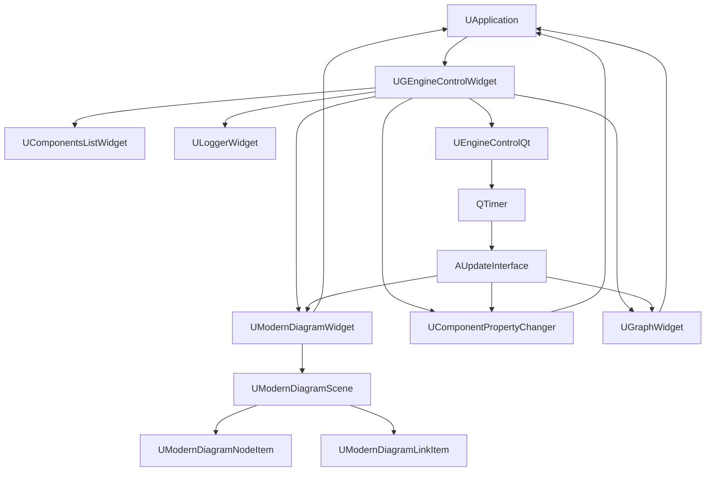

# GUI - Обзор

## RU

### Назначение

Графический интерфейс пользователя (GUI) Nmsdk построен на Qt и предоставляет визуальный редактор компонентов, мониторинг выполнения и управление проектами.

### Основные компоненты

- **Главное окно** - центральный интерфейс приложения
- **Редактор диаграмм** - визуальное создание и редактирование сетей компонентов
- **Список компонентов** - библиотека доступных компонентов
- **Редактор свойств** - настройка параметров компонентов
- **Окно логов** - мониторинг выполнения и отладка
- **Окно графиков** - визуализация данных компонентов
- **Управление проектами** - создание, открытие, сохранение проектов

**Архитектура GUI системы:**

Все виджеты наследуются от `UVisualControllerWidget` или `UVisualControllerMainWidget` и получают указатель на `UApplication` при создании. Они используют этот указатель для доступа к движку (`UEngine`), хранилищу компонентов (`UStorage`) и проекту (`UProject`).

### Специализированные формы компонентов (BCB -> Qt)

В Qt реализовано ядро открытия форм по классу компонента:

- `UComponentGuiContext` - контекст (`componentLongName`, `componentClassName`, `channelIndex`)
- `UComponentFormRegistry` - статический реестр `ComponentClass -> FormFactory`
- `UComponentGuiService` - создание/активация инстансов форм
- `UModernDiagramContextMenu::componentGUI()` - точка вызова из контекстного меню схемы

Pipeline вызова:

`UModernDiagramContextMenu` -> `UModernDiagramWidget` -> `UModernDiagramContainerWidget` -> `UGEngineControlWidget` -> `UComponentGuiService`.

### См. также

- [Справочник виджетов](Widgets-Reference.md)
- [Система стилей](Style-System.md)
- [Rdk Core Graphics](../Rdk/Docs/Architecture/Graphics-Architecture.md)

---

## EN

### Purpose

The Graphical User Interface (GUI) of Nmsdk is built on Qt and provides a visual component editor, execution monitoring, and project management.

### Main Components

- **Main Window** - central application interface
- **Diagram Editor** - visual creation and editing of component networks
- **Component List** - library of available components
- **Property Editor** - component parameter configuration
- **Log Window** - execution monitoring and debugging
- **Graph Window** - component data visualization
- **Project Management** - create, open, save projects

All widgets inherit from `UVisualControllerWidget` or `UVisualControllerMainWidget` and receive a pointer to `UApplication` upon creation. They use this pointer to access the engine (`UEngine`), component storage (`UStorage`), and project (`UProject`). The update cycle is driven by `UEngineControlQt` timer, which calls `AUpdateInterface()` on all widgets periodically.

### See Also

- [Widgets Reference](Widgets-Reference.md)
- [Style System](Style-System.md)
- [Rdk Core Graphics](../Rdk/Docs/Architecture/Graphics-Architecture.md)
