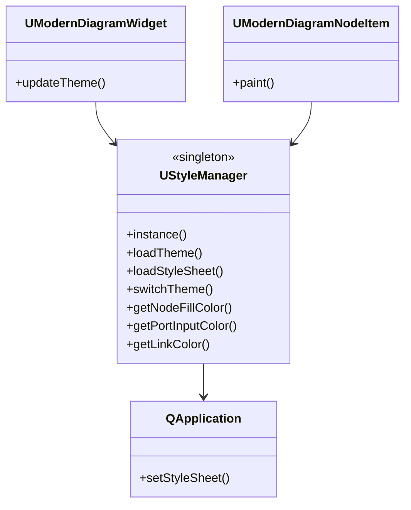
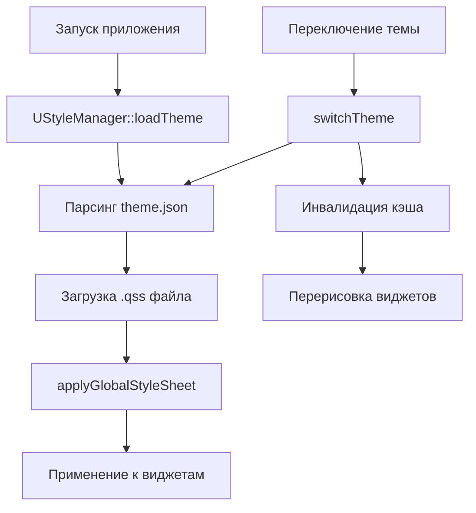

# Система стилей (Style System)

## RU

### Обзор

Система стилей NeuroModeler обеспечивает централизованное управление визуальным оформлением приложения с поддержкой переключения тем.

### Компоненты системы

1. **UStyleManager** - синглтон для доступа к стилям из кода
2. **default.qss** - светлая тема Qt виджетов (QSS)
3. **dark.qss** - тёмная тема Qt виджетов (QSS)
4. **theme.json** - цвета светлой темы для кастомной отрисовки (QPainter)
5. **dark-theme.json** - цвета тёмной темы для кастомной отрисовки

**Архитектура системы стилей:**



**Процесс применения стилей:**



### Поддерживаемые темы

- **Modern Light** - светлая профессиональная тема с градиентами
- **Modern Dark** - тёмная тема в стиле современных IDE

### Использование

```cpp
// Получение экземпляра синглтона
UStyleManager* style = UStyleManager::instance();

// Загрузка темы
style->loadTheme("Styles/theme.json");

// Загрузка QSS стилей
style->loadStyleSheet("Styles/default.qss");

// Применение стилей
style->applyGlobalStyleSheet(qApp);

// Переключение темы
style->switchTheme("Modern Dark", qApp);
```

`UStyleManager` загружает цвета из JSON файлов (`theme.json`, `dark-theme.json`) и применяет QSS стили к `QApplication`. Виджеты получают цвета через методы `getNodeFillColor()`, `getPortInputColor()` и т.д. для кастомной отрисовки через `QPainter`. При переключении темы виджеты вызывают `updateTheme()` для инвалидации кэша и перерисовки.

### Расположение файлов

- Исходники: `Rdk/GUI/Qt/Styles/`
- Runtime: `Bin/Styles/`

### Spatial density (compact default)

NeuroModeler — desktop power-tool (IDE / MATLAB-like). **Compact** — текущий дефолт плотности; отдельного UI-переключателя Compact/Comfortable пока нет.

**Два слоя плотности (оба обязательны):**

1. **QSS chrome** (`default.qss` / `dark.qss`) — padding dock title, tabs, headers, toolbar, tree/list items, GroupBox.
2. **Widget layout** — `setContentsMargins` / `setSpacing` / высоты chrome (status, breadcrumbs, custom title bars, form controllers). QSS не заменяет hardcoded margins в C++/`.ui`.

Правило: **spacing в light и dark QSS идентичен**; отличаются только цвета. Новые формы и docks должны использовать margins/spacing **4** (не платформенный default ~9–11).

| Токен chrome | Целевое значение |
|--------------|------------------|
| Dock / MDI title padding | 4px 8px / 4px 6px |
| TabBar tab padding | 4px 12px 4px 10px |
| HeaderView section | 4px 6px |
| ToolBar padding / spacing | 2px 4px / 4 |
| Tree/List item padding | 2–3px (+ margin 0–2) |
| GroupBox margin-top / padding-top | 8px |
| Form / dock content margins | 4px |

Шрифт UI не уменьшается density-режимом (берётся system UI font через `UStyleManager`).

### См. также

- [Reports/29-StyleSystem-Documentation.md](../../Reports/29-StyleSystem-Documentation.md) - детальная документация
- [GUI Overview](Overview.md)

---

## EN

### Overview

The NeuroModeler style system provides centralized management of application visual styling with theme switching support.

### System Components

1. **UStyleManager** - singleton for accessing styles from code
2. **default.qss** - light theme for Qt widgets (QSS)
3. **dark.qss** - dark theme for Qt widgets (QSS)
4. **theme.json** - light theme colors for custom rendering (QPainter)
5. **dark-theme.json** - dark theme colors for custom rendering

### Supported Themes

- **Modern Light** - light professional theme with gradients
- **Modern Dark** - dark theme in modern IDE style

### Usage

`UStyleManager` loads colors from JSON files (`theme.json`, `dark-theme.json`) and applies QSS styles to `QApplication`. Widgets get colors through methods like `getNodeFillColor()`, `getPortInputColor()`, etc. for custom rendering via `QPainter`. When switching themes, widgets call `updateTheme()` to invalidate cache and repaint.

### File Locations

- Sources: `Rdk/GUI/Qt/Styles/`
- Runtime: `Bin/Styles/`

### Spatial density (compact default)

NeuroModeler is a desktop power tool (IDE / MATLAB-like). **Compact** is the current density default; there is no Compact/Comfortable UI toggle yet.

**Two density layers (both required):**

1. **QSS chrome** (`default.qss` / `dark.qss`) — dock title, tabs, headers, toolbar, tree/list items, GroupBox padding.
2. **Widget layout** — `setContentsMargins` / `setSpacing` / chrome heights (status, breadcrumbs, custom title bars, form controllers). QSS does not override hardcoded C++/`.ui` margins.

Rule: **light and dark QSS spacing must match**; only colors differ. New forms and docks should use margins/spacing **4** (not the platform default ~9–11).

| Chrome token | Target |
|--------------|--------|
| Dock / MDI title padding | 4px 8px / 4px 6px |
| TabBar tab padding | 4px 12px 4px 10px |
| HeaderView section | 4px 6px |
| ToolBar padding / spacing | 2px 4px / 4 |
| Tree/List item padding | 2–3px (+ margin 0–2) |
| GroupBox margin-top / padding-top | 8px |
| Form / dock content margins | 4px |

UI font size is not reduced by density (system UI font via `UStyleManager`).

### See Also

- [Reports/29-StyleSystem-Documentation.md](../../Reports/29-StyleSystem-Documentation.md) - detailed documentation
- [GUI Overview](Overview.md)


