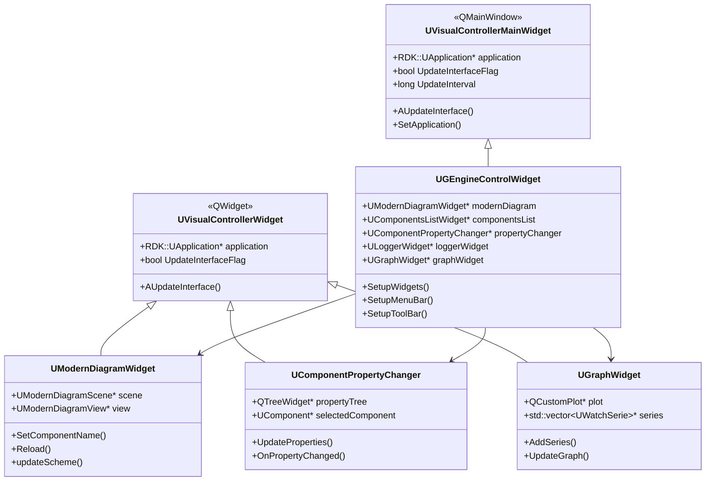

# Расширенная документация по GUI виджетам (Advanced Widgets Customization)

## RU

### Обзор

Этот документ описывает расширенные возможности кастомизации виджетов Nmsdk, включая создание пользовательских виджетов, стилизацию через QSS, расширение функциональности существующих виджетов и интеграцию с системой контроллеров.

### UDrawEngineImageWidget (legacy raster diagram)

`UDrawEngineImageWidget` (`Rdk/GUI/Qt/UDrawEngineImageWidget.h`) — QLabel-based raster view of the component network via `RDK::UDrawEngine`. Parent `UDrawEngineWidget` bridges engine access; signals connect to `UComponentsListWidget` in `UGEngineControlWidget`.

**Customization points:**

| Hook | Purpose |
|------|---------|
| `reDrawScheme(shouldReloadXml, no_resize_canvas)` | Force XML reload and bitmap repaint |
| `setComponentName` / `selectComponent` | Focus component on canvas |
| `ResizeCanvas` | Expand canvas on widget resize |
| `SetApplication` | Bind `UApplication` from parent |
| Mouse/drag slots | Link creation, move, switch modes via context menu |
| `classDescription` | ClDesc popup via `UClassDescriptionDisplay` |

Use `UModernDiagramWidget` for vector editing; keep `UDrawEngineImageWidget` for legacy layouts and tests that assert bitmap output.

### Архитектура виджетов



### Создание пользовательского виджета

#### Пример 1: Базовый пользовательский виджет

```cpp
#include "UVisualControllerWidget.h"
#include <QWidget>
#include <QVBoxLayout>
#include <QLabel>
#include <QPushButton>

class MyCustomWidget : public RDK::UVisualControllerWidget
{
    Q_OBJECT
    
public:
    MyCustomWidget(QWidget* parent = nullptr, RDK::UApplication* app = nullptr)
        : UVisualControllerWidget(parent, app)
    {
        setupUI();
    }
    
protected:
    virtual void AUpdateInterface() override
    {
        if (!application || UpdateInterfaceFlag)
            return;
            
        UpdateInterfaceFlag = true;
        
        // Обновление интерфейса на основе данных из приложения
        if (application->IsProjectOpen()) {
            auto engine = application->GetEngine(0);
            if (engine) {
                // Обновление виджета данными из движка
                updateWidgetData(engine);
            }
        }
        
        UpdateInterfaceFlag = false;
    }
    
private:
    void setupUI()
    {
        auto layout = new QVBoxLayout(this);
        
        label = new QLabel("Custom Widget", this);
        button = new QPushButton("Action", this);
        
        layout->addWidget(label);
        layout->addWidget(button);
        
        connect(button, &QPushButton::clicked, this, &MyCustomWidget::onButtonClicked);
    }
    
    void updateWidgetData(RDK::UEngine* engine)
    {
        // Обновление данных виджета
        label->setText(QString("Engine State: %1").arg(engine->GetState()));
    }
    
private slots:
    void onButtonClicked()
    {
        if (application) {
            // Выполнение действия через приложение
            RLOG(RDK_EX_INFO, RDK_SYS_MESSAGE, "custom", "Button clicked");
        }
    }
    
private:
    QLabel* label;
    QPushButton* button;
};
```

#### Пример 2: Виджет с интеграцией контроллера

```cpp
#include "UVisualControllerWidget.h"
#include "UController.h"
#include "UControllerData.h"
#include <QWidget>
#include <QVBoxLayout>
#include <QLabel>
#include <QLineEdit>

class PropertyMonitorWidget : public RDK::UVisualControllerWidget
{
    Q_OBJECT
    
public:
    PropertyMonitorWidget(QWidget* parent = nullptr, RDK::UApplication* app = nullptr)
        : UVisualControllerWidget(parent, app)
        , controller(nullptr)
    {
        setupUI();
        setupController();
    }
    
    ~PropertyMonitorWidget()
    {
        if (controller) {
            controller->Destroy();
        }
    }
    
protected:
    virtual void AUpdateInterface() override
    {
        if (!application || UpdateInterfaceFlag || !controller)
            return;
            
        UpdateInterfaceFlag = true;
        
        // Получение данных через контроллер
        auto data = controller->GetData();
        if (data) {
            updateFromControllerData(data);
        }
        
        UpdateInterfaceFlag = false;
    }
    
private:
    void setupUI()
    {
        auto layout = new QVBoxLayout(this);
        
        componentNameLabel = new QLabel("Component: None", this);
        propertyNameLabel = new QLabel("Property: None", this);
        valueLabel = new QLabel("Value: --", this);
        
        layout->addWidget(componentNameLabel);
        layout->addWidget(propertyNameLabel);
        layout->addWidget(valueLabel);
    }
    
    void setupController()
    {
        if (!application)
            return;
            
        // Создание контроллера для мониторинга свойства
        controller = RDK::UController::CreateController("PropertyMonitorController");
        if (controller) {
            controller->SetApplication(application);
            controller->SetComponentName("MyComponent");
            controller->SetPropertyName("MyProperty");
            controller->Build();
        }
    }
    
    void updateFromControllerData(RDK::UControllerData* data)
    {
        if (!data)
            return;
            
        componentNameLabel->setText(QString("Component: %1")
            .arg(QString::fromStdString(data->GetComponentName())));
        propertyNameLabel->setText(QString("Property: %1")
            .arg(QString::fromStdString(data->GetPropertyName())));
            
        // Обновление значения в зависимости от типа данных
        if (auto doubleData = dynamic_cast<RDK::UControllerDataDouble*>(data)) {
            valueLabel->setText(QString("Value: %1").arg(doubleData->GetValue()));
        } else if (auto intData = dynamic_cast<RDK::UControllerDataInt*>(data)) {
            valueLabel->setText(QString("Value: %1").arg(intData->GetValue()));
        } else if (auto stringData = dynamic_cast<RDK::UControllerDataString*>(data)) {
            valueLabel->setText(QString("Value: %1")
                .arg(QString::fromStdString(stringData->GetValue())));
        }
    }
    
private:
    RDK::UController* controller;
    QLabel* componentNameLabel;
    QLabel* propertyNameLabel;
    QLabel* valueLabel;
};
```

### Кастомизация стилей через QSS

#### Пример 3: Создание пользовательской темы

```cpp
#include "UStyleManager.h"
#include <QFile>
#include <QTextStream>

void applyCustomTheme(RDK::UStyleManager* styleManager)
{
    // Создание пользовательского QSS файла
    QString qssContent = R"(
        /* Пользовательская тема */
        QMainWindow {
            background-color: #2B2B2B;
            color: #FFFFFF;
        }
        
        QWidget {
            background-color: #2B2B2B;
            color: #FFFFFF;
            font-family: "Consolas", "Monaco", monospace;
            font-size: 11pt;
        }
        
        QPushButton {
            background-color: #3C3C3C;
            border: 1px solid #555555;
            border-radius: 4px;
            padding: 6px 12px;
            min-width: 80px;
        }
        
        QPushButton:hover {
            background-color: #4C4C4C;
            border-color: #666666;
        }
        
        QPushButton:pressed {
            background-color: #2C2C2C;
        }
        
        QTreeWidget {
            background-color: #1E1E1E;
            border: 1px solid #3C3C3C;
            selection-background-color: #3C5F8F;
        }
        
        QTreeWidget::item {
            padding: 4px;
        }
        
        QTreeWidget::item:selected {
            background-color: #3C5F8F;
        }
        
        QLineEdit, QTextEdit {
            background-color: #1E1E1E;
            border: 1px solid #3C3C3C;
            padding: 4px;
            border-radius: 3px;
        }
        
        QLineEdit:focus, QTextEdit:focus {
            border-color: #5B8DEF;
        }
        
        QTabWidget::pane {
            border: 1px solid #3C3C3C;
            background-color: #2B2B2B;
        }
        
        QTabBar::tab {
            background-color: #3C3C3C;
            color: #FFFFFF;
            padding: 8px 16px;
            border-top-left-radius: 4px;
            border-top-right-radius: 4px;
            margin-right: 2px;
        }
        
        QTabBar::tab:selected {
            background-color: #2B2B2B;
            border-bottom: 2px solid #5B8DEF;
        }
        
        QMenuBar {
            background-color: #2B2B2B;
            border-bottom: 1px solid #3C3C3C;
        }
        
        QMenuBar::item {
            padding: 6px 12px;
        }
        
        QMenuBar::item:selected {
            background-color: #3C3C3C;
        }
        
        QMenu {
            background-color: #2B2B2B;
            border: 1px solid #3C3C3C;
        }
        
        QMenu::item:selected {
            background-color: #3C5F8F;
        }
    )";
    
    // Применение темы
    styleManager->setStyleSheet(qssContent);
    
    // Сохранение темы в файл
    QFile file("custom_theme.qss");
    if (file.open(QIODevice::WriteOnly | QIODevice::Text)) {
        QTextStream out(&file);
        out << qssContent;
        file.close();
    }
}
```

#### Пример 4: Динамическое изменение стилей

```cpp
#include "UStyleManager.h"
#include <QApplication>

class ThemeSwitcher
{
public:
    static void switchToLightTheme(RDK::UStyleManager* styleManager)
    {
        QString lightTheme = R"(
            QWidget {
                background-color: #FFFFFF;
                color: #000000;
            }
            QPushButton {
                background-color: #F0F0F0;
                border: 1px solid #CCCCCC;
            }
            QPushButton:hover {
                background-color: #E0E0E0;
            }
        )";
        styleManager->setStyleSheet(lightTheme);
    }
    
    static void switchToDarkTheme(RDK::UStyleManager* styleManager)
    {
        QString darkTheme = R"(
            QWidget {
                background-color: #2B2B2B;
                color: #FFFFFF;
            }
            QPushButton {
                background-color: #3C3C3C;
                border: 1px solid #555555;
            }
            QPushButton:hover {
                background-color: #4C4C4C;
            }
        )";
        styleManager->setStyleSheet(darkTheme);
    }
    
    static void switchToHighContrastTheme(RDK::UStyleManager* styleManager)
    {
        QString contrastTheme = R"(
            QWidget {
                background-color: #000000;
                color: #FFFFFF;
            }
            QPushButton {
                background-color: #FFFFFF;
                color: #000000;
                border: 2px solid #FFFFFF;
            }
            QPushButton:hover {
                background-color: #FFFF00;
                color: #000000;
            }
        )";
        styleManager->setStyleSheet(contrastTheme);
    }
};
```

### Расширение функциональности существующих виджетов

#### Пример 5: Расширение UGraphWidget

```cpp
#include "UGraphWidget.h"
#include "UWatchChart.h"
#include "UWatchSerie.h"
#include <QMenu>
#include <QContextMenuEvent>

class ExtendedGraphWidget : public RDK::UGraphWidget
{
    Q_OBJECT
    
public:
    ExtendedGraphWidget(QWidget* parent = nullptr, RDK::UApplication* app = nullptr)
        : UGraphWidget(parent, app)
    {
        setupExtendedFeatures();
    }
    
protected:
    virtual void contextMenuEvent(QContextMenuEvent* event) override
    {
        QMenu menu(this);
        
        QAction* exportAction = menu.addAction("Export to CSV");
        QAction* exportImageAction = menu.addAction("Export to Image");
        QAction* clearAction = menu.addAction("Clear Graph");
        menu.addSeparator();
        QAction* settingsAction = menu.addAction("Settings");
        
        QAction* selectedAction = menu.exec(event->globalPos());
        
        if (selectedAction == exportAction) {
            exportToCSV();
        } else if (selectedAction == exportImageAction) {
            exportToImage();
        } else if (selectedAction == clearAction) {
            clearGraph();
        } else if (selectedAction == settingsAction) {
            showSettings();
        }
    }
    
private:
    void setupExtendedFeatures()
    {
        // Добавление дополнительных функций
        enableZoom = true;
        enablePan = true;
        autoScale = true;
    }
    
    void exportToCSV()
    {
        QFileDialog dialog(this);
        dialog.setAcceptMode(QFileDialog::AcceptSave);
        dialog.setNameFilter("CSV Files (*.csv)");
        
        if (dialog.exec()) {
            QString fileName = dialog.selectedFiles().first();
            // Реализация экспорта в CSV
            exportGraphDataToCSV(fileName);
        }
    }
    
    void exportToImage()
    {
        QFileDialog dialog(this);
        dialog.setAcceptMode(QFileDialog::AcceptSave);
        dialog.setNameFilter("PNG Files (*.png);;JPEG Files (*.jpg)");
        
        if (dialog.exec()) {
            QString fileName = dialog.selectedFiles().first();
            // Реализация экспорта в изображение
            exportGraphToImage(fileName);
        }
    }
    
    void clearGraph()
    {
        // Очистка всех серий
        if (chart) {
            chart->ClearAllSeries();
        }
    }
    
    void showSettings()
    {
        // Отображение диалога настроек
        GraphSettingsDialog dialog(this);
        if (dialog.exec() == QDialog::Accepted) {
            applySettings(dialog.getSettings());
        }
    }
    
    void exportGraphDataToCSV(const QString& fileName)
    {
        QFile file(fileName);
        if (!file.open(QIODevice::WriteOnly | QIODevice::Text))
            return;
            
        QTextStream out(&file);
        
        // Заголовок
        out << "Time,Value\n";
        
        // Данные из всех серий
        if (chart) {
            auto series = chart->GetSeries();
            for (auto* serie : series) {
                auto data = serie->GetData();
                for (const auto& point : data) {
                    out << point.first << "," << point.second << "\n";
                }
            }
        }
        
        file.close();
    }
    
    void exportGraphToImage(const QString& fileName)
    {
        if (chart) {
            QPixmap pixmap = chart->grab();
            pixmap.save(fileName);
        }
    }
    
    void applySettings(const GraphSettings& settings)
    {
        if (chart) {
            chart->SetAutoScale(settings.autoScale);
            chart->SetXAxisRange(settings.xMin, settings.xMax);
            chart->SetYAxisRange(settings.yMin, settings.yMax);
        }
    }
    
private:
    bool enableZoom;
    bool enablePan;
    bool autoScale;
};
```

### Интеграция пользовательских виджетов в главное окно

#### Пример 6: Добавление виджета в UGEngineControlWidget

```cpp
// В классе UGEngineControlWidget
void UGEngineControlWidget::setupCustomWidgets()
{
    // Создание пользовательского виджета
    customWidget = new MyCustomWidget(this, application);
    
    // Добавление в MDI область
    QMdiSubWindow* subWindow = ui->mdiArea->addSubWindow(customWidget);
    subWindow->setWindowTitle("Custom Widget");
    subWindow->resize(400, 300);
    
    // Добавление в меню Window
    QAction* showCustomWidgetAction = new QAction("Show Custom Widget", this);
    connect(showCustomWidgetAction, &QAction::triggered, [this, subWindow]() {
        subWindow->show();
        subWindow->raise();
    });
    
    windowMenu->addAction(showCustomWidgetAction);
    
    // Регистрация виджета в системе контроллеров
    RDK::UIVisualControllerStorage::RegisterController(customWidget);
}
```

### Регистрация форм компонентов по классу

Для миграции BCB-контроллеров используется единый реестр форм:

1. Определите виджет-контроллер (обычно на базе `UVisualControllerWidget` + `IComponentControllerWidget`).
2. Зарегистрируйте фабрику в `UComponentFormRegistry`.
3. Добавьте class mapping в registration unit нужного сабрепозитория (`Libraries/<Lib>/GUI/Qt/*ComponentGuiRegistration.cpp`).
4. Подключите registration unit в сборку GUI-приложения (`App/NeuroModeler/CMakeLists.txt`).

Минимальный контракт формы компонента:

- `setComponentContext(const UComponentGuiContext&)`
- `refreshFromModel(bool force)`
- `componentGuiId() const`

### Работа с событиями и сигналами

#### Пример 7: Обработка событий компонентов

```cpp
class ComponentEventWidget : public RDK::UVisualControllerWidget
{
    Q_OBJECT
    
public:
    ComponentEventWidget(QWidget* parent = nullptr, RDK::UApplication* app = nullptr)
        : UVisualControllerWidget(parent, app)
    {
        setupEventHandlers();
    }
    
private:
    void setupEventHandlers()
    {
        if (!application)
            return;
            
        // Подписка на события компонентов
        auto engine = application->GetEngine(0);
        if (engine) {
            // Обработка событий через систему логирования
            // Можно использовать UExceptionLogger для подписки на события
        }
    }
    
protected:
    virtual void AUpdateInterface() override
    {
        if (!application || UpdateInterfaceFlag)
            return;
            
        UpdateInterfaceFlag = true;
        
        // Проверка событий компонентов
        checkComponentEvents();
        
        UpdateInterfaceFlag = false;
    }
    
private:
    void checkComponentEvents()
    {
        auto engine = application->GetEngine(0);
        if (!engine)
            return;
            
        // Получение списка компонентов
        auto components = engine->GetComponents();
        
        for (auto* component : components) {
            // Проверка состояния компонента
            if (component->GetState() == RDK::CS_Error) {
                handleComponentError(component);
            }
        }
    }
    
    void handleComponentError(RDK::UComponent* component)
    {
        QString message = QString("Component %1 has error: %2")
            .arg(QString::fromStdString(component->GetName()))
            .arg(QString::fromStdString(component->GetLastError()));
            
        // Отображение уведомления
        showNotification(message, QSystemTrayIcon::Critical);
    }
    
    void showNotification(const QString& message, QSystemTrayIcon::MessageIcon icon)
    {
        // Реализация уведомлений
    }
};
```

### Лучшие практики

1. **Всегда наследуйтесь от `UVisualControllerWidget`** для виджетов, которые должны обновляться автоматически
2. **Используйте `UpdateInterfaceFlag`** для предотвращения рекурсивных обновлений
3. **Проверяйте `application` на nullptr** перед использованием
4. **Используйте контроллеры** для получения данных из компонентов
5. **Применяйте QSS стили** через `UStyleManager` для единообразия интерфейса
6. **Регистрируйте виджеты** в `UIVisualControllerStorage` для автоматического управления жизненным циклом

### См. также

- [Widgets Reference](Widgets-Reference.md) - базовый справочник виджетов
- [Style System](Style-System.md) - система стилей
- [GUI Overview](Overview.md) - обзор GUI системы

---

## EN

### Overview

This document describes advanced widget customization capabilities in Nmsdk, including creating custom widgets, styling via QSS, extending existing widget functionality, and integrating with the controller system.

### Widget Architecture


### Creating Custom Widgets

#### Example 1: Basic Custom Widget

```cpp
#include "UVisualControllerWidget.h"
#include <QWidget>
#include <QVBoxLayout>
#include <QLabel>
#include <QPushButton>

class MyCustomWidget : public RDK::UVisualControllerWidget
{
    Q_OBJECT
    
public:
    MyCustomWidget(QWidget* parent = nullptr, RDK::UApplication* app = nullptr)
        : UVisualControllerWidget(parent, app)
    {
        setupUI();
    }
    
protected:
    virtual void AUpdateInterface() override
    {
        if (!application || UpdateInterfaceFlag)
            return;
            
        UpdateInterfaceFlag = true;
        
        // Update interface based on application data
        if (application->IsProjectOpen()) {
            auto engine = application->GetEngine(0);
            if (engine) {
                // Update widget with engine data
                updateWidgetData(engine);
            }
        }
        
        UpdateInterfaceFlag = false;
    }
    
private:
    void setupUI()
    {
        auto layout = new QVBoxLayout(this);
        
        label = new QLabel("Custom Widget", this);
        button = new QPushButton("Action", this);
        
        layout->addWidget(label);
        layout->addWidget(button);
        
        connect(button, &QPushButton::clicked, this, &MyCustomWidget::onButtonClicked);
    }
    
    void updateWidgetData(RDK::UEngine* engine)
    {
        // Update widget data
        label->setText(QString("Engine State: %1").arg(engine->GetState()));
    }
    
private slots:
    void onButtonClicked()
    {
        if (application) {
            // Execute action through application
            RLOG(RDK_EX_INFO, RDK_SYS_MESSAGE, "custom", "Button clicked");
        }
    }
    
private:
    QLabel* label;
    QPushButton* button;
};
```

#### Example 2: Widget with Controller Integration

```cpp
#include "UVisualControllerWidget.h"
#include "UController.h"
#include "UControllerData.h"
#include <QWidget>
#include <QVBoxLayout>
#include <QLabel>
#include <QLineEdit>

class PropertyMonitorWidget : public RDK::UVisualControllerWidget
{
    Q_OBJECT
    
public:
    PropertyMonitorWidget(QWidget* parent = nullptr, RDK::UApplication* app = nullptr)
        : UVisualControllerWidget(parent, app)
        , controller(nullptr)
    {
        setupUI();
        setupController();
    }
    
    ~PropertyMonitorWidget()
    {
        if (controller) {
            controller->Destroy();
        }
    }
    
protected:
    virtual void AUpdateInterface() override
    {
        if (!application || UpdateInterfaceFlag || !controller)
            return;
            
        UpdateInterfaceFlag = true;
        
        // Get data through controller
        auto data = controller->GetData();
        if (data) {
            updateFromControllerData(data);
        }
        
        UpdateInterfaceFlag = false;
    }
    
private:
    void setupUI()
    {
        auto layout = new QVBoxLayout(this);
        
        componentNameLabel = new QLabel("Component: None", this);
        propertyNameLabel = new QLabel("Property: None", this);
        valueLabel = new QLabel("Value: --", this);
        
        layout->addWidget(componentNameLabel);
        layout->addWidget(propertyNameLabel);
        layout->addWidget(valueLabel);
    }
    
    void setupController()
    {
        if (!application)
            return;
            
        // Create controller for property monitoring
        controller = RDK::UController::CreateController("PropertyMonitorController");
        if (controller) {
            controller->SetApplication(application);
            controller->SetComponentName("MyComponent");
            controller->SetPropertyName("MyProperty");
            controller->Build();
        }
    }
    
    void updateFromControllerData(RDK::UControllerData* data)
    {
        if (!data)
            return;
            
        componentNameLabel->setText(QString("Component: %1")
            .arg(QString::fromStdString(data->GetComponentName())));
        propertyNameLabel->setText(QString("Property: %1")
            .arg(QString::fromStdString(data->GetPropertyName())));
            
        // Update value based on data type
        if (auto doubleData = dynamic_cast<RDK::UControllerDataDouble*>(data)) {
            valueLabel->setText(QString("Value: %1").arg(doubleData->GetValue()));
        } else if (auto intData = dynamic_cast<RDK::UControllerDataInt*>(data)) {
            valueLabel->setText(QString("Value: %1").arg(intData->GetValue()));
        } else if (auto stringData = dynamic_cast<RDK::UControllerDataString*>(data)) {
            valueLabel->setText(QString("Value: %1")
                .arg(QString::fromStdString(stringData->GetValue())));
        }
    }
    
private:
    RDK::UController* controller;
    QLabel* componentNameLabel;
    QLabel* propertyNameLabel;
    QLabel* valueLabel;
};
```

### Style Customization via QSS

#### Example 3: Creating Custom Theme

```cpp
#include "UStyleManager.h"
#include <QFile>
#include <QTextStream>

void applyCustomTheme(RDK::UStyleManager* styleManager)
{
    // Create custom QSS file
    QString qssContent = R"(
        /* Custom theme */
        QMainWindow {
            background-color: #2B2B2B;
            color: #FFFFFF;
        }
        
        QWidget {
            background-color: #2B2B2B;
            color: #FFFFFF;
            font-family: "Consolas", "Monaco", monospace;
            font-size: 11pt;
        }
        
        QPushButton {
            background-color: #3C3C3C;
            border: 1px solid #555555;
            border-radius: 4px;
            padding: 6px 12px;
            min-width: 80px;
        }
        
        QPushButton:hover {
            background-color: #4C4C4C;
            border-color: #666666;
        }
        
        QPushButton:pressed {
            background-color: #2C2C2C;
        }
        
        QTreeWidget {
            background-color: #1E1E1E;
            border: 1px solid #3C3C3C;
            selection-background-color: #3C5F8F;
        }
        
        QTreeWidget::item {
            padding: 4px;
        }
        
        QTreeWidget::item:selected {
            background-color: #3C5F8F;
        }
        
        QLineEdit, QTextEdit {
            background-color: #1E1E1E;
            border: 1px solid #3C3C3C;
            padding: 4px;
            border-radius: 3px;
        }
        
        QLineEdit:focus, QTextEdit:focus {
            border-color: #5B8DEF;
        }
        
        QTabWidget::pane {
            border: 1px solid #3C3C3C;
            background-color: #2B2B2B;
        }
        
        QTabBar::tab {
            background-color: #3C3C3C;
            color: #FFFFFF;
            padding: 8px 16px;
            border-top-left-radius: 4px;
            border-top-right-radius: 4px;
            margin-right: 2px;
        }
        
        QTabBar::tab:selected {
            background-color: #2B2B2B;
            border-bottom: 2px solid #5B8DEF;
        }
        
        QMenuBar {
            background-color: #2B2B2B;
            border-bottom: 1px solid #3C3C3C;
        }
        
        QMenuBar::item {
            padding: 6px 12px;
        }
        
        QMenuBar::item:selected {
            background-color: #3C3C3C;
        }
        
        QMenu {
            background-color: #2B2B2B;
            border: 1px solid #3C3C3C;
        }
        
        QMenu::item:selected {
            background-color: #3C5F8F;
        }
    )";
    
    // Apply theme
    styleManager->setStyleSheet(qssContent);
    
    // Save theme to file
    QFile file("custom_theme.qss");
    if (file.open(QIODevice::WriteOnly | QIODevice::Text)) {
        QTextStream out(&file);
        out << qssContent;
        file.close();
    }
}
```

#### Example 4: Dynamic Style Changes

```cpp
#include "UStyleManager.h"
#include <QApplication>

class ThemeSwitcher
{
public:
    static void switchToLightTheme(RDK::UStyleManager* styleManager)
    {
        QString lightTheme = R"(
            QWidget {
                background-color: #FFFFFF;
                color: #000000;
            }
            QPushButton {
                background-color: #F0F0F0;
                border: 1px solid #CCCCCC;
            }
            QPushButton:hover {
                background-color: #E0E0E0;
            }
        )";
        styleManager->setStyleSheet(lightTheme);
    }
    
    static void switchToDarkTheme(RDK::UStyleManager* styleManager)
    {
        QString darkTheme = R"(
            QWidget {
                background-color: #2B2B2B;
                color: #FFFFFF;
            }
            QPushButton {
                background-color: #3C3C3C;
                border: 1px solid #555555;
            }
            QPushButton:hover {
                background-color: #4C4C4C;
            }
        )";
        styleManager->setStyleSheet(darkTheme);
    }
    
    static void switchToHighContrastTheme(RDK::UStyleManager* styleManager)
    {
        QString contrastTheme = R"(
            QWidget {
                background-color: #000000;
                color: #FFFFFF;
            }
            QPushButton {
                background-color: #FFFFFF;
                color: #000000;
                border: 2px solid #FFFFFF;
            }
            QPushButton:hover {
                background-color: #FFFF00;
                color: #000000;
            }
        )";
        styleManager->setStyleSheet(contrastTheme);
    }
};
```

### Extending Existing Widget Functionality

#### Example 5: Extending UGraphWidget

```cpp
#include "UGraphWidget.h"
#include "UWatchChart.h"
#include "UWatchSerie.h"
#include <QMenu>
#include <QContextMenuEvent>

class ExtendedGraphWidget : public RDK::UGraphWidget
{
    Q_OBJECT
    
public:
    ExtendedGraphWidget(QWidget* parent = nullptr, RDK::UApplication* app = nullptr)
        : UGraphWidget(parent, app)
    {
        setupExtendedFeatures();
    }
    
protected:
    virtual void contextMenuEvent(QContextMenuEvent* event) override
    {
        QMenu menu(this);
        
        QAction* exportAction = menu.addAction("Export to CSV");
        QAction* exportImageAction = menu.addAction("Export to Image");
        QAction* clearAction = menu.addAction("Clear Graph");
        menu.addSeparator();
        QAction* settingsAction = menu.addAction("Settings");
        
        QAction* selectedAction = menu.exec(event->globalPos());
        
        if (selectedAction == exportAction) {
            exportToCSV();
        } else if (selectedAction == exportImageAction) {
            exportToImage();
        } else if (selectedAction == clearAction) {
            clearGraph();
        } else if (selectedAction == settingsAction) {
            showSettings();
        }
    }
    
private:
    void setupExtendedFeatures()
    {
        // Add additional features
        enableZoom = true;
        enablePan = true;
        autoScale = true;
    }
    
    void exportToCSV()
    {
        QFileDialog dialog(this);
        dialog.setAcceptMode(QFileDialog::AcceptSave);
        dialog.setNameFilter("CSV Files (*.csv)");
        
        if (dialog.exec()) {
            QString fileName = dialog.selectedFiles().first();
            // Implement CSV export
            exportGraphDataToCSV(fileName);
        }
    }
    
    void exportToImage()
    {
        QFileDialog dialog(this);
        dialog.setAcceptMode(QFileDialog::AcceptSave);
        dialog.setNameFilter("PNG Files (*.png);;JPEG Files (*.jpg)");
        
        if (dialog.exec()) {
            QString fileName = dialog.selectedFiles().first();
            // Implement image export
            exportGraphToImage(fileName);
        }
    }
    
    void clearGraph()
    {
        // Clear all series
        if (chart) {
            chart->ClearAllSeries();
        }
    }
    
    void showSettings()
    {
        // Show settings dialog
        GraphSettingsDialog dialog(this);
        if (dialog.exec() == QDialog::Accepted) {
            applySettings(dialog.getSettings());
        }
    }
    
    void exportGraphDataToCSV(const QString& fileName)
    {
        QFile file(fileName);
        if (!file.open(QIODevice::WriteOnly | QIODevice::Text))
            return;
            
        QTextStream out(&file);
        
        // Header
        out << "Time,Value\n";
        
        // Data from all series
        if (chart) {
            auto series = chart->GetSeries();
            for (auto* serie : series) {
                auto data = serie->GetData();
                for (const auto& point : data) {
                    out << point.first << "," << point.second << "\n";
                }
            }
        }
        
        file.close();
    }
    
    void exportGraphToImage(const QString& fileName)
    {
        if (chart) {
            QPixmap pixmap = chart->grab();
            pixmap.save(fileName);
        }
    }
    
    void applySettings(const GraphSettings& settings)
    {
        if (chart) {
            chart->SetAutoScale(settings.autoScale);
            chart->SetXAxisRange(settings.xMin, settings.xMax);
            chart->SetYAxisRange(settings.yMin, settings.yMax);
        }
    }
    
private:
    bool enableZoom;
    bool enablePan;
    bool autoScale;
};
```

### Integrating Custom Widgets into Main Window

#### Example 6: Adding Widget to UGEngineControlWidget

```cpp
// In UGEngineControlWidget class
void UGEngineControlWidget::setupCustomWidgets()
{
    // Create custom widget
    customWidget = new MyCustomWidget(this, application);
    
    // Add to MDI area
    QMdiSubWindow* subWindow = ui->mdiArea->addSubWindow(customWidget);
    subWindow->setWindowTitle("Custom Widget");
    subWindow->resize(400, 300);
    
    // Add to Window menu
    QAction* showCustomWidgetAction = new QAction("Show Custom Widget", this);
    connect(showCustomWidgetAction, &QAction::triggered, [this, subWindow]() {
        subWindow->show();
        subWindow->raise();
    });
    
    windowMenu->addAction(showCustomWidgetAction);
    
    // Register widget in controller system
    RDK::UIVisualControllerStorage::RegisterController(customWidget);
}
```

### Working with Events and Signals

#### Example 7: Handling Component Events

```cpp
class ComponentEventWidget : public RDK::UVisualControllerWidget
{
    Q_OBJECT
    
public:
    ComponentEventWidget(QWidget* parent = nullptr, RDK::UApplication* app = nullptr)
        : UVisualControllerWidget(parent, app)
    {
        setupEventHandlers();
    }
    
private:
    void setupEventHandlers()
    {
        if (!application)
            return;
            
        // Subscribe to component events
        auto engine = application->GetEngine(0);
        if (engine) {
            // Handle events through logging system
            // Can use UExceptionLogger to subscribe to events
        }
    }
    
protected:
    virtual void AUpdateInterface() override
    {
        if (!application || UpdateInterfaceFlag)
            return;
            
        UpdateInterfaceFlag = true;
        
        // Check component events
        checkComponentEvents();
        
        UpdateInterfaceFlag = false;
    }
    
private:
    void checkComponentEvents()
    {
        auto engine = application->GetEngine(0);
        if (!engine)
            return;
            
        // Get component list
        auto components = engine->GetComponents();
        
        for (auto* component : components) {
            // Check component state
            if (component->GetState() == RDK::CS_Error) {
                handleComponentError(component);
            }
        }
    }
    
    void handleComponentError(RDK::UComponent* component)
    {
        QString message = QString("Component %1 has error: %2")
            .arg(QString::fromStdString(component->GetName()))
            .arg(QString::fromStdString(component->GetLastError()));
            
        // Show notification
        showNotification(message, QSystemTrayIcon::Critical);
    }
    
    void showNotification(const QString& message, QSystemTrayIcon::MessageIcon icon)
    {
        // Implement notifications
    }
};
```

### Best Practices

1. **Always inherit from `UVisualControllerWidget`** for widgets that should update automatically
2. **Use `UpdateInterfaceFlag`** to prevent recursive updates
3. **Check `application` for nullptr** before using
4. **Use controllers** to get data from components
5. **Apply QSS styles** through `UStyleManager` for interface consistency
6. **Register widgets** in `UIVisualControllerStorage` for automatic lifecycle management

### See Also

- [Widgets Reference](Widgets-Reference.md) - basic widgets reference
- [Style System](Style-System.md) - style system
- [GUI Overview](Overview.md) - GUI system overview
