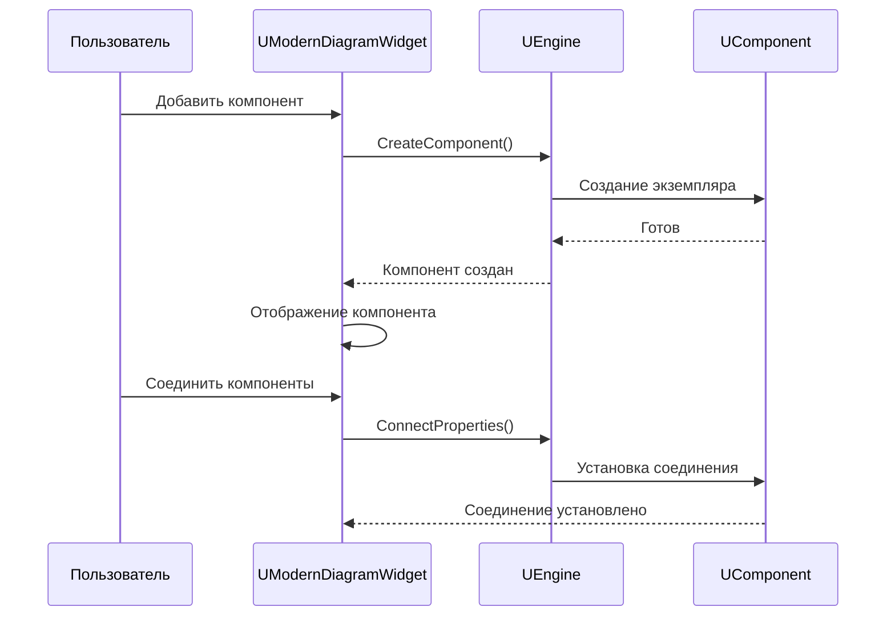
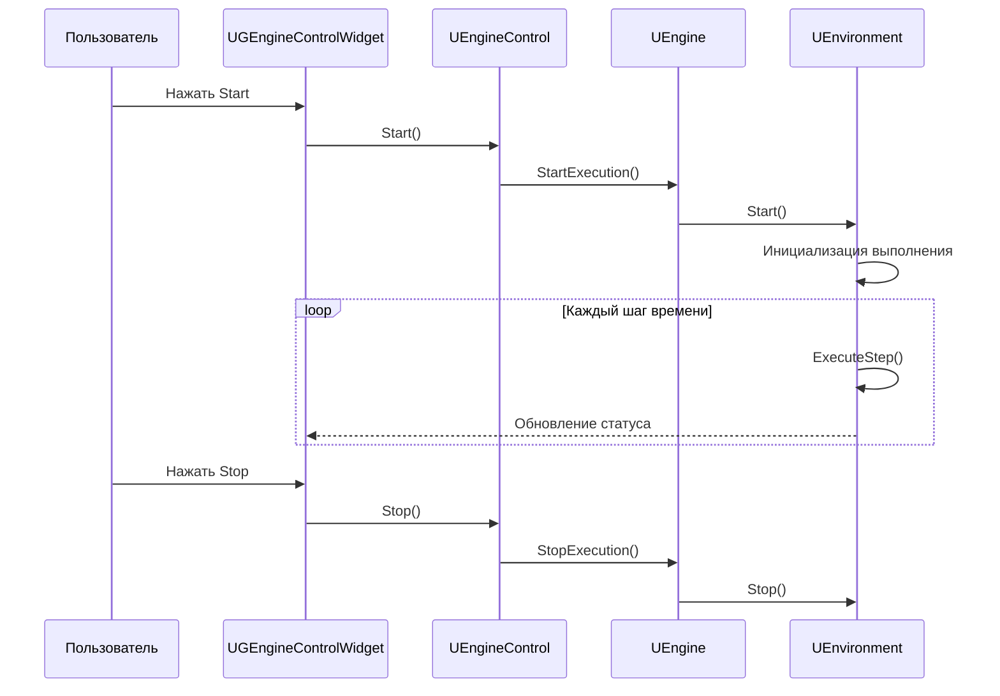

# Справочник виджетов (Widgets Reference)

## RU

### Обзор

Описание основных виджетов GUI приложения Nmsdk.

### Основные виджеты

#### UModernDiagramWidget

Визуальный редактор диаграмм компонентов.

**Основные функции:**
- Создание и редактирование компонентов
- Соединение компонентов
- Визуализация сетей компонентов
- Drag & Drop операции

**Взаимодействие с движком:**

#### UDrawEngineImageWidget

Виджет для отображения изображений из компонентов.

#### UGEngineControlWidget

Виджет управления движком выполнения.

**Основные функции:**
- Запуск/остановка выполнения
- Управление шагами времени
- Мониторинг состояния

**Взаимодействие с движком:**

#### UComponentPropertyEditor

Редактор свойств компонентов.

**Основные функции:**
- Редактирование параметров компонентов
- Настройка входов и выходов
- Валидация значений

#### ULoggerWidget

Окно логов для мониторинга выполнения.

**Основные функции:**
- Отображение логов выполнения
- Фильтрация по уровням
- Поиск в логах

#### UGraphWidget

Виджет для визуализации графиков данных компонентов.

**Основные функции:**
- Отображение временных рядов
- Настройка осей и масштаба
- Экспорт графиков

### См. также

- [GUI Overview](Overview.md)
- [Bin/Help](../../Bin/Help/) - пользовательская справка

---

## EN

### Overview

Description of main widgets in Nmsdk GUI application.

### Main Widgets

#### UModernDiagramWidget

Visual diagram editor for components.

#### UDrawEngineImageWidget

Widget for displaying images from components.

#### UGEngineControlWidget

Widget for controlling execution engine.

#### UComponentPropertyEditor

Component property editor.

#### ULoggerWidget

Log window for execution monitoring.

#### UGraphWidget

Widget for visualizing component data graphs.

### See Also

- [GUI Overview](Overview.md)
- [Bin/Help](../../Bin/Help/) - user help
