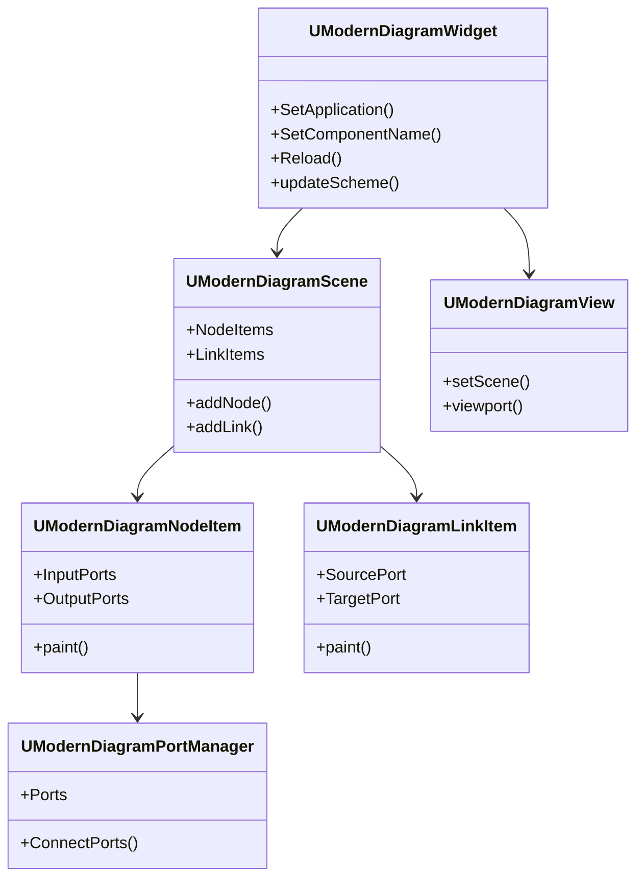
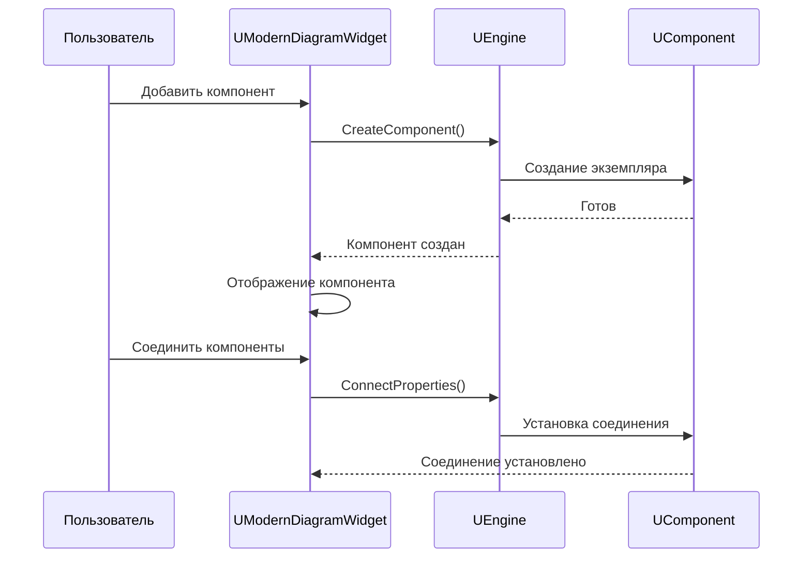
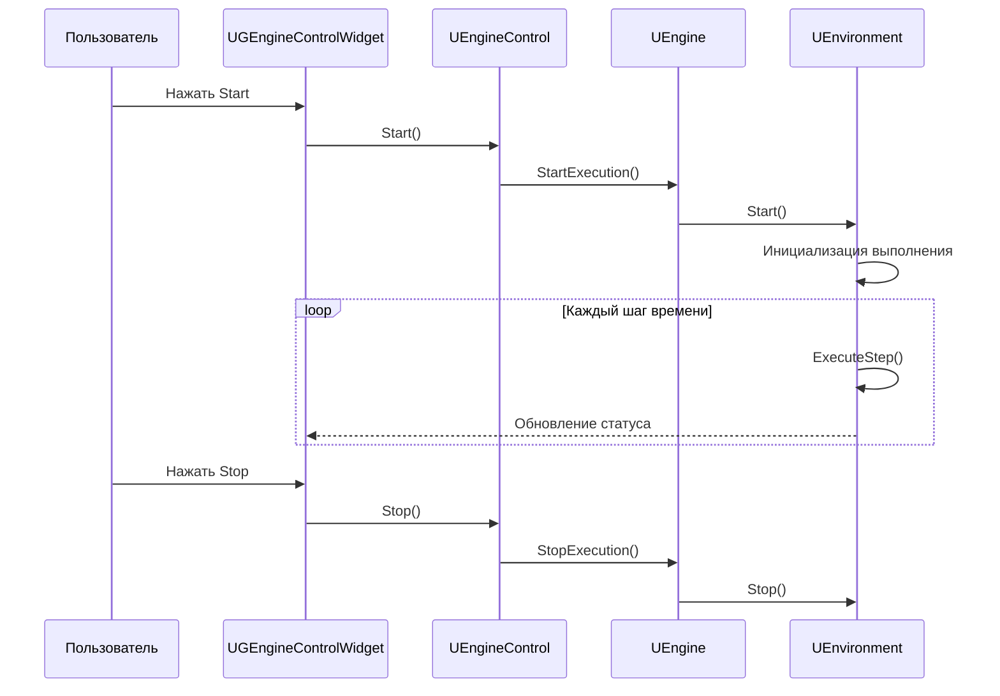
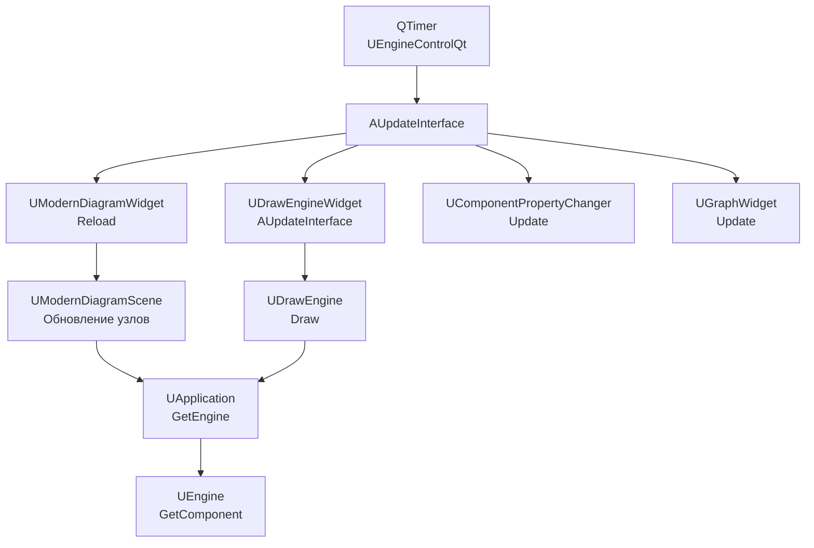

# Справочник виджетов (Widgets Reference)

## RU

### Обзор

Описание основных виджетов GUI приложения Nmsdk.

### Основные виджеты

#### UModernDiagramWidget

Визуальный редактор диаграмм компонентов.

**Основные функции:**
- Создание и редактирование компонентов
- Соединение компонентов
- Визуализация сетей компонентов
- Drag & Drop операции

`UModernDiagramWidget` использует архитектуру Qt Graphics Framework: `UModernDiagramScene` (QGraphicsScene) содержит элементы (`UModernDiagramNodeItem`, `UModernDiagramLinkItem`), а `UModernDiagramView` (QGraphicsView) отображает сцену. Виджет управляет кэшированием (`UModernDiagramCacheManager`), координатами (`UModernDiagramCoordinateManager`), viewport (`UModernDiagramViewportManager`) и контекстным меню (`UModernDiagramContextMenu`).

**Архитектура виджета:**

**Взаимодействие с движком:**

#### UDrawEngineImageWidget

Виджет для отображения изображений из компонентов.

Использует `UDrawEngine` для отрисовки схемы компонентов в растровом формате. Работает совместно с `UModernDiagramWidget` в `UDrawEngineWidget`, предоставляя альтернативный способ визуализации (legacy режим).

#### UGEngineControlWidget

Виджет управления движком выполнения.

**Основные функции:**
- Запуск/остановка выполнения
- Управление шагами времени
- Мониторинг состояния

`UGEngineControlWidget` является главным окном приложения (`UVisualControllerMainWidget`) и содержит все основные виджеты: `UModernDiagramWidget`, `UComponentsListWidget`, `UComponentPropertyChanger`, `ULoggerWidget`, `UGraphWidget` и др. Он управляет жизненным циклом приложения и координирует взаимодействие между виджетами.

**Взаимодействие с движком:**

#### UComponentPropertyChanger

Редактор свойств компонентов.

**Основные функции:**
- Редактирование параметров компонентов
- Настройка входов и выходов
- Валидация значений

`UComponentPropertyChanger` отображает свойства выбранного компонента в виде дерева (`QTreeWidget`) и позволяет редактировать их значения. Автоматически обновляется при изменении выбранного компонента в диаграмме или списке компонентов.

#### ULoggerWidget

Окно логов для мониторинга выполнения.

**Основные функции:**
- Отображение логов выполнения
- Фильтрация по уровням
- Поиск в логах

#### UGraphWidget

Виджет для визуализации графиков данных компонентов.

**Основные функции:**
- Отображение временных рядов
- Настройка осей и масштаба
- Экспорт графиков

**Процесс обновления интерфейса:**

`UEngineControlQt` запускает таймер (интервал 16 мс для режима 0 или `MTUpdateInterfaceInterval` для режима 1), который вызывает `AUpdateInterface()` у всех виджетов, наследующих `UVisualControllerWidget`. Виджеты обновляют своё состояние, читая данные из `UApplication` и `UEngine`.

### См. также

- [GUI Overview](Overview.md)
- [Bin/Help](../../Bin/Help/) - пользовательская справка

---

## EN

### Overview

Description of main widgets in Nmsdk GUI application.

### Main Widgets

#### UModernDiagramWidget

Visual diagram editor for components.

`UModernDiagramWidget` uses Qt Graphics Framework architecture: `UModernDiagramScene` (QGraphicsScene) contains items (`UModernDiagramNodeItem`, `UModernDiagramLinkItem`), and `UModernDiagramView` (QGraphicsView) displays the scene. The widget manages caching (`UModernDiagramCacheManager`), coordinates (`UModernDiagramCoordinateManager`), viewport (`UModernDiagramViewportManager`), and context menu (`UModernDiagramContextMenu`).

#### UDrawEngineImageWidget

Widget for displaying images from components.

Uses `UDrawEngine` to render component diagrams in bitmap format. Works together with `UModernDiagramWidget` in `UDrawEngineWidget`, providing an alternative visualization method (legacy mode).

#### UGEngineControlWidget

Widget for controlling execution engine.

`UGEngineControlWidget` is the main application window (`UVisualControllerMainWidget`) and contains all main widgets: `UModernDiagramWidget`, `UComponentsListWidget`, `UComponentPropertyChanger`, `ULoggerWidget`, `UGraphWidget`, etc. It manages the application lifecycle and coordinates interaction between widgets.

#### UComponentPropertyChanger

Component property editor.

`UComponentPropertyChanger` displays properties of the selected component as a tree (`QTreeWidget`) and allows editing their values. Automatically updates when the selected component changes in the diagram or component list.

#### ULoggerWidget

Log window for execution monitoring.

#### UGraphWidget

Widget for visualizing component data graphs.

**Interface update process:**

`UEngineControlQt` starts a timer (16 ms interval for mode 0 or `MTUpdateInterfaceInterval` for mode 1), which calls `AUpdateInterface()` on all widgets inheriting `UVisualControllerWidget`. Widgets update their state by reading data from `UApplication` and `UEngine`.

### See Also

- [GUI Overview](Overview.md)
- [Bin/Help](../../Bin/Help/) - user help
