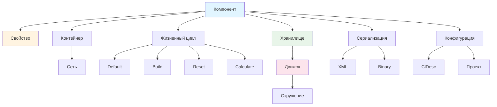
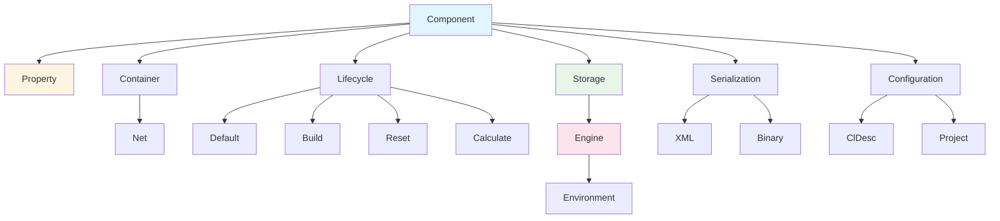

# Глоссарий терминов Nmsdk

## RU

### Назначение

Этот глоссарий содержит определения основных терминов, используемых в проекте Nmsdk. Термины собраны из различных источников документации и организованы по категориям.

### Основные термины системы

#### Компонент (Component)

**Определение:** Базовая функциональная единица системы Nmsdk.

**Описание:** Компонент - это класс, наследующий от `UComponent` или его потомков (`UContainer`, `UNet`). Компоненты реализуют определенную функциональность и могут быть соединены в сети для выполнения сложных задач.

**Связанные термины:** Свойство, Контейнер, Сеть

**См. также:**
- [Overview/README.md](Overview/README.md) - основные термины
- [Component System](Rdk/Docs/Guides/Component-System.md) - компонентная система
- [Rdk/Docs/Guides/Creating-Components.md](../Rdk/Docs/Guides/Creating-Components.md) - создание компонентов

#### Свойство (Property)

**Определение:** Параметр, состояние, вход или выход компонента.

**Описание:** Свойства используются для настройки компонента, передачи данных между компонентами и хранения состояния. Свойства могут быть параметрами (настраиваются пользователем), состояниями (только для чтения), входами или выходами.

**Типы свойств:**
- `ptPubParam` - публичный параметр
- `ptPubState` - публичное состояние
- `ptInput` - входное свойство
- `ptOutput` - выходное свойство

**См. также:**
- [Rdk/Docs/Guides/Creating-Properties.md](../Rdk/Docs/Guides/Creating-Properties.md) - создание свойств
- [Rdk/Docs/Diagrams/Property-System.md](../Rdk/Docs/Diagrams/Property-System.md) - система свойств

#### Контейнер (Container)

**Определение:** Группа компонентов, объединенных в единую структуру.

**Описание:** Контейнер - это компонент, который может содержать другие компоненты. Базовый класс - `UContainer`.

**См. также:**
- [Engine Architecture](Rdk/Docs/Architecture/Engine-Architecture.md) - архитектура движка

#### Сеть (Net)

**Определение:** Соединение компонентов в вычислительную сеть.

**Описание:** Сеть - это контейнер, компоненты которого соединены через свойства. Базовый класс - `UNet`.

**См. также:**
- [Engine Architecture](Rdk/Docs/Architecture/Engine-Architecture.md) - архитектура движка

#### Окружение (Environment)

**Определение:** Контекст выполнения компонентов.

**Описание:** Окружение предоставляет общие ресурсы для компонентов: логирование, RPC, системные абстракции.

**См. также:**
- [Rdk/Docs/Engine-Detailed.md](../Rdk/Docs/Engine-Detailed.md) - детали движка

#### Хранилище (Storage)

**Определение:** Реестр компонентов и их описаний.

**Описание:** Хранилище содержит информацию о всех зарегистрированных компонентах и позволяет создавать экземпляры компонентов.

**См. также:**
- [Rdk/Docs/Engine-Detailed.md](../Rdk/Docs/Engine-Detailed.md) - детали движка

#### Движок (Engine)

**Определение:** Управление выполнением компонентов.

**Описание:** Движок управляет жизненным циклом компонентов и их выполнением.

**См. также:**
- [Engine Architecture](Rdk/Docs/Architecture/Engine-Architecture.md) - архитектура движка
- [Rdk/Docs/Engine-Detailed.md](../Rdk/Docs/Engine-Detailed.md) - детали движка

### Термины библиотек

#### Терминология компонентов

Для расшифровки префиксов и аббревиатур в именах компонентов см. [Libraries/Terminology-Glossary.md](../Libraries/Terminology-Glossary.md).

**Основные префиксы:**
- `N` - компоненты библиотеки Nmsdk
- `U` - базовые классы Rdk Framework
- `T` - шаблонные классы
- `NC` - Continuous (непрерывный)
- `NP` - Pulse (импульсный)

**Основные аббревиатуры:**
- `STDP` - Spike-Timing Dependent Plasticity
- `IaF` - Integrate and Fire
- `LT` - Low Threshold
- `IO` - Input/Output

### Термины жизненного цикла

#### Default()

**Определение:** Метод инициализации значений по умолчанию компонента.

**Описание:** Вызывается первым в жизненном цикле компонента. Устанавливает начальные значения свойств.

**См. также:**
- [Rdk/Docs/Diagrams/Component-Lifecycle.md](../Rdk/Docs/Diagrams/Component-Lifecycle.md) - жизненный цикл

#### Build()

**Определение:** Метод построения внутренней структуры компонента.

**Описание:** Вызывается после `Default()`. Создает подкомпоненты, настраивает связи, проверяет готовность.

**См. также:**
- [Rdk/Docs/Diagrams/Component-Lifecycle.md](../Rdk/Docs/Diagrams/Component-Lifecycle.md) - жизненный цикл

#### Reset()

**Определение:** Метод сброса состояния компонента.

**Описание:** Вызывается для сброса состояния компонента перед новым циклом вычислений.

#### Calculate()

**Определение:** Метод выполнения вычислений компонента.

**Описание:** Основной метод компонента, выполняющий его функциональность. Вызывается многократно во время выполнения.

### Термины сериализации

#### XML Сериализация

**Определение:** Текстовый формат сериализации компонентов и проектов.

**Описание:** Используется для сохранения и загрузки проектов, конфигураций. Читаемый человеком формат.

**См. также:**
- [Serialize Architecture](Rdk/Docs/Architecture/Serialize-Architecture.md) - архитектура сериализации
- [Rdk/Docs/Guides/Serialization-Guide.md](../Rdk/Docs/Guides/Serialization-Guide.md) - руководство по сериализации

#### Binary Сериализация

**Определение:** Бинарный формат сериализации.

**Описание:** Более компактный и быстрый формат сериализации по сравнению с XML.

### Термины конфигураций

#### ClDesc

**Определение:** Описание класса компонента (Class Description).

**Описание:** XML файл, содержащий метаданные о компоненте: имя, описание, свойства, категорию. Используется для отображения компонента в GUI.

**См. также:**
- [Bin/Docs/Configs-Structure.md](../Bin/Docs/Configs-Structure.md) - структура конфигураций
- [Bin/Docs/Examples/ClDesc-Example.md](../Bin/Docs/Examples/ClDesc-Example.md) - пример ClDesc

#### Проект (Project)

**Определение:** Конфигурация компонентов и их связей.

**Описание:** Проект описывается в XML файле и содержит список компонентов, их параметры и связи между ними.

**См. также:**
- [Components-And-Configuration/Configuration-Files-Overview.md](Components-And-Configuration/Configuration-Files-Overview.md) - обзор конфигураций

### Диаграмма связей терминов

### Источники терминов

- [Overview/README.md](Overview/README.md) - основные термины системы
- [Libraries/Terminology-Glossary.md](../Libraries/Terminology-Glossary.md) - терминология компонентов библиотек
- [Rdk/Docs/](../Rdk/Docs/) - термины ядра Rdk
- Другие документы проекта

---

## EN

### Purpose

This glossary contains definitions of main terms used in the Nmsdk project. Terms are collected from various documentation sources and organized by categories.

### Core System Terms

#### Component

**Definition:** Basic functional unit of the Nmsdk system.

**Description:** A component is a class inheriting from `UComponent` or its descendants (`UContainer`, `UNet`). Components implement specific functionality and can be connected into networks to perform complex tasks.

**Related Terms:** Property, Container, Net

**See Also:**
- [Overview/README.md](Overview/README.md) - core terms
- [Components-And-Configuration/Component-System.md](Components-And-Configuration/Component-System.md) - component system
- [Rdk/Docs/Guides/Creating-Components.md](../Rdk/Docs/Guides/Creating-Components.md) - creating components

#### Property

**Definition:** Parameter, state, input or output of a component.

**Description:** Properties are used to configure components, transfer data between components, and store state. Properties can be parameters (user-configurable), states (read-only), inputs, or outputs.

**Property Types:**
- `ptPubParam` - public parameter
- `ptPubState` - public state
- `ptInput` - input property
- `ptOutput` - output property

**See Also:**
- [Rdk/Docs/Guides/Creating-Properties.md](../Rdk/Docs/Guides/Creating-Properties.md) - creating properties
- [Rdk/Docs/Diagrams/Property-System.md](../Rdk/Docs/Diagrams/Property-System.md) - property system

#### Container

**Definition:** Group of components combined into a single structure.

**Description:** A container is a component that can contain other components. Base class is `UContainer`.

**See Also:**
- [Rdk-Core/Engine-Architecture.md](Rdk-Core/Engine-Architecture.md) - engine architecture

#### Net

**Definition:** Connection of components into a computational network.

**Description:** A net is a container whose components are connected through properties. Base class is `UNet`.

**See Also:**
- [Rdk-Core/Engine-Architecture.md](Rdk-Core/Engine-Architecture.md) - engine architecture

#### Environment

**Definition:** Execution context for components.

**Description:** Environment provides common resources for components: logging, RPC, system abstractions.

**See Also:**
- [Rdk/Docs/Engine-Detailed.md](../Rdk/Docs/Engine-Detailed.md) - engine details

#### Storage

**Definition:** Registry of components and their descriptions.

**Description:** Storage contains information about all registered components and allows creating component instances.

**See Also:**
- [Rdk/Docs/Engine-Detailed.md](../Rdk/Docs/Engine-Detailed.md) - engine details

#### Engine

**Definition:** Component execution management.

**Description:** Engine manages component lifecycle and execution.

**See Also:**
- [Rdk-Core/Engine-Architecture.md](Rdk-Core/Engine-Architecture.md) - engine architecture
- [Rdk/Docs/Engine-Detailed.md](../Rdk/Docs/Engine-Detailed.md) - engine details

### Library Terms

#### Component Terminology

For decoding prefixes and abbreviations in component names see [Libraries/Terminology-Glossary.md](../Libraries/Terminology-Glossary.md).

**Main Prefixes:**
- `N` - Nmsdk library components
- `U` - Rdk Framework base classes
- `T` - template classes
- `NC` - Continuous
- `NP` - Pulse

**Main Abbreviations:**
- `STDP` - Spike-Timing Dependent Plasticity
- `IaF` - Integrate and Fire
- `LT` - Low Threshold
- `IO` - Input/Output

### Lifecycle Terms

#### Default()

**Definition:** Method for initializing component default values.

**Description:** Called first in component lifecycle. Sets initial property values.

**See Also:**
- [Rdk/Docs/Diagrams/Component-Lifecycle.md](../Rdk/Docs/Diagrams/Component-Lifecycle.md) - lifecycle

#### Build()

**Definition:** Method for building component internal structure.

**Description:** Called after `Default()`. Creates subcomponents, configures connections, checks readiness.

**See Also:**
- [Rdk/Docs/Diagrams/Component-Lifecycle.md](../Rdk/Docs/Diagrams/Component-Lifecycle.md) - lifecycle

#### Reset()

**Definition:** Method for resetting component state.

**Description:** Called to reset component state before new computation cycle.

#### Calculate()

**Definition:** Method for executing component calculations.

**Description:** Main component method performing its functionality. Called multiple times during execution.

### Serialization Terms

#### XML Serialization

**Definition:** Text format for serializing components and projects.

**Description:** Used for saving and loading projects, configurations. Human-readable format.

**See Also:**
- [Rdk-Core/Serialize-Architecture.md](Rdk-Core/Serialize-Architecture.md) - serialization architecture
- [Rdk/Docs/Guides/Serialization-Guide.md](../Rdk/Docs/Guides/Serialization-Guide.md) - serialization guide

#### Binary Serialization

**Definition:** Binary serialization format.

**Description:** More compact and faster serialization format compared to XML.

### Configuration Terms

#### ClDesc

**Definition:** Class Description - component class description.

**Description:** XML file containing component metadata: name, description, properties, category. Used for displaying component in GUI.

**See Also:**
- [Bin/Docs/Configs-Structure.md](../Bin/Docs/Configs-Structure.md) - configuration structure
- [Bin/Docs/Examples/ClDesc-Example.md](../Bin/Docs/Examples/ClDesc-Example.md) - ClDesc example

#### Project

**Definition:** Configuration of components and their connections.

**Description:** Project is described in XML file and contains list of components, their parameters, and connections between them.

**See Also:**
- [Components-And-Configuration/Configuration-Files-Overview.md](Components-And-Configuration/Configuration-Files-Overview.md) - configuration overview

### Term Relationships Diagram

### Term Sources

- [Overview/README.md](Overview/README.md) - core system terms
- [Libraries/Terminology-Glossary.md](../Libraries/Terminology-Glossary.md) - library component terminology
- [Rdk/Docs/](../Rdk/Docs/) - Rdk core terms
- Other project documents
