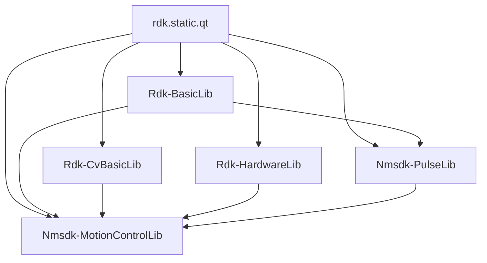

# Обзор библиотек (Libraries Overview)

## RU

### Назначение

Библиотеки в папке `Libraries/` содержат реализацию конкретных компонентов, расширяющих базовую функциональность ядра Rdk.

### Список библиотек

#### Основные библиотеки

1. **Rdk-BasicLib** - Базовые компоненты для работы с данными
2. **Rdk-CvBasicLib** - Компоненты компьютерного зрения на базе OpenCV
3. **Rdk-HardwareLib** - Работа с аппаратным обеспечением (Arduino и др.)
4. **Nmsdk-PulseLib** - Импульсные нейронные сети
5. **Nmsdk-MotionControlLib** - Управление движением и робототехника

#### Библиотеки машинного обучения

6. **Rdk-PyMachineLearningLib** - Интеграция с Python ML библиотеками
7. **Rdk-TensorflowLib** - Интеграция с TensorFlow
8. **Rdk-DarknetLib** - Интеграция с Darknet

### Зависимости между библиотеками

### Механизм загрузки библиотек

Библиотеки загружаются через функцию `RdkLoadPredefinedLibraries()` в файле `Libraries/Libraries.cpp`.

### Детальная документация

- [Rdk-BasicLib](Rdk-BasicLib.md)
- [Rdk-CvBasicLib](Rdk-CvBasicLib.md)
- [Rdk-HardwareLib](Rdk-HardwareLib.md)
- [Nmsdk-PulseLib](Nmsdk-PulseLib.md)
- [Nmsdk-MotionControlLib](Nmsdk-MotionControlLib.md)
- [Rdk-PyMachineLearningLib](Rdk-PyMachineLearningLib.md)
- [Rdk-TensorflowLib](Rdk-TensorflowLib.md)
- [Rdk-DarknetLib](Rdk-DarknetLib.md)

### См. также

- [Reports/02-Libraries-Overview.md](../../Reports/02-Libraries-Overview.md) - детальный обзор
- [Component System](../Components-And-Configuration/Component-System.md)

---

## EN

### Purpose

Libraries in the `Libraries/` folder contain implementations of specific components that extend the basic functionality of the Rdk core.

### Library List

#### Main Libraries

1. **Rdk-BasicLib** - Basic components for data operations
2. **Rdk-CvBasicLib** - Computer vision components based on OpenCV
3. **Rdk-HardwareLib** - Hardware integration (Arduino, etc.)
4. **Nmsdk-PulseLib** - Spiking Neural Networks
5. **Nmsdk-MotionControlLib** - Motion control and robotics

#### Machine Learning Libraries

6. **Rdk-PyMachineLearningLib** - Integration with Python ML libraries
7. **Rdk-TensorflowLib** - TensorFlow integration
8. **Rdk-DarknetLib** - Darknet integration

### Library Dependencies

### Library Loading Mechanism

Libraries are loaded through the `RdkLoadPredefinedLibraries()` function in `Libraries/Libraries.cpp`.

### Detailed Documentation

### See Also

- [Reports/02-Libraries-Overview.md](../../Reports/02-Libraries-Overview.md) - detailed overview
- [Component System](../Components-And-Configuration/Component-System.md)
