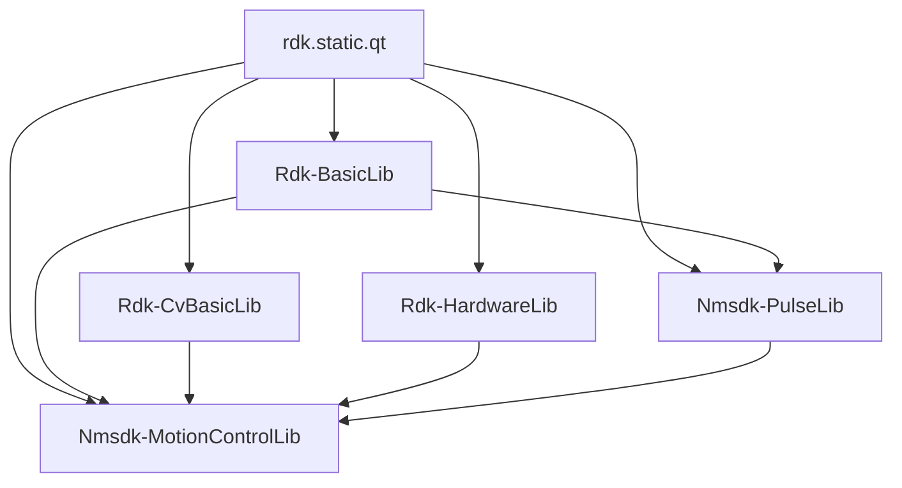

# Обзор библиотек (Libraries Overview)

## RU

### Назначение

Библиотеки в папке `Libraries/` содержат реализацию конкретных компонентов, расширяющих базовую функциональность ядра Rdk.

### Список библиотек

#### Основные библиотеки

1. **Rdk-BasicLib** - Базовые компоненты для работы с данными
2. **Rdk-CvBasicLib** - Компоненты компьютерного зрения на базе OpenCV
3. **Rdk-HardwareLib** - Работа с аппаратным обеспечением (Arduino и др.)
4. **Nmsdk-PulseLib** - Импульсные нейронные сети
5. **Nmsdk-MotionControlLib** - Управление движением и робототехника

#### Библиотеки машинного обучения

6. **Rdk-PyMachineLearningLib** - Интеграция с Python ML библиотеками
7. **Rdk-TensorflowLib** - Интеграция с TensorFlow
8. **Rdk-DarknetLib** - Интеграция с Darknet

### Зависимости между библиотеками

### Механизм загрузки библиотек

Библиотеки загружаются через функцию `RdkLoadPredefinedLibraries()` в файле `Libraries/Libraries.cpp`.

### Детальная документация

#### Основные библиотеки

1. **Rdk-BasicLib** - Базовые компоненты
   - [Корневая документация](Rdk-BasicLib.md) - обзор библиотеки
   - [Детальная документация](../Libraries/Rdk-BasicLib/Docs/README.md) - полная документация в репозитории библиотеки
   - [Архитектура](../Libraries/Rdk-BasicLib/Docs/Architecture.md) - архитектура библиотеки
   - [Каталог компонентов](../Libraries/Rdk-BasicLib/Docs/Component-Catalog.md) - список всех компонентов
   - [API Обзор](../Libraries/Rdk-BasicLib/Docs/API-Overview.md) - обзор API

2. **Rdk-CvBasicLib** - Компьютерное зрение
   - [Корневая документация](Rdk-CvBasicLib.md) - обзор библиотеки
   - [Детальная документация](../Libraries/Rdk-CvBasicLib/Docs/README.md) - полная документация в репозитории библиотеки
   - [Архитектура](../Libraries/Rdk-CvBasicLib/Docs/Architecture.md) - архитектура библиотеки
   - [Каталог компонентов](../Libraries/Rdk-CvBasicLib/Docs/Component-Catalog.md) - список всех компонентов
   - [API Обзор](../Libraries/Rdk-CvBasicLib/Docs/API-Overview.md) - обзор API

3. **Rdk-HardwareLib** - Аппаратное обеспечение
   - [Корневая документация](Rdk-HardwareLib.md) - обзор библиотеки
   - [Детальная документация](../Libraries/Rdk-HardwareLib/Docs/README.md) - полная документация в репозитории библиотеки
   - [Архитектура](../Libraries/Rdk-HardwareLib/Docs/Architecture.md) - архитектура библиотеки
   - [Каталог компонентов](../Libraries/Rdk-HardwareLib/Docs/Component-Catalog.md) - список всех компонентов
   - [API Обзор](../Libraries/Rdk-HardwareLib/Docs/API-Overview.md) - обзор API

4. **Nmsdk-PulseLib** - Импульсные нейронные сети
   - [Корневая документация](Nmsdk-PulseLib.md) - обзор библиотеки
   - [Детальная документация](../Libraries/Nmsdk-PulseLib/Docs/README.md) - полная документация в репозитории библиотеки
   - [Архитектура](../Libraries/Nmsdk-PulseLib/Docs/Architecture.md) - архитектура библиотеки
   - [Каталог компонентов](../Libraries/Nmsdk-PulseLib/Docs/Component-Catalog.md) - список всех компонентов
   - [API Обзор](../Libraries/Nmsdk-PulseLib/Docs/API-Overview.md) - обзор API
   - [Примеры использования](../Libraries/Nmsdk-PulseLib/Docs/Usage-Examples.md) - практические примеры

5. **Nmsdk-MotionControlLib** - Управление движением
   - [Корневая документация](Nmsdk-MotionControlLib.md) - обзор библиотеки
   - [Детальная документация](../Libraries/Nmsdk-MotionControlLib/Docs/README.md) - полная документация в репозитории библиотеки
   - [Архитектура](../Libraries/Nmsdk-MotionControlLib/Docs/Architecture.md) - архитектура библиотеки
   - [Каталог компонентов](../Libraries/Nmsdk-MotionControlLib/Docs/Component-Catalog.md) - список всех компонентов
   - [API Обзор](../Libraries/Nmsdk-MotionControlLib/Docs/API-Overview.md) - обзор API

#### Библиотеки машинного обучения

6. **Rdk-PyMachineLearningLib** - Python ML
   - [Корневая документация](Rdk-PyMachineLearningLib.md) - обзор библиотеки
   - [Детальная документация](../Libraries/Rdk-PyMachineLearningLib/Docs/README.md) - полная документация в репозитории библиотеки
   - [Архитектура](../Libraries/Rdk-PyMachineLearningLib/Docs/Architecture.md) - архитектура библиотеки
   - [Каталог компонентов](../Libraries/Rdk-PyMachineLearningLib/Docs/Component-Catalog.md) - список всех компонентов
   - [API Обзор](../Libraries/Rdk-PyMachineLearningLib/Docs/API-Overview.md) - обзор API

7. **Rdk-TensorflowLib** - TensorFlow
   - [Корневая документация](Rdk-TensorflowLib.md) - обзор библиотеки
   - [Детальная документация](../Libraries/Rdk-TensorflowLib/Docs/README.md) - полная документация в репозитории библиотеки
   - [Архитектура](../Libraries/Rdk-TensorflowLib/Docs/Architecture.md) - архитектура библиотеки
   - [Каталог компонентов](../Libraries/Rdk-TensorflowLib/Docs/Component-Catalog.md) - список всех компонентов
   - [API Обзор](../Libraries/Rdk-TensorflowLib/Docs/API-Overview.md) - обзор API

8. **Rdk-DarknetLib** - Darknet
   - [Корневая документация](Rdk-DarknetLib.md) - обзор библиотеки
   - [Детальная документация](../Libraries/Rdk-DarknetLib/Docs/README.md) - полная документация в репозитории библиотеки
   - [Архитектура](../Libraries/Rdk-DarknetLib/Docs/Architecture.md) - архитектура библиотеки
   - [Каталог компонентов](../Libraries/Rdk-DarknetLib/Docs/Component-Catalog.md) - список всех компонентов
   - [API Обзор](../Libraries/Rdk-DarknetLib/Docs/API-Overview.md) - обзор API

### Индексы документации

- [Полный индекс документации библиотек](../Submodules/Libraries-Index.md) - структурированный индекс всей документации библиотек
- [Навигационная карта](../Submodules/Navigation-Map.md) - визуальная карта документации

### См. также

- [Component System](../Components-And-Configuration/Component-System.md)

---

## EN

### Purpose

Libraries in the `Libraries/` folder contain implementations of specific components that extend the basic functionality of the Rdk core.

### Library List

#### Main Libraries

1. **Rdk-BasicLib** - Basic components for data operations
2. **Rdk-CvBasicLib** - Computer vision components based on OpenCV
3. **Rdk-HardwareLib** - Hardware integration (Arduino, etc.)
4. **Nmsdk-PulseLib** - Spiking Neural Networks
5. **Nmsdk-MotionControlLib** - Motion control and robotics

#### Machine Learning Libraries

6. **Rdk-PyMachineLearningLib** - Integration with Python ML libraries
7. **Rdk-TensorflowLib** - TensorFlow integration
8. **Rdk-DarknetLib** - Darknet integration

### Library Dependencies

### Library Loading Mechanism

Libraries are loaded through the `RdkLoadPredefinedLibraries()` function in `Libraries/Libraries.cpp`.

### Detailed Documentation

#### Main Libraries

1. **Rdk-BasicLib** - Basic Components
   - [Root Documentation](Rdk-BasicLib.md) - library overview
   - [Detailed Documentation](../Libraries/Rdk-BasicLib/Docs/README.md) - complete documentation in library repository
   - [Architecture](../Libraries/Rdk-BasicLib/Docs/Architecture.md) - library architecture
   - [Component Catalog](../Libraries/Rdk-BasicLib/Docs/Component-Catalog.md) - list of all components
   - [API Overview](../Libraries/Rdk-BasicLib/Docs/API-Overview.md) - API overview

2. **Rdk-CvBasicLib** - Computer Vision
   - [Root Documentation](Rdk-CvBasicLib.md) - library overview
   - [Detailed Documentation](../Libraries/Rdk-CvBasicLib/Docs/README.md) - complete documentation in library repository
   - [Architecture](../Libraries/Rdk-CvBasicLib/Docs/Architecture.md) - library architecture
   - [Component Catalog](../Libraries/Rdk-CvBasicLib/Docs/Component-Catalog.md) - list of all components
   - [API Overview](../Libraries/Rdk-CvBasicLib/Docs/API-Overview.md) - API overview

3. **Rdk-HardwareLib** - Hardware
   - [Root Documentation](Rdk-HardwareLib.md) - library overview
   - [Detailed Documentation](../Libraries/Rdk-HardwareLib/Docs/README.md) - complete documentation in library repository
   - [Architecture](../Libraries/Rdk-HardwareLib/Docs/Architecture.md) - library architecture
   - [Component Catalog](../Libraries/Rdk-HardwareLib/Docs/Component-Catalog.md) - list of all components
   - [API Overview](../Libraries/Rdk-HardwareLib/Docs/API-Overview.md) - API overview

4. **Nmsdk-PulseLib** - Spiking Neural Networks
   - [Root Documentation](Nmsdk-PulseLib.md) - library overview
   - [Detailed Documentation](../Libraries/Nmsdk-PulseLib/Docs/README.md) - complete documentation in library repository
   - [Architecture](../Libraries/Nmsdk-PulseLib/Docs/Architecture.md) - library architecture
   - [Component Catalog](../Libraries/Nmsdk-PulseLib/Docs/Component-Catalog.md) - list of all components
   - [API Overview](../Libraries/Nmsdk-PulseLib/Docs/API-Overview.md) - API overview
   - [Usage Examples](../Libraries/Nmsdk-PulseLib/Docs/Usage-Examples.md) - practical examples

5. **Nmsdk-MotionControlLib** - Motion Control
   - [Root Documentation](Nmsdk-MotionControlLib.md) - library overview
   - [Detailed Documentation](../Libraries/Nmsdk-MotionControlLib/Docs/README.md) - complete documentation in library repository
   - [Architecture](../Libraries/Nmsdk-MotionControlLib/Docs/Architecture.md) - library architecture
   - [Component Catalog](../Libraries/Nmsdk-MotionControlLib/Docs/Component-Catalog.md) - list of all components
   - [API Overview](../Libraries/Nmsdk-MotionControlLib/Docs/API-Overview.md) - API overview

#### Machine Learning Libraries

6. **Rdk-PyMachineLearningLib** - Python ML
   - [Root Documentation](Rdk-PyMachineLearningLib.md) - library overview
   - [Detailed Documentation](../Libraries/Rdk-PyMachineLearningLib/Docs/README.md) - complete documentation in library repository
   - [Architecture](../Libraries/Rdk-PyMachineLearningLib/Docs/Architecture.md) - library architecture
   - [Component Catalog](../Libraries/Rdk-PyMachineLearningLib/Docs/Component-Catalog.md) - list of all components
   - [API Overview](../Libraries/Rdk-PyMachineLearningLib/Docs/API-Overview.md) - API overview

7. **Rdk-TensorflowLib** - TensorFlow
   - [Root Documentation](Rdk-TensorflowLib.md) - library overview
   - [Detailed Documentation](../Libraries/Rdk-TensorflowLib/Docs/README.md) - complete documentation in library repository
   - [Architecture](../Libraries/Rdk-TensorflowLib/Docs/Architecture.md) - library architecture
   - [Component Catalog](../Libraries/Rdk-TensorflowLib/Docs/Component-Catalog.md) - list of all components
   - [API Overview](../Libraries/Rdk-TensorflowLib/Docs/API-Overview.md) - API overview

8. **Rdk-DarknetLib** - Darknet
   - [Root Documentation](Rdk-DarknetLib.md) - library overview
   - [Detailed Documentation](../Libraries/Rdk-DarknetLib/Docs/README.md) - complete documentation in library repository
   - [Architecture](../Libraries/Rdk-DarknetLib/Docs/Architecture.md) - library architecture
   - [Component Catalog](../Libraries/Rdk-DarknetLib/Docs/Component-Catalog.md) - list of all components
   - [API Overview](../Libraries/Rdk-DarknetLib/Docs/API-Overview.md) - API overview

### Documentation Indexes

- [Complete Libraries Documentation Index](../Submodules/Libraries-Index.md) - structured index of all library documentation
- [Navigation Map](../Submodules/Navigation-Map.md) - visual documentation map

### See Also

- [Component System](../Components-And-Configuration/Component-System.md)
