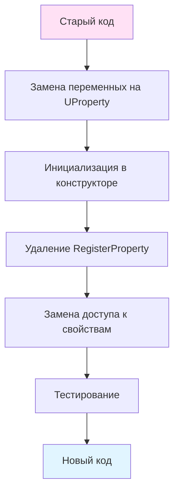
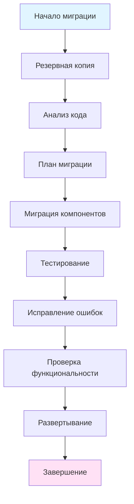

# Руководство по миграции API (API Migration Guide)

## RU

### Обзор

Это руководство описывает процесс миграции кода с старых версий API Nmsdk на новые версии. Оно содержит примеры изменений и рекомендации по обновлению кода.

### История изменений API

Основные изменения API документированы в [Refactoring History](../Refactoring-History/Refactoring-Timeline.md). Ниже приведены ключевые изменения и способы миграции.

### Изменения в системе свойств

#### Старый API (до версии 2.0)

```cpp
// Старый способ определения свойств
class OldComponent : public UContainer
{
public:
    double Parameter1;
    double Input1;
    double Output1;
    
protected:
    virtual bool ADefault(void) override
    {
        // Ручная регистрация свойств
        RegisterProperty("Parameter1", &Parameter1, ptParameter);
        RegisterProperty("Input1", &Input1, ptInput);
        RegisterProperty("Output1", &Output1, ptOutput);
        
        // Инициализация
        Parameter1 = 1.0;
        
        return true;
    }
    
    virtual bool ACalculate(void) override
    {
        // Прямой доступ к переменным
        Output1 = Input1 * Parameter1;
        return true;
    }
};
```

#### Новый API (версия 2.0+)

```cpp
// Новый способ с UProperty
class NewComponent : public UContainer
{
public:
    UProperty<double, NewComponent, ptPubParameter> Parameter1;
    UProperty<double, NewComponent, ptPubInput> Input1;
    UProperty<double, NewComponent, ptPubOutput> Output1;
    
    NewComponent(void)
        : UContainer(),
          Parameter1("Parameter1", this, 1.0),
          Input1("Input1", this, 0.0),
          Output1("Output1", this, 0.0)
    {
        // Автоматическая регистрация в конструкторе
    }
    
protected:
    virtual bool ADefault(void) override
    {
        if (!UContainer::ADefault())
            return false;
        
        // Инициализация значений по умолчанию
        Parameter1 = 1.0;
        
        return true;
    }
    
    virtual bool ACalculate(void) override
    {
        if (!IsReady())
            return false;
        
        // Доступ через operator()
        Output1 = Input1() * Parameter1();
        return true;
    }
};
```

**Процесс миграции:**



**Пошаговая миграция:**

1. **Замена объявлений свойств:**
   ```cpp
   // Было:
   double Parameter1;
   
   // Стало:
   UProperty<double, MyComponent, ptPubParameter> Parameter1;
   ```

2. **Инициализация в конструкторе:**
   ```cpp
   // Было:
   MyComponent(void) { }
   
   // Стало:
   MyComponent(void)
       : Parameter1("Parameter1", this, 1.0)
   { }
   ```

3. **Удаление RegisterProperty:**
   ```cpp
   // Было:
   RegisterProperty("Parameter1", &Parameter1, ptParameter);
   
   // Стало:
   // Удалить - регистрация автоматическая
   ```

4. **Замена доступа к свойствам:**
   ```cpp
   // Было:
   Output1 = Input1 * Parameter1;
   
   // Стало:
   Output1 = Input1() * Parameter1();
   ```

### Изменения в системе контейнеров

#### Старый API

```cpp
// Старый способ создания подкомпонентов
class OldComposite : public UNet
{
private:
    UContainer* SubComponent;
    
protected:
    virtual bool ABuild(void) override
    {
        // Ручное создание и управление
        SubComponent = new MyComponent();
        SubComponent->SetName("Sub");
        SubComponent->SetStorage(Storage);
        SubComponent->Default();
        SubComponent->Build();
        
        // Ручное добавление в контейнер
        AddComponent(SubComponent);
        
        return true;
    }
    
    virtual ~OldComposite(void)
    {
        // Ручное удаление
        delete SubComponent;
    }
};
```

#### Новый API

```cpp
// Новый способ с UEPtr и CreateComponent
class NewComposite : public UNet
{
public:
    UEPtr<MyComponent> SubComponent;
    
protected:
    virtual bool ABuild(void) override
    {
        if (!UNet::ABuild())
            return false;
        
        // Автоматическое создание и управление
        SubComponent = CreateComponent<MyComponent>("Sub");
        SubComponent->Build();
        
        // Автоматическое добавление в контейнер
        // Автоматическое управление памятью
        
        return true;
    }
    
    // Деструктор автоматически очистит SubComponent
};
```

**Процесс миграции:**

1. **Замена указателей на UEPtr:**
   ```cpp
   // Было:
   UContainer* SubComponent;
   
   // Стало:
   UEPtr<MyComponent> SubComponent;
   ```

2. **Использование CreateComponent:**
   ```cpp
   // Было:
   SubComponent = new MyComponent();
   SubComponent->SetName("Sub");
   SubComponent->SetStorage(Storage);
   SubComponent->Default();
   SubComponent->Build();
   AddComponent(SubComponent);
   
   // Стало:
   SubComponent = CreateComponent<MyComponent>("Sub");
   SubComponent->Build();
   ```

3. **Удаление ручного управления памятью:**
   ```cpp
   // Было:
   virtual ~OldComposite(void)
   {
       delete SubComponent;
   }
   
   // Стало:
   // Деструктор не требуется - UEPtr управляет автоматически
   ```

### Изменения в системе логирования

#### Старый API

```cpp
// Старый способ логирования
void OldMethod()
{
    // Прямой вызов функций логирования
    Log_LogMessage(RDK_EX_INFO, "Message");
    MLog_LogMessage(0, RDK_EX_ERROR, "Error message");
    
    // Обработка исключений
    try {
        // код
    } catch (const UException& ex) {
        LogException(ex);
    }
}
```

#### Новый API

```cpp
// Новый способ через UExceptionLogger
void NewMethod()
{
    // Получение логгера
    RDK::UELockPtr<RDK::UEnvironment> env = RDK::GetEnvironmentLock();
    if (env) {
        RDK::UExceptionLogger* logger = env->GetLogger();
        
        // Логирование с контекстом
        logger->LogMessageEx(RDK_EX_INFO, "Component", "Method", "Message");
        
        // Обработка исключений
        try {
            // код
        } catch (const RDK::UException& ex) {
            logger->ProcessException(ex);
        }
    }
}

// Или использование макросов
void NewMethod2()
{
    RLOG(RDK_EX_INFO, RDK_SYS_MESSAGE, "sys", "System message");
    RLOG(RDK_EX_ERROR, 0, "component", "Component error");
}
```

**Процесс миграции:**

1. **Замена функций логирования:**
   ```cpp
   // Было:
   Log_LogMessage(RDK_EX_INFO, "Message");
   
   // Стало:
   Logger->LogMessage(RDK_EX_INFO, "Message");
   // или
   RLOG(RDK_EX_INFO, RDK_SYS_MESSAGE, "sys", "Message");
   ```

2. **Использование LogMessageEx:**
   ```cpp
   // Было:
   Log_LogMessage(RDK_EX_ERROR, "Error");
   
   // Стало:
   Logger->LogMessageEx(RDK_EX_ERROR, GetName(), __FUNCTION__, "Error");
   ```

### Изменения в системе сборки

#### Старый CMake (до версии 3.0)

```cmake
# Старый способ
add_library(MyLib ${SOURCES})
target_link_libraries(MyLib RdkCore)
include_directories(${RDK_INCLUDE_DIR})
```

#### Новый CMake (версия 3.0+)

```cmake
# Новый способ с современными практиками
add_library(MyLib SHARED ${SOURCES} ${HEADERS})

target_link_libraries(MyLib
    PRIVATE
    Rdk::Core
)

target_include_directories(MyLib
    PUBLIC
    ${CMAKE_CURRENT_SOURCE_DIR}
    $<BUILD_INTERFACE:${RDK_CORE_INCLUDE_DIR}>
    $<INSTALL_INTERFACE:include>
)

# Установка
install(TARGETS MyLib
    EXPORT MyLibTargets
    LIBRARY DESTINATION lib
    ARCHIVE DESTINATION lib
    RUNTIME DESTINATION bin
)
```

### Сравнение старого и нового API

**Таблица миграции:**

| Старый API | Новый API | Примечания |
|------------|-----------|------------|
| `double Parameter;` | `UProperty<double, Component, ptPubParameter> Parameter;` | Автоматическая регистрация |
| `RegisterProperty(...)` | Не требуется | Регистрация в конструкторе |
| `UContainer* comp;` | `UEPtr<Component> comp;` | Автоматическое управление памятью |
| `new Component()` | `CreateComponent<Component>("Name")` | Интеграция с Storage |
| `Log_LogMessage(...)` | `Logger->LogMessage(...)` | Контекстное логирование |
| `AddComponent(comp)` | Не требуется | Автоматическое добавление |

### Примеры миграции

#### Пример 1: Простой компонент

**До миграции:**

```cpp
class OldSimpleComponent : public UContainer
{
public:
    double Gain;
    double Input;
    double Output;
    
protected:
    virtual bool ADefault(void) override
    {
        RegisterProperty("Gain", &Gain, ptParameter);
        RegisterProperty("Input", &Input, ptInput);
        RegisterProperty("Output", &Output, ptOutput);
        Gain = 1.0;
        return true;
    }
    
    virtual bool ACalculate(void) override
    {
        Output = Input * Gain;
        return true;
    }
};
```

**После миграции:**

```cpp
class NewSimpleComponent : public UContainer
{
public:
    UProperty<double, NewSimpleComponent, ptPubParameter> Gain;
    UProperty<double, NewSimpleComponent, ptPubInput> Input;
    UProperty<double, NewSimpleComponent, ptPubOutput> Output;
    
    NewSimpleComponent(void)
        : UContainer(),
          Gain("Gain", this, 1.0),
          Input("Input", this, 0.0),
          Output("Output", this, 0.0)
    {
    }
    
protected:
    virtual bool ADefault(void) override
    {
        if (!UContainer::ADefault())
            return false;
        Gain = 1.0;
        return true;
    }
    
    virtual bool ACalculate(void) override
    {
        if (!IsReady())
            return false;
        Output = Input() * Gain();
        return true;
    }
};
```

#### Пример 2: Композитный компонент

**До миграции:**

```cpp
class OldComposite : public UNet
{
private:
    UContainer* Filter1;
    UContainer* Filter2;
    
protected:
    virtual bool ABuild(void) override
    {
        Filter1 = new MovingAverageFilter();
        Filter1->SetName("Filter1");
        Filter1->SetStorage(Storage);
        Filter1->Default();
        Filter1->Build();
        AddComponent(Filter1);
        
        Filter2 = new MovingAverageFilter();
        Filter2->SetName("Filter2");
        Filter2->SetStorage(Storage);
        Filter2->Default();
        Filter2->Build();
        AddComponent(Filter2);
        
        // Создание связей вручную
        CreateLink(Filter1->FindProperty("Output"), 
                   Filter2->FindProperty("Input"));
        
        return true;
    }
    
    virtual ~OldComposite(void)
    {
        delete Filter1;
        delete Filter2;
    }
};
```

**После миграции:**

```cpp
class NewComposite : public UNet
{
public:
    UEPtr<MovingAverageFilter> Filter1;
    UEPtr<MovingAverageFilter> Filter2;
    
protected:
    virtual bool ABuild(void) override
    {
        if (!UNet::ABuild())
            return false;
        
        // Автоматическое создание и управление
        Filter1 = CreateComponent<MovingAverageFilter>("Filter1");
        Filter2 = CreateComponent<MovingAverageFilter>("Filter2");
        
        Filter1->Build();
        Filter2->Build();
        
        // Создание связей
        CreateLink(Filter1->FindProperty("Output"), 
                   Filter2->FindProperty("Input"));
        
        return true;
    }
    
    // Деструктор не требуется - UEPtr управляет автоматически
};
```

#### Пример 3: Логирование

**До миграции:**

```cpp
void OldMethod()
{
    try {
        PerformCalculation();
        Log_LogMessage(RDK_EX_INFO, "Calculation completed");
    } catch (const UException& ex) {
        Log_LogMessage(RDK_EX_ERROR, ex.what());
        LogException(ex);
    }
}
```

**После миграции:**

```cpp
void NewMethod()
{
    try {
        PerformCalculation();
        Logger->LogMessageEx(RDK_EX_INFO, GetName(), __FUNCTION__,
                            "Calculation completed");
    } catch (const RDK::UException& ex) {
        Logger->ProcessException(ex);
    }
}

// Или с макросами
void NewMethod2()
{
    try {
        PerformCalculation();
        RLOG(RDK_EX_INFO, RDK_SYS_MESSAGE, "sys", "Calculation completed");
    } catch (const RDK::UException& ex) {
        Logger->ProcessException(ex);
    }
}
```

### Обратная совместимость

Система Nmsdk поддерживает обратную совместимость для большинства API. Однако рекомендуется мигрировать на новый API для:

- Лучшей производительности
- Автоматического управления памятью
- Улучшенной диагностики
- Поддержки новых функций

### Deprecated API

Следующие API помечены как устаревшие и будут удалены в будущих версиях:

1. **Ручная регистрация свойств** - используйте `UProperty`
2. **Ручное управление памятью компонентов** - используйте `UEPtr` и `CreateComponent`
3. **Старые функции логирования** - используйте `UExceptionLogger` и макросы `RLOG`
4. **Прямой доступ к переменным свойств** - используйте `operator()`

**Примеры deprecated API:**

```cpp
// ❌ Deprecated - будет удалено в версии 3.0
RegisterProperty("Param", &param, ptParameter);

// ✅ Используйте вместо этого
UProperty<double, Component, ptPubParameter> Param("Param", this, 0.0);

// ❌ Deprecated
UContainer* comp = new MyComponent();
comp->SetStorage(storage);

// ✅ Используйте вместо этого
UEPtr<MyComponent> comp = CreateComponent<MyComponent>("Name");

// ❌ Deprecated
Log_LogMessage(RDK_EX_INFO, "Message");

// ✅ Используйте вместо этого
RLOG(RDK_EX_INFO, RDK_SYS_MESSAGE, "sys", "Message");
```

### Процесс миграции проекта

**Пошаговый план миграции:**



**Чеклист миграции:**

1. **Подготовка:**
   - [ ] Создать резервную копию проекта
   - [ ] Изучить изменения API
   - [ ] Составить план миграции

2. **Миграция компонентов:**
   - [ ] Заменить переменные на `UProperty`
   - [ ] Обновить конструкторы
   - [ ] Удалить `RegisterProperty`
   - [ ] Обновить доступ к свойствам

3. **Миграция композитных компонентов:**
   - [ ] Заменить указатели на `UEPtr`
   - [ ] Использовать `CreateComponent`
   - [ ] Удалить ручное управление памятью

4. **Миграция логирования:**
   - [ ] Заменить функции логирования
   - [ ] Использовать `UExceptionLogger`
   - [ ] Обновить обработку исключений

5. **Тестирование:**
   - [ ] Запустить unit тесты
   - [ ] Проверить функциональность
   - [ ] Проверить производительность

6. **Развертывание:**
   - [ ] Обновить документацию
   - [ ] Развернуть новую версию
   - [ ] Мониторинг работы

### Автоматизация миграции

Для больших проектов можно использовать скрипты для автоматизации миграции:

**Пример скрипта замены (sed/awk):**

```bash
# Замена RegisterProperty на UProperty (упрощенный пример)
# Внимание: требует ручной проверки и доработки

# Замена объявлений свойств
sed -i 's/double \([A-Za-z]*\);/UProperty<double, Component, ptPubParameter> \1;/g' *.cpp

# Замена RegisterProperty (требует ручной обработки)
# sed -i '/RegisterProperty/d' *.cpp

# Замена доступа к свойствам
sed -i 's/\([A-Za-z]*\) = \([A-Za-z]*\) \* \([A-Za-z]*\)/\1 = \2() * \3()/g' *.cpp
```

**Важно:** Автоматическая замена может быть неточной. Всегда проверяйте результат вручную.

### См. также

- [Refactoring Timeline](../Refactoring-History/Refactoring-Timeline.md) - история изменений
- [Lessons Learned](../Refactoring-History/Lessons-Learned.md) - уроки рефакторинга
- [Component Development Guide](../Development-Guides/Component-Development.md) - разработка компонентов

---

## EN

### Overview

This guide describes the process of migrating code from older Nmsdk API versions to new versions. It contains examples of changes and recommendations for code updates.

### API Change History

Main API changes are documented in [Refactoring History](../Refactoring-History/Refactoring-Timeline.md).

### Property System Changes

#### Old API (before version 2.0)

```cpp
class OldComponent : public UContainer
{
public:
    double Parameter1;
    
protected:
    virtual bool ADefault(void) override
    {
        RegisterProperty("Parameter1", &Parameter1, ptParameter);
        return true;
    }
};
```

#### New API (version 2.0+)

```cpp
class NewComponent : public UContainer
{
public:
    UProperty<double, NewComponent, ptPubParameter> Parameter1;
    
    NewComponent(void)
        : Parameter1("Parameter1", this, 1.0)
    {
    }
};
```

### Container System Changes

#### Old API

```cpp
class OldComposite : public UNet
{
private:
    UContainer* SubComponent;
    
protected:
    virtual bool ABuild(void) override
    {
        SubComponent = new MyComponent();
        SubComponent->SetStorage(Storage);
        SubComponent->Default();
        SubComponent->Build();
        AddComponent(SubComponent);
        return true;
    }
};
```

#### New API

```cpp
class NewComposite : public UNet
{
public:
    UEPtr<MyComponent> SubComponent;
    
protected:
    virtual bool ABuild(void) override
    {
        if (!UNet::ABuild())
            return false;
        
        SubComponent = CreateComponent<MyComponent>("Sub");
        SubComponent->Build();
        return true;
    }
};
```

### Logging System Changes

#### Old API

```cpp
Log_LogMessage(RDK_EX_INFO, "Message");
```

#### New API

```cpp
Logger->LogMessageEx(RDK_EX_INFO, GetName(), __FUNCTION__, "Message");
// or
RLOG(RDK_EX_INFO, RDK_SYS_MESSAGE, "sys", "Message");
```

### Migration Process

**Migration Steps:**

1. Replace variable declarations with `UProperty`
2. Initialize properties in constructor
3. Remove `RegisterProperty` calls
4. Replace property access with `operator()`
5. Replace pointers with `UEPtr`
6. Use `CreateComponent` instead of `new`
7. Update logging calls

### Deprecated API

The following APIs are deprecated and will be removed in future versions:

1. Manual property registration - use `UProperty`
2. Manual memory management - use `UEPtr` and `CreateComponent`
3. Old logging functions - use `UExceptionLogger` and `RLOG` macros
4. Direct property variable access - use `operator()`

### Migration Checklist

1. **Preparation:**
   - [ ] Create project backup
   - [ ] Study API changes
   - [ ] Create migration plan

2. **Component Migration:**
   - [ ] Replace variables with `UProperty`
   - [ ] Update constructors
   - [ ] Remove `RegisterProperty`
   - [ ] Update property access

3. **Testing:**
   - [ ] Run unit tests
   - [ ] Check functionality
   - [ ] Check performance

### See Also

- [Refactoring Timeline](../Refactoring-History/Refactoring-Timeline.md) - change history
- [Lessons Learned](../Refactoring-History/Lessons-Learned.md) - refactoring lessons
- [Component Development Guide](../Development-Guides/Component-Development.md) - component development
