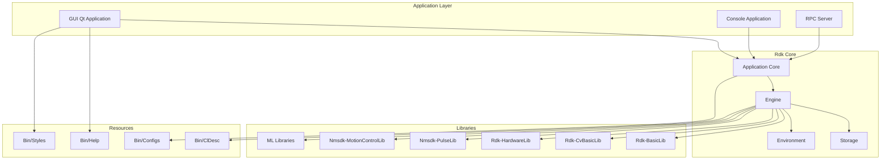
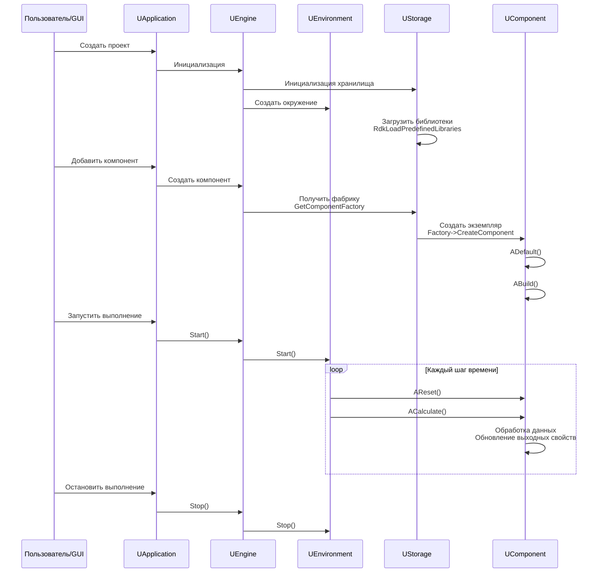
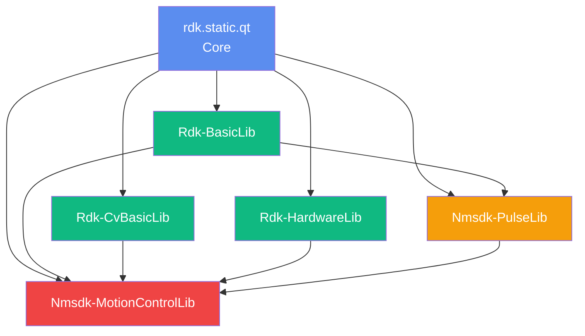

# Архитектура системы Nmsdk

## RU

### Общая архитектура

Nmsdk построен на модульной архитектуре с четким разделением ответственности между уровнями.

### Уровни архитектуры

#### 1. Уровень приложения (Application Layer)

**Компоненты:**
- **GUI Application** - графическое приложение на Qt
- **Console Application** - консольное приложение для выполнения без GUI
- **RPC Server** - сервер для удаленного управления и выполнения

**Основные классы:**
- `UApplication` - главный класс приложения
- `UEngineControl` - управление движком
- `URpcDispatcher` - диспетчер RPC команд
- `UServerTransport` - транспорт для сервера (TCP, HTTP)

#### 2. Ядро Rdk (Rdk Core)

**Подсистемы:**

##### Application Core (`Rdk/Core/Application`)
- Управление жизненным циклом приложения
- RPC система для удаленных вызовов
- Управление проектами
- Серверная инфраструктура

##### Engine (`Rdk/Core/Engine`)
- Компонентная система (`UComponent`, `UContainer`, `UNet`)
- Система свойств (`UProperty`, `UPropertyInput`, `UPropertyOutput`)
- Окружение выполнения (`UEnvironment`)
- Хранилище компонентов (`UStorage`)
- Управление выполнением

##### Graphics (`Rdk/Core/Graphics`)
- Система графики для визуализации
- Работа с изображениями (`UBitmap`)
- Движок отрисовки (`UDrawEngine`)

##### Serialize (`Rdk/Core/Serialize`)
- XML сериализация
- Бинарная сериализация
- Хранилища данных (`USerStorage`)

##### System (`Rdk/Core/System`)
- Кроссплатформенные абстракции
- Мьютексы и события (`UGenericMutex`, `UGenericEvent`)
- Загрузка DLL/SO
- Системные утилиты

##### Utilities (`Rdk/Core/Utilities`)
- Вспомогательные утилиты
- Работа с файлами
- Конфигурация

#### 3. Библиотеки компонентов (Libraries)

Библиотеки расширяют функциональность ядра, предоставляя конкретные реализации компонентов:

- **Rdk-BasicLib** - базовые компоненты (IO, матрицы, статистика)
- **Rdk-CvBasicLib** - компьютерное зрение на базе OpenCV
- **Rdk-HardwareLib** - работа с аппаратным обеспечением
- **Nmsdk-PulseLib** - импульсные нейронные сети
- **Nmsdk-MotionControlLib** - управление движением
- **Rdk-PyMachineLearningLib** - интеграция с Python ML
- **Rdk-TensorflowLib** - интеграция с TensorFlow
- **Rdk-DarknetLib** - интеграция с Darknet

#### 4. Ресурсы (Resources)

- **Configs** - конфигурационные файлы проектов и компонентов
- **ClDesc** - описания классов компонентов (XML)
- **Help** - справочная документация пользователя
- **Styles** - стили и темы для GUI

### Поток данных и управления

Диаграмма ниже показывает типичный сценарий использования системы: от создания проекта пользователем через GUI до выполнения вычислений компонентами. Она отражает реальные вызовы методов в коде: `UApplication::CreateProject()`, `UEngine::Init()`, `UStorage::LoadLibraries()`, `UStorage::CreateComponent()`, `UEnvironment::Start()` и цикл выполнения `Reset/Calculate`.

Эта последовательность соответствует коду в `UAppCore::Init`, `UEngine::Init`, `UStorage::BuildStorage`, `UEnvironment::Start` и методам жизненного цикла компонентов.

### Зависимости между модулями

### Кроссплатформенность

Система поддерживает следующие платформы:

- **Linux** - основная платформа, полная поддержка
- **Windows** - полная поддержка через Qt и WinAPI
- **Borland C++ Builder** - поддержка для legacy приложений

Абстракции в `Rdk/Core/System` обеспечивают единый интерфейс для:
- Потоков и синхронизации
- Файловых операций
- Загрузки библиотек
- Системных утилит

### См. также

- [Rdk Core Architecture](../Rdk-Core/Overview.md) - детальная архитектура ядра
- [Application Architecture](../Rdk-Core/Application-Architecture.md) - архитектура приложения
- [Engine Architecture](../Rdk-Core/Engine-Architecture.md) - архитектура движка
- [Component System](../Components-And-Configuration/Component-System.md) - компонентная система

---

## EN

### Overall Architecture

Nmsdk is built on a modular architecture with clear separation of responsibilities between layers.

### Architecture Layers

#### 1. Application Layer

**Components:**
- **GUI Application** - Qt-based graphical application
- **Console Application** - console application for execution without GUI
- **RPC Server** - server for remote management and execution

**Main Classes:**
- `UApplication` - main application class
- `UEngineControl` - engine control
- `URpcDispatcher` - RPC command dispatcher
- `UServerTransport` - server transport (TCP, HTTP)

#### 2. Rdk Core

**Subsystems:**

##### Application Core (`Rdk/Core/Application`)
- Application lifecycle management
- RPC system for remote calls
- Project management
- Server infrastructure

##### Engine (`Rdk/Core/Engine`)
- Component system (`UComponent`, `UContainer`, `UNet`)
- Property system (`UProperty`, `UPropertyInput`, `UPropertyOutput`)
- Execution environment (`UEnvironment`)
- Component storage (`UStorage`)
- Execution management

##### Graphics (`Rdk/Core/Graphics`)
- Graphics system for visualization
- Image handling (`UBitmap`)
- Drawing engine (`UDrawEngine`)

##### Serialize (`Rdk/Core/Serialize`)
- XML serialization
- Binary serialization
- Data storage (`USerStorage`)

##### System (`Rdk/Core/System`)
- Cross-platform abstractions
- Mutexes and events (`UGenericMutex`, `UGenericEvent`)
- DLL/SO loading
- System utilities

##### Utilities (`Rdk/Core/Utilities`)
- Helper utilities
- File operations
- Configuration

#### 3. Component Libraries

Libraries extend core functionality by providing specific component implementations.

#### 4. Resources

- **Configs** - project and component configuration files
- **ClDesc** - component class descriptions (XML)
- **Help** - user help documentation
- **Styles** - GUI styles and themes

### Cross-Platform Support

The system supports the following platforms:

- **Linux** - primary platform, full support
- **Windows** - full support via Qt and WinAPI
- **Borland C++ Builder** - support for legacy applications

Abstractions in `Rdk/Core/System` provide a unified interface for:
- Threading and synchronization
- File operations
- Library loading
- System utilities

### See Also

- [Rdk Core Architecture](../Rdk-Core/Overview.md) - detailed core architecture
- [Application Architecture](../Rdk-Core/Application-Architecture.md) - application architecture
- [Engine Architecture](../Rdk-Core/Engine-Architecture.md) - engine architecture
- [Component System](../Components-And-Configuration/Component-System.md) - component system
