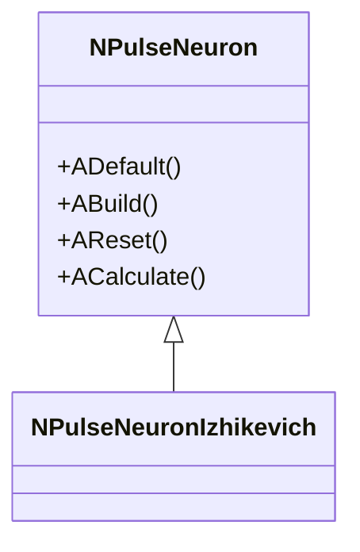
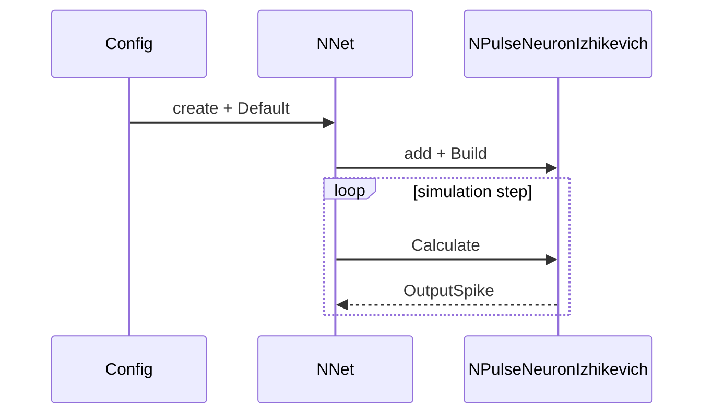

# Шаблон документации компонента (гибрид для Libraries/*)

Использовать для групповых страниц и отдельных страниц компонентов. Язык — RU; при необходимости EN-дубль ниже того же файла.

## Структура
1. **Название и краткое назначение**
2. **Регистрация в UStorage**  
   - Файл/класс библиотеки: `Libraries/<Lib>/Core/...`  
   - Метод/место: `CreateClassSamples(...)`, `UploadClass(...)` (с указанием имени регистрации)
3. **Иерархия / подреализации**  
   - `classDiagram` (Mermaid): базовый класс, наследники, ключевые поля
4. **Жизненный цикл**  
   - `ADefault/ABuild/AReset/ACalculate` и другие фазы; что и когда инициализируется
5. **Входы/выходы (UProperty)**  
   - входные параметры/потоки, выходные результаты, типы данных
6. **Типовые сценарии / пайплайны**  
   - `flowchart` или `sequenceDiagram` (init → build → calc → outputs)  
   - примеры конфигов: активные ссылки в корне, текстовые пути в сабрепо
7. **Ошибки/ограничения**  
   - требования к размерности/типам, частые ошибки, важные флаги
8. **Родственные компоненты**  
   - ссылки внутри библиотеки на альтернативы/соседние элементы
9. **References (optional)**  
   - `neuromodeler.ru`, статьи (Google Scholar), если релевантно

## Правила ссылок (мульти-репо)
- **Внутри сабрепозитория (`Libraries/<Lib>`)**: активные ссылки только на файлы того же сабрепо. Ссылки на корневой репозиторий — **текст в обратных кавычках** (без Markdown-ссылки), чтобы не ломать GitHub сабрепо.
- **В корневом репозитории (`Docs/**`)**: активные относительные ссылки на `Libraries/<Lib>/Docs/...` и `Docs/**`.
- **Внешние URL**: обычные `https://` ссылки.

## Правила структуры файлов
- `Libraries/<Lib>/Docs/Component-Catalog.md` — индекс компонентов и групп.
- `Libraries/<Lib>/Docs/Groups/<Group>.md` — группы (семейства) компонентов.
- `Libraries/<Lib>/Docs/Components/<Component>.md` — сложные/ключевые компоненты.
- Диаграммы: `Docs/Diagrams/*.md` (по желанию) или внутри компонентов.

## Мини-образец (фрагмент)
```
## NPulseNeuronIzhikevich — импульсный нейрон (модель Ижикевича)

**Регистрация**: `Libraries/Nmsdk-PulseLib/Core/NPulseLibrary.cpp`, `UploadClass("NPulseNeuronIzhikevich", ...)`



**Жизненный цикл**: `ADefault` — инициализация параметров модели (a,b,c,d), `ABuild` — подготовка мембраны, `ACalculate` — шаг интегрирования; частота вызова = шаг модели.

**Входы/выходы (UProperty)**: вход — ток/сигнал; выход — спайк/потенциал.

**Типовой сценарий** (Sequence):


**Ошибки/ограничения**: параметры a,b,c,d должны соответствовать типу нейрона; timestep согласован с решателем ODE (если используется).

**References**: (опционально) ссылка на статью Ижикевича.
```
