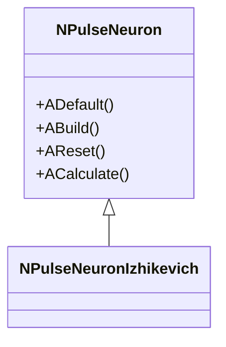
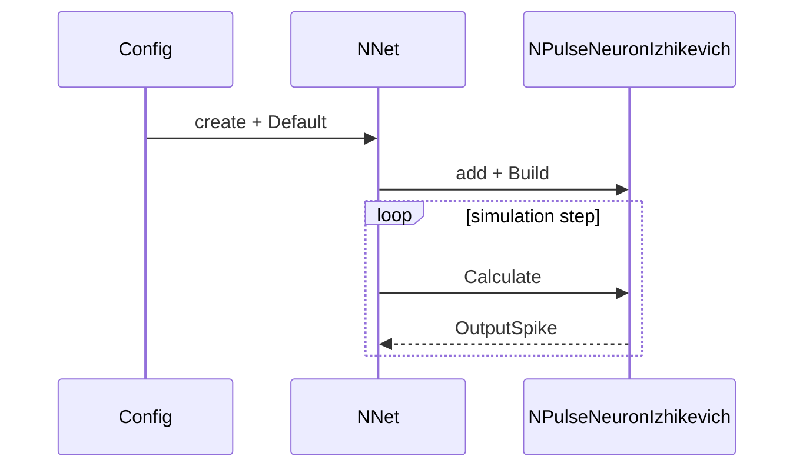

# Шаблон документации компонента (гибрид для Libraries/*)

## RU

Использовать для групповых страниц и отдельных страниц компонентов. Язык — RU; при необходимости EN-дубль ниже того же файла.

## Структура
1. **Название и краткое назначение**
2. **Регистрация в UStorage**  
   - Файл/класс библиотеки: `Libraries/<Lib>/Core/...`  
   - Метод/место: `CreateClassSamples(...)`, `UploadClass(...)` (с указанием имени регистрации)
3. **Иерархия / подреализации**  
   - `classDiagram` (Mermaid): базовый класс, наследники, ключевые поля
4. **Жизненный цикл**  
   - `ADefault/ABuild/AReset/ACalculate` и другие фазы; что и когда инициализируется
5. **Входы/выходы (UProperty)**  
   - входные параметры/потоки, выходные результаты, типы данных
6. **Типовые сценарии / пайплайны**  
   - `flowchart` или `sequenceDiagram` (init → build → calc → outputs)  
   - примеры конфигов: активные ссылки в корне, текстовые пути в сабрепо
7. **Ошибки/ограничения**  
   - требования к размерности/типам, частые ошибки, важные флаги
8. **Родственные компоненты**  
   - ссылки внутри библиотеки на альтернативы/соседние элементы
9. **References (optional)**  
   - `neuromodeler.ru`, статьи (Google Scholar), если релевантно

## Правила ссылок (мульти-репо)
- **Внутри сабрепозитория (`Libraries/<Lib>`)**: активные ссылки только на файлы того же сабрепо. Ссылки на корневой репозиторий — **текст в обратных кавычках** (без Markdown-ссылки), чтобы не ломать GitHub сабрепо.
- **В корневом репозитории (`Docs/**`)**: активные относительные ссылки на `Libraries/<Lib>/Docs/...` и `Docs/**`.
- **Внешние URL**: обычные `https://` ссылки.

## Правила структуры файлов
- `Libraries/<Lib>/Docs/Component-Catalog.md` — индекс компонентов и групп.
- `Libraries/<Lib>/Docs/Groups/<Group>.md` — группы (семейства) компонентов.
- `Libraries/<Lib>/Docs/Components/<Component>.md` — сложные/ключевые компоненты.
- Диаграммы: `Docs/Diagrams/*.md` (по желанию) или внутри компонентов.

## Мини-образец (фрагмент)
```
## NPulseNeuronIzhikevich — импульсный нейрон (модель Ижикевича)

**Регистрация**: `Libraries/Nmsdk-PulseLib/Core/NPulseLibrary.cpp`, `UploadClass("NPulseNeuronIzhikevich", ...)`



**Жизненный цикл**: `ADefault` — инициализация параметров модели (a,b,c,d), `ABuild` — подготовка мембраны, `ACalculate` — шаг интегрирования; частота вызова = шаг модели.

**Входы/выходы (UProperty)**: вход — ток/сигнал; выход — спайк/потенциал.

**Типовой сценарий** (Sequence):


**Ошибки/ограничения**: параметры a,b,c,d должны соответствовать типу нейрона; timestep согласован с решателем ODE (если используется).

**References**: (опционально) ссылка на статью Ижикевича.
```

---

## EN

Use for group pages and individual component pages. Language — RU; add an EN duplicate below in the same file if needed.

## Structure
1. **Name and brief purpose**
2. **UStorage registration**  
   - Library file/class: `Libraries/<Lib>/Core/...`  
   - Method/location: `CreateClassSamples(...)`, `UploadClass(...)` (with registration name)
3. **Hierarchy / implementations**  
   - `classDiagram` (Mermaid): base class, derived classes, key fields
4. **Lifecycle**  
   - `ADefault/ABuild/AReset/ACalculate` and other phases; what is initialized and when
5. **Inputs/outputs (UProperty)**  
   - input parameters/streams, output results, data types
6. **Typical scenarios / pipelines**  
   - `flowchart` or `sequenceDiagram` (init → build → calc → outputs)  
   - config examples: active links in the root repo, text paths in subrepos
7. **Errors/limitations**  
   - dimension/type requirements, common errors, important flags
8. **Related components**  
   - links within the library to alternatives/neighboring elements
9. **References (optional)**  
   - `neuromodeler.ru`, papers (Google Scholar), if relevant

## Link rules (multi-repo)
- **Inside a subrepo (`Libraries/<Lib>`)**: active links only to files in the same subrepo. Links to the root repository — **text in backticks** (no Markdown link), so GitHub subrepo navigation is not broken.
- **In the root repository (`Docs/**`)**: active relative links to `Libraries/<Lib>/Docs/...` and `Docs/**`.
- **External URLs**: regular `https://` links.

## File structure rules
- `Libraries/<Lib>/Docs/Component-Catalog.md` — component and group index.
- `Libraries/<Lib>/Docs/Groups/<Group>.md` — groups (families) of components.
- `Libraries/<Lib>/Docs/Components/<Component>.md` — complex/key components.
- Diagrams: `Docs/Diagrams/*.md` (optional) or inside component pages.

## Mini sample (fragment)
```
## NPulseNeuronIzhikevich — spiking neuron (Izhikevich model)

**Registration**: `Libraries/Nmsdk-PulseLib/Core/NPulseLibrary.cpp`, `UploadClass("NPulseNeuronIzhikevich", ...)`


**Lifecycle**: `ADefault` — initialize model parameters (a,b,c,d), `ABuild` — prepare membrane, `ACalculate` — integration step; call frequency = model step.

**Inputs/outputs (UProperty)**: input — current/signal; output — spike/potential.

**Typical scenario** (Sequence):


**Errors/limitations**: parameters a,b,c,d must match the neuron type; timestep consistent with the ODE solver (if used).

**References**: (optional) link to Izhikevich's paper.
```
