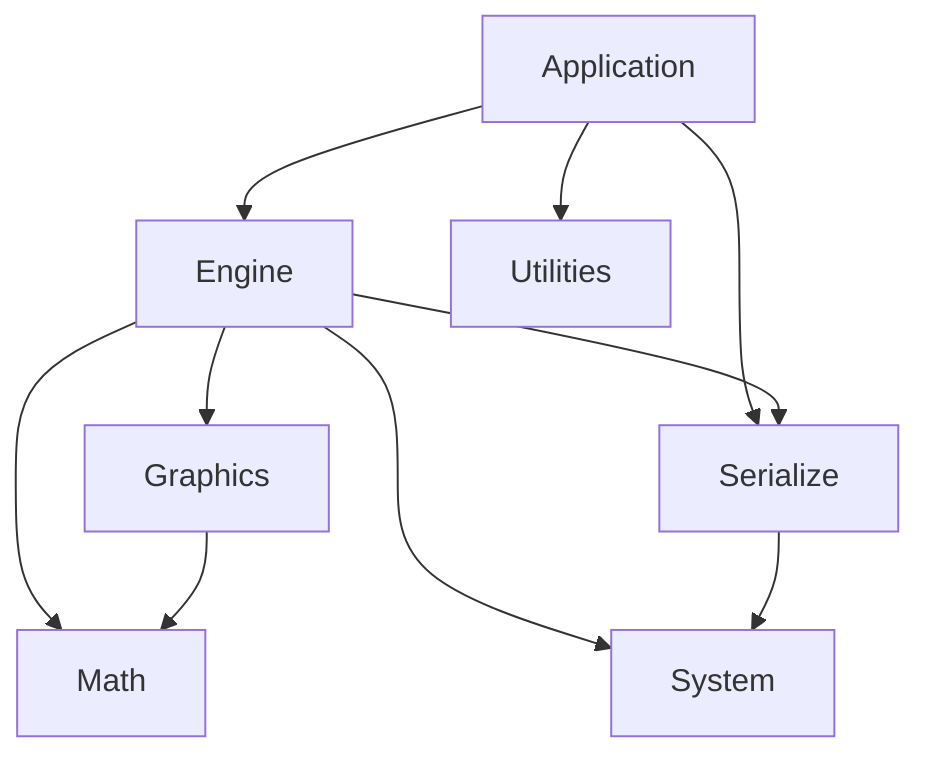

# Структура исходников проекта (File Structure)

## RU

### Обзор

Описание структуры директорий и файлов проекта Nmsdk.

### Корневая структура

```
Nmsdk/
├── Rdk/                    # Основной модуль (ядро)
│   ├── Core/               # Исходный код ядра
│   ├── Deploy/             # Заголовочные файлы для использования
│   ├── GUI/                # Графический интерфейс
│   ├── Tests/              # Тесты
│   └── ThirdParty/         # Сторонние библиотеки
│
├── Libraries/              # Библиотеки компонентов
│   ├── Rdk-BasicLib/       # Базовые компоненты
│   ├── Rdk-CvBasicLib/     # Компьютерное зрение
│   ├── Rdk-HardwareLib/    # Работа с железом
│   ├── Nmsdk-PulseLib/     # Импульсные нейронные сети
│   └── Nmsdk-MotionControlLib/  # Управление движением
│
├── Bin/                    # Скомпилированные бинарники и конфиги
│   ├── Configs/            # Конфигурационные файлы (Users/<UserName>/ — папки пользователей)
│   ├── ClDesc/             # Описания классов компонентов
│   ├── Help/               # Справочная документация
│   ├── Styles/             # Стили и темы
│   └── Platform/           # Платформенные артефакты
│
├── Build/                  # Файлы сборки (CMake, Qt, VS, etc.)
├── Docs/                   # Документация (точка входа Docs/README.md)
│   └── Audit/              # Отчёты аудита (Scripts/doc-audit/)
├── Docs.old/               # Legacy .doc / Doxygen (не поддерживается)
├── Reports/                # Исторические отчёты (archive)
├── Scripts/doc-audit/      # Инструменты аудита документации
├── LLM/                    # Runtime-индекс LLM-ассистента
├── README.md               # Корневая точка входа
└── CMakeLists.txt          # Корневой файл сборки
```

### Структура Rdk

```
Rdk/
├── Core/                   # Исходный код ядра
│   ├── Application/        # Приложение, RPC, сервер
│   │   ├── UApplication.h/cpp
│   │   ├── UEngineControl.h/cpp
│   │   ├── URpcDispatcher.h/cpp
│   │   ├── UProject.h/cpp
│   │   ├── Qt/            # Qt реализация
│   │   └── Bcb/           # Borland C++ Builder реализация
│   ├── Engine/             # Движок, компоненты, окружение
│   │   ├── UEngine.h/cpp
│   │   ├── UComponent.h/cpp
│   │   ├── UContainer.h/cpp
│   │   ├── UNet.h/cpp
│   │   ├── UStorage.h/cpp
│   │   ├── UEnvironment.h/cpp
│   │   ├── UProperty.h
│   │   └── UPropertyEndpoints.h
│   ├── Graphics/           # Графика и визуализация
│   │   ├── UGraphics.h/cpp
│   │   ├── UDrawEngine.h/cpp
│   │   ├── UBitmap.h/cpp
│   │   └── UFont.h
│   ├── Math/              # Математические утилиты
│   │   └── MVector.h      # Векторы и матрицы
│   ├── Serialize/          # Сериализация (XML, Binary)
│   │   ├── USerStorage.h
│   │   ├── USerStorageXML.h/cpp
│   │   └── USerStorageBinary.h/cpp
│   ├── System/            # Системные утилиты
│   │   ├── rdk_system.h
│   │   ├── UGenericMutex.h
│   │   ├── UGenericEvent.h
│   │   ├── UDllLoader.h
│   │   ├── Qt/            # Qt реализации
│   │   ├── Win/           # Windows реализации
│   │   └── Gcc/           # GCC/POSIX реализации
│   ├── Utilities/          # Вспомогательные утилиты
│   │   └── UIniFile.h     # Работа с INI файлами
│   └── Console/           # Консольный движок
│       └── UConsoleEngine.h/cpp
├── Deploy/                # Заголовочные файлы
│   └── Include/           # Публичные заголовки
│       ├── rdk.h
│       ├── rdk_application.h
│       └── rdk_init.h
├── GUI/                   # Графический интерфейс
│   ├── Qt/               # Qt реализация GUI
│   │   ├── UGEngineControlWidget.h/cpp
│   │   ├── UModernDiagramWidget.h/cpp
│   │   ├── UStyleManager.h/cpp
│   │   └── Styles/       # QSS и JSON темы
│   └── BCB/              # Borland C++ Builder GUI
├── Tests/                 # Тесты
│   ├── Unit/             # Юнит-тесты
│   └── Integration/      # Интеграционные тесты
└── ThirdParty/           # Сторонние библиотеки
```

**Зависимости между модулями Core:**



### Структура Libraries

Каждая библиотека следует общей структуре:

```
LibraryName/
├── Core/                  # Исходный код компонентов
│   ├── Component1.h
│   ├── Component1.cpp
│   └── ...
├── Deploy/                # Заголовочные файлы
│   └── Include/
│       └── Lib.h          # Главный заголовок
├── CMake/                 # Файлы сборки CMake
│   └── CMakeLists.txt
├── Build/                 # Файлы сборки для различных IDE
├── Docs/                  # Документация библиотеки
└── Tests/                 # Тесты библиотеки
```

### Структура Bin

```
Bin/
├── Configs/               # Конфигурационные файлы проектов (Users/<UserName>/ — папки пользователей)
├── ClDesc/                # Описания классов компонентов (XML)
├── Help/                  # Справочная документация
│   ├── en/               # Английская версия
│   └── ru/               # Русская версия
├── Styles/                # Стили и темы GUI
└── Platform/              # Платформенные артефакты
    ├── Linux/            # Linux специфичные файлы
    └── Win/              # Windows специфичные файлы
```

### См. также

- [Архитектура системы](Architecture-Overview.md) - архитектурное описание
- [Build System](../Build-And-Deploy/Build-System.md) - система сборки

---

## EN

### Overview

Description of the Nmsdk project directory and file structure.

### Root Structure

```
Nmsdk/
├── Rdk/                    # Main module (core)
│   ├── Core/               # Core source code
│   ├── Deploy/             # Header files for use
│   ├── GUI/                # Graphical user interface
│   ├── Tests/              # Tests
│   └── ThirdParty/         # Third-party libraries
│
├── Libraries/              # Component libraries
│   ├── Rdk-BasicLib/       # Basic components
│   ├── Rdk-CvBasicLib/     # Computer vision
│   ├── Rdk-HardwareLib/    # Hardware integration
│   ├── Nmsdk-PulseLib/     # Spiking neural networks
│   └── Nmsdk-MotionControlLib/  # Motion control
│
├── Bin/                    # Compiled binaries and configs
│   ├── Configs/            # Configuration files (Users/<UserName>/ — user folders)
│   ├── ClDesc/             # Component class descriptions
│   ├── Help/               # Reference documentation
│   ├── Styles/             # Styles and themes
│   └── Platform/           # Platform artifacts
│
├── Build/                  # Build files (CMake, Qt, VS, etc.)
├── Docs/                   # Documentation (entry point Docs/README.md)
│   └── Audit/              # Audit reports (Scripts/doc-audit/)
├── Docs.old/               # Legacy .doc / Doxygen (not maintained)
├── Reports/                # Historical reports (archive)
├── Scripts/doc-audit/      # Documentation audit tools
├── LLM/                    # LLM assistant runtime index
├── README.md               # Root entry point
└── CMakeLists.txt          # Root build file
```

### Rdk Structure

```
Rdk/
├── Core/                   # Core source code
│   ├── Application/        # Application, RPC, server
│   │   ├── UApplication.h/cpp
│   │   ├── UEngineControl.h/cpp
│   │   ├── URpcDispatcher.h/cpp
│   │   ├── UProject.h/cpp
│   │   ├── Qt/            # Qt implementation
│   │   └── Bcb/           # Borland C++ Builder implementation
│   ├── Engine/             # Engine, components, environment
│   │   ├── UEngine.h/cpp
│   │   ├── UComponent.h/cpp
│   │   ├── UContainer.h/cpp
│   │   ├── UNet.h/cpp
│   │   ├── UStorage.h/cpp
│   │   ├── UEnvironment.h/cpp
│   │   ├── UProperty.h
│   │   └── UPropertyEndpoints.h
│   ├── Graphics/           # Graphics and visualization
│   │   ├── UGraphics.h/cpp
│   │   ├── UDrawEngine.h/cpp
│   │   ├── UBitmap.h/cpp
│   │   └── UFont.h
│   ├── Math/              # Mathematical utilities
│   │   └── MVector.h      # Vectors and matrices
│   ├── Serialize/          # Serialization (XML, Binary)
│   │   ├── USerStorage.h
│   │   ├── USerStorageXML.h/cpp
│   │   └── USerStorageBinary.h/cpp
│   ├── System/            # System utilities
│   │   ├── rdk_system.h
│   │   ├── UGenericMutex.h
│   │   ├── UGenericEvent.h
│   │   ├── UDllLoader.h
│   │   ├── Qt/            # Qt implementations
│   │   ├── Win/           # Windows implementations
│   │   └── Gcc/           # GCC/POSIX implementations
│   ├── Utilities/          # Helper utilities
│   │   └── UIniFile.h     # INI file handling
│   └── Console/           # Console engine
│       └── UConsoleEngine.h/cpp
├── Deploy/                # Header files
│   └── Include/           # Public headers
│       ├── rdk.h
│       ├── rdk_application.h
│       └── rdk_init.h
├── GUI/                   # Graphical user interface
│   ├── Qt/               # Qt GUI implementation
│   │   ├── UGEngineControlWidget.h/cpp
│   │   ├── UModernDiagramWidget.h/cpp
│   │   ├── UStyleManager.h/cpp
│   │   └── Styles/       # QSS and JSON themes
│   └── BCB/              # Borland C++ Builder GUI
├── Tests/                 # Tests
│   ├── Unit/             # Unit tests
│   └── Integration/      # Integration tests
└── ThirdParty/           # Third-party libraries
```

**Core module dependencies:**


### Libraries Structure

Each library follows a common structure:

```
LibraryName/
├── Core/                  # Component source code
│   ├── Component1.h
│   ├── Component1.cpp
│   └── ...
├── Deploy/                # Header files
│   └── Include/
│       └── Lib.h          # Main header
├── CMake/                 # CMake build files
│   └── CMakeLists.txt
├── Build/                 # Build files for various IDEs
├── Docs/                  # Library documentation
└── Tests/                 # Library tests
```

### Bin Structure

```
Bin/
├── Configs/               # Project configuration files (Users/<UserName>/ — user folders)
├── ClDesc/                # Component class descriptions (XML)
├── Help/                  # Reference documentation
│   ├── en/               # English version
│   └── ru/               # Russian version
├── Styles/                # GUI styles and themes
└── Platform/              # Platform artifacts
    ├── Linux/            # Linux-specific files
    └── Win/              # Windows-specific files
```

### See Also

- [System Architecture](Architecture-Overview.md) - architectural description
- [Build System](../Build-And-Deploy/Build-System.md) - build system
