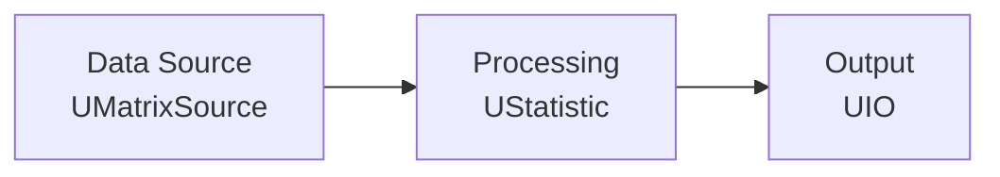

# Быстрый старт (Quick Start)

## RU

### Установка зависимостей

#### Linux (Ubuntu/Debian)

```bash
sudo apt-get update
sudo apt-get install build-essential cmake qtbase5-dev
```

#### Windows

- Установите Visual Studio 2019 или новее
- Установите CMake 3.16+
- Установите Qt5

### Сборка проекта

```bash
# Создать директорию сборки
mkdir build
cd build

# Конфигурация CMake
cmake ..

# Сборка
cmake --build . -j$(nproc)  # Linux
# или
cmake --build . --config Release  # Windows
```

### Создание первого проекта

1. **Запустите NeuroModeler:**
   ```bash
   ./Bin/Platform/Linux/NeuroModeler
   ```

2. **Создайте новый проект:**
   - File → New Project

3. **Добавьте компонент:**
   - Перетащите компонент из библиотеки в редактор диаграмм
   - Настройте параметры компонента

4. **Соедините компоненты:**
   - Соедините выходы одних компонентов с входами других

5. **Запустите выполнение:**
   - Нажмите кнопку "Start" в панели управления

### Пример: Простая сеть компонентов


**Пример создания компонента программно:**

```cpp
#include <rdk.h>
using namespace RDK;

// Создание хранилища и движка
UStorage storage;
UEngine engine;
engine.SetStorage(&storage);

// Загрузка библиотек
std::list<ULibrary*> libs;
RdkLoadPredefinedLibraries(libs);
for(auto lib : libs) {
    storage.AddCollection(lib);
}
storage.BuildStorage();

// Создание компонента
auto source = storage.CreateComponent<UMatrixSource>("Source");
source->FileName = "data.csv";
source->Build();

auto processor = storage.CreateComponent<UStatistic>("Processor");
processor->Build();

// Соединение компонентов
processor->InputData.AttachTo(&source->OutputMatrix);

// Выполнение
engine.GetEnvironment()->Start();
for(int i = 0; i < 10; i++) {
    source->Calculate();
    processor->Calculate();
}
```

**Пример конфигурационного файла проекта (XML):**

```xml
<Project>
  <Name>MyFirstProject</Name>
  <Components>
    <Component Name="Source" Class="UMatrixSource">
      <Properties>
        <Property Name="FileName" Type="string">data.csv</Property>
      </Properties>
    </Component>
    <Component Name="Processor" Class="UStatistic">
      <Properties>
        <Property Name="InputData" Type="link">Source.OutputMatrix</Property>
      </Properties>
    </Component>
  </Components>
</Project>
```

### Следующие шаги

- [Компонентная система](../../Rdk/Docs/Guides/Component-System.md) - детальное описание работы с компонентами
- [Обзор библиотек](../Libraries/Overview.md) - доступные библиотеки компонентов
- [GUI Overview](../GUI/Overview.md) - описание интерфейса

---

## EN

### Installing Dependencies

#### Linux (Ubuntu/Debian)

```bash
sudo apt-get update
sudo apt-get install build-essential cmake qtbase5-dev
```

#### Windows

- Install Visual Studio 2019 or newer
- Install CMake 3.16+
- Install Qt5

### Building the Project

```bash
# Create build directory
mkdir build
cd build

# Configure CMake
cmake ..

# Build
cmake --build . -j$(nproc)  # Linux
# or
cmake --build . --config Release  # Windows
```

### Creating Your First Project

1. **Launch NeuroModeler:**
   ```bash
   ./Bin/Platform/Linux/NeuroModeler
   ```

2. **Create a new project:**
   - File → New Project

3. **Add a component:**
   - Drag a component from the library to the diagram editor
   - Configure component parameters

4. **Connect components:**
   - Connect outputs of some components to inputs of others

5. **Start execution:**
   - Press the "Start" button in the control panel

### Example: Simple Component Network



**Example component creation programmatically:**

```cpp
#include <rdk.h>
using namespace RDK;

// Create storage and engine
UStorage storage;
UEngine engine;
engine.SetStorage(&storage);

// Load libraries
std::list<ULibrary*> libs;
RdkLoadPredefinedLibraries(libs);
for(auto lib : libs) {
    storage.AddCollection(lib);
}
storage.BuildStorage();

// Create component
auto source = storage.CreateComponent<UMatrixSource>("Source");
source->FileName = "data.csv";
source->Build();

auto processor = storage.CreateComponent<UStatistic>("Processor");
processor->Build();

// Connect components
processor->InputData.AttachTo(&source->OutputMatrix);

// Execute
engine.GetEnvironment()->Start();
for(int i = 0; i < 10; i++) {
    source->Calculate();
    processor->Calculate();
}
```

**Example project configuration file (XML):**

```xml
<Project>
  <Name>MyFirstProject</Name>
  <Components>
    <Component Name="Source" Class="UMatrixSource">
      <Properties>
        <Property Name="FileName" Type="string">data.csv</Property>
      </Properties>
    </Component>
    <Component Name="Processor" Class="UStatistic">
      <Properties>
        <Property Name="InputData" Type="link">Source.OutputMatrix</Property>
      </Properties>
    </Component>
  </Components>
</Project>
```

### Common Issues

Если возникли проблемы, см. [Troubleshooting Guide](../Troubleshooting/Troubleshooting-Guide.md) для решений типичных проблем.

### Next Steps

- [Component System](../Components-And-Configuration/Component-System.md) - detailed component description
- [Libraries Overview](../Libraries/Overview.md) - available component libraries
- [GUI Overview](../GUI/Overview.md) - interface description
