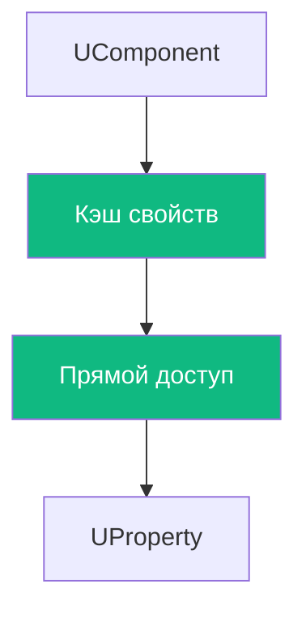
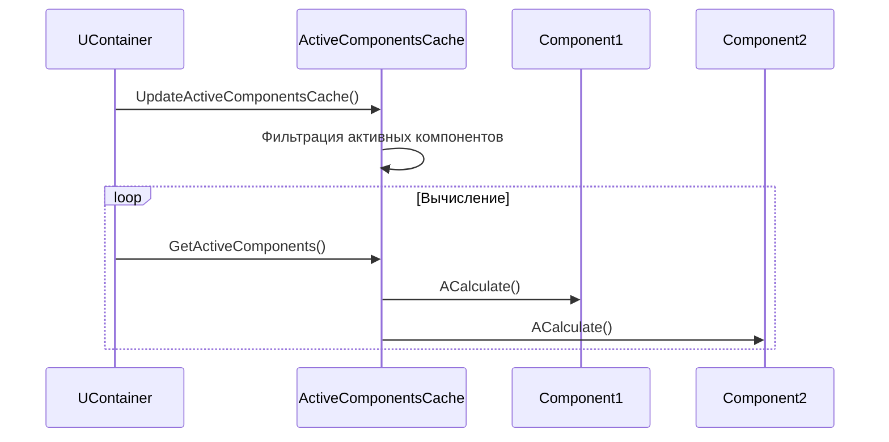
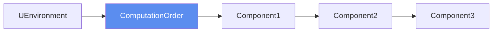
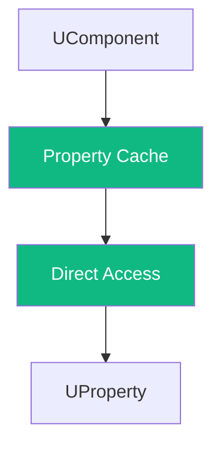
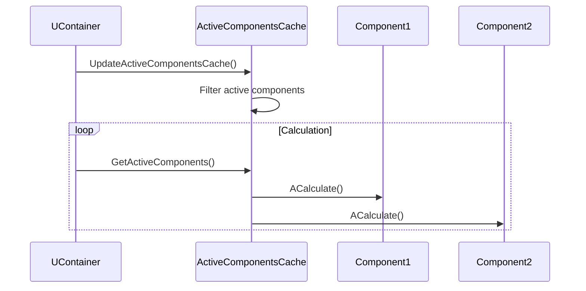

# Обзор производительности (Performance Overview)

## RU

### Обзор

Оптимизации производительности и результаты бенчмарков проекта Nmsdk.

### Основные оптимизации

- Оптимизация доступа к свойствам компонентов
- Кэширование активных компонентов
- Оптимизация вычислений в движке

### Поток данных в критичных участках

#### Оптимизированный доступ к свойствам

**Оптимизация:** Кэширование указателей на свойства для избежания поиска по имени на каждом обращении.

#### Кэширование активных компонентов

**Оптимизация:** Кэширование списка активных компонентов для избежания повторной фильтрации на каждом шаге.

#### Оптимизация вычислений движка

**Оптимизация:** Предварительное вычисление порядка выполнения компонентов для минимизации зависимостей.

### Бенчмарки

Результаты бенчмарков доступны в отчетах:
- [Performance_Benchmarks_GetData_Optimization.md](../../Reports/Performance_Benchmarks_GetData_Optimization.md)
- [Reports/Performance/](../../Reports/Performance/)

### См. также

- [Testing Strategy](Testing-Strategy.md)
- [Direct Property Access](../Components-And-Configuration/Direct-Property-Access.md)

---

## EN

### Overview

Performance optimizations and benchmark results for the Nmsdk project.

### Main Optimizations

- Component property access optimization
- Active component caching
- Engine computation optimization

### Data Flow in Critical Sections

#### Optimized Property Access

**Optimization:** Caching property pointers to avoid name-based lookup on each access.

#### Active Component Caching

**Optimization:** Caching list of active components to avoid repeated filtering on each step.

#### Engine Computation Optimization

**Optimization:** Pre-computing component execution order to minimize dependencies.

### Benchmarks

Benchmark results available in reports:
- [Performance_Benchmarks_GetData_Optimization.md](../../Reports/Performance_Benchmarks_GetData_Optimization.md)
- [Reports/Performance/](../../Reports/Performance/)

### See Also

- [Testing Strategy](Testing-Strategy.md)
- [Direct Property Access](../Components-And-Configuration/Direct-Property-Access.md)
