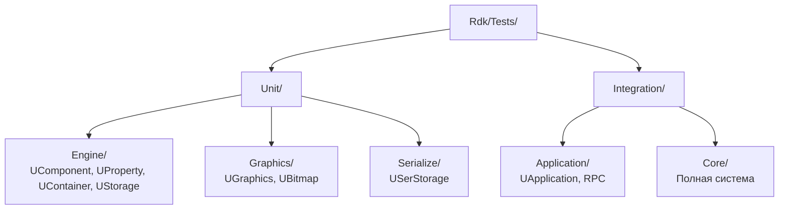
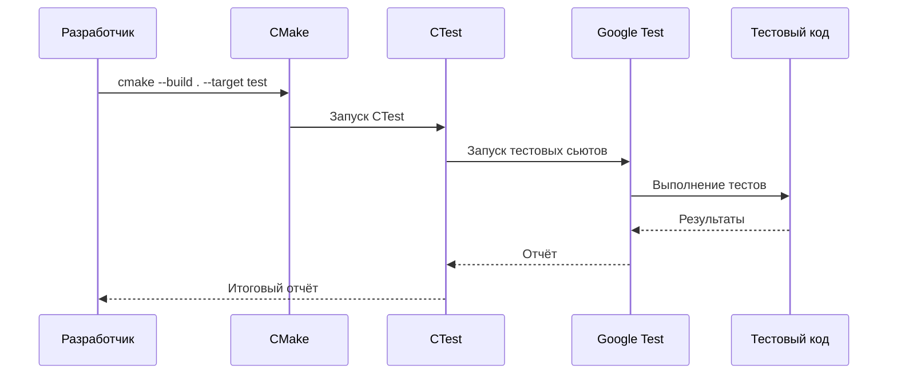

# Стратегия тестирования (Testing Strategy)

## RU

### Обзор

Стратегия тестирования проекта Nmsdk включает юнит-тесты и интеграционные тесты.

### Типы тестов

#### Юнит-тесты

Тесты отдельных компонентов и модулей:
- Тесты компонентов (`Rdk/Tests/Unit/Engine/UComponent/`)
- Тесты свойств (`Rdk/Tests/Unit/Engine/UProperty/`)
- Тесты контейнеров (`Rdk/Tests/Unit/Engine/UContainer/`)
- Тесты хранилища (`Rdk/Tests/Unit/Engine/UStorage/`)

**Пример юнит-теста компонента:**

```cpp
#include <gtest/gtest.h>
#include <rdk.h>

using namespace RDK;

// Тестовый компонент
class TestComponent : public UNet
{
public:
    UProperty<double, TestComponent, ptPubParameter> Param;
    UProperty<double, TestComponent, ptPubOutput> Output;
    
    TestComponent() : 
        Param("Param", this),
        Output("Output", this)
    {
    }
    
protected:
    virtual bool ADefault(void) override {
        Param = 10.0;
        return true;
    }
    
    virtual bool ACalculate(void) override {
        Output = Param() * 2.0;
        return true;
    }
};

TEST(ComponentTest, BasicCalculation)
{
    TestComponent comp;
    comp.Default();
    comp.Build();
    comp.Reset();
    
    comp.Calculate();
    
    EXPECT_DOUBLE_EQ(comp.Output(), 20.0);
}
```

**Структура тестов:**



Тесты используют Google Test (gtest) framework и запускаются через CMake/CTest.

#### Интеграционные тесты

Тесты взаимодействия между модулями:
- Тесты приложения (`Rdk/Tests/Integration/Application/`)
- Тесты ядра (`Rdk/Tests/Integration/Core/`)

### Запуск тестов

```bash
cd build
ctest
# или
cmake --build . --target test
# или запуск конкретного теста
ctest -R Test_UComponent_Lifecycle
```

### comp_gui smoke-check через presets

Для стабильной проверки pipeline component GUI используйте воспроизводимый preset flow:

```bash
cmake --preset linux-gcc-debug-tests
cmake --build --preset linux-gcc-debug-tests
ctest --preset linux-component-gui-registry
```

Этот smoke-check покрывает `Test_ComponentGuiRegistry`: entrypoints (`diagram`, `components list`, `drawengine`), single-instance reopen и fallback для незарегистрированного класса.

**Процесс запуска тестов:**



**Типичные команды для разработки:**

```bash
# Запуск всех тестов
ctest

# Запуск с подробным выводом
ctest --verbose

# Запуск конкретного теста
ctest -R Test_UProperty_Basic

# Запуск тестов с фильтрацией
ctest -R "UComponent.*"

# Запуск тестов в параллельном режиме
ctest -j$(nproc)
```

### Детальные примеры Unit тестов

#### Пример 1: Тест жизненного цикла компонента

```cpp
#include <gtest/gtest.h>
#include <rdk.h>
#include <memory>

using namespace RDK;

// Тестовый компонент для проверки жизненного цикла
class LifecycleTestComponent : public UNet
{
public:
    bool defaultCalled;
    bool buildCalled;
    bool resetCalled;
    bool calculateCalled;
    
    UProperty<int, LifecycleTestComponent, ptPubState> Counter;

    LifecycleTestComponent() : 
        Counter("Counter", this),
        defaultCalled(false),
        buildCalled(false),
        resetCalled(false),
        calculateCalled(false)
    {
    }

protected:
    virtual bool ADefault(void) override
    {
        defaultCalled = true;
        Counter = 0;
        return true;
    }

    virtual bool ABuild(void) override
    {
        buildCalled = true;
        return true;
    }

    virtual bool AReset(void) override
    {
        resetCalled = true;
        Counter = 0;
        return true;
    }

    virtual bool ACalculate(void) override
    {
        calculateCalled = true;
        Counter = Counter() + 1;
        return true;
    }
};

class UComponentLifecycleTest : public ::testing::Test
{
protected:
    void SetUp() override
    {
        comp = std::make_unique<LifecycleTestComponent>();
    }

    void TearDown() override
    {
        comp.reset();
    }

    std::unique_ptr<LifecycleTestComponent> comp;
};

// Тест полного жизненного цикла
TEST_F(UComponentLifecycleTest, FullLifecycleSequence)
{
    // Начальное состояние
    EXPECT_FALSE(comp->IsReady());
    
    // Default
    comp->Default();
    EXPECT_TRUE(comp->defaultCalled);
    EXPECT_EQ(comp->Counter(), 0);
    
    // Build
    comp->Build();
    EXPECT_TRUE(comp->buildCalled);
    EXPECT_TRUE(comp->IsReady());
    
    // Reset
    comp->Counter = 5;
    comp->Reset();
    EXPECT_TRUE(comp->resetCalled);
    EXPECT_EQ(comp->Counter(), 0);
    
    // Calculate несколько раз
    comp->Calculate();
    EXPECT_TRUE(comp->calculateCalled);
    EXPECT_EQ(comp->Counter(), 1);
    
    comp->Calculate();
    EXPECT_EQ(comp->Counter(), 2);
    
    comp->Calculate();
    EXPECT_EQ(comp->Counter(), 3);
}

// Тест состояния IsReady
TEST_F(UComponentLifecycleTest, IsReadyState)
{
    EXPECT_FALSE(comp->IsReady());
    
    comp->Default();
    EXPECT_FALSE(comp->IsReady()); // Все еще не готов после Default
    
    comp->Build();
    EXPECT_TRUE(comp->IsReady()); // Готов после Build
    
    comp->Reset();
    EXPECT_TRUE(comp->IsReady()); // Все еще готов после Reset
    
    comp->Calculate();
    EXPECT_TRUE(comp->IsReady()); // Все еще готов после Calculate
}
```

#### Пример 2: Тест свойств компонента

```cpp
#include <gtest/gtest.h>
#include <rdk.h>

using namespace RDK;

// Тестовый компонент для проверки свойств
class TestComponent : public UComponent
{
public:
    UProperty<double, TestComponent, ptPubParameter> Param;
    UProperty<int, TestComponent, ptPubState> State;
    UProperty<double, TestComponent, ptPubInput> Input;
    UProperty<double, TestComponent, ptPubOutput> Output;

public:
    TestComponent() : 
        Param("Param", this),
        State("State", this),
        Input("Input", this),
        Output("Output", this)
    {
    }

    virtual TestComponent* New(void) { return new TestComponent(); }

protected:
    virtual bool ADefault(void) 
    {
        Param = 10.0;
        State = 0;
        return true;
    }

    virtual bool ABuild(void) { return true; }
    virtual bool AReset(void) { return true; }
    virtual bool ACalculate(void) 
    {
        Output = Input * Param;
        State++;
        return true;
    }
};

// Тест создания и уничтожения свойств
TEST(UPropertyBasic, CreateDestroy)
{
    UStorage storage;
    TestComponent* comp = new TestComponent();
    
    EXPECT_NE(comp, nullptr);
    EXPECT_EQ(comp->Param, 10.0);
    EXPECT_EQ(comp->State, 0);
    
    delete comp;
}

// Тест GetData/SetData для простых типов
TEST(UPropertyBasic, GetSetData)
{
    UStorage storage;
    TestComponent comp;
    
    // Тест параметра
    comp.Param = 42.5;
    EXPECT_DOUBLE_EQ(comp.Param.GetData(), 42.5);
    EXPECT_DOUBLE_EQ(comp.Param(), 42.5);
    
    // Тест состояния
    comp.State = 100;
    EXPECT_EQ(comp.State.GetData(), 100);
    EXPECT_EQ(comp.State(), 100);
    
    // Тест выхода
    comp.Output = 3.14;
    EXPECT_DOUBLE_EQ(comp.Output.GetData(), 3.14);
}

// Тест поиска свойств
TEST(UPropertyBasic, FindProperty)
{
    UStorage storage;
    TestComponent comp;
    
    UEPtr<UIProperty> prop = comp.FindProperty("Param");
    EXPECT_NE(prop.Get(), nullptr);
    
    prop = comp.FindProperty("State");
    EXPECT_NE(prop.Get(), nullptr);
    
    prop = comp.FindProperty("Input");
    EXPECT_NE(prop.Get(), nullptr);
    
    prop = comp.FindProperty("Output");
    EXPECT_NE(prop.Get(), nullptr);
    
    // Несуществующее свойство
    prop = comp.FindProperty("NonExistent");
    EXPECT_EQ(prop.Get(), nullptr);
}
```

#### Пример 3: Тест производительности свойств

```cpp
#include <gtest/gtest.h>
#include <rdk.h>
#include <chrono>

using namespace RDK;

// Тест производительности доступа к свойствам
TEST(UPropertyPerformance, AccessBaseline)
{
    UStorage storage;
    TestComponent comp;
    comp.Param = 1.0;
    
    const int iterations = 1000000;
    auto start = std::chrono::high_resolution_clock::now();
    
    double sum = 0.0;
    for (int i = 0; i < iterations; ++i)
    {
        sum += comp.Param();
    }
    
    auto end = std::chrono::high_resolution_clock::now();
    auto duration = std::chrono::duration_cast<std::chrono::microseconds>(end - start);
    
    EXPECT_GT(sum, 0.0);
    // Логируем время для baseline
    std::cout << "Baseline property access: " << duration.count() 
              << " microseconds for " << iterations << " iterations" << std::endl;
}
```

### Детальные примеры Integration тестов

#### Пример 4: Тест сети компонентов

```cpp
#include <gtest/gtest.h>
#include <rdk.h>
#include <memory>

using namespace RDK;

// Простой компонент, который складывает два входа
class AdderComponent : public UNet
{
public:
    UProperty<int, AdderComponent, ptPubInput> Input1;
    UProperty<int, AdderComponent, ptPubInput> Input2;
    UProperty<int, AdderComponent, ptPubOutput> Output;

    AdderComponent() : 
        Input1("Input1", this),
        Input2("Input2", this),
        Output("Output", this)
    {
    }

protected:
    virtual bool ACalculate(void) override
    {
        Output = Input1() + Input2();
        return true;
    }
};

// Компонент, который умножает вход на параметр
class MultiplierComponent : public UNet
{
public:
    UProperty<int, MultiplierComponent, ptPubInput> Input;
    UProperty<int, MultiplierComponent, ptPubParameter> Factor;
    UProperty<int, MultiplierComponent, ptPubOutput> Output;

    MultiplierComponent() : 
        Input("Input", this),
        Factor("Factor", this),
        Output("Output", this)
    {
    }

protected:
    virtual bool ACalculate(void) override
    {
        Output = Input() * Factor();
        return true;
    }
};

class ComponentNetworkTest : public ::testing::Test
{
protected:
    void SetUp() override
    {
        adder1 = std::make_unique<AdderComponent>();
        adder2 = std::make_unique<AdderComponent>();
        multiplier = std::make_unique<MultiplierComponent>();
    }

    void TearDown() override
    {
        adder1.reset();
        adder2.reset();
        multiplier.reset();
    }

    std::unique_ptr<AdderComponent> adder1;
    std::unique_ptr<AdderComponent> adder2;
    std::unique_ptr<MultiplierComponent> multiplier;
};

// Тест простой сети из двух компонентов
TEST_F(ComponentNetworkTest, SimpleTwoComponentNetwork)
{
    // Настройка: adder1 -> multiplier
    adder1->Input1 = 5;
    adder1->Input2 = 3;
    multiplier->Input.Connect(&adder1->Output);
    multiplier->Factor = 2;
    
    // Инициализация
    adder1->Default();
    adder1->Build();
    multiplier->Default();
    multiplier->Build();
    
    // Выполнение
    adder1->Reset();
    multiplier->Reset();
    adder1->Calculate();
    multiplier->Calculate();
    
    // Проверка: (5 + 3) * 2 = 16
    EXPECT_EQ(multiplier->Output(), 16);
}

// Тест цепочки компонентов
TEST_F(ComponentNetworkTest, ComponentChain)
{
    // Настройка: adder1 -> adder2 -> multiplier
    adder1->Input1 = 2;
    adder1->Input2 = 3;
    adder2->Input1.Connect(&adder1->Output);
    adder2->Input2 = 4;
    multiplier->Input.Connect(&adder2->Output);
    multiplier->Factor = 3;
    
    // Инициализация
    adder1->Default();
    adder1->Build();
    adder2->Default();
    adder2->Build();
    multiplier->Default();
    multiplier->Build();
    
    // Выполнение
    adder1->Reset();
    adder2->Reset();
    multiplier->Reset();
    
    adder1->Calculate();
    adder2->Calculate();
    multiplier->Calculate();
    
    // Проверка: ((2 + 3) + 4) * 3 = 27
    EXPECT_EQ(multiplier->Output(), 27);
}

// Тест распространения данных через сеть
TEST_F(ComponentNetworkTest, DataPropagation)
{
    adder1->Input1 = 10;
    adder1->Input2 = 20;
    multiplier->Input.Connect(&adder1->Output);
    multiplier->Factor = 2;
    
    adder1->Default();
    adder1->Build();
    multiplier->Default();
    multiplier->Build();
    
    adder1->Reset();
    multiplier->Reset();
    
    // Первый расчет
    adder1->Calculate();
    multiplier->Calculate();
    EXPECT_EQ(multiplier->Output(), 60); // (10 + 20) * 2 = 60
    
    // Изменение входа и пересчет
    adder1->Input1 = 15;
    adder1->Input2 = 25;
    adder1->Calculate();
    multiplier->Calculate();
    EXPECT_EQ(multiplier->Output(), 80); // (15 + 25) * 2 = 80
}
```

#### Пример 5: Тест цепочек свойств

```cpp
#include <gtest/gtest.h>
#include <rdk.h>
#include <memory>

using namespace RDK;

// Тестовый компонент для цепочек свойств
class ChainTestComponent : public UNet
{
public:
    UProperty<int, ChainTestComponent, ptPubOutput> Output;
    UProperty<int, ChainTestComponent, ptPubInput> Input;
    UProperty<int, ChainTestComponent, ptPubState> State;

    ChainTestComponent() : 
        Output("Output", this),
        Input("Input", this),
        State("State", this)
    {
    }

protected:
    virtual bool ACalculate(void) override
    {
        if (Input.IsConnected())
        {
            Output = Input();
        }
        else
        {
            Output = State();
        }
        return true;
    }
};

class PropertyChainsTest : public ::testing::Test
{
protected:
    void SetUp() override
    {
        comp1 = std::make_unique<ChainTestComponent>();
        comp2 = std::make_unique<ChainTestComponent>();
        comp3 = std::make_unique<ChainTestComponent>();
        comp4 = std::make_unique<ChainTestComponent>();
    }

    void TearDown() override
    {
        comp1.reset();
        comp2.reset();
        comp3.reset();
        comp4.reset();
    }

    std::unique_ptr<ChainTestComponent> comp1;
    std::unique_ptr<ChainTestComponent> comp2;
    std::unique_ptr<ChainTestComponent> comp3;
    std::unique_ptr<ChainTestComponent> comp4;
};

// Тест простой цепочки свойств
TEST_F(PropertyChainsTest, SimpleChain)
{
    // Цепочка: comp1 -> comp2 -> comp3
    comp1->Output = 10;
    comp2->Input.Connect(&comp1->Output);
    comp3->Input.Connect(&comp2->Output);
    
    comp1->Default();
    comp1->Build();
    comp2->Default();
    comp2->Build();
    comp3->Default();
    comp3->Build();
    
    comp1->Reset();
    comp2->Reset();
    comp3->Reset();
    
    comp1->Calculate();
    comp2->Calculate();
    comp3->Calculate();
    
    EXPECT_EQ(comp3->Input(), 10);
}

// Тест длинной цепочки свойств
TEST_F(PropertyChainsTest, LongChain)
{
    // Цепочка: comp1 -> comp2 -> comp3 -> comp4
    comp1->Output = 42;
    comp2->Input.Connect(&comp1->Output);
    comp3->Input.Connect(&comp2->Output);
    comp4->Input.Connect(&comp3->Output);
    
    comp1->Default();
    comp1->Build();
    comp2->Default();
    comp2->Build();
    comp3->Default();
    comp3->Build();
    comp4->Default();
    comp4->Build();
    
    comp1->Reset();
    comp2->Reset();
    comp3->Reset();
    comp4->Reset();
    
    comp1->Calculate();
    comp2->Calculate();
    comp3->Calculate();
    comp4->Calculate();
    
    EXPECT_EQ(comp4->Input(), 42);
}

// Тест цепочки с разветвлениями
TEST_F(PropertyChainsTest, ChainWithBranches)
{
    comp1->Output = 20;
    comp2->Input.Connect(&comp1->Output);
    comp3->Input.Connect(&comp1->Output); // Ветвление
    comp4->Input.Connect(&comp2->Output);
    
    comp1->Default();
    comp1->Build();
    comp2->Default();
    comp2->Build();
    comp3->Default();
    comp3->Build();
    comp4->Default();
    comp4->Build();
    
    comp1->Reset();
    comp2->Reset();
    comp3->Reset();
    comp4->Reset();
    
    comp1->Calculate();
    comp2->Calculate();
    comp3->Calculate();
    comp4->Calculate();
    
    EXPECT_EQ(comp2->Input(), 20);
    EXPECT_EQ(comp3->Input(), 20);
    EXPECT_EQ(comp4->Input(), 20);
}
```

#### Пример 6: Тест сериализации

```cpp
#include <gtest/gtest.h>
#include <rdk.h>
#include <sstream>

using namespace RDK;

// Тест сериализации компонента
TEST(SerializationTest, ComponentSerialization)
{
    UStorage storage;
    
    // Создание компонента
    auto comp = storage.CreateComponent<TestComponent>("TestComp");
    comp->Param = 42.5;
    comp->State = 100;
    comp->Input = 10.0;
    
    comp->Default();
    comp->Build();
    comp->Reset();
    comp->Calculate();
    
    // Сериализация в XML
    USerStorageXML xml;
    xml.Create("Component");
    comp->WriteToXml(xml);
    
    std::stringstream ss;
    xml.SaveToStream(ss);
    std::string xmlString = ss.str();
    
    EXPECT_FALSE(xmlString.empty());
    EXPECT_NE(xmlString.find("TestComp"), std::string::npos);
    
    // Десериализация из XML
    USerStorageXML xml2;
    xml2.LoadFromString(xmlString, "");
    xml2.SelectNodeRoot("Component");
    
    auto comp2 = storage.CreateComponent<TestComponent>("TestComp2");
    comp2->ReadFromXml(xml2);
    
    EXPECT_DOUBLE_EQ(comp2->Param(), 42.5);
    EXPECT_EQ(comp2->State(), 100);
}
```

### Настройка CMake для тестов

```cmake
# В CMakeLists.txt библиотеки или модуля
enable_testing()

# Поиск Google Test
find_package(GTest REQUIRED)
include(GoogleTest)

# Добавление unit тестов
add_executable(Test_UComponent_Lifecycle
    Tests/Unit/Engine/UComponent/Test_UComponent_Lifecycle.cpp
)

target_link_libraries(Test_UComponent_Lifecycle
    PRIVATE
    rdk.static.qt
    GTest::GTest
    GTest::Main
)

gtest_discover_tests(Test_UComponent_Lifecycle)

# Добавление integration тестов
add_executable(Test_ComponentNetwork
    Tests/Integration/ComponentSystem/Test_ComponentNetwork.cpp
)

target_link_libraries(Test_ComponentNetwork
    PRIVATE
    rdk.static.qt
    GTest::GTest
    GTest::Main
)

gtest_discover_tests(Test_ComponentNetwork)
```

### Лучшие практики написания тестов

1. **Используйте фикстуры Google Test** для общей настройки:
```cpp
class MyTestFixture : public ::testing::Test
{
protected:
    void SetUp() override
    {
        // Инициализация перед каждым тестом
    }
    
    void TearDown() override
    {
        // Очистка после каждого теста
    }
    
    // Общие данные для тестов
    UStorage storage;
};
```

2. **Тестируйте граничные случаи**:
```cpp
TEST(MyTest, BoundaryConditions)
{
    // Тест с минимальными значениями
    // Тест с максимальными значениями
    // Тест с нулевыми значениями
    // Тест с отрицательными значениями
}
```

3. **Используйте параметризованные тесты** для множественных сценариев:
```cpp
class ParameterizedTest : public ::testing::TestWithParam<int>
{
};

TEST_P(ParameterizedTest, TestWithParameters)
{
    int value = GetParam();
    // Тест с параметром
}

INSTANTIATE_TEST_SUITE_P(
    MyTests,
    ParameterizedTest,
    ::testing::Values(1, 2, 3, 10, 100)
);
```

4. **Проверяйте исключения**:
```cpp
TEST(ExceptionTest, ThrowsException)
{
    EXPECT_THROW({
        // Код, который должен выбросить исключение
        throw std::runtime_error("Error");
    }, std::runtime_error);
}
```

5. **Используйте ASSERT для критических проверок** (останавливает тест):
```cpp
TEST(CriticalTest, CriticalChecks)
{
    ASSERT_NE(component, nullptr); // Остановит тест если nullptr
    EXPECT_EQ(component->GetState(), CS_Ready); // Продолжит даже если не равно
}
```

### См. также

- [Rdk/Tests/](../../Rdk/Tests/) - исходный код тестов
- [Reports/33-34](../../Reports/) - результаты тестирования
- [Component Development Guide](../../Rdk/Docs/Guides/Component-Development.md) - разработка компонентов с тестами

---

## EN

### Overview

The Nmsdk project testing strategy includes unit tests and integration tests.

### Test Types

#### Unit Tests

Tests of individual components and modules.

Unit tests use Google Test framework and test individual classes and methods in isolation. Examples include:
- Component lifecycle tests (`Test_UComponent_Lifecycle.cpp`)
- Property access and connection tests (`Test_UProperty_*.cpp`)
- Container component management tests (`Test_UContainer_*.cpp`)
- Storage registration and lookup tests (`Test_UStorage_*.cpp`)

#### Integration Tests

Tests of interaction between modules.

Integration tests verify that multiple subsystems work together correctly:
- Application initialization and RPC handling
- Engine execution with multiple components
- Serialization and deserialization of complete projects

### Running Tests

Tests are executed through CMake/CTest:

```bash
cd build
ctest                    # Run all tests
ctest --verbose         # Verbose output
ctest -R Test_UComponent # Run specific test
ctest -j$(nproc)        # Parallel execution
```

### comp_gui Smoke Check (preset-based)

For component GUI pipeline stability checks, use reproducible preset commands:

```bash
cmake --preset linux-gcc-debug-tests
cmake --build --preset linux-gcc-debug-tests
ctest --preset linux-component-gui-registry
```

This smoke check validates `Test_ComponentGuiRegistry` scenarios for diagram/components-list/drawengine entrypoints, single-instance reopen behavior, and unregistered-class fallback.

The test structure follows CMake conventions with `add_test()` and `enable_testing()` in CMakeLists.txt files.

### Detailed Unit Test Examples

#### Example 1: Component Lifecycle Test

```cpp
#include <gtest/gtest.h>
#include <rdk.h>
#include <memory>

using namespace RDK;

// Test component for lifecycle verification
class LifecycleTestComponent : public UNet
{
public:
    bool defaultCalled;
    bool buildCalled;
    bool resetCalled;
    bool calculateCalled;
    
    UProperty<int, LifecycleTestComponent, ptPubState> Counter;

    LifecycleTestComponent() : 
        Counter("Counter", this),
        defaultCalled(false),
        buildCalled(false),
        resetCalled(false),
        calculateCalled(false)
    {
    }

protected:
    virtual bool ADefault(void) override
    {
        defaultCalled = true;
        Counter = 0;
        return true;
    }

    virtual bool ABuild(void) override
    {
        buildCalled = true;
        return true;
    }

    virtual bool AReset(void) override
    {
        resetCalled = true;
        Counter = 0;
        return true;
    }

    virtual bool ACalculate(void) override
    {
        calculateCalled = true;
        Counter = Counter() + 1;
        return true;
    }
};

class UComponentLifecycleTest : public ::testing::Test
{
protected:
    void SetUp() override
    {
        comp = std::make_unique<LifecycleTestComponent>();
    }

    void TearDown() override
    {
        comp.reset();
    }

    std::unique_ptr<LifecycleTestComponent> comp;
};

// Test full lifecycle sequence
TEST_F(UComponentLifecycleTest, FullLifecycleSequence)
{
    // Initial state
    EXPECT_FALSE(comp->IsReady());
    
    // Default
    comp->Default();
    EXPECT_TRUE(comp->defaultCalled);
    EXPECT_EQ(comp->Counter(), 0);
    
    // Build
    comp->Build();
    EXPECT_TRUE(comp->buildCalled);
    EXPECT_TRUE(comp->IsReady());
    
    // Reset
    comp->Counter = 5;
    comp->Reset();
    EXPECT_TRUE(comp->resetCalled);
    EXPECT_EQ(comp->Counter(), 0);
    
    // Calculate multiple times
    comp->Calculate();
    EXPECT_TRUE(comp->calculateCalled);
    EXPECT_EQ(comp->Counter(), 1);
    
    comp->Calculate();
    EXPECT_EQ(comp->Counter(), 2);
    
    comp->Calculate();
    EXPECT_EQ(comp->Counter(), 3);
}
```

#### Example 2: Property Test

```cpp
#include <gtest/gtest.h>
#include <rdk.h>

using namespace RDK;

// Test component for property verification
class TestComponent : public UComponent
{
public:
    UProperty<double, TestComponent, ptPubParameter> Param;
    UProperty<int, TestComponent, ptPubState> State;
    UProperty<double, TestComponent, ptPubInput> Input;
    UProperty<double, TestComponent, ptPubOutput> Output;

public:
    TestComponent() : 
        Param("Param", this),
        State("State", this),
        Input("Input", this),
        Output("Output", this)
    {
    }

    virtual TestComponent* New(void) { return new TestComponent(); }

protected:
    virtual bool ADefault(void) 
    {
        Param = 10.0;
        State = 0;
        return true;
    }

    virtual bool ABuild(void) { return true; }
    virtual bool AReset(void) { return true; }
    virtual bool ACalculate(void) 
    {
        Output = Input * Param;
        State++;
        return true;
    }
};

// Test property creation and destruction
TEST(UPropertyBasic, CreateDestroy)
{
    UStorage storage;
    TestComponent* comp = new TestComponent();
    
    EXPECT_NE(comp, nullptr);
    EXPECT_EQ(comp->Param, 10.0);
    EXPECT_EQ(comp->State, 0);
    
    delete comp;
}

// Test GetData/SetData for simple types
TEST(UPropertyBasic, GetSetData)
{
    UStorage storage;
    TestComponent comp;
    
    // Test parameter
    comp.Param = 42.5;
    EXPECT_DOUBLE_EQ(comp.Param.GetData(), 42.5);
    EXPECT_DOUBLE_EQ(comp.Param(), 42.5);
    
    // Test state
    comp.State = 100;
    EXPECT_EQ(comp.State.GetData(), 100);
    EXPECT_EQ(comp.State(), 100);
    
    // Test output
    comp.Output = 3.14;
    EXPECT_DOUBLE_EQ(comp.Output.GetData(), 3.14);
}
```

### Detailed Integration Test Examples

#### Example 3: Component Network Test

```cpp
#include <gtest/gtest.h>
#include <rdk.h>
#include <memory>

using namespace RDK;

// Simple component that adds two inputs
class AdderComponent : public UNet
{
public:
    UProperty<int, AdderComponent, ptPubInput> Input1;
    UProperty<int, AdderComponent, ptPubInput> Input2;
    UProperty<int, AdderComponent, ptPubOutput> Output;

    AdderComponent() : 
        Input1("Input1", this),
        Input2("Input2", this),
        Output("Output", this)
    {
    }

protected:
    virtual bool ACalculate(void) override
    {
        Output = Input1() + Input2();
        return true;
    }
};

// Component that multiplies input by parameter
class MultiplierComponent : public UNet
{
public:
    UProperty<int, MultiplierComponent, ptPubInput> Input;
    UProperty<int, MultiplierComponent, ptPubParameter> Factor;
    UProperty<int, MultiplierComponent, ptPubOutput> Output;

    MultiplierComponent() : 
        Input("Input", this),
        Factor("Factor", this),
        Output("Output", this)
    {
    }

protected:
    virtual bool ACalculate(void) override
    {
        Output = Input() * Factor();
        return true;
    }
};

class ComponentNetworkTest : public ::testing::Test
{
protected:
    void SetUp() override
    {
        adder1 = std::make_unique<AdderComponent>();
        adder2 = std::make_unique<AdderComponent>();
        multiplier = std::make_unique<MultiplierComponent>();
    }

    void TearDown() override
    {
        adder1.reset();
        adder2.reset();
        multiplier.reset();
    }

    std::unique_ptr<AdderComponent> adder1;
    std::unique_ptr<AdderComponent> adder2;
    std::unique_ptr<MultiplierComponent> multiplier;
};

// Test simple two-component network
TEST_F(ComponentNetworkTest, SimpleTwoComponentNetwork)
{
    // Setup: adder1 -> multiplier
    adder1->Input1 = 5;
    adder1->Input2 = 3;
    multiplier->Input.Connect(&adder1->Output);
    multiplier->Factor = 2;
    
    // Initialize
    adder1->Default();
    adder1->Build();
    multiplier->Default();
    multiplier->Build();
    
    // Execute
    adder1->Reset();
    multiplier->Reset();
    adder1->Calculate();
    multiplier->Calculate();
    
    // Verify: (5 + 3) * 2 = 16
    EXPECT_EQ(multiplier->Output(), 16);
}

// Test component chain
TEST_F(ComponentNetworkTest, ComponentChain)
{
    // Setup: adder1 -> adder2 -> multiplier
    adder1->Input1 = 2;
    adder1->Input2 = 3;
    adder2->Input1.Connect(&adder1->Output);
    adder2->Input2 = 4;
    multiplier->Input.Connect(&adder2->Output);
    multiplier->Factor = 3;
    
    // Initialize
    adder1->Default();
    adder1->Build();
    adder2->Default();
    adder2->Build();
    multiplier->Default();
    multiplier->Build();
    
    // Execute
    adder1->Reset();
    adder2->Reset();
    multiplier->Reset();
    
    adder1->Calculate();
    adder2->Calculate();
    multiplier->Calculate();
    
    // Verify: ((2 + 3) + 4) * 3 = 27
    EXPECT_EQ(multiplier->Output(), 27);
}
```

### CMake Configuration for Tests

```cmake
# In CMakeLists.txt of library or module
enable_testing()

# Find Google Test
find_package(GTest REQUIRED)
include(GoogleTest)

# Add unit tests
add_executable(Test_UComponent_Lifecycle
    Tests/Unit/Engine/UComponent/Test_UComponent_Lifecycle.cpp
)

target_link_libraries(Test_UComponent_Lifecycle
    PRIVATE
    rdk.static.qt
    GTest::GTest
    GTest::Main
)

gtest_discover_tests(Test_UComponent_Lifecycle)

# Add integration tests
add_executable(Test_ComponentNetwork
    Tests/Integration/ComponentSystem/Test_ComponentNetwork.cpp
)

target_link_libraries(Test_ComponentNetwork
    PRIVATE
    rdk.static.qt
    GTest::GTest
    GTest::Main
)

gtest_discover_tests(Test_ComponentNetwork)
```

### Best Practices for Writing Tests

1. **Use Google Test fixtures** for common setup:
```cpp
class MyTestFixture : public ::testing::Test
{
protected:
    void SetUp() override
    {
        // Initialize before each test
    }
    
    void TearDown() override
    {
        // Cleanup after each test
    }
    
    // Common test data
    UStorage storage;
};
```

2. **Test boundary conditions**:
```cpp
TEST(MyTest, BoundaryConditions)
{
    // Test with minimum values
    // Test with maximum values
    // Test with zero values
    // Test with negative values
}
```

3. **Use parameterized tests** for multiple scenarios:
```cpp
class ParameterizedTest : public ::testing::TestWithParam<int>
{
};

TEST_P(ParameterizedTest, TestWithParameters)
{
    int value = GetParam();
    // Test with parameter
}

INSTANTIATE_TEST_SUITE_P(
    MyTests,
    ParameterizedTest,
    ::testing::Values(1, 2, 3, 10, 100)
);
```

4. **Check exceptions**:
```cpp
TEST(ExceptionTest, ThrowsException)
{
    EXPECT_THROW({
        // Code that should throw exception
        throw std::runtime_error("Error");
    }, std::runtime_error);
}
```

5. **Use ASSERT for critical checks** (stops test):
```cpp
TEST(CriticalTest, CriticalChecks)
{
    ASSERT_NE(component, nullptr); // Will stop test if nullptr
    EXPECT_EQ(component->GetState(), CS_Ready); // Will continue even if not equal
}
```

### See Also

- [Rdk/Tests/](../../Rdk/Tests/) - test source code
- [Reports/33-34](../../Reports/) - test results
- [Component Development Guide](../Development-Guides/Component-Development.md) - component development with tests


