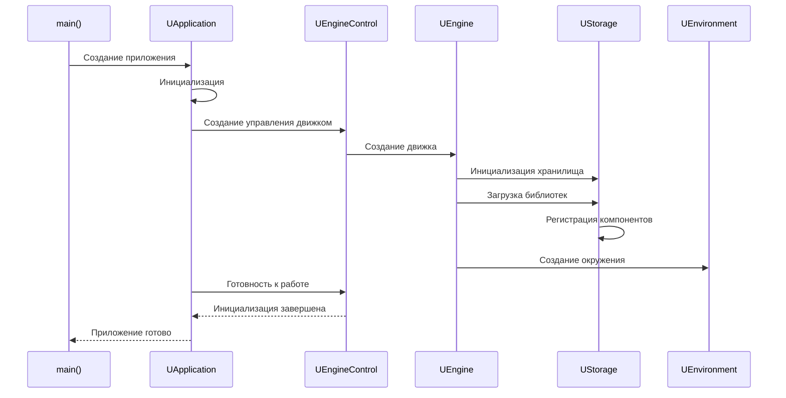
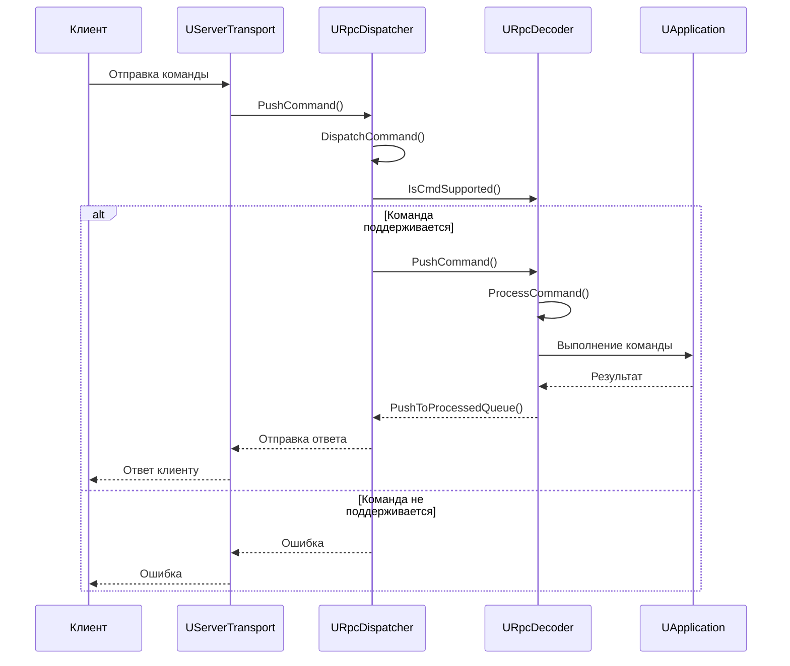
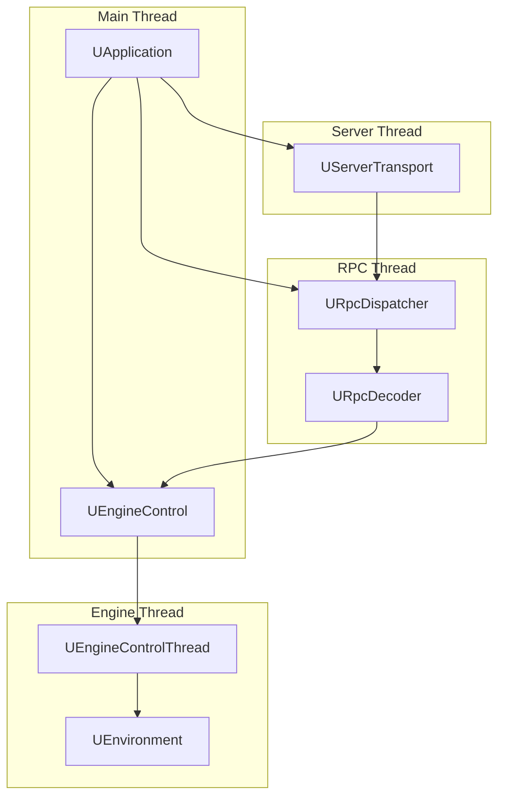

# Архитектура приложения (Application Architecture)

## RU

### Обзор

Модуль `Rdk/Core/Application` предоставляет инфраструктуру для управления приложением, RPC-систему, серверную функциональность и управление проектами.

### Основные компоненты

#### UApplication

Главный класс приложения, управляющий жизненным циклом и координацией всех подсистем.

**Основные функции:**
- Инициализация и завершение работы
- Управление движком
- Координация RPC и сервера
- Управление проектами

**Последовательность запуска приложения:**

#### UEngineControl

Управление движком выполнения компонентов.

**Основные функции:**
- Запуск/остановка выполнения
- Управление шагами времени
- Синхронизация потоков выполнения

#### RPC система

Система удаленных вызовов процедур для взаимодействия с приложением через сеть.

**Основные классы:**
- `URpcDispatcher` - диспетчер RPC команд
- `URpcDecoder` - декодер RPC команд
- `URpcCommand` - команда RPC
- `URpcDecoderCommon` - общий декодер
- `URpcDecoderInternal` - внутренний декодер

**Последовательность обработки RPC команды:**

#### UServerTransport

Транспортный слой для сервера.

**Реализации:**
- `UServerTransportTcp` - TCP транспорт
- `UServerTransportTcpQt` - TCP транспорт на Qt
- `UServerTransportHttp` - HTTP транспорт

#### UProject и UProjectDeployer

Управление проектами и их развертывание.

**Основные функции:**
- Загрузка/сохранение проектов
- Развертывание проектов на удаленные системы
- Управление конфигурациями

### Потоки выполнения

### Платформенные реализации

#### Qt (`Core/Application/Qt`)
Современная кроссплатформенная реализация на Qt.

**Основные классы:**
- `UEngineControlQt` - управление движком на Qt
- `UProjectDeployerQt` - развертывание проектов на Qt
- `UServerTransportTcpQt` - TCP транспорт на Qt

#### Borland C++ Builder (`Core/Application/Bcb`)
Реализация для Borland C++ Builder (legacy).

**Основные классы:**
- `Application.bcb.*` - приложение для BCB
- `URpcDispatcherVcl` - RPC диспетчер для VCL

#### Boost (`Core/Application/Boost`)
Реализация на Boost (опционально).

### См. также

- [Архитектура движка](Engine-Architecture.md)
- [Rdk Core Overview](Overview.md)
- [Детальная документация Rdk](../../Rdk/Docs/README.md)

---

## EN

### Overview

The `Rdk/Core/Application` module provides infrastructure for application management, RPC system, server functionality, and project management.

### Main Components

#### UApplication

Main application class managing lifecycle and coordination of all subsystems.

#### UEngineControl

Control of component execution engine.

#### RPC System

Remote Procedure Call system for interacting with the application over the network.

**Main Classes:**
- `URpcDispatcher` - RPC command dispatcher
- `URpcDecoder` - RPC command decoder
- `URpcCommand` - RPC command
- `URpcDecoderCommon` - common decoder
- `URpcDecoderInternal` - internal decoder

#### UServerTransport

Transport layer for the server.

**Implementations:**
- `UServerTransportTcp` - TCP transport
- `UServerTransportTcpQt` - TCP transport on Qt
- `UServerTransportHttp` - HTTP transport

#### UProject and UProjectDeployer

Project management and deployment.

### Execution Threads

### Platform Implementations

#### Qt (`Core/Application/Qt`)
Modern cross-platform implementation on Qt.

#### Borland C++ Builder (`Core/Application/Bcb`)
Implementation for Borland C++ Builder (legacy).

#### Boost (`Core/Application/Boost`)
Implementation on Boost (optional).

### See Also

- [Engine Architecture](Engine-Architecture.md)
- [Rdk Core Overview](Overview.md)
- [Detailed Rdk Documentation](../../Rdk/Docs/README.md)
