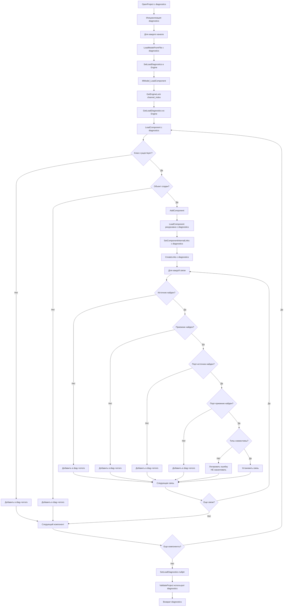

> **Note:** Root-level diagnostic flow doc. Related: [Engine-Detailed.md](../../Rdk/Docs/Engine-Detailed.md), `TProjectLoadDiagnostics` in `Rdk/Core/Engine/`.

# Поток диагностики при загрузке проекта

## Обзор

Данный документ описывает поток диагностики (`TProjectLoadDiagnostics`) через всю цепочку загрузки проекта, от открытия проекта до загрузки отдельных компонентов и установки связей.

## Структура диагностики

**Файл:** `Rdk/Core/Engine/TProjectLoadDiagnostics.h`

```cpp
struct TProjectLoadDiagnostics
{
  std::vector<std::string> errors;      // Список ошибок
  std::vector<std::string> warnings;    // Список предупреждений
  bool modelExists;                      // Существует ли модель
  bool modelEmpty;                       // Пустая ли модель
  std::vector<int> componentsCount;     // Количество компонентов по каналам
  std::vector<std::string> missingFiles;// Отсутствующие файлы
  std::vector<int> failedChannels;      // Каналы с ошибками
  bool isValid;                         // Общая валидность
  int channelsLoaded;                    // Успешно загруженные каналы
  int channelsTotal;                     // Общее количество каналов
};
```

## Диаграмма потока диагностики



## Детальное описание потока

### Этап 1: Инициализация диагностики

**Файл:** `Rdk/Core/Application/UApplication.cpp:2037-2040`

```cpp
if(diagnostics)
{
  *diagnostics = TProjectLoadDiagnostics();
}
```

**Действия:**
- Очистка всех полей диагностики
- Инициализация счетчиков

### Этап 2: Передача диагностики в LoadModelFromFile

**Файл:** `Rdk/Core/Application/UApplication.cpp:2131`

```cpp
is_loaded = LoadModelFromFile(i, model_file_path, diagnostics);
```

**Действия:**
- Диагностика передается по указателю
- Все ошибки загрузки файла накапливаются в `diagnostics->errors`

### Этап 3: Временное хранение в Engine

**Файл:** `Rdk/Core/Application/UApplication.cpp:2882-2888`

```cpp
RDK::UELockPtr<RDK::UEngine> engine_lock = RDK::GetEngineLock(channel_index);
if(engine_lock.Get())
{
  engine_lock.Get()->SetLoadDiagnostics(diagnostics);
}
```

**Действия:**
- Диагностика сохраняется в поле `UEngine::LoadDiagnostics`
- Это временное хранилище для передачи через C API

**Проблема:** Если `GetEngineLock` возвращает другой Engine (например, при переключении канала), диагностика теряется.

### Этап 4: Получение диагностики в Model_LoadComponent

**Файл:** `Rdk/Core/Engine/UEngine.cpp:5615`

```cpp
void* load_diagnostics = GetLoadDiagnostics();
if(!cont->LoadComponent(&XmlStorage, true, load_diagnostics))
  return RDK_E_MODEL_LOAD_COMPONENT_FAIL;
```

**Действия:**
- Диагностика извлекается из временного хранилища Engine
- Передается в `LoadComponent` как `void*` для обратной совместимости

**Проблема:** Если `GetLoadDiagnostics()` возвращает `nullptr`, диагностика не передается дальше.

### Этап 5: Накопление ошибок в LoadComponent

**Файл:** `Rdk/Core/Engine/UNet.cpp:789-895`

```cpp
TProjectLoadDiagnostics* diag = diagnostics ? static_cast<TProjectLoadDiagnostics*>(diagnostics) : nullptr;

// При ошибке:
if(diag)
{
  diag->errors.push_back(error_msg);
}
```

**Действия:**
- Диагностика приводится к правильному типу
- Ошибки накапливаются в `diag->errors`
- Проверка `if(diag)` предотвращает разыменование `nullptr`

**Обрабатываемые ошибки:**
1. Несуществующий класс: `EClassNameNotExist` → `diag->errors`
2. Неудачное создание: `TakeObject` возвращает `nullptr` → `diag->errors`
3. Неудачное добавление: `AddComponent` возвращает `ForbiddenId` → `diag->errors`
4. Неудачная загрузка дочернего: `LoadComponent` возвращает `false` → `diag->errors`

### Этап 6: Накопление ошибок в CreateLink

**Файл:** `Rdk/Core/Engine/UNet.h:399-422`

```cpp
TProjectLoadDiagnostics* diag = diagnostics ? static_cast<TProjectLoadDiagnostics*>(diagnostics) : nullptr;

if(!pitem)
{
  if(diag)
    diag->errors.push_back("Source component 'X' not found");
  return false;
}
```

**Действия:**
- Диагностика приводится к правильному типу
- Ошибки отсутствующих компонентов накапливаются в `diag->errors`

**Обрабатываемые ошибки:**
1. Компонент-источник не найден → `diag->errors`
2. Компонент-приемник не найден → `diag->errors`

### Этап 7: Накопление ошибок в ConnectToItem

**Файл:** `Rdk/Core/Engine/UConnector.cpp:457-483`

```cpp
TProjectLoadDiagnostics* diag = diagnostics ? static_cast<TProjectLoadDiagnostics*>(diagnostics) : nullptr;

if(!i_item_property)
{
  if(diag)
    diag->errors.push_back("Output port 'X' not found in component 'Y'");
  return false;
}
```

**Действия:**
- Диагностика приводится к правильному типу
- Ошибки отсутствующих портов накапливаются в `diag->errors`

**Обрабатываемые ошибки:**
1. Порт-источник не найден → `diag->errors`
2. Порт-приемник не найден → `diag->errors`

**Не обрабатывается:**
- Несовместимость типов портов → только логирование, не накопление

## Проблемы потока диагностики

### Проблема 1: Потеря диагностики между LoadModelFromFile и Model_LoadComponent

**Местоположение:** `Rdk/Core/Application/UApplication.cpp:2882-2893`

**Описание:**
- Диагностика устанавливается в Engine через `SetLoadDiagnostics`
- Затем вызывается `MModel_LoadComponent`, который создает новый `UELockPtr`
- Если между установкой и получением произошло переключение канала, диагностика может быть потеряна

**Решение:**
- Убедиться, что `GetEngineLock(channel_index)` всегда возвращает указатель на один и тот же Engine
- Добавить проверку, что диагностика не потерялась
- Рассмотреть альтернативный подход: передача через параметры

### Проблема 2: Диагностика может быть nullptr

**Местоположение:** Различные места в коде

**Описание:**
- Во многих местах проверяется `if(diag)`, но если диагностика не передана, ошибки теряются
- Это нормально для обратной совместимости, но может скрывать ошибки

**Решение:**
- Убедиться, что диагностика передается во все рекурсивные вызовы
- Добавить логирование, если диагностика не передана (для отладки)

### Проблема 3: Ошибка несовместимости типов не накапливается

**Местоположение:** `Rdk/Core/Engine/UConnector.cpp:485-494`

**Описание:**
- При несовместимости типов портов ошибка логируется, но не накапливается в диагностике
- Это критическая ошибка, которая должна быть в диагностике

**Решение:**
- Добавить накопление ошибки в `diag->errors` при несовместимости типов

## Рекомендации по улучшению

### Рекомендация 1: Единый механизм передачи диагностики

**Текущее состояние:**
- Диагностика передается через временное хранилище в Engine
- Это работает, но не идеально

**Предложение:**
- Рассмотреть передачу диагностики через параметры функций
- Это потребует изменения C API, но будет более надежно

### Рекомендация 2: Накопление всех ошибок

**Текущее состояние:**
- Большинство ошибок накапливаются
- Но ошибка несовместимости типов не накапливается

**Предложение:**
- Добавить накопление всех ошибок, включая несовместимость типов

### Рекомендация 3: Накопление предупреждений

**Текущее состояние:**
- Предупреждения о неактивных компонентах только логируются

**Предложение:**
- Добавить накопление предупреждений в `diag->warnings`

## Примеры использования

### Пример 1: Валидация конфигурации

```cpp
TProjectLoadDiagnostics diagnostics;
bool loaded = app->OpenProject("project.ini", &diagnostics);

if(!diagnostics.errors.empty())
{
  std::cout << "Errors:" << std::endl;
  for(const auto& error : diagnostics.errors)
    std::cout << "  - " << error << std::endl;
}

if(!diagnostics.warnings.empty())
{
  std::cout << "Warnings:" << std::endl;
  for(const auto& warning : diagnostics.warnings)
    std::cout << "  - " << warning << std::endl;
}
```

### Пример 2: Проверка валидности

```cpp
TProjectLoadDiagnostics diagnostics = app->ValidateProject("project.ini");

if(!diagnostics.isValid)
{
  // Обработка ошибок
  return false;
}
```

## См. также

- [Цепочка загрузки компонентов](Component-Loading-Chain.md)
- [Цепочка создания связей](Link-Creation-Chain.md)
- [Архитектура Application](Application-Architecture.md)
