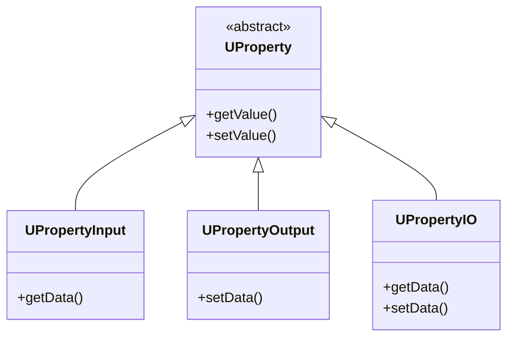
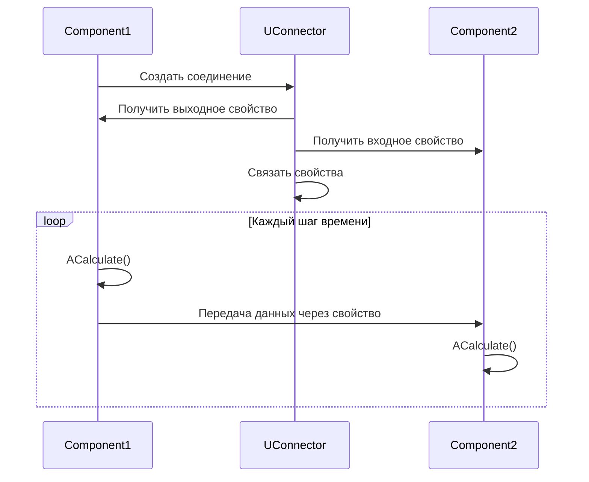
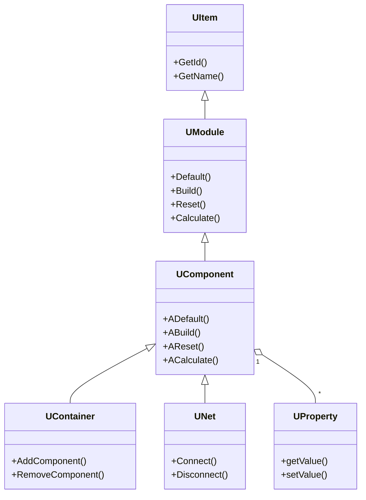
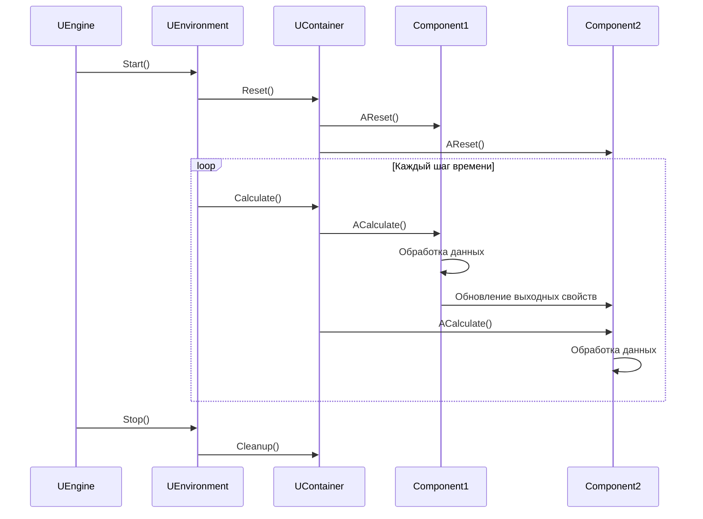
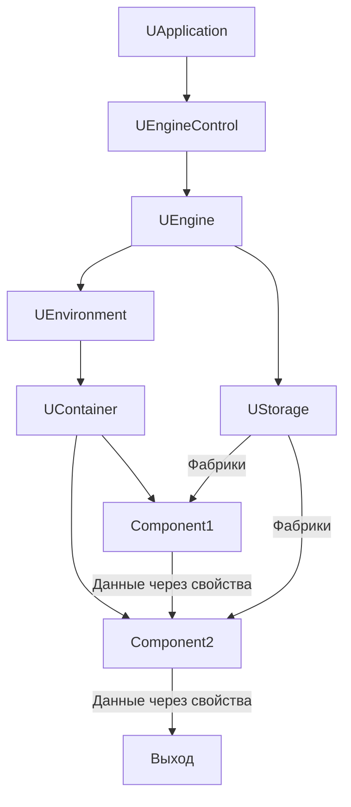

# Архитектура движка (Engine Architecture)

## RU

### Обзор

Модуль `Rdk/Core/Engine` реализует ядро компонентной системы - движок выполнения компонентов, систему свойств, контейнеры и сети компонентов.

### Основные компоненты

#### UEngine

Главный класс движка, управляющий окружением и хранилищем компонентов.

**Основные функции:**
- Создание и управление окружением (`UEnvironment`)
- Управление хранилищем компонентов (`UStorage`)
- Координация выполнения компонентов

#### UComponent

Базовый класс для всех компонентов в системе.

**Жизненный цикл компонента:**

```mermaid
stateDiagram-v2
    [*] --> Default: Создание
    Default --> Build: Настройка параметров
    Build --> Ready: Готов к работе
    Ready --> Reset: Перед вычислениями
    Reset --> Calculate: Вычисление
    Calculate --> Calculate: Повтор
    Calculate --> Reset: Новый цикл
    Ready --> [*]: Удаление
```

**Методы жизненного цикла:**
- `ADefault()` - инициализация значений по умолчанию
- `ABuild()` - построение структуры компонента
- `AReset()` - сброс состояния перед вычислениями
- `ACalculate()` - выполнение вычислений

#### UContainer

Контейнер для группировки компонентов.

**Основные функции:**
- Хранение компонентов
- Управление жизненным циклом группы компонентов
- Изоляция компонентов друг от друга

#### UNet

Сеть компонентов - контейнер для соединения компонентов в вычислительную сеть.

**Основные функции:**
- Организация компонентов в сеть
- Управление соединениями между компонентами
- Выполнение сети компонентов

#### UEnvironment

Окружение выполнения компонентов.

**Основные функции:**
- Управление временем выполнения (TimeStep)
- Логирование
- Обработка исключений
- Координация выполнения компонентов

#### UStorage

Хранилище (реестр) компонентов.

**Основные функции:**
- Реестр классов компонентов
- Фабрики для создания компонентов
- Описания компонентов (`UComponentDescription`)
- Управление библиотеками (`ULibrary`)

### Система свойств

#### Типы свойств



**Типы свойств:**
- `ptParameter` - параметр компонента
- `ptState` - состояние компонента
- `ptTemp` - временное свойство
- `ptInput` - входное свойство
- `ptOutput` - выходное свойство

**Группы свойств:**
- `pgPublic` - публичное свойство
- `pgSystem` - системное свойство
- `pgInput` - входная группа
- `pgOutput` - выходная группа

### Соединение компонентов



### Архитектура классов



### Выполнение компонентов

**Последовательность выполнения:**



### Поток управления и данных

**Как течёт управление и данные в системе:**



### Фабрики компонентов

#### UComponentFactory

Фабрика для создания компонентов определенного типа.

**Основные функции:**
- Создание экземпляров компонентов
- Регистрация в хранилище
- Управление метаданными компонентов

### См. также

- [Компонентная система](../Components-And-Configuration/Component-System.md)
- [Rdk Core Overview](Overview.md)
- [Детальная документация Rdk](../../Rdk/Docs/README.md)

---

## EN

### Overview

The `Rdk/Core/Engine` module implements the core of the component system - component execution engine, property system, containers, and component networks.

### Main Components

#### UEngine

Main engine class managing environment and component storage.

#### UComponent

Base class for all components in the system.

**Component Lifecycle:**
- `ADefault()` - default value initialization
- `ABuild()` - component structure building
- `AReset()` - state reset before calculations
- `ACalculate()` - calculation execution

#### UContainer

Container for grouping components.

#### UNet

Component network - container for connecting components into a computational network.

#### UEnvironment

Component execution environment.

#### UStorage

Component storage (registry).

### Property System

**Property Types:**
- `ptParameter` - component parameter
- `ptState` - component state
- `ptTemp` - temporary property
- `ptInput` - input property
- `ptOutput` - output property

**Property Groups:**
- `pgPublic` - public property
- `pgSystem` - system property
- `pgInput` - input group
- `pgOutput` - output group

### Component Connection

### Class Architecture

### Component Execution

### Component Factories

#### UComponentFactory

Factory for creating components of a specific type.

### See Also

- [Component System](../Components-And-Configuration/Component-System.md)
- [Rdk Core Overview](Overview.md)
- [Detailed Rdk Documentation](../../Rdk/Docs/README.md)
