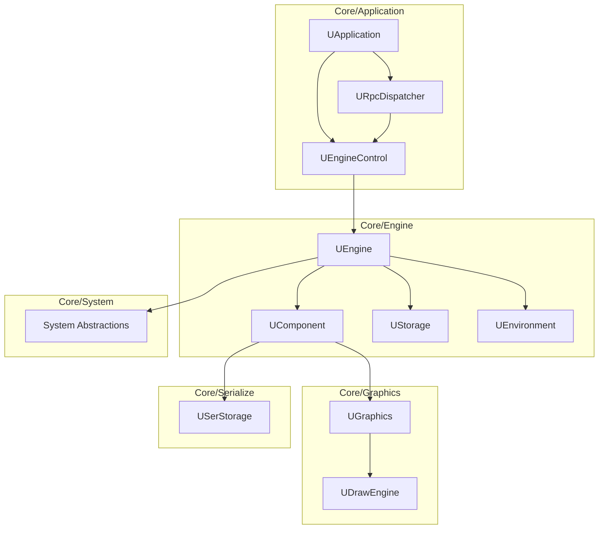

# Rdk Core - Обзор

## RU

### Назначение

**Rdk (Core)** - это ядро системы Nmsdk, предоставляющее базовую инфраструктуру для компонентной архитектуры. Ядро реализует:

- Движок выполнения компонентов
- Компонентную систему
- Систему сериализации (XML, Binary)
- Графическую подсистему
- Прикладной уровень (RPC, сервер, управление проектами)
- Кроссплатформенные абстракции

### Структура модулей

#### Схема зависимостей модулей Rdk

#### Core/Application
Управление приложением, RPC, сервер, проекты.

**Основные классы:**
- `UApplication` - главный класс приложения
- `UEngineControl` - управление движком
- `URpcDispatcher` - диспетчер RPC команд
- `UServerTransport` - транспорт сервера (TCP, HTTP)
- `UProject` - проект

См. [Архитектура приложения](Application-Architecture.md)

#### Core/Engine
Движок и компонентная система.

**Основные классы:**
- `UEngine` - главный класс движка
- `UComponent` - базовый класс компонентов
- `UContainer` - контейнер компонентов
- `UNet` - сеть компонентов
- `UEnvironment` - окружение выполнения
- `UStorage` - хранилище компонентов
- `UProperty` - система свойств

См. [Архитектура движка](Engine-Architecture.md)

#### Core/Graphics
Система графики для визуализации компонентов и данных.

**Основные классы:**
- `UGraphics` - основной класс графики
- `UDrawEngine` - движок отрисовки
- `UBitmap` - растровое изображение
- `UFont` - шрифт

См. [Архитектура графики](Graphics-Architecture.md)

#### Core/Serialize
Система сериализации данных и компонентов.

**Основные классы:**
- `USerStorage` - хранилище данных
- `UXMLStdSerialize` - XML сериализация
- `UBinaryStdSerialize` - бинарная сериализация

См. [Архитектура сериализации](Serialize-Architecture.md)

#### Core/System
Кроссплатформенные системные абстракции.

**Основные классы:**
- `UGenericMutex` - универсальный мьютекс
- `UGenericEvent` - универсальное событие
- `UDllLoader` - загрузчик DLL/SO
- `USharedMemoryLoader` - загрузчик разделяемой памяти

См. [Системные абстракции](System-Platform-Abstraction.md)

#### Core/Utilities
Вспомогательные утилиты.

#### Core/Math
Математические утилиты (матрицы, векторы, математические операции).

#### Core/Console
Консольный движок для выполнения без GUI.

**Основные классы:**
- `UConsoleEngine` - консольный движок

### Зависимости

Rdk Core не зависит от других библиотек проекта, но использует:

- Qt5 (Core) - для базовой функциональности
- Стандартная библиотека C++
- Системные библиотеки (платформо-зависимые)

### Детальная документация

#### Архитектура (корневая документация)

- [Архитектура приложения](Application-Architecture.md) - RPC, сервер, управление проектами
- [Архитектура движка](Engine-Architecture.md) - компоненты, контейнеры, свойства
- [Архитектура графики](Graphics-Architecture.md) - система графики и визуализации
- [Архитектура сериализации](Serialize-Architecture.md) - XML и бинарная сериализация
- [Системные абстракции](System-Platform-Abstraction.md) - кроссплатформенные абстракции

#### Детальная документация в Rdk/Docs

- [Обзор документации Rdk](../../Rdk/Docs/README.md) - главная страница документации Rdk
- [Архитектура](../../Rdk/Docs/Architecture.md) - детальное описание архитектуры подсистем
- [Архитектурные диаграммы](../../Rdk/Docs/Architecture-Diagrams.md) - обзорные диаграммы
- [API Справочник](../../Rdk/Docs/API-Reference.md) - полный справочник API

#### Детальная документация модулей

- [Движок](../../Rdk/Docs/Engine-Detailed.md) - компоненты, свойства, контроллеры
- [Приложение](../../Rdk/Docs/Application-Detailed.md) - RPC, проекты, сервер
- [Графика](../../Rdk/Docs/Graphics-Detailed.md) - графика, шрифты, отрисовка
- [Сериализация](../../Rdk/Docs/Serialize-Detailed.md) - XML, Binary сериализация
- [Система](../../Rdk/Docs/System-Detailed.md) - мьютексы, события, загрузка библиотек
- [Математика](../../Rdk/Docs/Math-Detailed.md) - математические утилиты
- [Утилиты](../../Rdk/Docs/Utilities-Detailed.md) - вспомогательные утилиты

#### Справочники

- [Математические библиотеки](../../Rdk/Docs/Math-Libraries-Reference.md) - матрицы, векторы, фильтры Калмана
- [Утилиты](../../Rdk/Docs/Utilities-Reference.md) - исключения, файлы, временные метки
- [Система логирования](../../Rdk/Docs/Logging-System.md) - логирование
- [Система контроллеров](../../Rdk/Docs/Controllers-System.md) - контроллеры
- [Консольное приложение](../../Rdk/Docs/Console-Application.md) - консольный движок
- [Тесты](../../Rdk/Docs/Tests.md) - юнит и интеграционные тесты

#### Руководства

- [Создание компонентов](../../Rdk/Docs/Guides/Creating-Components.md)
- [Создание свойств](../../Rdk/Docs/Guides/Creating-Properties.md)
- [Создание контроллеров](../../Rdk/Docs/Guides/Creating-Controllers.md)
- [Сериализация](../../Rdk/Docs/Guides/Serialization-Guide.md)
- [RPC интеграция](../../Rdk/Docs/Guides/RPC-Integration.md)
- [Многопоточность](../../Rdk/Docs/Guides/Threading-Guide.md)
- [Обработка ошибок](../../Rdk/Docs/Guides/Error-Handling.md)

#### Диаграммы

- [Жизненный цикл компонента](../../Rdk/Docs/Diagrams/Component-Lifecycle.md)
- [Система свойств](../../Rdk/Docs/Diagrams/Property-System.md)
- [Поток RPC](../../Rdk/Docs/Diagrams/RPC-Flow.md)

#### Индексы

- [Полный индекс документации Rdk](../Submodules/Rdk-Index.md) - структурированный индекс всей документации Rdk
- [Навигационная карта](../Submodules/Navigation-Map.md) - визуальная карта документации

---

## EN

### Purpose

**Rdk (Core)** is the core of the Nmsdk system, providing the basic infrastructure for component-based architecture. The core implements:

- Component execution engine
- Component system
- Serialization system (XML, Binary)
- Graphics subsystem
- Application layer (RPC, server, project management)
- Cross-platform abstractions

### Module Structure

#### Core/Application
Application management, RPC, server, projects.

#### Core/Engine
Engine and component system.

#### Core/Graphics
Graphics system for visualizing components and data.

#### Core/Serialize
Data and component serialization system.

#### Core/System
Cross-platform system abstractions.

#### Core/Utilities
Helper utilities.

#### Core/Math
Mathematical utilities (matrices, vectors, mathematical operations).

#### Core/Console
Console engine for execution without GUI.

### Dependencies

Rdk Core does not depend on other project libraries but uses:

- Qt5 (Core) - for basic functionality
- C++ standard library
- System libraries (platform-dependent)

### Detailed Documentation

#### Architecture (Root Documentation)

- [Application Architecture](Application-Architecture.md) - RPC, server, project management
- [Engine Architecture](Engine-Architecture.md) - components, containers, properties
- [Graphics Architecture](Graphics-Architecture.md) - graphics and visualization system
- [Serialization Architecture](Serialize-Architecture.md) - XML and binary serialization
- [System Abstractions](System-Platform-Abstraction.md) - cross-platform abstractions

#### Detailed Documentation in Rdk/Docs

- [Rdk Documentation Overview](../../Rdk/Docs/README.md) - main Rdk documentation page
- [Architecture](../../Rdk/Docs/Architecture.md) - detailed subsystem architecture description
- [Architecture Diagrams](../../Rdk/Docs/Architecture-Diagrams.md) - overview diagrams
- [API Reference](../../Rdk/Docs/API-Reference.md) - complete API reference

#### Detailed Module Documentation

- [Engine](../../Rdk/Docs/Engine-Detailed.md) - components, properties, controllers
- [Application](../../Rdk/Docs/Application-Detailed.md) - RPC, projects, server
- [Graphics](../../Rdk/Docs/Graphics-Detailed.md) - graphics, fonts, rendering
- [Serialization](../../Rdk/Docs/Serialize-Detailed.md) - XML, Binary serialization
- [System](../../Rdk/Docs/System-Detailed.md) - mutexes, events, library loading
- [Math](../../Rdk/Docs/Math-Detailed.md) - mathematical utilities
- [Utilities](../../Rdk/Docs/Utilities-Detailed.md) - helper utilities

#### References

- [Math Libraries](../../Rdk/Docs/Math-Libraries-Reference.md) - matrices, vectors, Kalman filters
- [Utilities](../../Rdk/Docs/Utilities-Reference.md) - exceptions, files, timestamps
- [Logging System](../../Rdk/Docs/Logging-System.md) - logging
- [Controllers System](../../Rdk/Docs/Controllers-System.md) - controllers
- [Console Application](../../Rdk/Docs/Console-Application.md) - console engine
- [Tests](../../Rdk/Docs/Tests.md) - unit and integration tests

#### Guides

- [Creating Components](../../Rdk/Docs/Guides/Creating-Components.md)
- [Creating Properties](../../Rdk/Docs/Guides/Creating-Properties.md)
- [Creating Controllers](../../Rdk/Docs/Guides/Creating-Controllers.md)
- [Serialization](../../Rdk/Docs/Guides/Serialization-Guide.md)
- [RPC Integration](../../Rdk/Docs/Guides/RPC-Integration.md)
- [Threading](../../Rdk/Docs/Guides/Threading-Guide.md)
- [Error Handling](../../Rdk/Docs/Guides/Error-Handling.md)

#### Diagrams

- [Component Lifecycle](../../Rdk/Docs/Diagrams/Component-Lifecycle.md)
- [Property System](../../Rdk/Docs/Diagrams/Property-System.md)
- [RPC Flow](../../Rdk/Docs/Diagrams/RPC-Flow.md)

#### Indexes

- [Complete Rdk Documentation Index](../Submodules/Rdk-Index.md) - structured index of all Rdk documentation
- [Navigation Map](../Submodules/Navigation-Map.md) - visual documentation map
