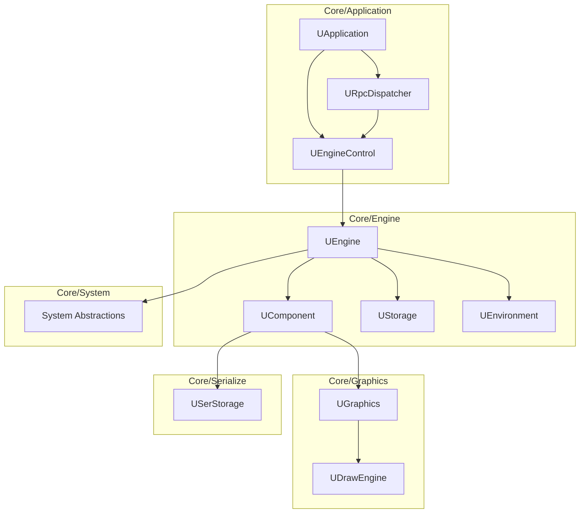

# Rdk Core - Обзор

## RU

### Назначение

**Rdk (Core)** - это ядро системы Nmsdk, предоставляющее базовую инфраструктуру для компонентной архитектуры. Ядро реализует:

- Движок выполнения компонентов
- Компонентную систему
- Систему сериализации (XML, Binary)
- Графическую подсистему
- Прикладной уровень (RPC, сервер, управление проектами)
- Кроссплатформенные абстракции

### Структура модулей

#### Схема зависимостей модулей Rdk

#### Core/Application
Управление приложением, RPC, сервер, проекты.

**Основные классы:**
- `UApplication` - главный класс приложения
- `UEngineControl` - управление движком
- `URpcDispatcher` - диспетчер RPC команд
- `UServerTransport` - транспорт сервера (TCP, HTTP)
- `UProject` - проект

См. [Архитектура приложения](Application-Architecture.md)

#### Core/Engine
Движок и компонентная система.

**Основные классы:**
- `UEngine` - главный класс движка
- `UComponent` - базовый класс компонентов
- `UContainer` - контейнер компонентов
- `UNet` - сеть компонентов
- `UEnvironment` - окружение выполнения
- `UStorage` - хранилище компонентов
- `UProperty` - система свойств

См. [Архитектура движка](Engine-Architecture.md)

#### Core/Graphics
Система графики для визуализации компонентов и данных.

**Основные классы:**
- `UGraphics` - основной класс графики
- `UDrawEngine` - движок отрисовки
- `UBitmap` - растровое изображение
- `UFont` - шрифт

См. [Архитектура графики](Graphics-Architecture.md)

#### Core/Serialize
Система сериализации данных и компонентов.

**Основные классы:**
- `USerStorage` - хранилище данных
- `UXMLStdSerialize` - XML сериализация
- `UBinaryStdSerialize` - бинарная сериализация

См. [Архитектура сериализации](Serialize-Architecture.md)

#### Core/System
Кроссплатформенные системные абстракции.

**Основные классы:**
- `UGenericMutex` - универсальный мьютекс
- `UGenericEvent` - универсальное событие
- `UDllLoader` - загрузчик DLL/SO
- `USharedMemoryLoader` - загрузчик разделяемой памяти

См. [Системные абстракции](System-Platform-Abstraction.md)

#### Core/Utilities
Вспомогательные утилиты.

#### Core/Math
Математические утилиты (матрицы, векторы, математические операции).

#### Core/Console
Консольный движок для выполнения без GUI.

**Основные классы:**
- `UConsoleEngine` - консольный движок

### Зависимости

Rdk Core не зависит от других библиотек проекта, но использует:

- Qt5 (Core) - для базовой функциональности
- Стандартная библиотека C++
- Системные библиотеки (платформо-зависимые)

### Детальная документация

- [Архитектура приложения](Application-Architecture.md)
- [Архитектура движка](Engine-Architecture.md)
- [Архитектура графики](Graphics-Architecture.md)
- [Архитектура сериализации](Serialize-Architecture.md)
- [Системные абстракции](System-Platform-Abstraction.md)

Также см. детальную документацию в [Rdk/Docs](../../Rdk/Docs/README.md)

---

## EN

### Purpose

**Rdk (Core)** is the core of the Nmsdk system, providing the basic infrastructure for component-based architecture. The core implements:

- Component execution engine
- Component system
- Serialization system (XML, Binary)
- Graphics subsystem
- Application layer (RPC, server, project management)
- Cross-platform abstractions

### Module Structure

#### Core/Application
Application management, RPC, server, projects.

#### Core/Engine
Engine and component system.

#### Core/Graphics
Graphics system for visualizing components and data.

#### Core/Serialize
Data and component serialization system.

#### Core/System
Cross-platform system abstractions.

#### Core/Utilities
Helper utilities.

#### Core/Math
Mathematical utilities (matrices, vectors, mathematical operations).

#### Core/Console
Console engine for execution without GUI.

### Dependencies

Rdk Core does not depend on other project libraries but uses:

- Qt5 (Core) - for basic functionality
- C++ standard library
- System libraries (platform-dependent)

### Detailed Documentation

- [Application Architecture](Application-Architecture.md)
- [Engine Architecture](Engine-Architecture.md)
- [Graphics Architecture](Graphics-Architecture.md)
- [Serialization Architecture](Serialize-Architecture.md)
- [System Abstractions](System-Platform-Abstraction.md)

Also see detailed documentation in [Rdk/Docs](../../Rdk/Docs/README.md)
