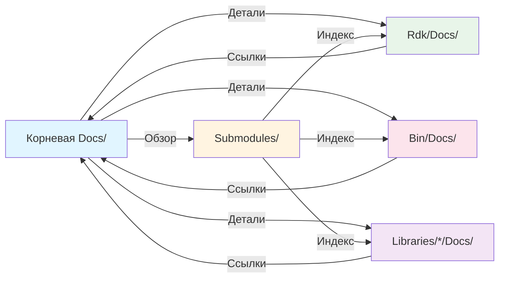
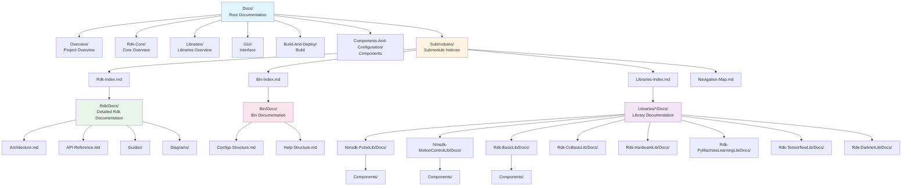
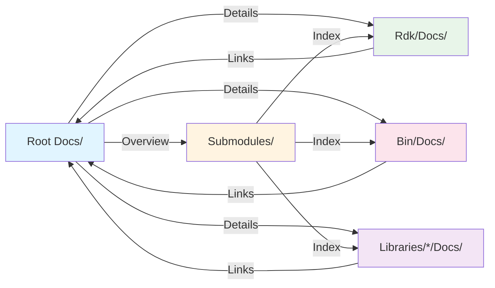

# Навигационная карта документации Nmsdk

## RU

### Назначение

Этот документ предоставляет визуальную карту структуры документации проекта Nmsdk и связей между корневой документацией и документацией сабмодулей.

### Структура документации

### Быстрые ссылки

#### Корневая документация

- [Главная страница](../README.md) - точка входа в документацию
- [Обзор проекта](../Overview/README.md) - высокоуровневое описание
- [Быстрый старт](../Overview/QuickStart.md) - начало работы
- [Архитектура системы](../Overview/Architecture-Overview.md) - архитектура проекта

#### Индексы сабмодулей

- [Индекс документации Rdk](Rdk-Index.md) - полный индекс документации ядра Rdk
- [Индекс документации Bin](Bin-Index.md) - индекс документации ресурсов и конфигураций
- [Индекс документации библиотек](Libraries-Index.md) - индекс документации всех библиотек

#### Rdk Core

- [Обзор Rdk Core](../Rdk-Core/Overview.md) - обзор ядра системы
- [Документация Rdk](../../Rdk/Docs/README.md) - детальная документация ядра
- [Архитектура Rdk](../../Rdk/Docs/Architecture.md) - архитектура подсистем
- [API Справочник](../../Rdk/Docs/API-Reference.md) - полный справочник API

#### Bin (Ресурсы)

- [Документация Bin](../../Bin/Docs/README.md) - документация ресурсов
- [Структура конфигураций](../../Bin/Docs/Configs-Structure.md) - конфигурационные файлы
- [Структура справки](../../Bin/Docs/Help-Structure.md) - справочная система

#### Библиотеки

##### Основные библиотеки

- [Nmsdk-PulseLib](../Libraries/Nmsdk-PulseLib.md) - импульсные нейронные сети
  - [Документация](../../Libraries/Nmsdk-PulseLib/Docs/README.md)
- [Nmsdk-MotionControlLib](../Libraries/Nmsdk-MotionControlLib.md) - управление движением
  - [Документация](../../Libraries/Nmsdk-MotionControlLib/Docs/README.md)
- [Rdk-BasicLib](../Libraries/Rdk-BasicLib.md) - базовые компоненты
  - [Документация](../../Libraries/Rdk-BasicLib/Docs/README.md)
- [Rdk-CvBasicLib](../Libraries/Rdk-CvBasicLib.md) - компьютерное зрение
  - [Документация](../../Libraries/Rdk-CvBasicLib/Docs/README.md)
- [Rdk-HardwareLib](../Libraries/Rdk-HardwareLib.md) - аппаратное обеспечение
  - [Документация](../../Libraries/Rdk-HardwareLib/Docs/README.md)

##### Библиотеки машинного обучения

- [Rdk-PyMachineLearningLib](../Libraries/Rdk-PyMachineLearningLib.md) - Python ML
  - [Документация](../../Libraries/Rdk-PyMachineLearningLib/Docs/README.md)
- [Rdk-TensorflowLib](../Libraries/Rdk-TensorflowLib.md) - TensorFlow
  - [Документация](../../Libraries/Rdk-TensorflowLib/Docs/README.md)
- [Rdk-DarknetLib](../Libraries/Rdk-DarknetLib.md) - Darknet
  - [Документация](../../Libraries/Rdk-DarknetLib/Docs/README.md)

### Пути навигации

#### Для новых пользователей

1. [Главная страница](../README.md) → [Быстрый старт](../Overview/QuickStart.md)
2. [Обзор проекта](../Overview/README.md) → [Архитектура системы](../Overview/Architecture-Overview.md)
3. [Обзор библиотек](../Libraries/Overview.md) → Выбор нужной библиотеки

#### Для разработчиков

1. [Rdk Core Overview](../Rdk-Core/Overview.md) → [Индекс документации Rdk](Rdk-Index.md)
2. [Guides](../../Rdk/Docs/Guides/Creating-Components.md) → Создание компонентов
3. [API Reference](../../Rdk/Docs/API-Reference.md) → Справочник API

#### Для пользователей библиотек

1. [Обзор библиотек](../Libraries/Overview.md) → [Индекс документации библиотек](Libraries-Index.md)
2. Выбор библиотеки → [Документация библиотеки](../../Libraries/<LibName>/Docs/README.md)
3. [Каталог компонентов](../../Libraries/<LibName>/Docs/Component-Catalog.md) → [Документация компонента](../../Libraries/<LibName>/Docs/Components/<Component>.md)

#### Для работы с конфигурациями

1. [Документация Bin](../../Bin/Docs/README.md) → [Структура конфигураций](../../Bin/Docs/Configs-Structure.md)
2. [Индекс документации Bin](Bin-Index.md) → Детальная информация

### Связи между документацией

### Примечания

- Все ссылки в документации используют относительные пути
- Документация сабмодулей содержит обратные ссылки на корневую документацию
- Индексные файлы в `Submodules/` обеспечивают быстрый доступ ко всей документации
- Каждая библиотека имеет свою структуру документации, но следует общим принципам

---

## EN

### Purpose

This document provides a visual map of the Nmsdk project documentation structure and links between root documentation and submodule documentation.

### Documentation Structure

### Quick Links

#### Root Documentation

- [Main Page](../README.md) - documentation entry point
- [Project Overview](../Overview/README.md) - high-level description
- [Quick Start](../Overview/QuickStart.md) - getting started
- [System Architecture](../Overview/Architecture-Overview.md) - project architecture

#### Submodule Indexes

- [Rdk Documentation Index](Rdk-Index.md) - complete index of Rdk core documentation
- [Bin Documentation Index](Bin-Index.md) - index of resources and configurations documentation
- [Libraries Documentation Index](Libraries-Index.md) - index of all libraries documentation

#### Rdk Core

- [Rdk Core Overview](../Rdk-Core/Overview.md) - system core overview
- [Rdk Documentation](../../Rdk/Docs/README.md) - detailed core documentation
- [Rdk Architecture](../../Rdk/Docs/Architecture.md) - subsystem architecture
- [API Reference](../../Rdk/Docs/API-Reference.md) - complete API reference

#### Bin (Resources)

- [Bin Documentation](../../Bin/Docs/README.md) - resources documentation
- [Configuration Structure](../../Bin/Docs/Configs-Structure.md) - configuration files
- [Help Structure](../../Bin/Docs/Help-Structure.md) - help system

#### Libraries

##### Main Libraries

- [Nmsdk-PulseLib](../Libraries/Nmsdk-PulseLib.md) - spiking neural networks
  - [Documentation](../../Libraries/Nmsdk-PulseLib/Docs/README.md)
- [Nmsdk-MotionControlLib](../Libraries/Nmsdk-MotionControlLib.md) - motion control
  - [Documentation](../../Libraries/Nmsdk-MotionControlLib/Docs/README.md)
- [Rdk-BasicLib](../Libraries/Rdk-BasicLib.md) - basic components
  - [Documentation](../../Libraries/Rdk-BasicLib/Docs/README.md)
- [Rdk-CvBasicLib](../Libraries/Rdk-CvBasicLib.md) - computer vision
  - [Documentation](../../Libraries/Rdk-CvBasicLib/Docs/README.md)
- [Rdk-HardwareLib](../Libraries/Rdk-HardwareLib.md) - hardware
  - [Documentation](../../Libraries/Rdk-HardwareLib/Docs/README.md)

##### Machine Learning Libraries

- [Rdk-PyMachineLearningLib](../Libraries/Rdk-PyMachineLearningLib.md) - Python ML
  - [Documentation](../../Libraries/Rdk-PyMachineLearningLib/Docs/README.md)
- [Rdk-TensorflowLib](../Libraries/Rdk-TensorflowLib.md) - TensorFlow
  - [Documentation](../../Libraries/Rdk-TensorflowLib/Docs/README.md)
- [Rdk-DarknetLib](../Libraries/Rdk-DarknetLib.md) - Darknet
  - [Documentation](../../Libraries/Rdk-DarknetLib/Docs/README.md)

### Navigation Paths

#### For New Users

1. [Main Page](../README.md) → [Quick Start](../Overview/QuickStart.md)
2. [Project Overview](../Overview/README.md) → [System Architecture](../Overview/Architecture-Overview.md)
3. [Libraries Overview](../Libraries/Overview.md) → Choose needed library

#### For Developers

1. [Rdk Core Overview](../Rdk-Core/Overview.md) → [Rdk Documentation Index](Rdk-Index.md)
2. [Guides](../../Rdk/Docs/Guides/Creating-Components.md) → Creating components
3. [API Reference](../../Rdk/Docs/API-Reference.md) → API reference

#### For Library Users

1. [Libraries Overview](../Libraries/Overview.md) → [Libraries Documentation Index](Libraries-Index.md)
2. Choose library → [Library Documentation](../../Libraries/<LibName>/Docs/README.md)
3. [Component Catalog](../../Libraries/<LibName>/Docs/Component-Catalog.md) → [Component Documentation](../../Libraries/<LibName>/Docs/Components/<Component>.md)

#### For Configuration Work

1. [Bin Documentation](../../Bin/Docs/README.md) → [Configuration Structure](../../Bin/Docs/Configs-Structure.md)
2. [Bin Documentation Index](Bin-Index.md) → Detailed information

### Documentation Links

### Notes

- All documentation links use relative paths
- Submodule documentation contains backlinks to root documentation
- Index files in `Submodules/` provide quick access to all documentation
- Each library has its own documentation structure but follows common principles
