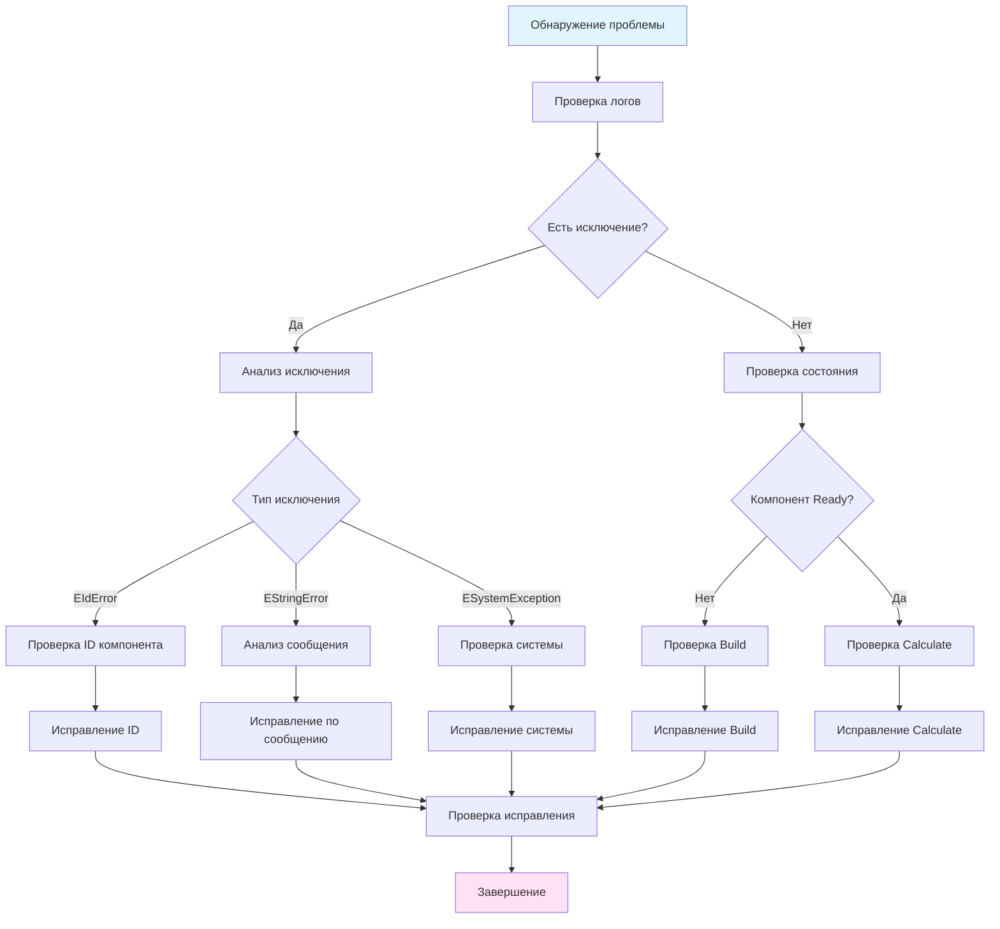

# Руководство по устранению неполадок (Troubleshooting Guide)

## RU

### Обзор

Это руководство описывает типичные проблемы, возникающие при работе с Nmsdk, и способы их решения. Оно поможет быстро диагностировать и устранить неполадки.

### Типичные проблемы и решения

#### Проблема 1: Компонент не инициализируется (EIdError с Id=0)

**Симптомы:**
- Исключение `EIdError` или `EForbiddenId` с Id=0
- Компонент не создается через `CreateComponent()`
- Ошибка "Component ID is zero"

**Причины:**
- Компонент создан без регистрации в `UStorage`
- Компонент создан до вызова `Default()`
- Нарушена иерархия компонентов

**Решения:**

```cpp
// ❌ Неправильно - компонент создан без регистрации
MyComponent* comp = new MyComponent();
comp->Calculate(); // Ошибка: Id=0

// ✅ Правильно - создание через Storage
auto comp = storage->CreateComponent<MyComponent>("MyComp");
comp->Default();
comp->Build();
comp->Calculate();

// ✅ Правильно - создание подкомпонента в ABuild()
virtual bool ABuild(void) override
{
    if (!UNet::ABuild())
        return false;
    
    // Подкомпонент автоматически получает Id
    SubComponent = CreateComponent<MyComponent>("Sub");
    SubComponent->Build();
    
    return true;
}
```

**Диагностика:**

```cpp
// Проверка ID компонента
if (component->GetId() == 0) {
    Logger->LogMessageEx(RDK_EX_ERROR, "Component", __FUNCTION__,
                        "Component ID is zero - not registered in Storage");
}

// Проверка регистрации в Storage
RDK::UId class_id = storage->FindClass("MyComponent");
if (class_id == 0) {
    Logger->LogMessageEx(RDK_EX_ERROR, "Storage", __FUNCTION__,
                        "Component class not found in Storage");
}
```

#### Проблема 2: Проблемы с производительностью

**Симптомы:**
- Медленные вычисления
- Высокое использование CPU
- Задержки в обновлении интерфейса

**Причины:**
- Отсутствие кэширования результатов
- Частые выделения памяти в `ACalculate()`
- Неоптимальные алгоритмы
- Избыточное логирование

**Решения:**

```cpp
// ❌ Неправильно - выделение памяти в каждом вызове
virtual bool ACalculate(void) override
{
    std::vector<double> buffer(1000); // Выделение памяти каждый раз
    // ...
}

// ✅ Правильно - переиспользование буфера
class OptimizedComponent : public UContainer
{
private:
    std::vector<double> Buffer; // Буфер как член класса
    
protected:
    virtual bool ADefault(void) override
    {
        if (!UContainer::ADefault())
            return false;
        Buffer.reserve(1000); // Резервирование один раз
        return true;
    }
    
    virtual bool ACalculate(void) override
    {
        Buffer.clear(); // Очистка без перевыделения
        // Использование буфера
        return true;
    }
};

// ❌ Неправильно - отсутствие кэширования
virtual bool ACalculate(void) override
{
    double result = ExpensiveCalculation(Input());
    Output = result;
}

// ✅ Правильно - кэширование результатов
class CachedComponent : public UContainer
{
private:
    double LastInput;
    double CachedOutput;
    bool CacheValid;

protected:
    virtual bool AReset(void) override
    {
        if (!UContainer::AReset())
            return false;
        CacheValid = false; // Инвалидация кэша при сбросе
        return true;
    }
    
    virtual bool ACalculate(void) override
    {
        if (!IsReady())
            return false;
        
        // Проверка кэша
        if (CacheValid && Input() == LastInput) {
            Output = CachedOutput;
            return true;
        }
        
        // Вычисление только при изменении входных данных
        double result = ExpensiveCalculation(Input());
        LastInput = Input();
        CachedOutput = result;
        CacheValid = true;
        Output = result;
        
        return true;
    }
};
```

**Диагностика производительности:**

```cpp
#include <chrono>

virtual bool ACalculate(void) override
{
    auto start = std::chrono::high_resolution_clock::now();
    
    // Вычисления
    PerformCalculations();
    
    auto end = std::chrono::high_resolution_clock::now();
    auto duration = std::chrono::duration_cast<std::chrono::microseconds>(
        end - start).count();
    
    if (duration > 1000) { // Больше 1 мс
        Logger->LogMessageEx(RDK_EX_WARNING, GetName(), __FUNCTION__,
                            RDK::sntoa(duration) + " microseconds");
    }
    
    return true;
}
```

#### Проблема 3: Ошибки сериализации

**Симптомы:**
- Ошибки при сохранении/загрузке проекта
- Потеря данных свойств
- Некорректные значения после загрузки

**Причины:**
- Неправильная реализация `Save()` / `Load()`
- Изменение структуры компонента без миграции
- Несовместимость версий формата

**Решения:**

```cpp
// ✅ Правильная реализация сериализации
virtual bool Save(RDK::USerStorageXML &xml) override
{
    if (!UContainer::Save(xml))
        return false;
    
    // Сохранение параметров
    xml.Add("Gain", Gain());
    xml.Add("WindowSize", WindowSize());
    
    // Сохранение состояний (если требуется)
    xml.Add("State", State());
    
    return true;
}

virtual bool Load(RDK::USerStorageXML &xml) override
{
    if (!UContainer::Load(xml))
        return false;
    
    // Загрузка параметров с проверкой версии
    int version = xml.GetInt("Version", 1);
    
    if (version >= 1) {
        Gain = xml.GetDouble("Gain", 1.0);
        WindowSize = xml.GetInt("WindowSize", 10);
    }
    
    // Миграция старых версий
    if (version < 2) {
        // Конвертация старых данных
        MigrateFromVersion1(xml);
    }
    
    return true;
}
```

**Диагностика сериализации:**

```cpp
// Проверка корректности загрузки
virtual bool Load(RDK::USerStorageXML &xml) override
{
    if (!UContainer::Load(xml))
        return false;
    
    // Валидация загруженных данных
    if (Gain() < 0.0 || Gain() > 100.0) {
        Logger->LogMessageEx(RDK_EX_WARNING, GetName(), __FUNCTION__,
                            "Invalid Gain value, using default");
        Gain = 1.0;
    }
    
    return true;
}
```

#### Проблема 4: Проблемы с логированием

**Симптомы:**
- Логи не записываются
- Дублирование сообщений
- Отсутствие логов в файлах

**Причины:**
- Неправильная настройка log sinks
- Неверный канал логирования
- Отключенный режим логирования

**Решения:**

```cpp
// ✅ Правильная настройка логирования
void SetupLogging()
{
    // Настройка файлового логирования
    RDK::UFileLogSink& file_sink = RDK::UFileLogSink::Instance();
    file_sink.Configure("/path/to/logs", "application");
    
    // Проверка состояния
    if (!file_sink.IsEnabled()) {
        std::cerr << "File logging is disabled" << std::endl;
    }
    
    // Настройка логгера компонента
    RDK::UExceptionLogger* logger = /* получение логгера */;
    logger->SetChannelIndex(0);
    logger->SetDebugMode(true);
    
    // Логирование с правильным каналом
    logger->LogMessageEx(RDK_EX_INFO, "Component", "Method", "Message");
}

// ✅ Использование правильных уровней
try {
    // Код
} catch (const RDK::UException& ex) {
    // Используем правильный уровень в зависимости от типа исключения
    int level = ex.GetType();
    Logger->LogMessageEx(level, GetName(), __FUNCTION__, ex.what());
}
```

**Диагностика логирования:**

```cpp
// Проверка настройки логирования
void CheckLoggingSetup()
{
    RDK::UFileLogSink& file_sink = RDK::UFileLogSink::Instance();
    if (!file_sink.IsEnabled()) {
        std::cerr << "ERROR: File logging is disabled" << std::endl;
    }
    
    RDK::UELockPtr<RDK::UEnvironment> env = RDK::GetEnvironmentLock();
    if (env) {
        RDK::UExceptionLogger* logger = env->GetLogger();
        if (!logger) {
            std::cerr << "ERROR: Logger is null" << std::endl;
        }
    }
}
```

#### Проблема 5: Ошибки сборки на разных платформах

**Симптомы:**
- Ошибки компиляции на Linux/Windows
- Отсутствующие зависимости
- Проблемы с путями к файлам

**Решения:**

```cpp
// ✅ Кросс-платформенные пути
#include "Rdk/Core/Engine/rdk_system.h"

std::string GetConfigPath()
{
#ifdef _WIN32
    return "C:\\Config\\config.ini";
#else
    return "/etc/config/config.ini";
#endif
}

// ✅ Кросс-платформенная работа с файлами
#include <filesystem>

std::string NormalizePath(const std::string& path)
{
    std::filesystem::path p(path);
    return p.generic_string(); // Универсальный формат пути
}

// ✅ Условная компиляция
// Примеры условной компиляции для других библиотек
```

**CMake настройки:**

```cmake
# Проверка платформы
if(WIN32)
    # Windows-специфичные настройки
    add_definitions(-D_WIN32_WINNT=0x0601)
elseif(UNIX)
    # Linux-специфичные настройки
    add_definitions(-D_POSIX_C_SOURCE=200809L)
endif()

# Условная компиляция библиотек
# Примеры условной компиляции для других библиотек
```

#### Проблема 6: Проблемы с соединениями свойств

**Симптомы:**
- Данные не передаются между компонентами
- Свойства не обновляются
- Ошибки при создании связей

**Причины:**
- Неправильное создание связей
- Несовместимые типы свойств
- Компоненты не готовы (не вызван Build())

**Решения:**

```cpp
// ✅ Правильное создание связей
virtual bool ABuild(void) override
{
    if (!UNet::ABuild())
        return false;
    
    // Создание компонентов
    Source = CreateComponent<SourceComponent>("Source");
    Target = CreateComponent<TargetComponent>("Target");
    
    // Построение компонентов перед созданием связей
    Source->Build();
    Target->Build();
    
    // Поиск свойств
    auto source_output = Source->FindProperty("Output");
    auto target_input = Target->FindProperty("Input");
    
    if (!source_output || !target_input) {
        RDK_THROW(EStringError("Properties not found"));
        return false;
    }
    
    // Проверка совместимости типов
    if (source_output->GetLanguageType() != target_input->GetLanguageType()) {
        RDK_THROW(EStringError("Incompatible property types"));
        return false;
    }
    
    // Создание связи
    if (!CreateLink(source_output, target_input)) {
        RDK_THROW(EStringError("Failed to create link"));
        return false;
    }
    
    return true;
}

// ✅ Проверка соединений
void CheckConnections()
{
    auto prop = FindProperty("Input");
    if (prop) {
        if (prop->IsConnected()) {
            auto connected_output = prop->GetConnectedOutput();
            if (connected_output) {
                std::cout << "Input connected to: " 
                          << connected_output->GetOwnerName() << std::endl;
            }
        } else {
            std::cout << "Input is not connected" << std::endl;
        }
    }
}
```

#### Проблема 7: Утечки памяти

**Симптомы:**
- Постепенное увеличение использования памяти
- Падение производительности со временем
- Ошибки выделения памяти

**Причины:**
- Неправильное управление указателями
- Циклические ссылки
- Отсутствие очистки ресурсов

**Решения:**

```cpp
// ✅ Использование UEPtr для автоматического управления
class SafeComponent : public UNet
{
public:
    UEPtr<MyComponent> SubComponent; // Автоматическое управление
    
protected:
    virtual bool ABuild(void) override
    {
        if (!UNet::ABuild())
            return false;
        
        // UEPtr автоматически управляет памятью
        SubComponent = CreateComponent<MyComponent>("Sub");
        SubComponent->Build();
        
        return true;
    }
    
    // Деструктор автоматически очистит SubComponent
};

// ❌ Неправильно - ручное управление без очистки
class UnsafeComponent : public UNet
{
private:
    MyComponent* RawPointer; // Опасный указатель
    
protected:
    virtual bool ABuild(void) override
    {
        RawPointer = new MyComponent(); // Утечка памяти
        return true;
    }
};

// ✅ Правильно - очистка в деструкторе
class SafeComponent2 : public UNet
{
private:
    std::unique_ptr<MyComponent> ManagedPointer;
    
protected:
    virtual bool ABuild(void) override
    {
        ManagedPointer = std::make_unique<MyComponent>();
        return true;
    }
    
    // std::unique_ptr автоматически очистит память
};
```

### Процесс диагностики проблем

**Общий алгоритм диагностики:**



### Инструменты отладки

#### ULoggerWidget - Просмотр логов

Виджет для просмотра логов в реальном времени:

```cpp
#include "Rdk/GUI/Qt/ULoggerWidget.h"

// Создание виджета логгера
ULoggerWidget* logger_widget = new ULoggerWidget(parent, application);
logger_widget->show();

// Логи автоматически отображаются в виджете
```

**Использование:**
- Фильтрация по уровню серьезности
- Поиск по тексту сообщения
- Экспорт логов в файл

#### UComponentPropertyChanger - Проверка свойств

Виджет для проверки и изменения свойств компонентов:

```cpp
#include "Rdk/GUI/Qt/UComponentPropertyChanger.h"

// Создание виджета для компонента
UComponentPropertyChanger* prop_widget = 
    new UComponentPropertyChanger(parent, application);
prop_widget->SetComponent(component);
prop_widget->show();

// Просмотр и изменение свойств в реальном времени
```

**Использование:**
- Просмотр всех свойств компонента
- Изменение значений параметров
- Мониторинг состояний
- Проверка связей

#### Консольное приложение - Тестирование

Использование консольного приложения для тестирования:

```cpp
#include "Rdk/Core/Console/UConsoleEngine.h"

class DebugConsole : public RDK::UConsoleEngine
{
protected:
    virtual void Parser(const std::string& command, 
                       std::list<std::string>& params) override
    {
        if (command == "check") {
            CCheckComponent(params);
            return;
        }
        RDK::UConsoleEngine::Parser(command, params);
    }
    
    virtual void CCheckComponent(std::list<std::string>& params)
    {
        if (params.empty()) {
            ResultBuffer.push_back("Usage: check <component_name>");
            return;
        }
        
        std::string comp_name = params.front();
        RDK::UELockPtr<RDK::UEnvironment> env = RDK::GetEnvironmentLock();
        if (env) {
            auto comp = env->GetStorage()->FindComponent(comp_name);
            if (comp) {
                ResultBuffer.push_back("Component found: " + comp_name);
                ResultBuffer.push_back("ID: " + RDK::sntoa(comp->GetId()));
                ResultBuffer.push_back("Ready: " + 
                    std::string(comp->IsReady() ? "Yes" : "No"));
            } else {
                ResultBuffer.push_back("Component not found: " + comp_name);
            }
        }
    }
};
```

### Примеры типичных ошибок и исправлений

#### Пример 1: Компонент не готов к вычислениям

**Ошибка:**
```cpp
virtual bool ACalculate(void) override
{
    // Прямое использование без проверки
    Output = Input() * Gain(); // Может упасть если компонент не готов
    return true;
}
```

**Исправление:**
```cpp
virtual bool ACalculate(void) override
{
    if (!IsReady()) {
        Logger->LogMessageEx(RDK_EX_WARNING, GetName(), __FUNCTION__,
                            "Component not ready");
        return false;
    }
    
    Output = Input() * Gain();
    return true;
}
```

#### Пример 2: Неправильная обработка исключений

**Ошибка:**
```cpp
virtual bool ACalculate(void) override
{
    try {
        PerformCalculation();
    } catch (...) {
        // Пустой catch - скрывает ошибки
    }
    return true;
}
```

**Исправление:**
```cpp
virtual bool ACalculate(void) override
{
    try {
        PerformCalculation();
    } catch (const RDK::UException& ex) {
        Logger->LogMessageEx(RDK_EX_ERROR, GetName(), __FUNCTION__,
                            std::string("RDK Exception: ") + ex.what());
        return false;
    } catch (const std::exception& ex) {
        Logger->LogMessageEx(RDK_EX_ERROR, GetName(), __FUNCTION__,
                            std::string("STD Exception: ") + ex.what());
        return false;
    } catch (...) {
        Logger->LogMessageEx(RDK_EX_FATAL, GetName(), __FUNCTION__,
                            "Unknown exception");
        return false;
    }
    
    return true;
}
```

#### Пример 3: Проблемы с многопоточностью

**Ошибка:**
```cpp
class UnsafeComponent : public UContainer
{
private:
    double SharedData; // Не защищено мьютексом
    
public:
    void Thread1()
    {
        SharedData = 10.0; // Race condition
    }
    
    void Thread2()
    {
        double value = SharedData; // Race condition
    }
};
```

**Исправление:**
```cpp
class SafeComponent : public UContainer
{
private:
    std::mutex DataMutex;
    double SharedData;
    
public:
    void Thread1()
    {
        std::lock_guard<std::mutex> lock(DataMutex);
        SharedData = 10.0;
    }
    
    void Thread2()
    {
        std::lock_guard<std::mutex> lock(DataMutex);
        double value = SharedData;
    }
};

// Или использование потокобезопасных свойств
class SafeComponent2 : public UContainer
{
public:
    // thread_safe=true делает свойство потокобезопасным
    UProperty<double, SafeComponent2, ptPubState> SafeData;
    
    SafeComponent2(void)
        : SafeData("SafeData", this, 0.0, nullptr, true) // thread_safe=true
    {
    }
};
```

### Чеклист диагностики

**Перед обращением за помощью проверьте:**

- [ ] Компонент создан через `Storage->CreateComponent()`
- [ ] Вызван `Default()` перед `Build()`
- [ ] Вызван `Build()` перед `Calculate()`
- [ ] Компонент находится в состоянии `IsReady()`
- [ ] Свойства правильно инициализированы
- [ ] Связи созданы после `Build()` всех компонентов
- [ ] Логирование настроено и работает
- [ ] Нет утечек памяти (проверено через valgrind/AddressSanitizer)
- [ ] Код компилируется без предупреждений
- [ ] Unit тесты проходят

### См. также

- [Component Development Guide](../../Rdk/Docs/Guides/Component-Development.md) - разработка компонентов
- [Logging System](../../Rdk/Docs/Logging-System.md) - система логирования
- [Engine Architecture](../../Rdk/Docs/Architecture/Engine-Architecture.md) - архитектура движка

---

## EN

### Overview

This guide describes typical problems encountered when working with Nmsdk and ways to resolve them. It helps quickly diagnose and fix issues.

### Common Problems and Solutions

#### Problem 1: Component Not Initializing (EIdError with Id=0)

**Symptoms:**
- `EIdError` or `EForbiddenId` exception with Id=0
- Component not created via `CreateComponent()`
- Error "Component ID is zero"

**Solutions:**

```cpp
// ❌ Wrong - component created without registration
MyComponent* comp = new MyComponent();

// ✅ Correct - creation through Storage
auto comp = storage->CreateComponent<MyComponent>("MyComp");
comp->Default();
comp->Build();
```

#### Problem 2: Performance Issues

**Symptoms:**
- Slow calculations
- High CPU usage
- Interface update delays

**Solutions:**

```cpp
// ✅ Correct - buffer reuse
class OptimizedComponent : public UContainer
{
private:
    std::vector<double> Buffer;
    
protected:
    virtual bool ADefault(void) override
    {
        Buffer.reserve(1000); // Reserve once
        return true;
    }
    
    virtual bool ACalculate(void) override
    {
        Buffer.clear(); // Clear without reallocation
        return true;
    }
};
```

#### Problem 3: Serialization Errors

**Symptoms:**
- Errors when saving/loading project
- Property data loss
- Incorrect values after loading

**Solutions:**

```cpp
virtual bool Load(RDK::USerStorageXML &xml) override
{
    if (!UContainer::Load(xml))
        return false;
    
    // Load with version check
    int version = xml.GetInt("Version", 1);
    Gain = xml.GetDouble("Gain", 1.0);
    
    // Validate loaded data
    if (Gain() < 0.0) {
        Gain = 1.0; // Use default
    }
    
    return true;
}
```

#### Problem 4: Logging Problems

**Symptoms:**
- Logs not written
- Message duplication
- Missing log files

**Solutions:**

```cpp
void SetupLogging()
{
    RDK::UFileLogSink& file_sink = RDK::UFileLogSink::Instance();
    file_sink.Configure("/path/to/logs", "application");
    
    if (!file_sink.IsEnabled()) {
        std::cerr << "File logging is disabled" << std::endl;
    }
}
```

#### Problem 5: Build Errors on Different Platforms

**Solutions:**

```cpp
// ✅ Cross-platform paths
#ifdef _WIN32
    return "C:\\Config\\config.ini";
#else
    return "/etc/config/config.ini";
#endif
```

#### Problem 6: Property Connection Issues

**Solutions:**

```cpp
virtual bool ABuild(void) override
{
    // Build components before creating links
    Source->Build();
    Target->Build();
    
    // Check property types compatibility
    if (source_output->GetLanguageType() != target_input->GetLanguageType()) {
        return false;
    }
    
    // Create link
    CreateLink(source_output, target_input);
    return true;
}
```

#### Problem 7: Memory Leaks

**Solutions:**

```cpp
// ✅ Use UEPtr for automatic management
class SafeComponent : public UNet
{
public:
    UEPtr<MyComponent> SubComponent; // Automatic management
};
```

### Debugging Tools

#### ULoggerWidget - View Logs

Widget for viewing logs in real-time.

#### UComponentPropertyChanger - Check Properties

Widget for checking and modifying component properties.

#### Console Application - Testing

Use console application for testing components.

### Diagnostic Checklist

**Before seeking help, check:**

- [ ] Component created via `Storage->CreateComponent()`
- [ ] `Default()` called before `Build()`
- [ ] `Build()` called before `Calculate()`
- [ ] Component is in `IsReady()` state
- [ ] Properties properly initialized
- [ ] Links created after `Build()` of all components
- [ ] Logging configured and working
- [ ] No memory leaks
- [ ] Code compiles without warnings
- [ ] Unit tests pass

### See Also

- [Component Development Guide](../Development-Guides/Component-Development.md) - component development
- [Logging System](../../Rdk/Docs/Logging-System.md) - logging system
- [Engine Architecture](../Rdk-Core/Engine-Architecture.md) - engine architecture
