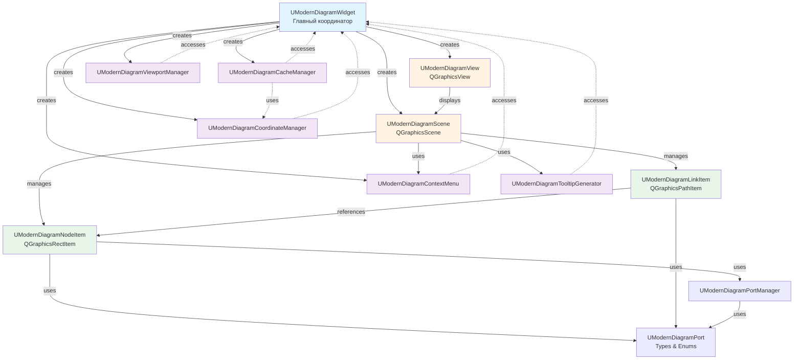

# Архитектура UModernDiagramWidget после рефакторинга

## Обзор

Документ описывает архитектуру модуля `UModernDiagramWidget` после завершения масштабного рефакторинга, в ходе которого монолитный файл (~9242 строки .cpp, ~511 строк .h) был разбит на логические модули с четким разделением ответственности.

**Дата создания:** 2025-01-XX
**Версия:** 1.0
**Статус:** Завершено

---

## 1. Структура модулей

### 1.1. Основной виджет

#### `UModernDiagramWidget` (`UModernDiagramWidget.h/.cpp`)
- **Роль:** Главный координатор, управляющий всей диаграммой
- **Размер:** ~1700 строк .cpp, ~320 строк .h
- **Ответственность:**
  - Координация работы всех подсистем
  - Публичный API для внешних компонентов
  - Управление жизненным циклом менеджеров
  - Обработка высокоуровневых операций (Reload, FitToView, updateScheme)

**Ключевые компоненты:**
- `UModernDiagramScene* m_scene` - сцена для отображения элементов
- `UModernDiagramView* m_mainView` - основной вид для отображения сцены
- `QGraphicsView* m_miniMap` - миникарта
- Менеджеры: `m_cacheManager`, `m_coordinateManager`, `m_viewportManager`, `m_contextMenuManager`

---

### 1.2. Графические элементы

#### `UModernDiagramNodeItem` (`UModernDiagramNodeItem.h/.cpp`)
- **Роль:** Представление компонента на диаграмме
- **Размер:** ~2892 строки .cpp, ~100 строк .h
- **Наследование:** `QGraphicsRectItem`
- **Ответственность:**
  - Визуализация узла (имя, класс, порты)
  - Обработка событий мыши (hover, click, drag)
  - Управление списком портов (QTreeWidget)
  - Кэширование данных портов для оптимизации отрисовки
  - Определение категорий портов (Own, Child, Alias)

**Ключевые особенности:**
- Использует `std::unique_ptr<QTimer>` для управления таймером скрытия списка портов
- Кэширует порты по категориям для ускорения отрисовки
- Поддерживает динамическое обновление tooltip при наведении

#### `UModernDiagramLinkItem` (`UModernDiagramLinkItem.h/.cpp`)
- **Роль:** Представление связи между компонентами
- **Размер:** ~200 строк .cpp, ~60 строк .h
- **Наследование:** `QGraphicsPathItem`
- **Ответственность:**
  - Визуализация связи (кривая Безье)
  - Динамическое обновление пути при перемещении узлов
  - Поддержка временных связей при drag & drop

#### `UModernDiagramScene` (`UModernDiagramScene.h/.cpp`)
- **Роль:** Сцена для отображения элементов диаграммы
- **Размер:** ~600 строк .cpp, ~50 строк .h
- **Наследование:** `QGraphicsScene`
- **Ответственность:**
  - Обработка событий мыши (клики, двойные клики, drag & drop)
  - Управление групповым выделением (rubber band selection)
  - Управление групповым перемещением
  - Периодический опрос hover-состояния элементов
  - Отображение контекстного меню

**Ключевые особенности:**
- Использует `QTimer` для периодического опроса hover-состояния (~12 fps)
- Сохраняет состояние выделения при групповом перемещении

#### `UModernDiagramView` (`UModernDiagramView.h/.cpp`)
- **Роль:** Вид для отображения сцены
- **Размер:** ~200 строк .cpp, ~50 строк .h
- **Наследование:** `QGraphicsView`
- **Ответственность:**
  - Масштабирование колесом мыши с учетом позиции курсора
  - Прокрутка canvas при Ctrl+ЛКМ
  - Выделение прямоугольником (rubber band selection)
  - Управление кнопкой сброса масштаба

---

### 1.3. Менеджеры функциональности

#### `UModernDiagramCoordinateManager` (`UModernDiagramCoordinateManager.h/.cpp`)
- **Роль:** Управление координатами и их преобразованием
- **Размер:** ~300 строк .cpp, ~65 строк .h
- **Ответственность:**
  - Преобразование координат между kernel и scene
  - Загрузка и сохранение координат компонентов
  - Управление нормализацией координат (m_normalizationOffset)
  - Обновление нормализации при перемещении компонентов
  - Отслеживание компонентов с отрицательными координатами

**Ключевые методы:**
- `scenePosFromKernel()` / `kernelPosFromScene()` - преобразование координат
- `loadCoord()` / `saveCoord()` - работа с координатами в ядре
- `recalculateNormalizationOffset()` - пересчет нормализации
- `updateNormalizationOffsetForMovement()` - обновление при движении

**Константы:**
- `DEFAULT_COORD_SCALE = 30.0` - масштаб преобразования (scene units per kernel unit)

#### `UModernDiagramCacheManager` (`UModernDiagramCacheManager.h/.cpp`)
- **Роль:** Управление кэшированием данных
- **Размер:** ~600 строк .cpp, ~115 строк .h
- **Ответственность:**
  - Кэш уровней (SceneCache) - для быстрого перехода между уровнями
  - Кэш компонентов (ComponentCache) - для ускорения отрисовки
  - Сохранение/загрузка кэша в файл (JSON/binary)
  - Инвалидация кэша при изменении структуры
  - Вычисление хешей компонентов для проверки актуальности

**Структуры данных:**
- `UModernDiagramSceneCache` - кэш состояния сцены (узлы, связи, позиции)
- `UModernDiagramComponentCacheEntry` - кэш данных компонента (порты, класс, координаты)

**Ключевые методы:**
- `saveSceneToCache()` / `restoreSceneFromCache()` - работа с кэшем уровней
- `computeComponentHash()` - вычисление хеша компонента
- `saveComponentCacheToFile()` / `loadComponentCacheFromFile()` - персистентность
- `scheduleCacheSave()` - отложенное сохранение кэша

#### `UModernDiagramViewportManager` (`UModernDiagramViewportManager.h/.cpp`)
- **Роль:** Управление состоянием viewport
- **Размер:** ~200 строк .cpp, ~60 строк .h
- **Ответственность:**
  - Сохранение состояния viewport (масштаб, центр) для каждого компонента
  - Восстановление состояния viewport при переключении уровней
  - Управление кнопкой сброса масштаба
  - Сохранение/загрузка состояния в QSettings

**Структура данных:**
- `UModernDiagramViewState` - состояние viewport (scale, center, isValid)

**Ключевые методы:**
- `saveCurrentViewState()` - сохранение текущего состояния
- `restoreViewState()` - восстановление состояния
- `resetZoom()` - сброс масштаба
- `createResetZoomButton()` - создание кнопки сброса

#### `UModernDiagramContextMenu` (`UModernDiagramContextMenu.h/.cpp`)
- **Роль:** Управление контекстным меню
- **Размер:** ~400 строк .cpp, ~90 строк .h
- **Ответственность:**
  - Создание и настройка контекстного меню
  - Обработка действий меню (view/break link, create link, clone, etc.)
  - Управление состоянием действий в зависимости от контекста
  - Эмиссия сигналов через виджет для поддержания API совместимости

**Ключевые действия:**
- View/Break link
- Create link / Finish link / Cancel link
- Start moving / Finish moving / Cancel moving
- Switch link / Finish switching / Cancel switching
- Clone component
- Quick link
- Clear cache

#### `UModernDiagramTooltipGenerator` (`UModernDiagramTooltipGenerator.h/.cpp`)
- **Роль:** Генерация tooltip для элементов диаграммы
- **Размер:** ~100 строк .cpp, ~30 строк .h
- **Ответственность:**
  - Генерация tooltip для узлов (имя, класс, количество портов)
  - Генерация tooltip для портов (имя, категория, полный путь)
  - Генерация tooltip для связей (источник, назначение)
  - Генерация tooltip для canvas (информация о компоненте)

**Методы:**
- `generateNodeTooltip()` - tooltip для узла
- `generatePortTooltip()` - tooltip для порта
- `generateLinkTooltip()` - tooltip для связи
- `generateCanvasTooltip()` - tooltip для canvas

#### `UModernDiagramPortManager` (`UModernDiagramPortManager.h/.cpp`)
- **Роль:** Управление портами компонентов
- **Размер:** ~200 строк .cpp, ~50 строк .h
- **Ответственность:**
  - Загрузка портов различных категорий (Own, Child, Alias)
  - Категоризация портов по типу (входные/выходные)
  - Определение категории порта по имени свойства
  - Работа с вложенными портами

**Методы:**
- `loadOwnOutputPorts()` / `loadOwnInputPorts()` - собственные порты
- `loadChildOutputPorts()` / `loadChildInputPorts()` - порты дочерних компонентов
- `loadAliasOutputPorts()` / `loadAliasInputPorts()` - алиасы портов
- `loadNestedPorts()` - все вложенные порты
- `determinePortCategory()` - определение категории порта

---

### 1.4. Типы данных

#### `UModernDiagramPort` (`UModernDiagramPort.h`)
- **Роль:** Определение типов данных для портов
- **Размер:** ~35 строк .h
- **Содержимое:**
  - `enum class UModernDiagramPortCategory` - категории портов (Own, Child, Alias)
  - `struct UModernDiagramPort` - структура данных порта
  - Typedef для обратной совместимости (`Port`, `PortCategory`)

**Структура Port:**
```cpp
struct UModernDiagramPort {
    QPointF pos;                    // Позиция порта
    bool isInput;                   // Входной/выходной порт
    QString name;                   // Имя порта
    QString fullPath;               // Полный путь для вложенных портов
    QString componentName;          // Имя компонента-владельца
    QString displayName;            // Отображаемое имя
    UModernDiagramPortCategory category;  // Категория порта
};
```

#### `UModernDiagramConstants` (в `UModernDiagramWidget.h`)
- **Роль:** Константы для диаграммы
- **Содержимое:**
  - Размеры и отступы (MINIMAP_HEIGHT, SCENE_RECT_PADDING)
  - Параметры сетки размещения (GRID_COLUMNS, GRID_CELL_WIDTH, GRID_CELL_HEIGHT)
  - Размеры виджета списка портов (PORT_LIST_MAX_HEIGHT, etc.)
  - Таймеры (PORT_LIST_HIDE_DELAY_MS, PORT_LIST_HIDE_RETRY_DELAY_MS)

---

## 2. Диаграмма зависимостей

### 2.1. Текстовая диаграмма

```
┌─────────────────────────────────────────────────────────────┐
│                  UModernDiagramWidget                      │
│              (Главный координатор)                         │
└───────────────┬─────────────────────────────────────────────┘
                │
                ├─────────────────────────────────────────────┐
                │                                               │
    ┌───────────▼──────────┐                    ┌──────────────▼──────────┐
    │ UModernDiagramScene  │                    │ UModernDiagramView     │
    │   (QGraphicsScene)   │                    │  (QGraphicsView)      │
    └───────────┬──────────┘                    └──────────────┬─────────┘
                │                                               │
                ├───────────────┬───────────────────────────────┤
                │               │                               │
    ┌───────────▼──────────┐   │                   ┌──────────▼──────────┐
    │UModernDiagramNodeItem│   │                   │UModernDiagramLinkItem│
    │ (QGraphicsRectItem)  │   │                   │(QGraphicsPathItem) │
    └───────────┬──────────┘   │                   └──────────────────────┘
                │               │
                │               │
    ┌───────────▼──────────┐   │
    │UModernDiagramPort    │   │
    │  (Types & Enums)     │   │
    └───────────┬──────────┘   │
                │               │
                │               │
    ┌───────────▼──────────┐   │
    │UModernDiagramPort    │   │
    │     Manager          │   │
    └──────────────────────┘   │
                                │
                ┌───────────────┴───────────────┐
                │                               │
    ┌───────────▼──────────┐      ┌────────────▼──────────┐
    │UModernDiagram        │      │UModernDiagram         │
    │CoordinateManager     │      │CacheManager           │
    └──────────────────────┘      └───────────────────────┘
                │                               │
                │                               │
    ┌───────────▼──────────┐      ┌────────────▼──────────┐
    │UModernDiagram        │      │UModernDiagram         │
    │ViewportManager       │      │ContextMenu            │
    └──────────────────────┘      └───────────────────────┘
                │                               │
                │                               │
    ┌───────────▼──────────┐
    │UModernDiagram        │
    │TooltipGenerator      │
    └──────────────────────┘
```

### 2.2. Диаграмма в формате Mermaid



**Легенда:**
- **Синий** - главный координатор
- **Оранжевый** - графические компоненты Qt
- **Зеленый** - графические элементы диаграммы
- **Фиолетовый** - менеджеры функциональности
- Сплошные линии - прямая зависимость (создание/использование)
- Пунктирные линии - обратная зависимость (доступ через m_owner)

### 2.1. Описание зависимостей

#### Прямые зависимости (UModernDiagramWidget → Менеджеры)
- **UModernDiagramScene** - создается в конструкторе, владеет сценой
- **UModernDiagramView** - создается в конструкторе, владеет видом
- **UModernDiagramCacheManager** - создается в конструкторе, управляет кэшем
- **UModernDiagramCoordinateManager** - создается в конструкторе, управляет координатами
- **UModernDiagramViewportManager** - создается в конструкторе, управляет viewport
- **UModernDiagramContextMenu** - создается в конструкторе, управляет меню

#### Обратные зависимости (Менеджеры → UModernDiagramWidget)
- Все менеджеры хранят указатель `m_owner` на виджет для доступа к данным
- Используют `friend` объявления для доступа к приватным членам

#### Зависимости между менеджерами
- **UModernDiagramCacheManager** использует `UModernDiagramCoordinateManager` для работы с координатами
- **UModernDiagramScene** использует все менеджеры через `m_owner`
- **UModernDiagramNodeItem** использует менеджеры через `m_owner`

#### Зависимости графических элементов
- **UModernDiagramNodeItem** и **UModernDiagramLinkItem** взаимозависимы (связи ссылаются на узлы)
- **UModernDiagramScene** управляет жизненным циклом всех графических элементов

---

## 3. Процессы работы компонентов

### 3.1. Инициализация диаграммы

```
1. UModernDiagramWidget::UModernDiagramWidget()
   ├─ Создание менеджеров:
   │  ├─ m_cacheManager = new UModernDiagramCacheManager(this)
   │  ├─ m_coordinateManager = new UModernDiagramCoordinateManager(this)
   │  ├─ m_viewportManager = new UModernDiagramViewportManager(this)
   │  └─ m_contextMenuManager = new UModernDiagramContextMenu(this)
   │
   ├─ Создание сцены и вида:
   │  ├─ m_scene = new UModernDiagramScene(this)
   │  └─ m_mainView = new UModernDiagramView(this, m_scene)
   │
   └─ Настройка UI:
      ├─ Создание миникарты (m_miniMap)
      └─ Подключение сигналов/слотов

2. UModernDiagramWidget::SetApplication()
   └─ Сохранение указателя на приложение

3. UModernDiagramWidget::SetComponentName()
   └─ Сохранение имени компонента

4. UModernDiagramWidget::Reload()
   └─ UModernDiagramWidget::buildScene()
```

### 3.2. Построение сцены (buildScene)

```
UModernDiagramWidget::buildScene()
│
├─ 1. loadComponentList()
│  └─ Получение списка компонентов из ядра
│     Model_GetComponentsNameList()
│
├─ 2. loadAndCacheCoordinates()
│  ├─ Для каждого компонента:
│  │  ├─ m_coordinateManager->loadCoord() - загрузка координат
│  │  └─ m_cacheManager->getComponentCache().setEntry() - кэширование
│  │
│  └─ Вычисление минимальной позиции для нормализации
│
├─ 3. createNodes()
│  ├─ Для каждого компонента:
│  │  ├─ Получение класса компонента (из кэша или ядра)
│  │  ├─ Создание UModernDiagramNodeItem
│  │  ├─ Вычисление позиции (из координат или сетки)
│  │  └─ Сохранение в списке для добавления
│  │
│  └─ Кэширование имен классов
│
├─ 4. addNodesToScene()
│  ├─ Для каждого узла:
│  │  ├─ m_scene->addItem(node) - добавление в сцену
│  │  ├─ node->setPos() - установка позиции
│  │  └─ Сохранение в m_nodes и m_nodeByName
│  │
│  └─ Обновление m_lastNodePositions
│
├─ 5. layoutGrid() (если координаты не загружены)
│  └─ Размещение узлов в сетке
│
├─ 6. updateSceneRect()
│  └─ Обновление границ сцены с учетом всех элементов
│
└─ 7. buildLinks()
   └─ Создание связей между компонентами
```

### 3.3. Обработка событий мыши

#### Клик по узлу
```
1. UModernDiagramScene::mousePressEvent()
   ├─ Определение узла под курсором
   ├─ Если Ctrl+ЛКМ: начало группового выделения
   └─ Если ЛКМ: начало перемещения узла

2. UModernDiagramNodeItem::itemChange(ItemPositionHasChanged)
   ├─ Обновление позиции связанных LinkItem
   ├─ Проверка отрицательных координат
   └─ Добавление в m_componentsWithNegativePos (если нужно)

3. UModernDiagramScene::mouseReleaseEvent()
   ├─ Если групповое перемещение:
   │  ├─ m_coordinateManager->updateNormalizationOffsetForMovement()
   │  └─ Корректировка позиций всех компонентов
   │
   └─ Очистка флагов состояния
```

#### Drag & Drop связи
```
1. UModernDiagramScene::mousePressEvent() на порте
   ├─ Создание временной связи (m_tempLink)
   └─ Установка флага m_isWaitingForPortSelection

2. UModernDiagramScene::mouseMoveEvent()
   ├─ Обновление позиции временной связи
   └─ Подсветка порта под курсором

3. UModernDiagramScene::mouseReleaseEvent() на порте
   ├─ Создание постоянной связи
   ├─ Удаление временной связи
   └─ Обновление сцены
```

### 3.4. Управление координатами

#### Загрузка координат
```
UModernDiagramCoordinateManager::loadCoord()
│
├─ 1. Получение координат из ядра
│  └─ Model_GetComponentParameterValue("Coord")
│
├─ 2. Парсинг координат
│  ├─ Попытка парсинга как строка "x y z"
│  └─ Если не удалось: парсинг XML через UXMLEnvSerialize
│
└─ 3. Возврат kernel координат
```

#### Сохранение координат
```
UModernDiagramCoordinateManager::saveCoord()
│
├─ 1. Преобразование scene → kernel координат
│  └─ kernelPosFromScene(scenePos)
│
├─ 2. Денормализация координат
│  └─ kernelPos - (m_normalizationOffset / m_coordScale)
│
└─ 3. Сохранение в ядро
   └─ Model_SetComponentParameterValue("Coord", ...)
```

#### Обновление нормализации при движении
```
UModernDiagramCoordinateManager::updateNormalizationOffsetForMovement()
│
├─ 1. Вычисление deltaOffset
│  └─ deltaOffset = -min(newMinNormalizedPos, QPointF(0, 0))
│
├─ 2. Обновление m_normalizationOffset
│  └─ m_normalizationOffset += deltaOffset
│
└─ 3. Корректировка позиций компонентов
   └─ Для каждого компонента: pos += deltaOffset
```

### 3.5. Кэширование

#### Сохранение кэша уровня
```
UModernDiagramCacheManager::saveSceneToCache()
│
├─ 1. Создание UModernDiagramSceneCache
│  ├─ Копирование узлов и связей
│  ├─ Сохранение позиций узлов
│  ├─ Сохранение normalizationOffset
│  └─ Сохранение списка компонентов
│
└─ 2. Сохранение в m_levelCache[componentName]
```

#### Восстановление кэша уровня
```
UModernDiagramCacheManager::restoreSceneFromCache()
│
├─ 1. Проверка наличия кэша
│  └─ hasLevelCache(componentName)
│
├─ 2. Проверка актуальности кэша
│  └─ Сравнение списка компонентов
│
├─ 3. Восстановление узлов и связей
│  ├─ Восстановление позиций узлов
│  └─ Восстановление normalizationOffset
│
└─ 4. Обновление сцены
```

#### Кэширование компонентов
```
UModernDiagramComponentCache::setEntry()
│
├─ 1. Сохранение данных компонента
│  ├─ Порты (ownInputPorts, childInputPorts, etc.)
│  ├─ Класс компонента (className)
│  ├─ Координаты (kernelPos, hasKernelPos)
│  └─ Хеш компонента (hash)
│
└─ 2. Обновление timestamp
```

### 3.6. Генерация tooltip

```
UModernDiagramTooltipGenerator::generateNodeTooltip()
│
├─ 1. Формирование базовой информации
│  ├─ Имя узла (nodeName)
│  ├─ Класс компонента (className)
│  └─ Количество портов (inputs.size(), outputs.size())
│
└─ 2. Добавление детальной информации
   └─ Список портов по категориям
```

---

## 4. Современные практики C++

### 4.1. Умные указатели

- **`std::unique_ptr<QTimer>`** в `UModernDiagramNodeItem::m_hideTimer`
  - Автоматическое управление памятью
  - RAII для таймера

### 4.2. Константы времени компиляции

- **`constexpr`** константы в `UModernDiagramConstants`
  - Все магические числа заменены на именованные константы
  - Вычисляются на этапе компиляции

- **`constexpr`** в менеджерах:
  - `UModernDiagramCoordinateManager::DEFAULT_COORD_SCALE = 30.0`
  - `UModernDiagramViewportManager::DEFAULT_SCALE = 1.0`

### 4.3. Enum class

- **`enum class UModernDiagramPortCategory`**
  - Типобезопасные перечисления
  - Избежание конфликтов имен

### 4.4. RAII

- Все менеджеры используют RAII для управления ресурсами
- Автоматическая очистка при уничтожении виджета

---

## 5. Тестирование

### 5.1. Интеграционные тесты

**Файл:** `Tests/Integration/GUI/Test_UModernDiagramWidget_Movement.cpp`

**Покрытие:**
- Тесты перемещения компонентов (отрицательные координаты, нормализация)
- Тесты координатного менеджера (преобразование kernel ↔ scene)
- Тесты кэша компонентов (setEntry, getEntry, invalidateEntry, clear)

**Ключевые тесты:**
- `MovementLeftUp_NegativeCoordinates` - движение влево-вверх с отрицательными координатами
- `CoordinateManager_KernelSceneConversion` - преобразование координат
- `ComponentCache_BasicOperations` - базовые операции кэша

---

## 6. Метрики рефакторинга

### До рефакторинга:
- **UModernDiagramWidget.cpp:** ~9242 строки
- **UModernDiagramWidget.h:** ~511 строк
- **Всего:** 2 файла, ~9753 строки

### После рефакторинга:
- **UModernDiagramWidget.cpp:** ~1700 строк (-81%)
- **UModernDiagramWidget.h:** ~320 строк (-37%)
- **Всего:** 20+ файлов, каждый < 1000 строк

**Улучшения:**
- ✅ Разделение ответственности (SRP)
- ✅ Снижение связанности между модулями
- ✅ Улучшение читаемости и поддержки
- ✅ Подготовка к расширению функциональности
- ✅ Покрытие тестами ключевых компонентов
- ✅ Современные практики C++

---

## 7. Рекомендации по дальнейшему развитию

### 7.1. Оптимизация производительности
- Рассмотреть использование `QGraphicsItem::ItemIgnoresTransformations` для статических элементов
- Оптимизация обновления связей при перемещении множества узлов
- Кэширование путей связей для ускорения отрисовки

### 7.2. Расширение функциональности
- Поддержка группировки узлов
- Экспорт диаграммы в различные форматы (PNG, SVG, PDF)
- Поддержка аннотаций и комментариев на диаграмме
- История изменений (undo/redo)

### 7.3. Улучшение тестирования
- Добавить unit-тесты для всех менеджеров
- Добавить тесты для обработки событий мыши
- Добавить тесты для edge cases (пустая сцена, один узел, множество связей)

---

## 8. Глоссарий

- **Kernel координаты** - координаты в системе координат ядра RDK
- **Scene координаты** - координаты в системе координат QGraphicsScene
- **Нормализация** - сдвиг координат так, чтобы минимальная позиция была (0, 0)
- **Порт** - точка входа/выхода компонента для связи с другими компонентами
- **Категория порта** - классификация порта (Own - собственный, Child - дочерний, Alias - алиас)
- **Кэш уровня** - сохраненное состояние сцены для быстрого перехода между уровнями
- **Кэш компонента** - сохраненные данные компонента для ускорения отрисовки

---

## 9. Ссылки на связанные документы

- `28-ModernDiagramWidget-Complete.md` - полная документация функциональности
- `27-ModernDiagram-Visualization-Links.md` - документация по визуализации связей
- `29-StyleSystem-Documentation.md` - документация системы стилей

---

**Автор:** AI Assistant
**Дата последнего обновления:** 2025-01-XX
**Версия документа:** 1.0

